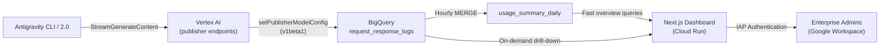
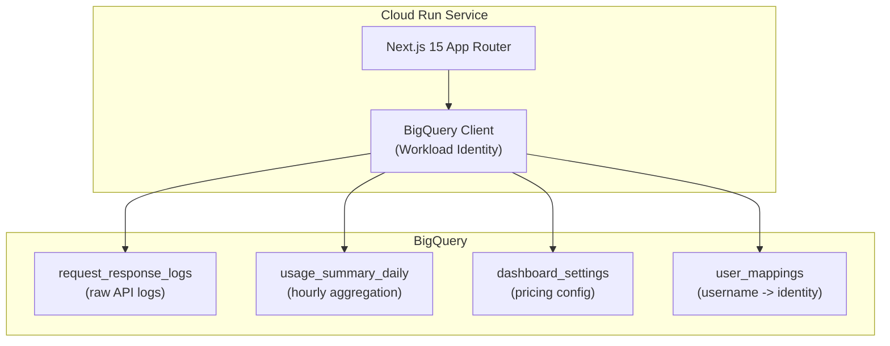

# 1. Problem Context

Antigravity's enterprise licensing model treats all AI usage as bundled cloud SKUs, which gives organizations zero visibility into who is using the tool, how much they are consuming, or what it costs per user. Competitors (Codex, Claude) already offer per-user tracking as a standard feature.

This dashboard fills that gap using the `setPublisherModelConfig` API to capture full request-response payloads (including `usageMetadata` with real token counts) directly into BigQuery.

## 1.1 Target Users

- **Enterprise Admins**: Platform owners who need granular AI consumption visibility for cost allocation and usage governance.
- **FinOps Teams**: Need per-user and per-model cost data for chargeback and budget forecasting.
- **Engineering Managers**: Want to understand which teams and individuals are heavy AI users.

## 1.2 Goals

- Attribute every Gemini API call to an individual enterprise user
- Display real token counts (not estimates) from Vertex AI `usageMetadata`
- Calculate inferred daily cost based on configurable per-model pricing
- Provide both overview dashboards and per-user drill-down capability
- Require zero changes to Antigravity CLI or Antigravity 2.0 (read-only data consumer)

## 1.3 Non-Goals

- This dashboard does NOT modify Antigravity's behavior or configuration
- It does NOT track the legacy Gemini Code Assist VS Code plugin or Antigravity IDE
- It does NOT replace Google Cloud Billing (costs are "inferred" from token counts and may differ from actual billing)
- It does NOT provide real-time streaming (data is aggregated hourly)

---

# 2. System Architecture

<!-- architecture
  id: ARCH-001
  type: c4-context
  title: Data flow from Antigravity to Dashboard
  supports_requirements: [REQ-001, REQ-002, REQ-003]
-->



<!-- architecture
  id: ARCH-002
  type: c4-container
  title: Dashboard application containers
  supports_requirements: [REQ-NFR-001, REQ-NFR-002]
-->



---

# 3. Requirements

## 3.1 Functional Requirements

<!-- requirement
  id: REQ-001
  title: Per-user token attribution
  priority: must
  category: functional
  rationale: Overcomes opacity of bundled Cloud SKU licensing vs per-seat tracking offered by competitors
  acceptance: |
    GIVEN raw API logs in request_response_logs
    WHEN the hourly attribution pipeline runs
    THEN each call is attributed to an os_username
    AND daily aggregates exist per (date, user, model) tuple
-->

The dashboard MUST attribute Gemini API token consumption to individual enterprise users by extracting the OS username from the `<user_information>` block that Antigravity injects into every conversation's system prompt. The home directory path in this block contains the username.

The extraction supports three platforms:
- **macOS**: `/Users/([^/]+)/`
- **Linux**: `/home/([^/]+)/`
- **Windows**: `C:\Users\([^\]+)\`

<!-- requirement
  id: REQ-002
  title: Real token count capture
  priority: must
  category: functional
  rationale: setPublisherModelConfig API directly outputs verified usageMetadata, no estimation or heuristic needed
  acceptance: |
    GIVEN a response from Vertex AI
    WHEN the full_response JSON is parsed
    THEN promptTokenCount, candidatesTokenCount, thoughtsTokenCount, and totalTokenCount
    are extracted as exact integers
-->

The system MUST capture real token counts from the `usageMetadata` field in the Vertex AI response. The `setPublisherModelConfig` API (v1beta1) enables request-response logging on Google-managed publisher models. The `full_response` JSON column in BigQuery contains these exact counts.

<!-- requirement
  id: REQ-003
  title: Scope boundaries for tracked usage
  priority: must
  category: functional
  rationale: Only Antigravity CLI and 2.0 route through aiplatform.googleapis.com publisher endpoints
  acceptance: |
    GIVEN a log entry in request_response_logs
    WHEN the model field is examined
    THEN only models matching Antigravity routing are included in aggregation
-->

The system MUST strictly track Antigravity CLI and Antigravity 2.0 usage only. These route through `aiplatform.googleapis.com` (Vertex AI) publisher endpoints. The legacy Gemini Code Assist VS Code plugin and Antigravity IDE are explicitly excluded.

<!-- requirement
  id: REQ-004
  title: Sub-agent call attribution
  priority: must
  category: functional
  rationale: Some Gemini calls are made by Antigravity sub-agents that do not carry user_information
  acceptance: |
    GIVEN a sub-agent call with no user_information but matching trajectory_id
    WHEN the attribution pipeline runs
    THEN the call is attributed to the parent session user
    AND remaining unattributed calls are distributed proportionally
-->

Some Gemini calls are made by Antigravity sub-agents (e.g., `gemini-3.1-flash-lite` routing calls) that do not carry `<user_information>`. These MUST be attributed to users via:

1. **`trajectory_id` match**: Sub-agent calls sharing the same `trajectory_id` as a parent call are attributed to the parent's user
2. **Proportional distribution**: Remaining calls with `trajectory_id = null` are distributed proportionally across active users in the same time window, since these represent internal Antigravity routing overhead

<!-- requirement
  id: REQ-005
  title: Configurable per-model pricing
  priority: must
  category: functional
  rationale: Gemini models have different pricing tiers and prices change over time
  acceptance: |
    GIVEN an admin on the Settings page
    WHEN they edit the pricing table
    THEN the new rates are saved to BigQuery
    AND all cost calculations on the dashboard use the updated rates
-->

The system MUST calculate inferred daily cost based on configurable per-model token rates. The pricing table stores input, output, and thinking rates per million tokens for each Gemini model variant. Default values are pre-populated from Google's published pricing page.

<!-- requirement
  id: REQ-006
  title: User identity mapping
  priority: should
  category: functional
  rationale: OS usernames are not corporate identities; admins need to map them to real names and emails
  acceptance: |
    GIVEN an admin uploads a CSV with columns os_username, display_name, email
    WHEN the upload is processed
    THEN the mapping table is updated
    AND the dashboard displays display_name instead of os_username
-->

The dashboard SHOULD provide a user mapping feature that allows admins to map OS usernames to corporate identities (display name and email). Two mechanisms MUST be supported: individual inline editing in a table, and bulk CSV upload.

## 3.2 Non-Functional Requirements

<!-- requirement
  id: REQ-NFR-001
  title: Dashboard query performance
  priority: must
  category: performance
  rationale: Admins abandon cost reviews when the overview page stalls; slow queries also raise BigQuery scan costs
  acceptance: |
    GIVEN 30 days of aggregated data for 100 users
    WHEN the overview page loads
    THEN the total page load time must be under 2 seconds at p95
    AND individual BigQuery queries must complete under 800ms at p95
-->

<!-- requirement
  id: REQ-NFR-002
  title: Authentication and access control
  priority: must
  category: security
  rationale: The dashboard exposes per-user cost data, which is sensitive employee information
  acceptance: |
    GIVEN an unauthenticated request to the dashboard
    WHEN the request reaches Cloud Run
    THEN IAP must reject it with a 401/403
    AND only authorized IAP users can access the dashboard
-->

<!-- requirement
  id: REQ-NFR-003
  title: Data freshness
  priority: should
  category: reliability
  rationale: Stale figures erode trust in the dashboard and cause teams to fall back to manual exports
  acceptance: |
    GIVEN the hourly scheduled query runs successfully
    WHEN an admin views the dashboard
    THEN the most recent data must be no older than 75 minutes
-->

---

# 4. Data Contracts

<!-- contract
  id: CT-DATA-001
  type: data-schema
  title: Raw request-response log table
  stack_category: relational-database
  implements_requirements: [REQ-001, REQ-002, REQ-003]
-->

This table is populated by Vertex AI's `setPublisherModelConfig` logging. It is not created by this project but consumed by it. Listed for reference:

```sql
-- Source table (created by Vertex AI, not by this project)
-- Dataset: agy_consumption
-- Table: request_response_logs
--
-- Key columns used by this project:
--   logging_time       TIMESTAMP
--   model              STRING   -- e.g., publishers/google/models/gemini-3.5-flash
--   api_method         STRING   -- StreamGenerateContent
--   full_request       JSON     -- Contains user_information, trajectory_id
--   full_response      JSON     -- Contains usageMetadata
--   metadata           JSON     -- Contains request_latency_ms
--   request_id         NUMERIC  -- Unique per-request ID
```

<!-- contract
  id: CT-DATA-002
  type: data-schema
  title: Daily usage summary aggregation table
  stack_category: relational-database
  implements_requirements: [REQ-001, REQ-003, REQ-004]
-->

```sql
CREATE TABLE IF NOT EXISTS agy_consumption.usage_summary_daily (
  summary_date    DATE     NOT NULL,
  os_username     STRING   NOT NULL,
  model           STRING   NOT NULL,
  request_count   INT64    NOT NULL,
  input_tokens    INT64    NOT NULL,
  output_tokens   INT64    NOT NULL,
  thinking_tokens INT64    NOT NULL,
  total_tokens    INT64    NOT NULL,
  sessions        INT64,
  avg_latency_ms  FLOAT64
) PARTITION BY summary_date
CLUSTER BY os_username, model;
```

<!-- contract
  id: CT-DATA-003
  type: data-schema
  title: Dashboard settings table
  stack_category: relational-database
  implements_requirements: [REQ-005]
-->

```sql
CREATE TABLE IF NOT EXISTS agy_consumption.dashboard_settings (
  setting_key   STRING  NOT NULL,
  setting_value STRING  NOT NULL,
  updated_at    TIMESTAMP NOT NULL DEFAULT CURRENT_TIMESTAMP(),
  updated_by    STRING
);

-- Pricing rows use keys like: pricing.{model}.input_rate, pricing.{model}.output_rate
-- Example: pricing.gemini-3.5-flash.input_rate = "0.075"  ($ per 1M tokens)
```

<!-- contract
  id: CT-DATA-004
  type: data-schema
  title: User identity mapping table
  stack_category: relational-database
  implements_requirements: [REQ-006]
-->

```sql
CREATE TABLE IF NOT EXISTS agy_consumption.user_mappings (
  os_username  STRING  NOT NULL PRIMARY KEY,
  display_name STRING,
  email        STRING,
  updated_at   TIMESTAMP NOT NULL DEFAULT CURRENT_TIMESTAMP()
);
```

---

# 5. Domain Models

<!-- contract
  id: CT-DOMAIN-001
  type: domain-model
  title: Usage metadata and daily summary types
  stack_category: application-code
  implements_requirements: [REQ-001, REQ-002, REQ-004]
-->

```typescript
export interface UsageMetadata {
  promptTokenCount: number;
  candidatesTokenCount: number;
  thoughtsTokenCount: number;
  totalTokenCount: number;
}

export interface DailyUsageSummary {
  summaryDate: string;
  osUsername: string;
  model: string;
  totalRequests: number;
  inputTokens: number;
  outputTokens: number;
  thinkingTokens: number;
  totalTokens: number;
  inferredCostUsd: number;
}

export interface UserDetail {
  osUsername: string;
  displayName: string | null;
  email: string | null;
  totalRequests: number;
  totalTokens: number;
  inferredCostUsd: number;
  lastActive: string;
}

export interface PricingConfig {
  model: string;
  inputRatePerMillion: number;
  outputRatePerMillion: number;
  thinkingRatePerMillion: number;
}
```

<!-- contract
  id: CT-DOMAIN-002
  type: domain-model
  title: Cost calculation utilities
  stack_category: application-code
  implements_requirements: [REQ-005]
-->

```typescript
export function calculateCost(
  inputTokens: number,
  outputTokens: number,
  thinkingTokens: number,
  pricing: PricingConfig
): number {
  const inputCost = (inputTokens / 1_000_000) * pricing.inputRatePerMillion;
  const outputCost = (outputTokens / 1_000_000) * pricing.outputRatePerMillion;
  const thinkingCost = (thinkingTokens / 1_000_000) * pricing.thinkingRatePerMillion;
  return inputCost + outputCost + thinkingCost;
}

export const DEFAULT_PRICING: PricingConfig[] = [
  { model: "gemini-3.6-flash", inputRatePerMillion: 0.075, outputRatePerMillion: 0.30, thinkingRatePerMillion: 0 },
  { model: "gemini-3.5-flash", inputRatePerMillion: 0.075, outputRatePerMillion: 0.30, thinkingRatePerMillion: 0 },
  { model: "gemini-3.1-pro-preview", inputRatePerMillion: 1.25, outputRatePerMillion: 5.00, thinkingRatePerMillion: 2.50 },
  { model: "gemini-3-flash-preview", inputRatePerMillion: 0.075, outputRatePerMillion: 0.30, thinkingRatePerMillion: 0 },
];
```

---

# 6. API Contracts

<!-- contract
  id: CT-API-001
  type: api-contract
  title: Settings API (server actions)
  stack_category: application-code
  implements_requirements: [REQ-005]
-->

```typescript
// Server actions for pricing configuration
export async function getPricing(): Promise<PricingConfig[]>;
export async function updatePricing(models: PricingConfig[]): Promise<void>;
export async function resetPricingToDefaults(): Promise<void>;

// Server actions for user mappings
export async function getUserMappings(): Promise<UserMappingRow[]>;
export async function updateUserMappings(mappings: UserMappingRow[]): Promise<void>;
export async function uploadUserMappingsCsv(csvContent: string): Promise<UploadResult>;
```

<!-- contract
  id: CT-API-002
  type: api-contract
  title: Dashboard data API (server actions)
  stack_category: application-code
  implements_requirements: [REQ-001, REQ-006]
-->

```typescript
export interface OverviewMetrics {
  totalRequests: number;
  uniqueUsers: number;
  totalTokens: number;
  totalInferredCost: number;
}

export async function getOverviewMetrics(
  dateRange: { start: string; end: string }
): Promise<OverviewMetrics>;

export async function getUsageOverTime(
  dateRange: { start: string; end: string }
): Promise<DailyTimeSeriesPoint[]>;

export async function getTopUsers(
  dateRange: { start: string; end: string },
  limit?: number
): Promise<UserDetail[]>;

export async function getUserDetail(
  username: string,
  dateRange: { start: string; end: string }
): Promise<UserDetail & { timeline: DailyTimeSeriesPoint[]; modelBreakdown: ModelUsage[] }>;
```

---

# 7. Infrastructure

<!-- contract
  id: CT-INFRA-001
  type: infrastructure
  title: Cloud Run service with IAP
  stack_category: container-orchestration
  implements_requirements: [REQ-NFR-002]
-->

```hcl
resource "google_cloud_run_v2_service" "dashboard" {
  name     = "agy-dashboard"
  location = var.region
  ingress  = "INGRESS_TRAFFIC_INTERNAL_LOAD_BALANCER"

  template {
    containers {
      image = "${var.region}-docker.pkg.dev/${var.project_id}/agy-dashboard/dashboard:latest"
      ports {
        container_port = 3000
      }
      resources {
        limits = {
          cpu    = var.cloud_run_cpu
          memory = var.cloud_run_memory
        }
      }
    }
    service_account = google_service_account.dashboard_runner.email
  }
}

resource "google_iap_web_service_backend_service_iam_member" "dashboard_viewer" {
  for_each           = toset(var.authorized_members)
  role               = "roles/iap.httpsResourceAccessor"
  member             = each.key
  web_service_backend_service = google_compute_backend_service.dashboard.id
}
```

<!-- contract
  id: CT-INFRA-002
  type: infrastructure
  title: BigQuery scheduled aggregation query
  stack_category: relational-database
  implements_requirements: [REQ-001, REQ-003, REQ-004, REQ-NFR-003]
-->

```hcl
resource "google_bigquery_data_transfer_config" "hourly_aggregation" {
  display_name          = "AGY Hourly Usage Aggregation"
  location              = var.region
  data_source_id        = "scheduled_query"
  schedule              = "5 * * * *"  # Every hour at :05
  notification_pubsub_topic = null
  destination_dataset_id = google_bigquery_dataset.agy_consumption.dataset_id

  params = {
    query = file("${path.module}/sql/hourly_merge.sql")
    write_disposition = "WRITE_APPEND"
    destination_table_name_template = "usage_summary_daily"
  }
}
```

```sql
-- sql/hourly_merge.sql
MERGE INTO `agy_consumption.usage_summary_daily` T
USING (
  WITH user_sessions AS (
    SELECT DISTINCT
      JSON_EXTRACT_SCALAR(full_request, '$.labels.trajectory_id') AS trajectory_id,
      COALESCE(
        REGEXP_EXTRACT(JSON_EXTRACT_SCALAR(full_request, '$.contents[0].parts[0].text'), r'/Users/([^/]+)/'),
        REGEXP_EXTRACT(JSON_EXTRACT_SCALAR(full_request, '$.contents[0].parts[0].text'), r'/home/([^/]+)/')
      ) AS os_username
    FROM `agy_consumption.request_response_logs`
    WHERE COALESCE(
      REGEXP_EXTRACT(JSON_EXTRACT_SCALAR(full_request, '$.contents[0].parts[0].text'), r'/Users/([^/]+)/'),
      REGEXP_EXTRACT(JSON_EXTRACT_SCALAR(full_request, '$.contents[0].parts[0].text'), r'/home/([^/]+)/')
    ) IS NOT NULL
  ),
  attributed AS (
    SELECT
      DATE(r.logging_time) AS day,
      COALESCE(
        COALESCE(
          REGEXP_EXTRACT(JSON_EXTRACT_SCALAR(r.full_request, '$.contents[0].parts[0].text'), r'/Users/([^/]+)/'),
          REGEXP_EXTRACT(JSON_EXTRACT_SCALAR(r.full_request, '$.contents[0].parts[0].text'), r'/home/([^/]+)/')
        ),
        su.os_username
      ) AS os_username,
      REGEXP_EXTRACT(r.model, r'models/(.+)') AS model,
      CAST(JSON_EXTRACT_SCALAR(r.full_response, '$.usageMetadata.promptTokenCount') AS INT64) AS input_tokens,
      CAST(JSON_EXTRACT_SCALAR(r.full_response, '$.usageMetadata.candidatesTokenCount') AS INT64) AS output_tokens,
      CAST(JSON_EXTRACT_SCALAR(r.full_response, '$.usageMetadata.thoughtsTokenCount') AS INT64) AS thinking_tokens,
      CAST(JSON_EXTRACT_SCALAR(r.full_response, '$.usageMetadata.totalTokenCount') AS INT64) AS total_tokens,
      AVG(CAST(JSON_EXTRACT_SCALAR(r.metadata, '$.request_latency') AS FLOAT64)) AS avg_latency_ms,
      COUNT(DISTINCT JSON_EXTRACT_SCALAR(r.full_request, '$.labels.trajectory_id')) AS sessions
    FROM `agy_consumption.request_response_logs` r
    LEFT JOIN user_sessions su
      ON JSON_EXTRACT_SCALAR(r.full_request, '$.labels.trajectory_id') = su.trajectory_id
    WHERE DATE(r.logging_time) = DATE_SUB(CURRENT_DATE(), INTERVAL 1 HOUR)
    GROUP BY 1, 2, 3, 4, 5, 6, 7
  )
  SELECT
    day,
    COALESCE(os_username, '__unattributed__') AS os_username,
    model,
    COUNT(*) AS request_count,
    SUM(input_tokens) AS input_tokens,
    SUM(output_tokens) AS output_tokens,
    SUM(thinking_tokens) AS thinking_tokens,
    SUM(total_tokens) AS total_tokens,
    ANY_VALUE(sessions) AS sessions,
    AVG(avg_latency_ms) AS avg_latency_ms
  FROM attributed
  GROUP BY 1, 2, 3
) S
ON T.summary_date = S.day AND T.os_username = S.os_username AND T.model = S.model
WHEN MATCHED THEN
  UPDATE SET
    T.request_count = S.request_count,
    T.input_tokens = S.input_tokens,
    T.output_tokens = S.output_tokens,
    T.thinking_tokens = S.thinking_tokens,
    T.total_tokens = S.total_tokens,
    T.sessions = S.sessions,
    T.avg_latency_ms = S.avg_latency_ms
WHEN NOT MATCHED THEN
  INSERT (summary_date, os_username, model, request_count, input_tokens, output_tokens, thinking_tokens, total_tokens, sessions, avg_latency_ms)
  VALUES (S.day, S.os_username, S.model, S.request_count, S.input_tokens, S.output_tokens, S.thinking_tokens, S.total_tokens, S.sessions, S.avg_latency_ms);
```

---

# 8. Acceptance Tests

<!-- test
  id: TC-ATTRIB-001
  type: acceptance-test
  title: Extract OS username from Linux home path
  verifies_requirements: [REQ-001]
-->

```gherkin
Feature: Per-User Token Attribution

  Scenario: Extract OS username from Linux path
    Given a log entry with system prompt containing "/home/jdoe/.gemini"
    When the regex extraction runs
    Then the attributed os_username must equal "jdoe"

  Scenario: Extract OS username from macOS path
    Given a log entry with system prompt containing "/Users/asmith/"
    When the regex extraction runs
    Then the attributed os_username must equal "asmith"
```

<!-- test
  id: TC-ATTRIB-002
  type: acceptance-test
  title: Attribute sub-agent call via trajectory_id
  verifies_requirements: [REQ-004]
-->

```gherkin
  Scenario: Attribute sub-agent call via trajectory_id
    Given a parent call with trajectory_id "sess-abc" and os_username "jdoe"
    And a sub-agent call with trajectory_id "sess-abc" and no user_information
    When the attribution pipeline runs
    Then the sub-agent call must be attributed to "jdoe"

  Scenario: Distribute unattributed calls proportionally
    Given 100 calls with os_username "jdoe" and 50 calls with os_username "asmith"
    And 15 calls with no user_information and no trajectory_id
    When the attribution pipeline runs
    Then 10 unattributed calls must be distributed to "jdoe"
    And 5 unattributed calls must be distributed to "asmith"
```

<!-- test
  id: TC-TOKEN-001
  type: acceptance-test
  title: Extract real token counts from response
  verifies_requirements: [REQ-002]
-->

```gherkin
  Scenario: Parse usageMetadata from full_response
    Given a full_response JSON with usageMetadata
    When the JSON is parsed
    Then promptTokenCount must be extracted as an integer
    And candidatesTokenCount must be extracted as an integer
    And thoughtsTokenCount must be extracted as an integer
    And totalTokenCount must equal the sum of the three token types
```

<!-- test
  id: TC-SCOPE-001
  type: acceptance-test
  title: Exclude non-Antigravity models
  verifies_requirements: [REQ-003]
-->

```gherkin
  Scenario: Filter to Antigravity-only models
    Given logs containing models from Antigravity CLI, VS Code plugin, and direct API calls
    When the aggregation pipeline runs
    Then only Antigravity CLI and 2.0 model entries must appear in usage_summary_daily
```

<!-- test
  id: TC-COST-001
  type: acceptance-test
  title: Calculate cost from token counts and pricing
  verifies_requirements: [REQ-005]
-->

```gherkin
  Scenario: Calculate daily cost for a single user and model
    Given a user with 1M input tokens and 500K output tokens for gemini-3.5-flash
    And pricing of $0.075/1M input and $0.30/1M output
    When cost is calculated
    Then the result must be $0.225
```

<!-- test
  id: TC-COST-002
  type: acceptance-test
  title: Admin updates pricing configuration
  verifies_requirements: [REQ-005]
-->

```gherkin
  Scenario: Update pricing and verify recalculation
    Given the Settings page with default pricing loaded
    When the admin changes gemini-3.5-flash output rate to $0.50
    And saves the configuration
    Then the dashboard_settings table must reflect the new rate
    And the overview page must recalculate costs using the new rate
```

<!-- test
  id: TC-MAP-001
  type: acceptance-test
  title: Upload CSV for bulk user mapping
  verifies_requirements: [REQ-006]
-->

```gherkin
  Scenario: Upload valid CSV
    Given a CSV file with columns os_username, display_name, email
    When the admin uploads the file on the Settings page
    Then the user_mappings table must be updated with the new mappings
    And a success message must be shown with the count of updated rows

  Scenario: Reject malformed CSV
    Given a CSV file missing the os_username column
    When the admin uploads the file
    Then an error message must be shown
    And no changes must be made to the user_mappings table
```

<!-- test
  id: TC-AUTH-001
  type: acceptance-test
  title: IAP blocks unauthenticated access
  verifies_requirements: [REQ-NFR-002]
-->

```gherkin
  Scenario: Unauthenticated request is rejected
    Given a request to the dashboard without IAP headers
    When the request reaches Cloud Run
    Then a 401 or 403 response must be returned
```

<!-- test
  id: TC-PERF-001
  type: integration-test
  title: Overview page meets latency budget at representative scale
  verifies_requirements: [REQ-NFR-001]
-->

```gherkin
  Scenario: Overview loads within budget for 30 days of data
    Given usage_summary_daily holds 30 days of data for 100 users
    When 50 virtual users request the overview page over 5 minutes
    Then the p95 page load time must be under 2 seconds
    And the p95 BigQuery query latency must be under 800 milliseconds
```

---

# 9. Security and Compliance

Access control is handled entirely by Google Identity-Aware Proxy (IAP). The dashboard application does not implement its own authentication. IAP validates the user's Google Workspace identity and passes the user's email in the `X-Goog-Authenticated-User-Email` header.

The dashboard reads this header to display the logged-in user's email in the navigation bar. The application does not make authorization decisions based on this header beyond displaying it.

Authorization (who can access the dashboard) is managed through IAP IAM bindings configured in Terraform (see `CT-INFRA-001`). Only users and groups listed in `var.authorized_members` can access the dashboard.

Data access follows the principle of least privilege:
- The Cloud Run service account has `roles/bigquery.dataViewer` and `roles/bigquery.jobUser` on the `agy_consumption` dataset
- The service account has no access to other datasets or projects
- Workload Identity is used (no key files)

---

# 10. Operational Concerns

<!-- slo
  id: SLO-001
  title: Dashboard page load time
  target: p95 < 2s
  measurement: Cloud Run request latency metric (server-side rendering)
  alert_threshold: p95 > 4s for 5 consecutive minutes
  constrains_requirements: [REQ-NFR-001]
-->

<!-- slo
  id: SLO-002
  title: BigQuery query latency
  target: p95 < 800ms
  measurement: BigQuery jobs query latency metric
  alert_threshold: p95 > 1500ms for 5 consecutive minutes
  constrains_requirements: [REQ-NFR-001]
-->

<!-- slo
  id: SLO-003
  title: Data aggregation freshness
  target: usage_summary_daily updated within 75 minutes of each hour
  measurement: BigQuery scheduled query last successful run time
  alert_threshold: Scheduled query failure or no successful run in 2 hours
  constrains_requirements: [REQ-NFR-003]
-->

Monitoring setup:
- Cloud Monitoring dashboard for Cloud Run request latency, error rates, and container CPU/memory
- BigQuery monitoring for scheduled query success/failure and execution time
- Alerting policy: notify `data-platform-team` on SLO breach via Cloud Monitoring notification channel

---

# 11. Out of Scope

- **Legacy Gemini Code Assist VS Code plugin tracking**: This plugin does not route through Vertex AI publisher endpoints and cannot be tracked with this approach
- **Antigravity IDE tracking**: Same reason as above
- **Real-time streaming dashboard**: Data is aggregated hourly; sub-hourly visibility is not provided
- **Google Cloud Billing reconciliation**: Inferred costs are calculated from token counts and may differ from actual billing; a future version may cross-reference with Cloud Billing exports
- **Audit log integration**: Security-focused tracking (IP addresses, user agents, OAuth client IDs) is deferred to a future version
- **Multi-project support**: Current design assumes a single GCP project; aggregating across projects is a future roadmap item

---

# 12. Open Questions

- [ ] Should the dashboard support custom date ranges beyond the default 30-day window, and if so, what is the maximum lookback period given BigQuery cost implications?
- [ ] How should we handle the transition when Google updates Gemini model names or deprecates models in the pricing table?
- [ ] Should the proportional distribution of unattributed calls be configurable (e.g., exclude from cost calculation entirely vs. distribute)?

---

# 13. Architecture Decisions

<!-- decision
  id: ADR-001
  title: Use BigQuery as the sole data store
  status: accepted
  context: We need an analytical database for log aggregation and the dashboard queries
  alternatives: ["BigQuery", "Snowflake", "ClickHouse", "PostgreSQL with TimescaleDB"]
  rationale: BigQuery is the natural choice because Vertex AI logging already targets BigQuery natively, eliminating any ETL pipeline. Serverless pricing means no capacity planning.
  consequences: Vendor lock-in to GCP analytics ecosystem. Query cost scales with data volume but is manageable for expected usage patterns.
  affects_requirements: [REQ-002, REQ-NFR-001]
-->

<!-- decision
  id: ADR-002
  title: Source-based deployment on Cloud Run instead of Docker
  status: accepted
  context: We need to deploy the Next.js application to Cloud Run
  alternatives: ["Dockerfile + Artifact Registry", "Cloud Buildpacks (source-based)"]
  rationale: Source-based deployment eliminates Dockerfile maintenance, automatically detects the Next.js framework, and leverages Google-maintained buildpacks for optimal layer caching.
  consequences: Slight loss of control over build process. Pin to specific Cloud Buildpacks version for reproducibility.
-->

<!-- decision
  id: ADR-003
  title: IAP for authentication instead of custom auth
  status: accepted
  context: The dashboard needs authentication and the target users are all Google Workspace users
  alternatives: ["Google IAP", "Firebase Auth + NextAuth.js", "Cloudflare Access", "Custom OAuth"]
  rationale: IAP provides zero-code authentication with Google Workspace, integrates natively with Cloud Run, and supports fine-grained IAM-based authorization. All target users already have Google Workspace accounts.
  consequences: Tied to GCP and Google Workspace. Cannot support non-Google identity providers.
  affects_requirements: [REQ-NFR-002]
-->