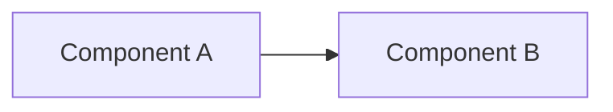

<!--
  Starter template. Delete what you do not need.

  1. Set doc_type, then follow the section order in profiles/<doc_type>.md
  2. Field definitions: specification.md 4    Type values: taxonomy.md
  3. Links point child -> requirement, and are written once. Requirements
     never list their tests or contracts; the parser derives that.
  4. Verify against specification.md §6 completeness rules
  5. Raise status above draft only once validation is clean.

  Optional frontmatter: supersedes, superseded_by, stakeholders, stack_profile,
  contract_types_used, dependencies, milestones, risk_assessment.
-->

# 1. Section Title

Narrative context. Standard Markdown — this is the layer humans read.

<!-- requirement
  id: REQ-001
  title: Requirement title in imperative mood
  priority: must
  category: functional
  rationale: Why this requirement exists
  acceptance: |
    GIVEN a precondition
    WHEN an action occurs
    THEN an observable outcome follows
-->

Elaborate here: edge cases, constraints, and behavior the annotation cannot carry.

<!-- contract
  id: CT-001
  type: domain-model
  title: Contract title
  stack_category: application-code
  implements_requirements: [REQ-001]
-->

```typescript
// Directly executable. No pseudocode, no elisions.
```

<!-- test
  id: TC-001
  type: acceptance-test
  title: Scenario name
  verifies_requirements: [REQ-001]
-->

```gherkin
Scenario: Scenario name
  Given a precondition
  When an action occurs
  Then an observable outcome follows
```

<!-- architecture
  id: ARCH-001
  type: c4-context
  title: Diagram title
  supports_requirements: [REQ-001]
-->



<!-- decision
  id: ADR-001
  title: Decision title
  status: proposed
  context: Why a decision is needed now
  alternatives: ["Option A", "Option B"]
  rationale: Why the chosen option won and what was traded away
  consequences: What gets easier, what gets harder
  affects_requirements: [REQ-001]
-->

<!-- slo
  id: SLO-001
  title: Objective name
  target: p95 < 200ms
  measurement: How this is measured
  alert_threshold: p95 > 500ms for 5min
  constrains_requirements: [REQ-001]
-->
