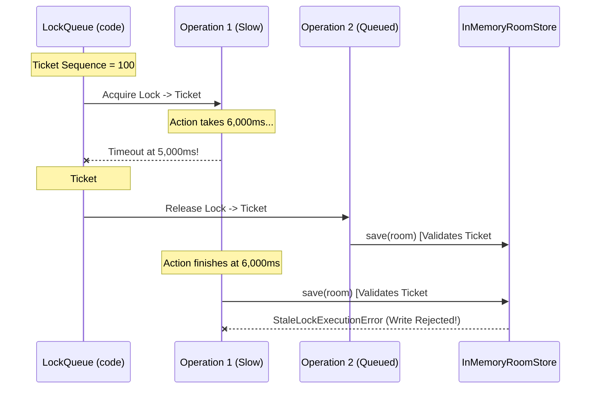

# Frozen API & Network Contracts: Fun Chess Audit Remediation

**Status**: FROZEN CONTRACT
**Author**: System Architect (`@architect`)
**Date**: 2026-09-08
**Scope**: Remediation of 97 Audit Findings (CRIT-001, CRIT-002, CRIT-003, MAJ-011, MAJ-012, MAJ-015, MAJ-029, MAJ-031, MAJ-033)
**Target Packages**: `@fun-chess/shared`, `@fun-chess/server`, `@fun-chess/client`

---

## 1. Executive Summary & Design Scope

This document defines the authoritative, frozen network and interface contracts for the remediation of all audit findings across `@fun-chess/shared`, `@fun-chess/server`, and `@fun-chess/client`. All builders (`@backend-engineer`, `@frontend-engineer`, `@test-automation-engineer`, `@devops-engineer`, and `Tech-Lead`s) implementing Scope Cards **SC-01** through **SC-09** must strictly adhere to the schemas, interfaces, type signatures, and lifecycle invariants specified herein.

### Architectural Invariants:
1. **Strict Validation at System Boundaries**: Every external HTTP request, incoming WebSocket packet, and outgoing WebSocket broadcast must validate against explicit runtime Zod schemas. Compile-time `as any` type assertions are strictly prohibited (`MAJ-027`, `MAJ-029`).
2. **Unified Error Response Envelope**: All HTTP error responses adhere to the standard envelope `{ status: "error", code, error: { code, message, details, correlationId } }` (`MAJ-033`).
3. **Partitioned Health & Observability**: Public lightweight container probes (`/health`) return strictly redacted liveness data (`LivenessHealthResponse`). Deep operational metrics (`/health/detail`, `/metrics`) return comprehensive resource counters (`DetailedHealthResponse`) (`CRIT-001`).
4. **Linearizable Store Concurrency**: Store state mutations are serialized through exclusive monotonic tickets. Overdue lock acquisitions and timed-out executions are invalidated to prevent background state clobbering (`CRIT-002`). Room creation is guaranteed atomic (`CRIT-003`).
5. **Decoupled Vertical Slices**: Domain services interact only via explicit feature interface contracts (`IRoomGameAdapter`, `IRoomCountProvider`, `IAddressingInfoProvider`) (`MAJ-011`, `MAJ-012`).
6. **I/O & Hardware Isolation**: All client hardware APIs (`navigator.clipboard`, `navigator.mediaDevices`) are abstracted behind mockable interfaces (`IClipboardService`, `ICameraService`) (`MAJ-015`).

---

## 2. Health Check Contract Alignment (`GET /health` vs `GET /health/detail`) [CRIT-001]

### 2.1 Problem Statement
`FetchApiClient.checkHealth()` previously parsed `GET /health` with `HealthCheckResponseSchema` (which was aliased to `DetailedHealthResponseSchema`). However, `GET /health` on the server returns `LivenessHealthResponse` (`{ status, uptimeSeconds, timestamp }`) to prevent telemetry leakage on unauthenticated endpoints (`ENH-003`). This caused every client health probe to throw a Zod validation error (`activeRooms is required`), crashing client health monitoring routines.

### 2.2 Wire Specifications

#### 2.2.1 Lightweight Liveness Probe: `GET /health` & `GET /api/health`
- **Target Audience**: Kubernetes/Docker container liveness and readiness probes, public client network connectivity checks.
- **HTTP Status Codes**:
  - `200 OK`: Server operational (`status: "ok"`).
  - `503 Service Unavailable`: Server degraded or terminating (`status: "degraded"`).
- **Zod Schema (`shared/src/contracts/schemas.ts`)**:
  ```typescript
  export const LivenessHealthResponseSchema = z.object({
    status: z.enum(["ok", "degraded"]),
    uptimeSeconds: z.number().nonnegative(),
    timestamp: z.string().datetime(),
  });
  export type LivenessHealthResponse = z.infer<typeof LivenessHealthResponseSchema>;
  ```
- **Example Wire Response**:
  ```json
  {
    "status": "ok",
    "uptimeSeconds": 142.5,
    "timestamp": "2026-09-08T15:30:00.000Z"
  }
  ```

#### 2.2.2 Detailed Telemetry Probe: `GET /health/detail` & `GET /metrics`
- **Target Audience**: Internal monitoring dashboards, diagnostic tools, and admin health checks.
- **HTTP Status Codes**: `200 OK`.
- **Zod Schema (`shared/src/contracts/schemas.ts`)**:
  ```typescript
  export const DetailedHealthResponseSchema = z.object({
    status: z.enum(["ok", "degraded"]),
    uptimeSeconds: z.number().nonnegative(),
    timestamp: z.string().datetime(),
    activeRooms: z.number().int().nonnegative(),
    activeSockets: z.number().int().nonnegative(),
    memoryUsageMb: z.object({
      rss: z.number().nonnegative(),
      heapTotal: z.number().nonnegative(),
      heapUsed: z.number().nonnegative(),
    }),
    relay: z
      .object({
        mode: z.enum(["cloud", "lan"]),
        publicUrl: z.string().url().optional(),
      })
      .optional(),
  });
  export type DetailedHealthResponse = z.infer<typeof DetailedHealthResponseSchema>;
  ```
- **Example Wire Response**:
  ```json
  {
    "status": "ok",
    "uptimeSeconds": 142.5,
    "timestamp": "2026-09-08T15:30:00.000Z",
    "activeRooms": 3,
    "activeSockets": 6,
    "memoryUsageMb": {
      "rss": 42.1,
      "heapTotal": 24.5,
      "heapUsed": 18.2
    },
    "relay": {
      "mode": "lan",
      "publicUrl": "http://192.168.1.100:3000"
    }
  }
  ```

### 2.3 Shared Contract Aliasing (`shared/src/contracts/schemas.ts`)
To prevent future client schema mismatch crashes while preserving backward compatibility:
```typescript
/**
 * Canonical alias for standard health checks (/health, /api/health).
 * Aligned strictly with LivenessHealthResponse to resolve CRIT-001.
 */
export const HealthCheckResponseSchema = LivenessHealthResponseSchema;
export type HealthCheckResponse = LivenessHealthResponse;
```

### 2.4 Client API Client Contract (`apps/client/src/platform/api/fetch_api_client.ts`)
```typescript
export interface IApiClient {
  // Lightweight health probe targeting /health
  checkHealth(options?: ApiRequestOptions): Promise<LivenessHealthResponse>;
  // Deep telemetry probe targeting /health/detail
  getDetailedHealth(options?: ApiRequestOptions): Promise<DetailedHealthResponse>;
  getLanInfo(options?: ApiRequestOptions): Promise<LanInfoResponse>;
  checkConnectivity(probeUrl?: string, options?: ApiRequestOptions): Promise<boolean>;
}

export class FetchApiClient implements IApiClient {
  async checkHealth(options?: ApiRequestOptions): Promise<LivenessHealthResponse> {
    const res = await this.get<unknown>('/health', options);
    if (!res.ok) throw new Error(`Health check failed: HTTP ${res.status}`);
    return LivenessHealthResponseSchema.parse(res.data);
  }

  async getDetailedHealth(options?: ApiRequestOptions): Promise<DetailedHealthResponse> {
    const res = await this.get<unknown>('/health/detail', options);
    if (!res.ok) throw new Error(`Detailed health check failed: HTTP ${res.status}`);
    return DetailedHealthResponseSchema.parse(res.data);
  }
  // ...
}
```

---

## 3. Standard HTTP Error Response Envelope Format [MAJ-033]

### 3.1 Specification & Envelope Schema
All error responses emitted by native HTTP server endpoints, route controllers, and middleware must follow the standardized envelope structure conforming to `.agents/rules/api-design-principles.md`. Transport status and domain error reasons are strictly segregated.

```typescript
export interface HttpErrorBody {
  /** Machine-readable business error code in UPPER_SNAKE_CASE */
  code: string;
  /** Human-readable explanatory message */
  message: string;
  /** Optional structured context payload */
  details?: Record<string, unknown>;
  /** Optional tracing correlation UUID */
  correlationId?: string;
}

export interface HttpErrorEnvelope {
  /** Always "error" */
  status: "error";
  /** Redundant HTTP status code (400-599) matching the HTTP status header */
  code: number;
  /** Domain error details */
  error: HttpErrorBody;
}
```

**Zod Schema (`shared/src/contracts/schemas.ts`)**:
```typescript
export const HttpErrorBodySchema = z.object({
  code: z.string(),
  message: z.string(),
  details: z.record(z.unknown()).optional(),
  correlationId: z.string().optional(),
});

export const HttpErrorEnvelopeSchema = z.object({
  status: z.literal("error"),
  code: z.number().int().min(400).max(599),
  error: HttpErrorBodySchema,
});
```

### 3.2 Standard Machine-Readable Error Codes
| HTTP Status | Error Code (`error.code`) | Description |
|---|---|---|
| `400` | `ERR_BAD_REQUEST` | Malformed URL, unparsable payload |
| `400` | `ERR_VALIDATION_FAILED` | Request parameters violated Zod schema |
| `403` | `ERR_CORS_FORBIDDEN` | Request origin not allowed by server CORS configuration |
| `404` | `ERR_NOT_FOUND` | Route or requested static asset does not exist |
| `405` | `ERR_METHOD_NOT_ALLOWED` | HTTP method not supported for route |
| `429` | `ERR_RATE_LIMITED` | Client IP exceeded request rate limits |
| `500` | `ERR_INTERNAL_SERVER_ERROR` | Unhandled exception during request dispatch |

### 3.3 Server Formatting Helpers (`apps/server/src/platform/http/http_server.ts`)
```typescript
export function formatHttpError(
  statusCode: number,
  errorCode: string,
  message: string,
  correlationId?: string,
  details?: Record<string, unknown>,
): HttpErrorEnvelope {
  return {
    status: "error",
    code: statusCode,
    error: {
      code: errorCode,
      message,
      ...(details ? { details } : {}),
      ...(correlationId ? { correlationId } : {}),
    },
  };
}

export function formatHttpErrorFromException(
  err: unknown,
  correlationId?: string,
): { statusCode: number; payload: HttpErrorEnvelope } {
  if (err instanceof AppError) {
    return {
      statusCode: err.statusCode,
      payload: formatHttpError(
        err.statusCode,
        err.code,
        err.message,
        correlationId,
        err.details,
      ),
    };
  }

  const message = err instanceof Error ? err.message : "Internal Server Error";
  return {
    statusCode: 500,
    payload: formatHttpError(
      500,
      "ERR_INTERNAL_SERVER_ERROR",
      message,
      correlationId,
    ),
  };
}
```

### 3.4 Wire Examples

#### 3.4.1 CORS Preflight Rejection (403 Forbidden)
```json
{
  "status": "error",
  "code": 403,
  "error": {
    "code": "ERR_CORS_FORBIDDEN",
    "message": "CORS origin not allowed",
    "correlationId": "48b6c00d-9b55-46f9-bf7b-f4581df10134"
  }
}
```

#### 3.4.2 Rate Limiting (429 Too Many Requests)
```json
{
  "status": "error",
  "code": 429,
  "error": {
    "code": "ERR_RATE_LIMITED",
    "message": "Rate limit exceeded. Maximum 100 requests per 10 seconds allowed.",
    "correlationId": "f90b9b32-cd20-4107-b2eb-d1e920ad51cb"
  }
}
```

---

## 4. Core WebSocket Event Runtime Zod Schemas [MAJ-029]

### 4.1 Schema Definitions (`shared/src/contracts/schemas.ts`)
Zero runtime schemas previously existed for core domain models (`RoomState`, `GameState`, `Player`, `MoveResult`, `GameOverPayload`), allowing corrupted or out-of-spec payloads to crash clients and servers. The following runtime Zod schemas are authoritative:

```typescript
/**
 * Piece type notation schema.
 */
export const PieceTypeSchema = z.enum(["p", "n", "b", "r", "q", "k"]);
export type PieceType = z.infer<typeof PieceTypeSchema>;

/**
 * Public player representation schema.
 * All Player objects are strictly free of private credentials (CRIT-001).
 */
export const PlayerSchema = z.object({
  id: z.string().uuid("Player ID must be a valid UUID"),
  socketId: z.string().min(1, "Socket ID must not be empty"),
  name: PlayerNameSchema,
  avatar: AvatarEmojiSchema,
  color: PieceColorSchema,
  isHost: z.boolean(),
  isConnected: z.boolean(),
  connectedAt: z.number().nonnegative(),
});
export type Player = z.infer<typeof PlayerSchema>;

/**
 * Executed move result schema.
 */
export const MoveResultSchema = z.object({
  from: ChessSquareSchema,
  to: ChessSquareSchema,
  san: z.string().min(1),
  piece: PieceTypeSchema,
  color: PieceColorSchema,
  captured: PieceTypeSchema.optional(),
  promotion: PromotionPieceSchema.optional(),
  flags: z.string(),
  fen: z.string().min(1),
  moveNumber: z.number().int().nonnegative(),
  timestamp: z.number().nonnegative(),
});
export type MoveResult = z.infer<typeof MoveResultSchema>;

/**
 * Authoritative game state schema.
 */
export const GameStateSchema = z.object({
  fen: z.string().min(1),
  turn: PieceColorSchema,
  isCheck: z.boolean(),
  isCheckmate: z.boolean(),
  isDraw: z.boolean(),
  isStalemate: z.boolean(),
  isThreefoldRepetition: z.boolean(),
  isInsufficientMaterial: z.boolean(),
  isFiftyMoveRule: z.boolean(),
  moveHistory: z.array(MoveResultSchema),
  capturedWhite: z.array(PieceTypeSchema),
  capturedBlack: z.array(PieceTypeSchema),
  materialAdvantage: z.object({
    white: z.number(),
    black: z.number(),
  }),
  lastMove: z
    .object({
      from: z.string(),
      to: z.string(),
    })
    .nullable(),
  moveCount: z.number().int().nonnegative(),
});
export type GameState = z.infer<typeof GameStateSchema>;

/**
 * Rematch proposal state schema.
 */
export const RematchStateSchema = z.object({
  requestedBy: z.string().uuid(),
  requestedAt: z.number().nonnegative(),
  status: z.enum(["pending", "accepted", "declined"]),
});
export type RematchState = z.infer<typeof RematchStateSchema>;

/**
 * Draw offer state schema.
 */
export const DrawOfferSchema = z.object({
  offeredBy: z.string().uuid(),
  offeredAt: z.number().nonnegative(),
});
export type DrawOffer = z.infer<typeof DrawOfferSchema>;

/**
 * Room lifecycle status schema.
 */
export const RoomStatusSchema = z.enum([
  "lobby",
  "playing",
  "paused_disconnect",
  "game_over",
  "rematch_pending",
  "abandoned",
]);
export type RoomStatus = z.infer<typeof RoomStatusSchema>;

/**
 * Authoritative room state schema.
 */
export const RoomStateSchema = z.object({
  roomCode: RoomCodeSchema,
  version: z.number().int().positive().optional(),
  status: RoomStatusSchema,
  hostId: z.string().uuid(),
  whitePlayer: PlayerSchema.nullable(),
  blackPlayer: PlayerSchema.nullable(),
  spectators: z.array(PlayerSchema),
  game: GameStateSchema,
  rematch: RematchStateSchema.nullable(),
  drawOffer: DrawOfferSchema.nullable().optional(),
  createdAt: z.number().nonnegative(),
  lastActivityAt: z.number().nonnegative(),
});
export type RoomState = z.infer<typeof RoomStateSchema>;

/**
 * Game termination reason schema.
 */
export const GameOverReasonSchema = z.enum([
  "checkmate",
  "stalemate",
  "threefold_repetition",
  "insufficient_material",
  "fifty_move_rule",
  "resignation",
  "draw_agreement",
  "abandonment",
]);
export type GameOverReason = z.infer<typeof GameOverReasonSchema>;

/**
 * Match conclusion broadcast payload schema.
 */
export const GameOverPayloadSchema = z.object({
  winner: z.union([PieceColorSchema, z.literal("draw")]),
  winnerName: z.string().optional(),
  reason: GameOverReasonSchema,
  message: z.string().min(1),
  finalFen: z.string().min(1),
  totalMoves: z.number().int().nonnegative(),
  durationSeconds: z.number().nonnegative(),
});
export type GameOverPayload = z.infer<typeof GameOverPayloadSchema>;
```

### 4.2 Inbound & Outbound Validation Policy
1. **Server Ingress**: All event payloads are parsed with `Schema.parse()` inside `wrapSocketHandler` or feature handlers. If validation fails, server emits `{ code: "ERR_INVALID_PAYLOAD", message, correlationId }` and does not mutate domain state.
2. **Server Egress**: Payloads emitted on `room:state`, `game:moved`, and `game:over` are validated with `Schema.parse()` in non-production environments to detect schema drift early.
3. **Client Ingress**: The client transport layer validates incoming packets before passing to reactive state refs, logging any schema violations via structured telemetry.

---

## 5. Idempotent Move Submission Schema [MAJ-031]

### 5.1 Problem Statement
In fast-paced play or network retries, clients re-submitting an in-flight move received `NotYourTurnError` because the first attempt succeeded on the server. Furthermore, out-of-order `game:moved` socket packets caused the client board to rewind to previous positions.

### 5.2 Updated Move Request Schema (`shared/src/contracts/schemas.ts`)
```typescript
export const MakeMoveRequestSchema = z.object({
  roomCode: RoomCodeSchema,
  move: MovePayloadSchema,
  /**
   * Expected move counter (half-moves / plies count before applying this move).
   * Used by server for linearizability validation and idempotency deduplication.
   */
  expectedMoveNumber: z.number().int().nonnegative().optional(),
  /**
   * Client-generated UUID idempotency token.
   * If a move with this idempotency key was already applied, the server returns
   * the existing move result without throwing NotYourTurnError.
   */
  idempotencyKey: z.string().uuid().optional(),
});
export type MakeMoveRequest = z.infer<typeof MakeMoveRequestSchema>;
```

### 5.3 Server Validation & Idempotency Rules (`GameService.makeMove`)
1. **Expected Move Number Verification**:
   - If `expectedMoveNumber` is provided and `expectedMoveNumber !== room.game.moveCount`:
     - If `expectedMoveNumber < room.game.moveCount`:
       - Check if the last move applied (`room.game.lastMove`) matches `move.from` and `move.to`.
       - If matching: Return current `room.game` and `moveResult` as an idempotent success.
       - If not matching: Throw `OptimisticLockConflictError(roomCode, expectedMoveNumber, room.game.moveCount)`.
     - If `expectedMoveNumber > room.game.moveCount`:
       - Throw `InvalidMoveError("Move out of sequence: expectedMoveNumber is in the future")`.
2. **Client Monotonic Sequence Guard (`useGameActions`)**:
   - When receiving `game:moved` or `room:updated`:
     - Compare packet `moveResult.moveNumber` against local `gameState.moveCount`.
     - If `moveResult.moveNumber < localGameState.moveCount`: Discard packet and log debug warning (`"Stale out-of-order move packet ignored"`).

---

## 6. Atomic Room Creation Contract: `IRoomStore.createIfAbsent` [CRIT-003]

### 6.1 Problem Statement
`RoomService.createRoom` previously generated a room code, performed an un-locked `findByCode(code)`, and if null, called `save(room)`. Two concurrent requests generating the same room code simultaneously both saw `null` and both called `save()`. Because `save()` did not verify versions on initial creation, the second write clobbered the first room, dropping existing players.

### 6.2 Updated `IRoomStore` Interface (`apps/server/src/features/rooms/room.store.ts`)
```typescript
export interface IRoomStore {
  findByCode(roomCode: string): Promise<RoomState | null>;
  findBySocketId(socketId: string): Promise<{ room: RoomState; playerId: string } | null>;
  mutate<T>(roomCode: string, mutator: RoomMutator<T>): Promise<T>;
  withLock<T>(roomCode: string, action: () => Promise<T>): Promise<T>;
  save(room: RoomState, expectedVersion?: number): Promise<void>;

  /**
   * Atomically creates and persists a room if and only if no room with this roomCode currently exists.
   * Guaranteed atomic under the room code's exclusive lock.
   *
   * @param room - The initial room state to persist
   * @throws RoomAlreadyExistsError if a room with this code already exists
   */
  createIfAbsent(room: RoomState): Promise<void>;

  delete(roomCode: string): Promise<boolean>;
  listActiveRooms(): Promise<RoomState[]>;
  count(): Promise<number>;
  clear(): Promise<void>;
}
```

### 6.3 Implementation Semantics (`InMemoryRoomStore.createIfAbsent`)
```typescript
public async createIfAbsent(room: RoomState): Promise<void> {
  const code = room.roomCode.toUpperCase();
  await this.withLock(code, async () => {
    if (this.rooms.has(code)) {
      throw new RoomAlreadyExistsError(code);
    }
    const roomToSave: RoomState = {
      ...structuredClone(room),
      version: room.version || 1,
      lastActivityAt: room.lastActivityAt ?? this.clock.now(),
    };
    this.rooms.set(code, roomToSave);
    this.indexSockets(roomToSave);
  });
}
```

### 6.4 `RoomService.createRoom` Orchestration
```typescript
// Retry loop with atomic createIfAbsent
for (let attempt = 0; attempt < MAX_CODE_ATTEMPTS; attempt++) {
  const code = this.generateRoomCode();
  const roomState = createInitialRoomState(code, ...);
  try {
    await this.store.createIfAbsent(roomState);
    return { room: roomState, sessionToken };
  } catch (err) {
    if (err instanceof RoomAlreadyExistsError) {
      continue; // Collision detected under lock; regenerate
    }
    throw err;
  }
}
```

---

## 7. Lock Acquisition Monotonic Ticket Model for `InMemoryRoomStore` [CRIT-002]

### 7.1 Problem Statement
When an operation in `withLock` exceeds `EXECUTION_TIMEOUT_MS` (5,000ms), `Promise.race` rejects with `LockExecutionTimeoutError`. In the `finally` block, `releaseLock()` runs and unblocks the next queued operation in the lock chain. In JavaScript, async functions cannot be cancelled; the timed-out `action()` continues executing in the background. When it eventually settles, it writes to `this.rooms.set(code, ...)`, overwriting state written by subsequent lock holders.

### 7.2 The Monotonic Ticket Architecture



### 7.3 Store Ticket Invariants & Methods
1. **Ticket Counter**: Monotonically increasing 64-bit integer: `private ticketSequence = 0;`.
2. **Active Tickets Map**: Maps `roomCode -> activeTicketId` (`Map<string, number>`).
3. **Cancelled Tickets Set**: Stores invalidated ticket IDs (`Set<number>`).
4. **Ticket Context Association**: `withLock` creates an execution context:
   ```typescript
   export interface LockContext {
     roomCode: string;
     ticket: number;
     isCancelled: () => boolean;
   }
   ```
5. **State Guard Enforcement**:
   - `mutate` and internal store writers assert:
     ```typescript
     if (this.cancelledTickets.has(ticket) || this.activeTickets.get(code) !== ticket) {
       throw new StaleLockExecutionError(code, ticket);
     }
     ```
   - If ticket is cancelled, the write is aborted, preserving store linearizability.

---

## 8. Interface Contract `IRoomGameAdapter` Decoupling `GameService` [MAJ-012]

### 8.1 Problem Statement
`GameService` directly imported internal `RoomStore`, `room.logic.ts`, and `session_registry.ts` from `../rooms/`, violating vertical slice boundaries (`MAJ-012`).

### 8.2 The Contract (`apps/server/src/features/rooms/room.interface.ts`)
```typescript
export interface IRoomGameAdapter {
  /**
   * Retrieves a read-only snapshot of current room state.
   */
  getRoom(roomCode: string): Promise<RoomState | null>;

  /**
   * Applies an executed chess move and state update to the room under exclusive lock.
   */
  applyGameMove(
    roomCode: string,
    nextGameState: GameState,
    gameOverPayload?: GameOverPayload,
  ): Promise<RoomState>;

  /**
   * Finalizes a match with an explicit game-over payload (resignation, timeout, draw).
   */
  finalizeGame(
    roomCode: string,
    gameOverPayload: GameOverPayload,
  ): Promise<RoomState>;

  /**
   * Records a proposed draw offer or response in the room state.
   */
  updateDrawOffer(
    roomCode: string,
    drawOffer: RoomState["drawOffer"],
  ): Promise<RoomState>;

  /**
   * Records a rematch proposal or acceptance in the room state.
   */
  updateRematch(
    roomCode: string,
    rematch: RoomState["rematch"],
    newGameState?: GameState,
    players?: { whitePlayer: Player | null; blackPlayer: Player | null },
  ): Promise<RoomState>;
}
```

### 8.3 Feature Public API Export (`apps/server/src/features/rooms/index.ts`)
```typescript
export type { IRoomService, IRoomGameAdapter } from "./room.interface.js";
export { RoomService } from "./room.service.js";
export { InMemoryRoomStore } from "./in_memory_room.store.js";
// Never export room.logic.ts or internal store mutators
```

### 8.4 `GameService` Constructor Dependency Injection (`apps/server/src/features/game/game.service.ts`)
```typescript
export class GameService implements IGameService {
  private readonly roomAdapter: IRoomGameAdapter;
  private readonly clock: IClock;
  private readonly idGenerator: IIdGenerator;

  constructor(
    roomAdapter: IRoomGameAdapter,
    clock?: IClock,
    idGenerator?: IIdGenerator,
  ) {
    this.roomAdapter = roomAdapter;
    this.clock = clock ?? new SystemClock();
    this.idGenerator = idGenerator ?? new UuidGenerator();
  }
  // All room interactions delegate through this.roomAdapter
}
```

---

## 9. Extracted HTTP Controller Interfaces [MAJ-011]

### 9.1 Problem Statement
`http_server.ts` imported controllers from `controllers/index.js`, while `health.controller.ts` and `lan_info.controller.ts` imported interfaces (`IRoomCountProvider`, `IAddressingInfoProvider`) back from `../http_server.js`, creating an ESM circular dependency.

### 9.2 Interface Contract File (`apps/server/src/platform/http/http.interface.ts`)
```typescript
import type { IncomingMessage, ServerResponse } from "node:http";
import type { LanInfoResponse, ServerEnv } from "@fun-chess/shared";
import type { Logger } from "../logger/logger.interface.js";
import type { IFileStorage } from "./file_storage.js";
import type { HttpRateLimiter } from "./http_rate_limiter.js";

/**
 * Storage count provider contract for health checks (MAJ-011).
 */
export interface IRoomCountProvider {
  count(): Promise<number>;
}

/**
 * Addressing provider contract for network info and relay status (MAJ-011).
 */
export interface IAddressingInfoProvider {
  getAddressingInfo(port: number): LanInfoResponse;
  isCloudRelay?(): boolean;
}

export interface HttpServerConfig {
  roomStore: IRoomCountProvider;
  relayAddressService?: IAddressingInfoProvider;
  /** @deprecated Use relayAddressService */
  lanService?: IAddressingInfoProvider;
  logger: Logger;
  port?: number;
  distPath?: string;
  allowedOrigins?: string[];
  env?: ServerEnv;
  fileStorage?: IFileStorage;
  getActiveSocketCount?: () => number;
  rateLimiter?: HttpRateLimiter;
}
```

Both `http_server.ts` and all route controllers in `controllers/` import strictly from `http.interface.js`, eliminating module evaluation cycles completely.

---

## 10. Client Hardware Abstraction Interfaces [MAJ-015]

### 10.1 Clipboard Abstraction (`apps/client/src/platform/hardware/clipboard.interface.ts`)
```typescript
export interface IClipboardService {
  /**
   * Copies text string to system clipboard.
   * Returns true on success, false on rejection.
   */
  copyText(text: string): Promise<boolean>;

  /**
   * Reads current plain text content from clipboard.
   */
  readText(): Promise<string>;

  /**
   * Checks if clipboard write is supported in the current browser context.
   */
  isSupported(): boolean;
}
```

#### Adapters:
- `BrowserClipboardService`: Production adapter using `navigator.clipboard.writeText` with legacy fallback to `document.execCommand('copy')`.
- `MockClipboardService`: In-memory test double for unit and component tests.

### 10.2 Camera Abstraction (`apps/client/src/platform/hardware/camera.interface.ts`)
```typescript
export interface ICameraService {
  /**
   * Requests user media video stream matching constraints.
   */
  getUserMedia(constraints: MediaStreamConstraints): Promise<MediaStream>;

  /**
   * Checks if mediaDevices and getUserMedia are supported in the current browser context.
   */
  isSupported(): boolean;
}
```

#### Adapters:
- `BrowserCameraService`: Production adapter delegating to `navigator.mediaDevices.getUserMedia`.
- `MockCameraService`: In-memory test double returning a controllable mock `MediaStream` for QR scanner tests.

### 10.3 Vue DI Registration (`apps/client/src/platform/di/tokens.ts`)
```typescript
import type { InjectionKey } from 'vue';
import type { IClipboardService } from '../hardware/clipboard.interface';
import type { ICameraService } from '../hardware/camera.interface';

export const CLIPBOARD_SERVICE_KEY: InjectionKey<IClipboardService> = Symbol('CLIPBOARD_SERVICE');
export const CAMERA_SERVICE_KEY: InjectionKey<ICameraService> = Symbol('CAMERA_SERVICE');
```

---

## 11. Verification Checklist for Implementers

| Scope Card | Contract Component | Verification Target |
|---|---|---|
| **SC-01** | `LivenessHealthResponseSchema` & `DetailedHealthResponseSchema` | `shared/src/contracts/schemas.ts` exports both schemas; `HealthCheckResponseSchema` is aliased to `LivenessHealthResponseSchema`. |
| **SC-01** | `MakeMoveRequestSchema` | Accepts `expectedMoveNumber` and `idempotencyKey`. |
| **SC-01** | Core WebSocket Schemas | `RoomStateSchema`, `GameStateSchema`, `PlayerSchema`, `MoveResultSchema`, `GameOverPayloadSchema` exported and tested. |
| **SC-02** | `HttpErrorEnvelope` & `formatHttpError` | Server returns `{ status: "error", code, error: { ... } }` for 400, 403, 404, 429, 500. |
| **SC-02** | `apps/server/src/platform/http/http.interface.ts` | Circular dependency between `http_server.ts` and controllers resolved (0 cycles reported by `dpdm`). |
| **SC-03** | `FetchApiClient.checkHealth` | Correctly parses `GET /health` with `LivenessHealthResponseSchema` without throwing Zod errors. |
| **SC-03** | `IClipboardService` & `ICameraService` | Wired in `platform/di/` and injected into `QrExportView`, `QrCodeModal`, and `useCameraStream`. |
| **SC-04** | `createIfAbsent` in `IRoomStore` & `InMemoryRoomStore` | Concurrent room allocations reject collisions under lock without overwriting. |
| **SC-04** | Monotonic Ticket Model | Timed-out lock executions cannot write to store; `StaleLockExecutionError` logged. |
| **SC-04** | `IRoomGameAdapter` in `GameService` | `GameService` receives `IRoomGameAdapter` and does not import `room.store.ts` or `room.logic.ts`. |
