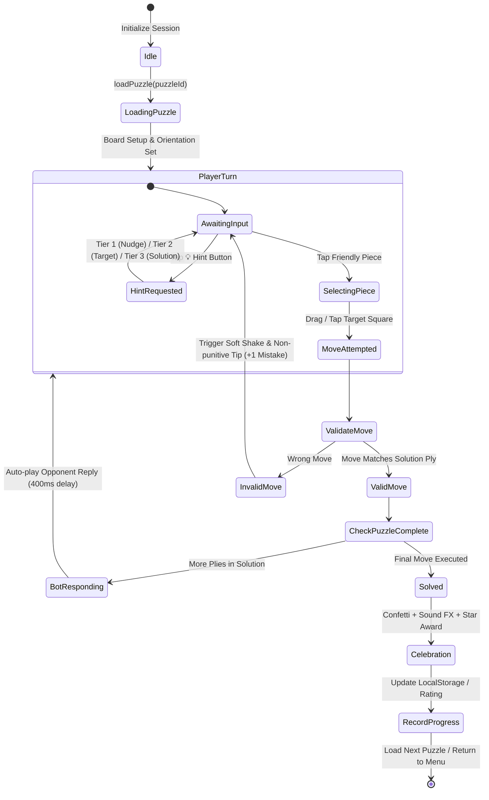
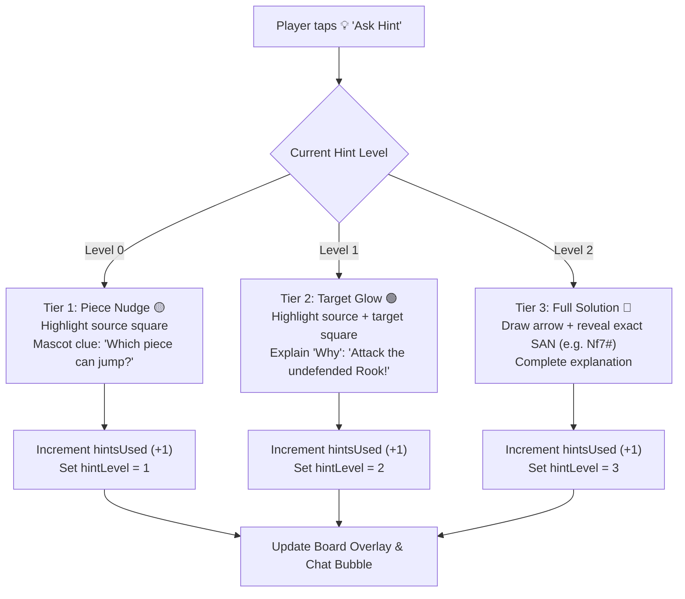

# Fun Chess — Academy Expansion & Gamified Puzzle Hub API Contracts

**Document Version:** `2.0.0`  
**Status:** `FROZEN CONTRACT`  
**Target Audience:** Children aged 7 to 15 (School Chess Clubs, Beginners & Intermediate Learners)  
**Monorepo Package:** `@fun-chess/shared` (`shared/src/contracts/`)  
**Author:** `@architect` (System Architecture Authority)  

---

## 1. Executive Architectural Overview

Fun Chess is expanding its pedagogical capabilities with two major pillars:
1. **Academy Curriculum Expansion:** Adding intermediate tactical motifs, checkmate pattern families, endgame conversions, and classic opening traps to the guided interactive scenario engine.
2. **Gamified Standalone Puzzle Hub:** Introducing an offline-first, zero-database puzzle hub featuring **Themed Drills**, an **Adaptive Rating Ladder**, and high-energy **Puzzle Rush / Streak Survivor** modes.

```
+-------------------------------------------------------------------------------+
|                             @fun-chess/shared                                 |
|                                                                               |
|   +--------------------------+   +----------------------------------------+   |
|   |    Scenario Contracts    |   |            Puzzle Contracts            |   |
|   |  - ScenarioCategory      |   |  - Puzzle & PuzzleTheme                |   |
|   |  - ChessScenario         |   |  - PuzzleMode & PuzzleSessionState     |   |
|   |  - ScenarioProgressStore |   |  - HintLevel & HintData (3-Tier)       |   |
|   |  - ScenarioRunnerState   |   |  - AdaptiveRatingState & Elo Engine    |   |
|   +--------------------------+   |  - PuzzleProgress & PuzzleProgressStore|   |
|                                  +----------------------------------------+   |
+-------------------------------------------------------------------------------+
                                      │
               ┌──────────────────────┴──────────────────────┐
               ▼                                             ▼
+-----------------------------+               +-----------------------------+
|    apps/client (Vue 3)      |               |     apps/server (Node)      |
|  - features/scenarios/      |               |  - LAN Discovery / WebSockets|
|  - features/puzzles/        |               |  - Zero Database            |
|  - Offline Puzzle Packs     |               |  - Stateless Multiplay Hub  |
|  - LocalStorage Repositories|               +-----------------------------+
+-----------------------------+
```

### Architectural Principles (Non-Negotiable)
1. **Rule 1 (I/O Isolation):** All persistence is abstracted behind strict interfaces (`ScenarioProgressStore`, `PuzzleProgressStore`). Production uses defensive `LocalStorage` adapters with in-memory fallbacks; unit tests use pure `InMemory` adapters.
2. **Rule 2 (Pure Business Logic):** All move validation, rating calculation (Elo/Glicko), puzzle progression, combo scoring, and hint generation are pure functions operating on immutable data structures.
3. **Rule 3 (Dependency Inversion):** UI components and composables depend on shared interfaces, never on concrete storage or filesystem implementations.
4. **Foolproof & Non-Punitive UX:** Designed for kids aged 7–15 with 3-tier progressive hints, unlimited non-punitive retries, gentle shake animations, and positive mascot reinforcement.

---

## 2. Shared Core Contracts (`@fun-chess/shared`)

### 2.1 Navigation & App Shell Updates (`contracts/navigation.ts`)

```typescript
import type { PieceColor } from './models.js';
import type { MascotId } from './ai.js';
import type { PuzzleMode, PuzzleTheme } from './puzzle.js';

/**
 * Primary game modes available within Fun Chess.
 */
export type AppGameMode =
  | 'lobby'             // Main menu mode selector
  | 'multiplayer_lan'   // Local Wi-Fi / LAN Room match
  | 'solo_ai'           // Single-player match against Mascot AI
  | 'academy'           // Interactive Chess Academy & Guided Lessons
  | 'puzzle_hub';       // Gamified Tactical Puzzle Hub (Drills, Ladder, Rush)

/**
 * Launch configuration for the Puzzle Hub.
 */
export interface PuzzleHubLaunchConfig {
  readonly mode: PuzzleMode;
  readonly theme?: PuzzleTheme;
  readonly targetRating?: number;
}

/**
 * Configuration payload for launching a specific Academy Scenario.
 */
export interface AcademyLaunchConfig {
  readonly scenarioId: string;
  readonly autoStartStep?: number;
}

/**
 * Unified application state governing top-level view routing.
 */
export interface AppShellState {
  readonly currentMode: AppGameMode;
  readonly soloAiConfig: SoloAiLaunchConfig | null;
  readonly academyConfig: AcademyLaunchConfig | null;
  readonly puzzleHubConfig: PuzzleHubLaunchConfig | null;
  readonly isMuted: boolean;
  readonly isDarkMode: boolean;
}

/**
 * Navigation actions emitted by sub-views to the top-level shell.
 */
export type AppShellEventMap = {
  'navigate:lobby': void;
  'navigate:multiplayer': void;
  'navigate:solo_ai': SoloAiLaunchConfig;
  'navigate:academy': AcademyLaunchConfig | undefined;
  'navigate:puzzle_hub': PuzzleHubLaunchConfig | undefined;
};
```

---

## 3. Academy & Scenario Curriculum Contracts (`contracts/scenario.ts`)

### 3.1 Expanded Category Taxonomy

```typescript
import type { Square, PieceColor } from './models.js';

/**
 * High-level topic category for chess learning curriculum.
 * Expanded to include intermediate tactical motifs, checkmate pattern families,
 * endgame conversions, and classic opening traps.
 */
export type ScenarioCategory =
  | 'fundamentals'          // Piece movements, captures, board geometry
  | 'rules_and_basics'      // Alias for fundamentals / rules
  | 'special_moves'         // Castling, en passant, pawn promotion
  | 'tactical_patterns'     // Basic tactics: forks, pins, skewers, discovered attacks
  | 'intermediate_tactics'  // Advanced tactics: CCT, deflection, decoy, interference, clearance, Greek Gift, windmill, zwischenzug, desperado
  | 'checkmate_patterns'    // Basic checkmates: Scholar's Mate, Back-Rank, Fool's Mate
  | 'checkmate_families'    // Named checkmate patterns: Anastasia, Arabian, Hook, Vukovic, Boden, Balestra, Blackburne, Lolli, Damiano, Kill Box, Railroad, Blind Swine
  | 'endgame_basics'        // Basic endgames: King+Queen, King+Rook, pawn races
  | 'endgame_conversions'   // Lucena position, Philidor defense, Two Bishops mate
  | 'opening_traps';        // Famous traps: Legal's Trap, Fried Liver Attack, Noah's Ark

/**
 * Scenario difficulty calibrated for young learners (ages 7–15).
 */
export type ScenarioDifficulty = 'beginner' | 'intermediate' | 'advanced' | 'master';

/**
 * Recommended target age cohort for pedagogical pacing and text tone.
 */
export type TargetAgeGroup = '5-8' | '7-10' | '11-15' | 'all';

/**
 * Performance star rating for completing a scenario attempt.
 * - 3 Stars: Solved cleanly with 0 hints used and 0 mistakes.
 * - 2 Stars: Solved using <= 1 hint or <= 1 retry.
 * - 1 Star:  Solved with multiple hints or retries (always awards at least 1 star for completion).
 */
export type StarRating = 1 | 2 | 3;

/**
 * Constrained move definition specifying acceptable source and target squares.
 */
export interface StepMoveConstraint {
  readonly from: Square;
  readonly to: Square;
  readonly promotion?: 'q' | 'r' | 'b' | 'n';
}

/**
 * Automated bot response executed after player successfully executes a step move.
 */
export interface StepOpponentResponse {
  readonly from: Square;
  readonly to: Square;
  readonly promotion?: 'q' | 'r' | 'b' | 'n';
  readonly delayMs?: number;
  readonly dialogue?: string;
}

/**
 * Individual interactive step within a multi-step tutorial scenario.
 */
export interface TutorialStep {
  readonly id: string;
  readonly stepNumber: number;
  readonly instruction: string;
  readonly conceptExplanation?: string;
  readonly hint: string;
  readonly setupFen: string;
  readonly highlightSquares?: readonly Square[];
  readonly threatSquares?: readonly Square[];
  readonly playerColor?: PieceColor;
  readonly allowedMoves?: readonly StepMoveConstraint[];
  readonly opponentResponse?: StepOpponentResponse;
  readonly explanationOnSuccess: string;
}

/**
 * Full tutorial scenario definition comprising multiple interactive steps.
 */
export interface ChessScenario {
  readonly id: string;
  readonly title: string;
  readonly subtitle: string;
  readonly category: ScenarioCategory;
  readonly difficulty: ScenarioDifficulty;
  readonly targetAgeGroup: TargetAgeGroup;
  readonly icon: string;
  readonly description: string;
  readonly estimatedMinutes: number;
  readonly steps: readonly TutorialStep[];
}

/**
 * Curriculum section grouping related scenarios in the Academy overview.
 */
export interface CurriculumSection {
  readonly id: ScenarioCategory;
  readonly title: string;
  readonly subtitle: string;
  readonly icon: string;
  readonly scenarios: readonly ChessScenario[];
}

/**
 * Scenario user progress record persisted locally.
 */
export interface ScenarioProgress {
  readonly scenarioId: string;
  readonly starsEarned: StarRating;
  readonly attemptsCount: number;
  readonly hintsUsedTotal: number;
  readonly firstCompletedAt: number;
  readonly lastCompletedAt: number;
}

export type ScenarioProgressMap = Record<string, ScenarioProgress>;

/**
 * Storage abstraction for persisting Scenario progress.
 * Adheres to I/O Isolation Rule (Rule 1).
 */
export interface ScenarioProgressStore {
  getProgressMap(): Promise<ScenarioProgressMap>;
  getProgress(scenarioId: string): Promise<ScenarioProgress | null>;
  saveProgress(scenarioId: string, stars: StarRating, hintsUsed: number): Promise<ScenarioProgress>;
  resetAllProgress(): Promise<void>;
}

/**
 * Reactive state machine for active scenario playback.
 */
export interface ScenarioRunnerState {
  readonly scenario: ChessScenario | null;
  readonly currentStepIndex: number;
  readonly currentStep: TutorialStep | null;
  readonly currentFen: string;
  readonly totalSteps: number;
  readonly isCompleted: boolean;
  readonly hintsUsedCurrentAttempt: number;
  readonly mistakesCurrentAttempt: number;
  readonly activeHint: string | null;
  readonly hintGlowSquare: Square | null;
  readonly hintTargetSquare: Square | null;
  readonly isWaitingForBotResponse: boolean;
  readonly feedbackMessage: string | null;
  readonly isStepSuccess: boolean;
  readonly isShaking: boolean;
  readonly calculatedStars: StarRating;
}
```

---

## 4. Gamified Puzzle Hub Contracts (`contracts/puzzle.ts`)

### 4.1 Puzzle Themes & Tactical Taxonomy

```typescript
import type { Square, PieceColor } from './models.js';

/**
 * Comprehensive tactical and positional motif themes for curated puzzles.
 * Grouped into 5 pedagogical domains.
 */
export type PuzzleTheme =
  // --- Domain 1: Fundamental Tactics ---
  | 'fork'
  | 'pin'
  | 'skewer'
  | 'discovered_attack'
  | 'discovered_check'
  | 'double_check'
  | 'hanging_piece'
  | 'trapped_piece'
  // --- Domain 2: Intermediate Tactical Motifs ---
  | 'captures_checks_threats' // CCT calculation discipline
  | 'knight_outpost'
  | 'cross_pin'
  | 'battery'
  | 'deflection'
  | 'decoy'
  | 'interference'
  | 'clearance'
  | 'greek_gift'
  | 'windmill'
  | 'zwischenzug'             // In-between move
  | 'desperado'
  | 'overloaded_piece'
  | 'x_ray_attack'
  // --- Domain 3: Checkmate Pattern Families ---
  | 'mate_in_1'
  | 'mate_in_2'
  | 'mate_in_3'
  | 'back_rank_mate'
  | 'scholars_mate'
  | 'smothered_mate'
  | 'anastasia_mate'
  | 'arabian_mate'
  | 'hook_mate'
  | 'vukovic_mate'
  | 'boden_mate'
  | 'balestra_mate'
  | 'blackburne_mate'
  | 'lolli_mate'
  | 'damiano_mate'
  | 'kill_box_mate'
  | 'railroad_mate'
  | 'blind_swine_mate'
  | 'dovetail_mate'
  // --- Domain 4: Endgame Conversions ---
  | 'pawn_endgame'
  | 'rook_endgame'
  | 'queen_endgame'
  | 'minor_piece_endgame'
  | 'lucena_position'
  | 'philidor_defense'
  | 'two_bishops_mate'
  // --- Domain 5: Opening Traps & Defenses ---
  | 'legals_trap'
  | 'fried_liver'
  | 'noahs_ark_trap'
  | 'fools_mate';

/**
 * High-level theme category for drill filtering.
 */
export type PuzzleThemeCategory =
  | 'basic_tactics'
  | 'advanced_tactics'
  | 'checkmate_patterns'
  | 'endgame_technique'
  | 'opening_traps';

/**
 * Metadata descriptor for rendering theme cards in Themed Drills.
 */
export interface PuzzleThemeDescriptor {
  readonly id: PuzzleTheme;
  readonly category: PuzzleThemeCategory;
  readonly name: string;
  readonly icon: string;
  readonly description: string;
  readonly kidFriendlyTip: string;
  readonly estimatedRatingRange: readonly [number, number];
}

/**
 * Calibrated puzzle difficulty tier based on target ELO.
 */
export type PuzzleDifficultyTier =
  | 'novice'       // 600 - 900  (1-move captures / simple mate in 1)
  | 'easy'         // 900 - 1200 (2-ply forks, pins, simple mates)
  | 'medium'       // 1200 - 1500 (3-4 ply intermediate tactics)
  | 'hard'         // 1500 - 1800 (Complex multi-ply combinations)
  | 'expert';      // 1800+       (Subtle sacrifices & endgame accuracy)
```

---

### 4.2 Puzzle Data Entity & Pack Specifications

```typescript
/**
 * Core immutable puzzle representation derived from curated offline CC0 positions.
 */
export interface Puzzle {
  /** Unique puzzle identifier, e.g. "puz_fork_001" */
  readonly id: string;
  /** Initial board FEN position before the setup move or player move */
  readonly fen: string;
  /**
   * Solution line represented as standard UCI move strings (e.g. ["e2e4", "e7e5", "g1f3"]).
   * If initialPly is odd, moves[0] is the opponent's setup move to trigger the puzzle position.
   */
  readonly moves: readonly string[];
  /** Calibrated difficulty rating (Elo / Glicko) */
  readonly rating: number;
  /** Rating deviation / confidence (Glicko RD) */
  readonly ratingDeviation: number;
  /** Identified tactical themes and motifs */
  readonly themes: readonly PuzzleTheme[];
  /** Primary theme of the puzzle for categorized drills */
  readonly primaryTheme: PuzzleTheme;
  /** Difficulty tier classification */
  readonly difficulty: PuzzleDifficultyTier;
  /** Kid-friendly puzzle title, e.g. "The Royal Knight Leap! ♞" */
  readonly title: string;
  /** Catchy subtitle or hint clue */
  readonly subtitle?: string;
  /** Side to move for the player ('w' | 'b') */
  readonly playerColor: PieceColor;
  /** Number of half-moves in the complete solution */
  readonly solutionPlies: number;
}

/**
 * Offline puzzle pack metadata header.
 */
export interface PuzzlePackMetadata {
  readonly version: string;
  readonly generatedAt: string;
  readonly totalPuzzles: number;
  readonly themeDistribution: Record<PuzzleTheme, number>;
  readonly ratingDistribution: {
    readonly novice: number;
    readonly easy: number;
    readonly medium: number;
    readonly hard: number;
    readonly expert: number;
  };
}

/**
 * Complete offline bundle format loaded client-side.
 */
export interface PuzzleBundle {
  readonly metadata: PuzzlePackMetadata;
  readonly puzzles: readonly Puzzle[];
}
```

---

### 4.3 3-Tier Progressive Hint System (`contracts/puzzle.ts`)

```typescript
/**
 * Three progressive tiers of assistance designed for zero-frustration learning.
 * - Tier 1 (Nudge): Highlights the source square of the piece that needs to move.
 * - Tier 2 (Target): Highlights the destination target square / zone with tactical rationale.
 * - Tier 3 (Solution): Displays the complete solution move arrow and exact UCI move.
 */
export type HintLevel = 0 | 1 | 2 | 3;

export type HintTierName = 'none' | 'piece_nudge' | 'target_glow' | 'full_solution';

/**
 * Structured hint payload returned to the UI when a hint is requested.
 */
export interface HintData {
  /** Current active hint level (1, 2, or 3) */
  readonly level: HintLevel;
  /** Friendly tier name */
  readonly tier: HintTierName;
  /** Source square of the piece that should move (revealed in Tier 1+) */
  readonly sourceSquare?: Square;
  /** Destination target square (revealed in Tier 2+) */
  readonly targetSquare?: Square;
  /** Kid-friendly hint message explaining the concept */
  readonly message: string;
  /** Full algebraic move string (e.g. "Nf7#", revealed in Tier 3) */
  readonly solutionSan?: string;
  /** UCI move format (e.g. "d5f7", revealed in Tier 3) */
  readonly solutionUci?: string;
  /** Mascot dialogue accompanying the hint */
  readonly mascotDialogue?: string;
}
```

---

### 4.4 Puzzle Hub Game Modes & Session States

```typescript
/**
 * Game modes available within the Puzzle Hub.
 */
export type PuzzleMode =
  | 'themed_drills'     // Untimed targeted practice by motif/theme
  | 'adaptive_ladder'   // Adaptive Elo rating climb with dynamic difficulty
  | 'puzzle_rush'       // 3-minute timed rapid-fire challenge
  | 'streak_survivor';  // 3-strike survival mode (how far can you go?)

/**
 * Result state for a single puzzle attempt within a session.
 */
export type PuzzleAttemptResult =
  | 'unsolved'
  | 'solved_first_try'
  | 'solved_with_hints'
  | 'solved_with_retries'
  | 'failed';

/**
 * Base state for any active puzzle session.
 */
export interface BasePuzzleSessionState {
  readonly mode: PuzzleMode;
  readonly currentPuzzle: Puzzle | null;
  readonly currentFen: string;
  readonly currentMoveIndex: number;      // Current ply index in puzzle.moves
  readonly isPlayerTurn: boolean;
  readonly isCompleted: boolean;
  readonly isSolvedSuccessfully: boolean;
  readonly attemptResult: PuzzleAttemptResult;
  readonly currentHintLevel: HintLevel;
  readonly activeHint: HintData | null;
  readonly mistakesCount: number;
  readonly selectedSquare: Square | null;
  readonly legalMoves: readonly Square[];
  readonly lastMove: { readonly from: Square; readonly to: Square } | null;
  readonly isShaking: boolean;
  readonly feedbackMessage: string | null;
}

/**
 * Themed Drills Session State (Untimed practice).
 */
export interface ThemedDrillsSessionState extends BasePuzzleSessionState {
  readonly mode: 'themed_drills';
  readonly activeTheme: PuzzleTheme;
  readonly puzzlesSolvedInSession: number;
  readonly totalPuzzlesInTheme: number;
  readonly sessionAccuracyPercent: number;
}

/**
 * Adaptive Rating Ladder Session State.
 */
export interface AdaptiveLadderSessionState extends BasePuzzleSessionState {
  readonly mode: 'adaptive_ladder';
  readonly currentRating: number;
  readonly initialSessionRating: number;
  readonly ratingDelta: number;
  readonly ratingConfidence: number;      // RD
  readonly streakCount: number;
  readonly bestStreakSession: number;
  readonly targetPuzzleRating: number;
}

/**
 * Puzzle Rush Session State (3-minute blitz sprint).
 */
export interface PuzzleRushSessionState extends BasePuzzleSessionState {
  readonly mode: 'puzzle_rush';
  readonly timeRemainingSeconds: number;
  readonly initialTimeSeconds: number;    // default: 180s (3 min)
  readonly score: number;                 // Total puzzles solved correctly
  readonly strikes: number;               // Strikes accumulated (max: 3)
  readonly maxStrikes: number;            // default: 3
  readonly comboMultiplier: number;       // 1x, 2x, 3x on consecutive correct solves
  readonly currentStreak: number;
  readonly isTimerRunning: boolean;
  readonly isGameOver: boolean;
  readonly timeBonusEarnedSeconds: number;// +5s bonus on fast streak solves
}

/**
 * Streak Survivor Session State (Untimed 3-strike survival).
 */
export interface StreakSurvivorSessionState extends BasePuzzleSessionState {
  readonly mode: 'streak_survivor';
  readonly livesRemaining: number;        // default: 3
  readonly maxLives: number;
  readonly currentStreak: number;
  readonly bestStreakAllTime: number;
  readonly score: number;
  readonly isGameOver: boolean;
}

/**
 * Union type for all active session states.
 */
export type PuzzleSessionState =
  | ThemedDrillsSessionState
  | AdaptiveLadderSessionState
  | PuzzleRushSessionState
  | StreakSurvivorSessionState;
```

---

### 4.5 Adaptive Rating & Progress Contracts (`contracts/puzzle.ts`)

```typescript
/**
 * Adaptive Elo Rating State for a young learner.
 * Uses child-friendly floor protections (rating cannot drop below 500)
 * and generous bonus scaling on clean streaks.
 */
export interface AdaptiveRatingState {
  /** Current calibrated puzzle Elo (default: 800 for beginners) */
  readonly rating: number;
  /** Rating deviation / volatility (default: 350) */
  readonly ratingDeviation: number;
  /** Peak Elo achieved all-time */
  readonly peakRating: number;
  /** Total puzzles attempted across all modes */
  readonly totalAttempted: number;
  /** Total puzzles solved cleanly */
  readonly totalSolved: number;
  /** All-time longest solve streak without mistakes */
  readonly bestStreak: number;
  /** History of rating adjustments for chart rendering (last 50 data points) */
  readonly ratingHistory: readonly {
    readonly timestamp: number;
    readonly rating: number;
    readonly puzzleId: string;
    readonly delta: number;
  }[];
}

/**
 * Performance summary for a single puzzle theme.
 */
export interface ThemeMasteryProgress {
  readonly theme: PuzzleTheme;
  readonly attempted: number;
  readonly solved: number;
  readonly starsEarned: number;
  readonly masteryLevel: 'novice' | 'apprentice' | 'master';
  readonly lastPracticedAt: number;
}

/**
 * High scores record for arcade modes.
 */
export interface PuzzleArcadeStats {
  readonly puzzleRushHighScore: number;
  readonly puzzleRushBestStreak: number;
  readonly streakSurvivorHighScore: number;
  readonly totalRushRuns: number;
}

/**
 * Overall persistent user progress across the entire Puzzle Hub.
 */
export interface PuzzleProgress {
  /** Player's adaptive Elo rating profile */
  readonly ratingProfile: AdaptiveRatingState;
  /** Theme-by-theme mastery stats */
  readonly themeMastery: Record<PuzzleTheme, ThemeMasteryProgress>;
  /** Arcade high scores */
  readonly arcadeStats: PuzzleArcadeStats;
  /** Map of solved puzzle IDs with best star rating (1-3) */
  readonly solvedPuzzles: Record<string, { readonly stars: StarRating; readonly solvedAt: number }>;
  /** Epoch ms timestamp when profile was created */
  readonly createdAt: number;
  /** Epoch ms timestamp when profile was last updated */
  readonly lastActiveAt: number;
}

/**
 * Storage abstraction for persisting Puzzle Hub progress.
 * Adheres to Rule 1 (I/O Isolation).
 */
export interface PuzzleProgressStore {
  /** Retrieves full player puzzle progress record */
  getProgress(): Promise<PuzzleProgress>;
  /** Updates adaptive rating profile after a ladder match */
  updateRating(newRatingState: AdaptiveRatingState): Promise<void>;
  /** Records a solved or attempted puzzle result */
  recordPuzzleAttempt(
    puzzleId: string,
    theme: PuzzleTheme,
    result: PuzzleAttemptResult,
    stars: StarRating
  ): Promise<PuzzleProgress>;
  /** Updates Puzzle Rush or Streak Survivor high scores */
  saveArcadeResult(mode: 'puzzle_rush' | 'streak_survivor', score: number, streak: number): Promise<PuzzleProgress>;
  /** Resets all puzzle progress (user data reset) */
  resetAll(): Promise<void>;
}
```

---

## 5. Pure Business Logic Engine Contracts (`contracts/puzzle_engine.ts`)

All engine functions are pure (Input $\to$ Output), zero I/O, zero DOM, and independently testable.

### 5.1 Puzzle Move Validator & State Advance

```typescript
import type { Square } from './models.js';
import type { Puzzle, HintLevel, HintData, PuzzleAttemptResult } from './puzzle.js';

export interface PlayerMoveAction {
  readonly from: Square;
  readonly to: Square;
  readonly promotion?: 'q' | 'r' | 'b' | 'n';
}

export interface MoveValidationOutcome {
  /** Whether the move matches the puzzle's expected solution ply */
  readonly isCorrect: boolean;
  /** Whether the complete puzzle solution is now finished */
  readonly isPuzzleComplete: boolean;
  /** Next FEN string after applying player move and optional bot response */
  readonly nextFen: string;
  /** Automated bot counter-move if puzzle continues */
  readonly botReplyMove?: {
    readonly from: Square;
    readonly to: Square;
    readonly promotion?: 'q' | 'r' | 'b' | 'n';
    readonly san: string;
    readonly uci: string;
  };
  /** Next ply index in solution */
  readonly nextMoveIndex: number;
  /** Encouraging feedback message */
  readonly feedback: string;
}

/**
 * Validates a player move against the current solution ply of a puzzle.
 * Pure function adhering to Rule 2.
 */
export interface PuzzleEngineService {
  /**
   * Evaluates player move against puzzle moves array.
   */
  validateMove(
    puzzle: Puzzle,
    currentMoveIndex: number,
    currentFen: string,
    playerMove: PlayerMoveAction
  ): MoveValidationOutcome;

  /**
   * Generates progressive 3-tier hint for the current puzzle state.
   */
  generateHint(
    puzzle: Puzzle,
    currentMoveIndex: number,
    currentFen: string,
    requestedLevel: HintLevel
  ): HintData;

  /**
   * Calculates star rating (1-3) based on hints and mistakes.
   */
  calculatePuzzleStars(hintsUsed: number, mistakesCount: number): StarRating;
}
```

---

### 5.2 Adaptive Elo Calculator (`contracts/rating_engine.ts`)

```typescript
export interface RatingAdjustmentParams {
  readonly playerRating: number;
  readonly playerRd: number;
  readonly puzzleRating: number;
  readonly isSuccess: boolean;
  readonly hintsUsed: number;
  readonly currentStreak: number;
}

export interface RatingAdjustmentResult {
  readonly newRating: number;
  readonly newRd: number;
  readonly delta: number;
  readonly streakBonus: number;
  readonly isProtectedByFloor: boolean;
}

/**
 * Pure calculation functions for dynamic Elo progression tailored for kids.
 */
export interface AdaptiveRatingCalculator {
  /**
   * Computes Elo delta using kid-calibrated K-factor:
   * - K = 32 for standard solves
   * - Floor protection at 500 ELO (no negative frustration)
   * - Non-punitive loss scaling on failed attempts with multiple hints
   * - Streak multipliers on consecutive clean solves (+2 to +10 bonus)
   */
  calculateAdjustment(params: RatingAdjustmentParams): RatingAdjustmentResult;

  /**
   * Selects the next recommended puzzle from an offline candidate pool
   * matching the player's current rating band with optimal win-rate targeting (~70%).
   */
  selectTargetPuzzleRating(currentRating: number, streak: number): number;
}
```

---

### 5.3 Puzzle Rush & Streak Engine

```typescript
export interface RushTickResult {
  readonly timeRemainingSeconds: number;
  readonly isExpired: boolean;
}

export interface RushSolveResult {
  readonly newScore: number;
  readonly newStreak: number;
  readonly comboMultiplier: number;
  readonly timeBonusSeconds: number;
  readonly isNewHighScore: boolean;
}

export interface RushStrikeResult {
  readonly newStrikes: number;
  readonly isGameOver: boolean;
  readonly comboReset: boolean;
}

/**
 * Pure logic for managing Puzzle Rush arcade rules.
 */
export interface PuzzleRushRules {
  applySolve(currentScore: number, currentStreak: number, highScore: number, solveTimeMs: number): RushSolveResult;
  applyStrike(currentStrikes: number, maxStrikes?: number): RushStrikeResult;
  calculateTimeTick(currentSeconds: number, deltaSeconds: number): RushTickResult;
}
```

---

## 6. State Machine Transitions & Flows (Mermaid)

### 6.1 Puzzle Runner Lifecycle



---

### 6.2 3-Tier Progressive Hint Flow



---

## 7. Error Contracts & Defensive Runtime Handling (`contracts/errors.ts`)

```typescript
export type PuzzleErrorCode =
  | 'ERR_PUZZLE_NOT_FOUND'
  | 'ERR_INVALID_PUZZLE_FEN'
  | 'ERR_MALFORMED_SOLUTION_LINE'
  | 'ERR_STORAGE_UNAVAILABLE'
  | 'ERR_STORAGE_PARSE_FAILED'
  | 'ERR_INVALID_THEME'
  | 'ERR_RUSH_ALREADY_FINISHED';

export interface PuzzleErrorPayload {
  readonly code: PuzzleErrorCode;
  readonly message: string;
  readonly puzzleId?: string;
  readonly details?: Record<string, unknown>;
}
```

### Defensive Runtime Rules
1. **Corrupted Pack Protection:** If an offline puzzle entry contains an unparseable FEN or corrupted UCI moves, the engine skips it gracefully, logs an internal warning, and loads the next puzzle in the pack without crashing.
2. **LocalStorage Quota Defense:** If `localStorage.setItem()` throws a `QuotaExceededError`, the storage adapter seamlessly reverts to the in-memory fallback cache so the child never experiences game interruption.
3. **Safe Type Narrowing:** All raw JSON reads from `localStorage` pass through a pure sanitizer (`sanitizePuzzleProgress`) validating property types before mutating runtime state.

---

## 8. Export Consolidation (`shared/src/index.ts`)

All contracts detailed above are re-exported at the root of `@fun-chess/shared`:

```typescript
export * from './contracts/models.js';
export * from './contracts/errors.js';
export * from './contracts/api.js';
export * from './contracts/events.js';
export * from './contracts/scenario.js';
export * from './contracts/ai.js';
export * from './contracts/navigation.js';
export * from './contracts/audio.js';
export * from './contracts/puzzle.js';
export * from './contracts/puzzle_engine.js';
export * from './contracts/rating_engine.js';
```
