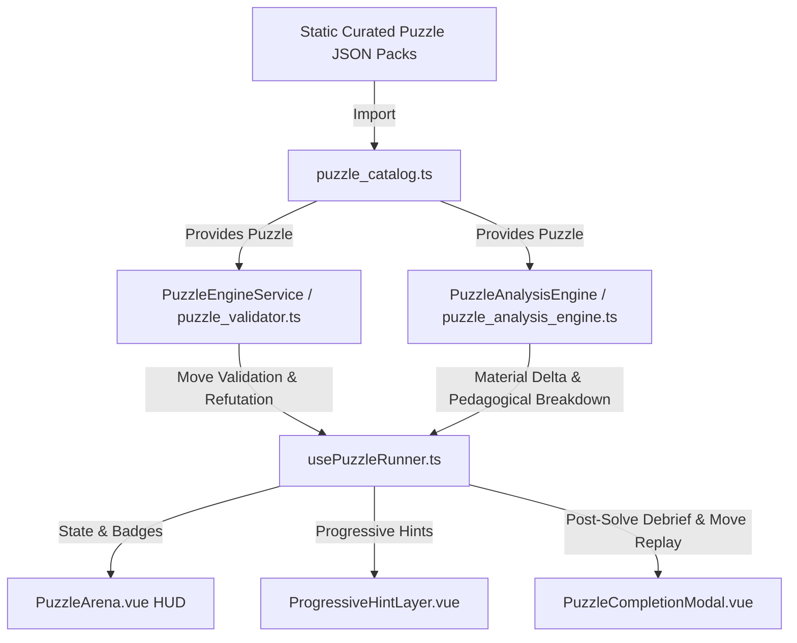

# Puzzle Hub Pedagogical Remediation: API & Engine Contracts

## 1. Executive Architecture Overview

This specification establishes the **frozen schema contracts**, **data structures**, and **algorithmic interfaces** for transforming the Fun Chess Puzzle Hub from a mechanical string-matching move validator into an intuitive, high-impact tactical tutor.



<!-- requirement
  id: REQ-PUZ-PEDAGOGY-001
  title: Pedagogical Puzzle Schema Definition
  priority: must
  category: functional
  rationale: Puzzles must convey why a move was played, the concrete tactical objective, the material advantage won, and the lesson to take away.
-->

<!-- requirement
  id: REQ-PUZ-ENGINE-002
  title: Client-Side Puzzle Analysis Engine
  priority: must
  category: functional
  rationale: Zero-latency client-side engine must calculate net material delta, detect tactical motifs, generate kid-friendly explanations, and provide mistake refutations without network or external LLM dependencies.
-->

---

## 2. Shared Data Contracts (`shared/src/contracts/puzzle.ts`)

The following definitions represent the frozen contract for `@fun-chess/shared`.

<!-- contract
  id: CT-PUZ-SCHEMA-001
  type: type-definition
  title: Enhanced Puzzle Entity & Pedagogical Metadata Contract
  stack_category: shared-contract
  implements_requirements: [REQ-PUZ-PEDAGOGY-001]
-->

```typescript
import type { Square, PieceColor, PieceType } from "./models.js";
import type { StarRating } from "./scenario.js";
import type { PuzzleErrorCode, PuzzleErrorPayload } from "./errors.js";

/**
 * Comprehensive tactical and positional motif themes for curated puzzles.
 * Grouped into 5 pedagogical domains for structured chess learning.
 */
export type PuzzleTheme =
  // --- Domain 1: Fundamental Tactics ---
  | "fork"
  | "pin"
  | "skewer"
  | "discovered_attack"
  | "discovered_check"
  | "double_check"
  | "hanging_piece"
  | "trapped_piece"
  // --- Domain 2: Intermediate Tactical Motifs ---
  | "captures_checks_threats" // CCT calculation discipline
  | "knight_outpost"
  | "cross_pin"
  | "battery"
  | "deflection"
  | "decoy"
  | "interference"
  | "clearance"
  | "greek_gift"
  | "windmill"
  | "zwischenzug" // In-between move
  | "desperado"
  | "overloaded_piece"
  | "x_ray_attack"
  // --- Domain 3: Checkmate Pattern Families ---
  | "mate_in_1"
  | "mate_in_2"
  | "mate_in_3"
  | "back_rank_mate"
  | "scholars_mate"
  | "smothered_mate"
  | "anastasia_mate"
  | "arabian_mate"
  | "hook_mate"
  | "vukovic_mate"
  | "boden_mate"
  | "balestra_mate"
  | "blackburne_mate"
  | "lolli_mate"
  | "damiano_mate"
  | "kill_box_mate"
  | "railroad_mate"
  | "blind_swine_mate"
  | "dovetail_mate"
  // --- Domain 4: Endgame Conversions ---
  | "pawn_endgame"
  | "rook_endgame"
  | "queen_endgame"
  | "minor_piece_endgame"
  | "lucena_position"
  | "philidor_defense"
  | "two_bishops_mate"
  // --- Domain 5: Opening Traps & Defenses ---
  | "legals_trap"
  | "fried_liver"
  | "noahs_ark_trap"
  | "fools_mate";

/**
 * High-level theme category for drill filtering.
 */
export type PuzzleThemeCategory =
  | "basic_tactics"
  | "advanced_tactics"
  | "checkmate_patterns"
  | "endgame_technique"
  | "opening_traps";

/**
 * Metadata descriptor for rendering theme cards in Themed Drills.
 */
export interface PuzzleThemeDescriptor {
  readonly id: PuzzleTheme;
  readonly category: PuzzleThemeCategory;
  readonly name: string;
  readonly icon: string;
  readonly description: string;
  readonly kidFriendlyTip: string;
  readonly estimatedRatingRange: readonly [number, number];
}

/**
 * Calibrated puzzle difficulty tier based on target ELO.
 */
export type PuzzleDifficultyTier =
  | "novice" // 600 - 900  (1-move captures / simple mate in 1)
  | "easy" // 900 - 1200 (2-ply forks, pins, simple mates)
  | "medium" // 1200 - 1500 (3-4 ply intermediate tactics)
  | "hard" // 1500 - 1800 (Complex multi-ply combinations)
  | "expert"; // 1800+       (Subtle sacrifices & endgame accuracy)

/**
 * Concrete pedagogical reward / tactical payoff expected from completing a puzzle.
 */
export type TacticalReward =
  | "checkmate"
  | "win_queen"
  | "win_rook"
  | "win_minor_piece"
  | "win_exchange"
  | "win_pawn"
  | "pawn_promotion"
  | "perpetual_defense"
  | "escape_danger";

/**
 * Turn-by-turn breakdown explaining individual plies in a multi-move solution.
 */
export interface PuzzleStepExplanation {
  /** 0-based ply index in puzzle.moves */
  readonly plyIndex: number;
  /** Standard Algebraic Notation of the move (e.g. "Nc7+", "Kd8", "Nxa8") */
  readonly moveSan: string;
  /** UCI move format (e.g. "b5c7") */
  readonly moveUci: string;
  /** Actor executing the move ('w' | 'b') */
  readonly actor: PieceColor;
  /** Kid-friendly explanation of the tactical purpose or consequence of this move */
  readonly explanation: string;
}

/**
 * Structured summary of net material advantage gained upon puzzle completion.
 */
export interface MaterialAdvantageSummary {
  /** Target piece captured or promoted (if applicable) */
  readonly pieceType?: PieceType;
  /** Net centipawn swing from player's perspective */
  readonly netCentipawns: number;
  /** Net standard point advantage (+9 Queen, +5 Rook, +3 Minor, +2 Exchange, +1 Pawn) */
  readonly netPoints: number;
  /** Human-readable pill label, e.g. "+5 Rook ♜", "+9 Queen ♛", "Checkmate 👑" */
  readonly formattedAdvantage: string;
  /** Whether the resulting material lead is completely decisive */
  readonly isDecisive: boolean;
}

/**
 * Full pedagogical analysis payload generated by PuzzleAnalysisEngine.
 */
export interface PuzzleAnalysisResult {
  /** Material balance in initial position */
  readonly initialMaterial: {
    readonly white: number;
    readonly black: number;
    readonly net: number;
  };
  /** Material balance in final position */
  readonly finalMaterial: {
    readonly white: number;
    readonly black: number;
    readonly net: number;
  };
  /** Net centipawn swing (final - initial from player's perspective) */
  readonly materialDeltaCentipawns: number;
  /** Net points gained (+9, +5, +3, etc.) */
  readonly netPointsDelta: number;
  /** Formatted advantage summary */
  readonly advantageSummary: MaterialAdvantageSummary;
  /** Primary tactical motif detected */
  readonly detectedTheme: PuzzleTheme;
  /** Whether solution ends in checkmate */
  readonly isCheckmate: boolean;
  /** Whether solution involves a pawn promotion */
  readonly isPawnPromotion: boolean;
  /** Catchy headline for the modal, e.g. "Royal Knight Fork on c7!" */
  readonly tacticalHeadline: string;
  /** 1-2 sentence kid-friendly explanation of why the tactic won */
  readonly kidFriendlyExplanation: string;
  /** Coach Sparky rule of thumb / takeaway tip */
  readonly ruleOfThumb: string;
  /** Detailed turn-by-turn narratives */
  readonly stepNarratives: readonly PuzzleStepExplanation[];
}

/**
 * Diagnostic analysis for an incorrect player move (refutation).
 */
export interface PlayerMistakeRefutation {
  /** Player's attempted move in UCI */
  readonly playerMoveUci: string;
  /** Player's attempted move in SAN */
  readonly playerMoveSan: string;
  /** Opponent's punishing counter-move in UCI */
  readonly refutationMoveUci: string;
  /** Opponent's punishing counter-move in SAN */
  readonly refutationMoveSan: string;
  /** Color of the punishing actor */
  readonly punishingActor: PieceColor;
  /** Piece lost or targeted in the mistake */
  readonly capturedPiece?: PieceType;
  /** Short tactical reason (e.g. "Leaves your Queen undefended") */
  readonly blunderReason: string;
  /** Kid-friendly coaching explanation */
  readonly kidFriendlyExplanation: string;
  /** Key square to highlight on board for the mistake warning */
  readonly threatSquare?: Square;
}

/**
 * Core immutable puzzle representation derived from curated offline positions.
 * Contains both structural move validation data and rich pedagogical metadata.
 */
export interface Puzzle {
  /** Unique puzzle identifier, e.g. "puz_fork_001" */
  readonly id: string;
  /** Initial board FEN position before the setup move or player move */
  readonly fen: string;
  /**
   * Solution line represented as standard UCI move strings (e.g. ["c3b5", "e8d8", "b5c7", "d8e7", "c7a8"]).
   */
  readonly moves: readonly string[];
  /** Calibrated difficulty rating (Elo / Glicko) */
  readonly rating: number;
  /** Rating deviation / confidence (Glicko RD) */
  readonly ratingDeviation: number;
  /** Identified tactical themes and motifs */
  readonly themes: readonly PuzzleTheme[];
  /** Primary theme of the puzzle for categorized drills */
  readonly primaryTheme: PuzzleTheme;
  /** Difficulty tier classification */
  readonly difficulty: PuzzleDifficultyTier;
  /** Kid-friendly puzzle title, e.g. "The Royal Knight Leap! ♞" */
  readonly title: string;
  /** Catchy subtitle or hint clue */
  readonly subtitle?: string;
  /** Side to move for the player ('w' | 'b') */
  readonly playerColor: PieceColor;
  /** Number of half-moves in the complete solution */
  readonly solutionPlies: number;

  // --- PEDAGOGICAL METADATA ---
  /**
   * Explicit tactical goal displayed in the HUD before and during play.
   * e.g. "Fork the King and Rook on c7 to win decisive material!"
   */
  readonly tacticalGoal: string;

  /**
   * The expected concrete payoff achieved by solving the puzzle.
   */
  readonly tacticalReward: TacticalReward;

  /**
   * Human-readable material / positional advantage descriptor.
   * e.g. "+5 Rook ♜", "+9 Queen ♛", "Checkmate 👑"
   */
  readonly outcomeAdvantage: string;

  /**
   * Post-solve coaching debrief explaining WHY the sequence won.
   * e.g. "1. Nb5 threatened c7. When Black's King moved, 2. Nxc7+ forked King and Rook, winning the undefended Rook!"
   */
  readonly learningSummary: string;

  /**
   * Coach rule of thumb or memorable guideline for young learners.
   * e.g. "Knights are master forkers because they can leap over defenders!"
   */
  readonly keyTakeaway: string;

  /**
   * Optional step-by-step breakdown for each move in the solution line.
   */
  readonly stepExplanations?: readonly PuzzleStepExplanation[];

  /**
   * Optional context describing the opponent's previous blunder that created this tactic.
   * e.g. "Black just moved their Knight to a5, leaving the c7 pawn unguarded."
   */
  readonly blunderContext?: string;

  /**
   * Key target squares involved in the tactic (e.g. ['c7', 'a8'] for fork and target rook).
   */
  readonly targetSquares?: readonly Square[];

  /**
   * Key pieces under threat or involved in the tactical motif.
   */
  readonly keySquares?: readonly Square[];
}

/**
 * Offline puzzle pack metadata header.
 */
export interface PuzzlePackMetadata {
  readonly version: string;
  readonly generatedAt: string;
  readonly totalPuzzles: number;
  readonly themeDistribution: Record<string, number>;
  readonly ratingDistribution: {
    readonly novice: number;
    readonly easy: number;
    readonly medium: number;
    readonly hard: number;
    readonly expert: number;
  };
}

/**
 * Complete offline bundle format loaded client-side.
 */
export interface PuzzleBundle {
  readonly metadata: PuzzlePackMetadata;
  readonly puzzles: readonly Puzzle[];
}

/**
 * Three progressive tiers of assistance designed for zero-frustration learning.
 */
export type HintLevel = 0 | 1 | 2 | 3;

export type HintTierName =
  | "none"
  | "piece_nudge"
  | "target_glow"
  | "full_solution";

/**
 * Extended HintData supporting pedagogical context and vector visual overlays.
 */
export interface ExtendedHintData {
  /** Current active hint level (1, 2, or 3) */
  readonly level: HintLevel;
  /** Friendly tier name */
  readonly tier: HintTierName;
  /** Source square of the piece that should move (revealed in Tier 1+) */
  readonly sourceSquare?: Square;
  /** Destination target square (revealed in Tier 2+) */
  readonly targetSquare?: Square;
  /** Kid-friendly hint message explaining the concept */
  readonly message: string;
  /** Explicit tactical objective clue (e.g. "Look for a double attack on King and Rook") */
  readonly tacticalObjective?: string;
  /** Primary theme icon */
  readonly themeIcon?: string;
  /** Full algebraic move string (e.g. "Nf7#", revealed in Tier 3) */
  readonly solutionSan?: string;
  /** UCI move format (e.g. "d5f7", revealed in Tier 3) */
  readonly solutionUci?: string;
  /** Mascot dialogue accompanying the hint */
  readonly mascotDialogue?: string;
  /** Visual highlight vector arrow (from -> to) */
  readonly highlightArrow?: { readonly from: Square; readonly to: Square };
  /** Threat squares to highlight (e.g. attacked opponent pieces) */
  readonly threatSquares?: readonly Square[];
  /** Target squares to highlight (e.g. outpost or fork square) */
  readonly targetSquares?: readonly Square[];
}

/**
 * Game modes available within the Puzzle Hub.
 */
export type PuzzleMode =
  | "themed_drills" // Untimed targeted practice by motif/theme
  | "adaptive_ladder" // Adaptive Elo rating climb with dynamic difficulty
  | "puzzle_rush" // 3-minute timed rapid-fire challenge
  | "streak_survivor"; // 3-strike survival mode (how far can you go?)

/**
 * Result state for a single puzzle attempt within a session.
 */
export type PuzzleAttemptResult =
  | "unsolved"
  | "solved_first_try"
  | "solved_with_hints"
  | "solved_with_retries"
  | "failed";

/**
 * Base state for any active puzzle session.
 */
export interface BasePuzzleSessionState {
  readonly mode: PuzzleMode;
  readonly currentPuzzle: Puzzle | null;
  readonly currentFen: string;
  readonly currentMoveIndex: number; // Current ply index in puzzle.moves
  readonly isPlayerTurn: boolean;
  readonly isCompleted: boolean;
  readonly isSolvedSuccessfully: boolean;
  readonly attemptResult: PuzzleAttemptResult;
  readonly currentHintLevel: HintLevel;
  readonly activeHint: ExtendedHintData | null;
  readonly mistakesCount: number;
  readonly selectedSquare: Square | null;
  readonly legalMoves: readonly Square[];
  readonly lastMove: { readonly from: Square; readonly to: Square } | null;
  readonly isShaking: boolean;
  readonly feedbackMessage: string | null;
  readonly analysis: PuzzleAnalysisResult | null;
  readonly lastMistakeRefutation: PlayerMistakeRefutation | null;
}

/**
 * Themed Drills Session State (Untimed practice).
 */
export interface ThemedDrillsSessionState extends BasePuzzleSessionState {
  readonly mode: "themed_drills";
  readonly activeTheme: PuzzleTheme;
  readonly puzzlesSolvedInSession: number;
  readonly totalPuzzlesInTheme: number;
  readonly sessionAccuracyPercent: number;
}

/**
 * Adaptive Ladder Session State.
 */
export interface AdaptiveLadderSessionState extends BasePuzzleSessionState {
  readonly mode: "adaptive_ladder";
  readonly currentRating: number;
  readonly initialSessionRating: number;
  readonly ratingDelta: number;
  readonly ratingConfidence: number; // RD
  readonly streakCount: number;
  readonly bestStreakSession: number;
  readonly targetPuzzleRating: number;
}

/**
 * Puzzle Rush Session State (3-minute blitz sprint).
 */
export interface PuzzleRushSessionState extends BasePuzzleSessionState {
  readonly mode: "puzzle_rush";
  readonly timeRemainingSeconds: number;
  readonly initialTimeSeconds: number; // default: 180s (3 min)
  readonly score: number; // Total puzzles solved correctly
  readonly strikes: number; // Strikes accumulated (max: 3)
  readonly maxStrikes: number; // default: 3
  readonly comboMultiplier: number; // 1x, 2x, 3x on consecutive correct solves
  readonly currentStreak: number;
  readonly isTimerRunning: boolean;
  readonly isGameOver: boolean;
  readonly timeBonusEarnedSeconds: number; // +5s bonus on fast streak solves
}

/**
 * Streak Survivor Session State (Untimed 3-strike survival).
 */
export interface StreakSurvivorSessionState extends BasePuzzleSessionState {
  readonly mode: "streak_survivor";
  readonly livesRemaining: number; // default: 3
  readonly maxLives: number;
  readonly currentStreak: number;
  readonly bestStreakAllTime: number;
  readonly score: number;
  readonly isGameOver: boolean;
}

/**
 * Union type for all active session states.
 */
export type PuzzleSessionState =
  | ThemedDrillsSessionState
  | AdaptiveLadderSessionState
  | PuzzleRushSessionState
  | StreakSurvivorSessionState;

/**
 * Historical rating adjustment point for charting.
 */
export interface RatingHistoryPoint {
  readonly timestamp: number;
  readonly rating: number;
  readonly puzzleId: string;
  readonly delta: number;
}

/**
 * Adaptive Elo Rating State for a young learner.
 */
export interface AdaptiveRatingState {
  readonly rating: number;
  readonly ratingDeviation: number;
  readonly peakRating: number;
  readonly totalAttempted: number;
  readonly totalSolved: number;
  readonly bestStreak: number;
  readonly ratingHistory: readonly RatingHistoryPoint[];
}

/**
 * Performance summary for a single puzzle theme.
 */
export interface ThemeMasteryProgress {
  readonly theme: PuzzleTheme;
  readonly attempted: number;
  readonly solved: number;
  readonly starsEarned: number;
  readonly masteryLevel: "novice" | "apprentice" | "master";
  readonly lastPracticedAt: number;
}

/**
 * High scores record for arcade modes.
 */
export interface PuzzleArcadeStats {
  readonly puzzleRushHighScore: number;
  readonly puzzleRushBestStreak: number;
  readonly streakSurvivorHighScore: number;
  readonly totalRushRuns: number;
}

/**
 * Record of solved puzzle completion.
 */
export interface SolvedPuzzleRecord {
  readonly stars: StarRating;
  readonly solvedAt: number;
}

/**
 * Overall persistent user progress across the entire Puzzle Hub.
 */
export interface PuzzleProgress {
  readonly ratingProfile: AdaptiveRatingState;
  readonly themeMastery: Record<string, ThemeMasteryProgress>;
  readonly arcadeStats: PuzzleArcadeStats;
  readonly solvedPuzzles: Record<string, SolvedPuzzleRecord>;
  readonly createdAt: number;
  readonly lastActiveAt: number;
}

/**
 * Storage abstraction for persisting Puzzle Hub progress.
 * Adheres to Rule 1 (I/O Isolation).
 */
export interface PuzzleProgressStore {
  getProgress(): Promise<PuzzleProgress>;
  updateRating(newRatingState: AdaptiveRatingState): Promise<void>;
  recordPuzzleAttempt(
    puzzleId: string,
    theme: PuzzleTheme,
    result: PuzzleAttemptResult,
    stars: StarRating,
  ): Promise<PuzzleProgress>;
  saveArcadeResult(
    mode: "puzzle_rush" | "streak_survivor",
    score: number,
    streak: number,
  ): Promise<PuzzleProgress>;
  resetAll(): Promise<void>;
}

/**
 * Player move input action in puzzle engine.
 */
export interface PlayerMoveAction {
  readonly from: Square;
  readonly to: Square;
  readonly promotion?: "q" | "r" | "b" | "n";
}

/**
 * Result of validating a player's move against expected solution.
 */
export interface MoveValidationOutcome {
  readonly isCorrect: boolean;
  readonly isPuzzleComplete: boolean;
  readonly intermediateFen?: string;
  readonly nextFen: string;
  readonly botReplyMove?: {
    readonly from: Square;
    readonly to: Square;
    readonly promotion?: "q" | "r" | "b" | "n";
    readonly san: string;
    readonly uci: string;
  };
  readonly nextMoveIndex: number;
  readonly feedback: string;
  /** Pedagogical explanation for the move that was just played */
  readonly stepExplanation?: PuzzleStepExplanation;
  /** Refutation payload if player made an incorrect move */
  readonly refutation?: PlayerMistakeRefutation;
  /** Full analysis payload when puzzle completes */
  readonly analysis?: PuzzleAnalysisResult;
}

/**
 * Re-export error contracts for convenience
 */
export type { PuzzleErrorCode, PuzzleErrorPayload };
```

---

## 3. Shared Puzzle Engine Contracts (`shared/src/contracts/puzzle_engine.ts`)

<!-- contract
  id: CT-PUZ-ENGINE-SERVICE-001
  type: service-contract
  title: Puzzle Engine & Analysis Service Contracts
  stack_category: shared-contract
  implements_requirements: [REQ-PUZ-ENGINE-002]
-->

```typescript
import type {
  Puzzle,
  PlayerMoveAction,
  MoveValidationOutcome,
  ExtendedHintData,
  HintLevel,
  PuzzleAnalysisResult,
  MaterialAdvantageSummary,
  PlayerMistakeRefutation,
  PuzzleStepExplanation,
  PuzzleTheme,
} from "./puzzle.js";
import type { StarRating } from "./scenario.js";
import type { PieceColor } from "./models.js";

/**
 * Pure engine interface for calculating material swings, detecting tactical motifs,
 * generating refutations on mistakes, and producing pedagogical explanations.
 * Adheres to Rule 2 (Pure Business Logic — zero I/O, zero framework).
 */
export interface PuzzleAnalysisEngineService {
  /**
   * Generates a complete pedagogical analysis of a puzzle from initial FEN to final solution ply.
   */
  analyzePuzzleSolution(puzzle: Puzzle): PuzzleAnalysisResult;

  /**
   * Evaluates the net material advantage gained between initial and final position.
   * Delta is calculated from the perspective of playerColor:
   * Delta = Material_final - Material_initial
   */
  calculateMaterialDelta(
    initialFen: string,
    finalFen: string,
    playerColor: PieceColor,
  ): MaterialAdvantageSummary;

  /**
   * Classifies the primary tactical motif executed in a move or sequence.
   */
  classifyTacticalMotif(
    fenBefore: string,
    moveUci: string,
    fenAfter: string,
  ): {
    readonly theme: PuzzleTheme;
    readonly confidence: number;
    readonly explanation: string;
  };

  /**
   * Generates a constructive refutation when a player attempts an incorrect move.
   * Evaluates opponent's punishing response in <15ms using local search.
   */
  generateMistakeRefutation(
    fen: string,
    playerMove: PlayerMoveAction,
    depth?: number,
  ): PlayerMistakeRefutation | null;

  /**
   * Synthesizes kid-friendly 1-2 sentence explanation of why a tactic worked.
   */
  generateKidExplanation(
    puzzle: Puzzle,
    analysis: PuzzleAnalysisResult,
  ): string;

  /**
   * Generates turn-by-turn explanations for every ply in the solution.
   */
  generateStepBreakdowns(
    puzzle: Puzzle,
  ): readonly PuzzleStepExplanation[];
}

/**
 * Core validation and hint service orchestrator.
 */
export interface PuzzleEngineService {
  validateMove(
    puzzle: Puzzle,
    currentMoveIndex: number,
    currentFen: string,
    playerMove: PlayerMoveAction,
  ): MoveValidationOutcome;

  generateHint(
    puzzle: Puzzle,
    currentMoveIndex: number,
    currentFen: string,
    requestedLevel: HintLevel,
  ): ExtendedHintData;

  calculatePuzzleStars(hintsUsed: number, mistakesCount: number): StarRating;

  analyzePuzzle(puzzle: Puzzle): PuzzleAnalysisResult;

  explainPlayerMistake(
    puzzle: Puzzle,
    currentMoveIndex: number,
    currentFen: string,
    playerMove: PlayerMoveAction,
  ): string;
}

export type {
  PlayerMoveAction,
  MoveValidationOutcome,
  ExtendedHintData,
  PuzzleAnalysisResult,
  MaterialAdvantageSummary,
  PlayerMistakeRefutation,
  PuzzleStepExplanation,
};
```

---

## 4. Architectural Specification: `PuzzleAnalysisEngine` Implementation

### 4.1 Location & Module Boundary
- **File**: `apps/client/src/features/puzzles/engine/puzzle_analysis_engine.ts`
- **Exports**: Pure functions implementing `PuzzleAnalysisEngineService`
- **Dependencies**: `chess.js` (for board simulation & legal moves), `PIECE_VALUES` (from `pst_evaluator.ts` or constants), `@fun-chess/shared` contracts.
- **Purity**: Zero Vue reactivity imports (`ref`, `computed`), zero LocalStorage I/O, zero network calls.

### 4.2 Algorithm 1: Material Delta Calculation ($\Delta \text{Material}$)

Piece Values in Centipawns:
- Pawn (`p`): 100 cp (1 pt)
- Knight (`n`): 320 cp (3 pts)
- Bishop (`b`): 330 cp (3 pts)
- Rook (`r`): 500 cp (5 pts)
- Queen (`q`): 900 cp (9 pts)
- King (`k`): 0 cp (infinite)

Calculation Formula:
$$\text{Material}(color, fen) = \sum_{p \in \text{Pieces}(color)} \text{Value}(p)$$
$$\Delta \text{Material} = \left(\text{Material}(\text{playerColor}, fen_{\text{final}}) - \text{Material}(\text{oppColor}, fen_{\text{final}})\right) - \left(\text{Material}(\text{playerColor}, fen_{\text{initial}}) - \text{Material}(\text{oppColor}, fen_{\text{initial}})\right)$$

Formatting Rules for `formattedAdvantage`:
| $\Delta \text{Centipawns}$ | Net Points | Default Label | Decisive? |
|---|---|---|---|
| Checkmate | $\infty$ | `"Checkmate 👑"` | `true` |
| $\ge +850$ | $+9$ | `"+9 Queen ♛"` | `true` |
| $+450 \dots +550$ | $+5$ | `"+5 Rook ♜"` | `true` |
| $+270 \dots +350$ | $+3$ | `"+3 Piece (Bishop/Knight) ⚔️"` | `true` |
| $+150 \dots +220$ | $+2$ | `"+2 The Exchange 🔄"` | `false` |
| $+90 \dots +120$ | $+1$ | `"+1 Pawn ♟️"` | `false` |
| $\le 0$ | $0$ | `"Positional Advantage ⚡"` | `false` |

### 4.3 Algorithm 2: Tactical Motif Classification

Given a move from `fenBefore` to `fenAfter`:
1. **Checkmate**: If `chessAfter.isCheckmate()`, classify as `mate_in_1` (or puzzle's specific mate theme like `back_rank_mate`, `smothered_mate`, `anastasia_mate`).
2. **Double Attack / Fork**:
   - Check destination piece $P$ placed on square $D$.
   - Find all opponent pieces attacked by $P$ on $D$ using ray/knight delta scans.
   - If count of attacked pieces $\ge 2$ (and at least one is high-value or King is checked), classify as `fork`.
3. **Pin**:
   - If a piece moves and an opponent piece behind another piece cannot move without exposing a higher-value piece or King.
4. **Skewer**:
   - Linear attack where a higher-value piece (King/Queen) is in front and must move, exposing a piece behind it to capture.
5. **Discovered Check / Attack**:
   - If `chessAfter.inCheck()`, but the checking piece is NOT the piece that moved.
6. **Deflection / Decoy**:
   - An opponent piece is forced to vacate a key defending square or capture a sacrificed piece.
7. **Pawn Promotion**:
   - Move promotes pawn to Queen/Rook (`move.promotion`).

### 4.4 Algorithm 3: Refutation Generator for Player Mistakes

When player executes an incorrect move $M$:
1. Apply $M$ to temporary `Chess(currentFen)`.
2. Scan legal opponent responses:
   - Priority 1: Can opponent deliver checkmate? $\rightarrow$ Blunder explanation: *"That move allows Black to checkmate your King!"*
   - Priority 2: Can opponent capture a hanging piece (especially Queen/Rook)? $\rightarrow$ Blunder explanation: *"Look out! That leaves your [Piece] on [Square] unprotected to [OpponentMoveSan]."*
   - Priority 3: Opponent escapes the tactical fork/pin. $\rightarrow$ Blunder explanation: *"That allows the opponent's piece to escape to safety."*
3. Return `PlayerMistakeRefutation` with target `threatSquare` for gold/red alert ring on UI board.

---

## 5. UI Integration Contracts

### 5.1 `PuzzleArena.vue` In-Game HUD Contract
- Props / Composable Bindings:
  - `puzzle.tacticalGoal` $\rightarrow$ Rendered in top `arena-guide-slot` as a prominent `🎯 Tactical Goal` chip.
  - `puzzle.primaryTheme` $\rightarrow$ Rendered as Theme Badge with icon.
  - `activeHint` $\rightarrow$ Passes `ExtendedHintData` to `ProgressiveHintLayer.vue`.

### 5.2 `ProgressiveHintLayer.vue` Contract
- Level 1: Renders soft pulsing ring on `sourceSquare` + displays `message` and `tacticalObjective`.
- Level 2: Renders pulsing target box on `targetSquare` + displays `message` and `threatSquares`.
- Level 3: Renders SVG Gold Arrow from `sourceSquare` to `targetSquare` + reveals `solutionSan` and mascot dialogue.

### 5.3 `PuzzleCompletionModal.vue` Contract
- Post-Solve Tactical Breakdown Display:
  - **Banner**: `puzzle.outcomeAdvantage` pill (e.g. `+5 Rook ♜`).
  - **Tactical Card**:
    - Title: `puzzle.title`
    - Motif: `puzzle.primaryTheme`
    - Explanation: `puzzle.learningSummary`
    - Sparky Coach Takeaway: `puzzle.keyTakeaway`
  - **Inspect Board Toggle**: Allows minimizing / toggling modal opacity so the learner can see the final board state.
  - **Move Replay Slider**: Mini-controller `[⏮ Start] [◀ Prev] [▶ Next] [⏭ End]` to step through solution plies with `stepExplanations`.

---

## 6. Acceptance Tests & Traceability

<!-- test
  id: TC-PUZ-PEDAGOGY-001
  type: unit-test
  title: Verify every curated puzzle has valid pedagogical metadata
  verifies_requirements: [REQ-PUZ-PEDAGOGY-001]
-->

```gherkin
Scenario: Curated Puzzle Pack Pedagogical Integrity
  Given the complete set of 11 puzzle packs loaded in puzzle_catalog
  When each puzzle record is inspected
  Then every puzzle must have a non-empty tacticalGoal
  And every puzzle must have a valid tacticalReward
  And every puzzle must have a non-empty learningSummary
  And every puzzle must have a non-empty keyTakeaway
  And every non-checkmate puzzle must yield net positive material gain (Delta > 0)
  And zero puzzles should terminate on an equal trade or hanging blunder
```

<!-- test
  id: TC-PUZ-ENGINE-002
  type: unit-test
  title: Verify PuzzleAnalysisEngine calculates exact material swings and motif explanations
  verifies_requirements: [REQ-PUZ-ENGINE-002]
-->

```gherkin
Scenario: Material Delta and Motif Analysis on Royal Fork
  Given a puzzle starting with FEN "r3k2r/ppp2ppp/2n1pn2/3p4/3P4/2N2N2/PPP2PPP/R1BQK2R w KQkq - 0 1"
  And solution sequence ["c3b5", "e8d8", "b5c7", "d8e7", "c7a8"]
  When analyzePuzzleSolution is executed
  Then materialDeltaCentipawns must equal 500
  And formattedAdvantage must equal "+5 Rook ♜"
  And detectedTheme must equal "fork"
  And kidFriendlyExplanation must explain the double attack on King and Rook
```

---

## 7. Migration & Backward Compatibility Strategy

1. **Zero Database Breaking Changes**: All puzzle data is stored as immutable static JSON bundles. User local progress stores (`PuzzleProgressStore`) key off `puzzle.id` and star ratings. Adding new optional/required fields to `Puzzle` does not invalidate existing user progress or ladder Elo ratings.
2. **Schema Field Defaults**: For any dynamic or legacy puzzle loader, fallback helpers ensure `tacticalGoal ?? puzzle.title`, `outcomeAdvantage ?? "Solved!"`, and `learningSummary ?? "Great tactical vision!"` prevent runtime undefined crashes.
3. **Build-Time Verification**: `tsc --noEmit` and `vitest run` validate complete type safety across `shared` and `client`.
