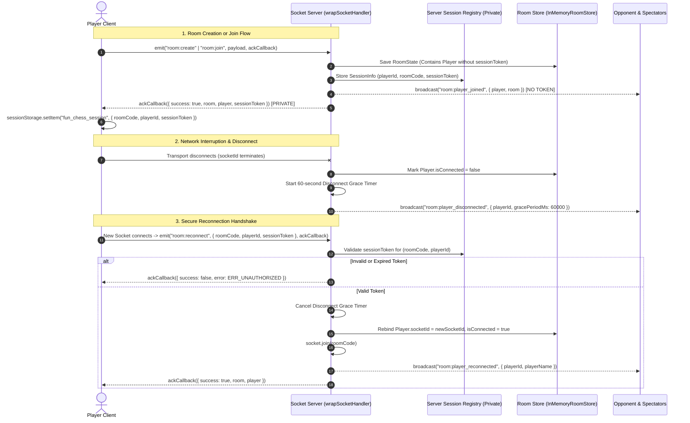

# Frozen API & Network Contracts: Fun Chess Remediation

**Status**: FROZEN CONTRACT
**Author**: @architect (System Architecture)
**Date**: 2026-09-07
**Scope**: Full Codebase Remediation (Findings CRIT-001, CRIT-002, CRIT-005, CRIT-008, MAJ-001, MAJ-002, MAJ-003, MAJ-007, MAJ-015, MAJ-016, MAJ-018, MIN-002, MIN-004, ENH-001, ENH-005)
**Target Locations**: `@fun-chess/shared`, `apps/server`, `apps/client`, `infra/terraform`

---

## 1. Executive Architecture Summary

This document establishes the authoritative, frozen network and API contracts across the Fun Chess monorepo. All builders and tech leads implementing Scope Cards 1 through 7 must adhere strictly to these types, schemas, wire protocols, and interface contracts.

### Core Architectural Invariants:
1. **Zero Secret Leakage**: The secret `sessionToken` is strictly excised from all public models (`Player`, `RoomState`). Session credentials are treated as private authentication secrets: stored server-side only in a private session registry and communicated only to the authorized client in a private acknowledgement callback.
2. **Strict Ingress Schema Validation**: Every inbound Socket.IO event payload and HTTP endpoint request is validated at runtime using declarative Zod schemas before reaching domain services.
3. **Deterministic Error Handling & Sanitization**: Socket errors are normalized into a unified `SocketErrorPayload`. Acknowledged events receive error objects via callbacks; unacknowledged events receive the `error` event. 4xx validation/client errors are demoted to `WARN`; 500 errors are logged at `ERROR` and sanitized to prevent leaking stack traces or internal runtime details.
4. **Hardened HTTP Ingress**: Wildcard `*` CORS is rejected in production. Modern HTTP security headers (CSP, HSTS, Permissions-Policy, X-Frame-Options) are enforced across all HTTP responses.
5. **Abstracted I/O with Fail-Safe Timeouts**: Client HTTP calls are encapsulated in an `IApiClient` service enforcing a 3-second timeout (`AbortSignal.timeout(3000)`).

---

## 2. Private Session Token Separation & Reconnection Protocol

### 2.1 Problem Analysis (CRIT-001)
Previously, `sessionToken` was declared as a field on `interface Player` (`shared/src/contracts/models.ts:96`). Because `RoomState` contains `whitePlayer`, `blackPlayer`, and `spectators`, every state broadcast (`room:joined`, `room:player_joined`, `game:moved`, `game:rematch_started`) transmitted the victim's plaintext `sessionToken` to all connected peers, enabling trivial session hijacking via `room:reconnect`.

### 2.2 Model Definitions

#### A. Public Player Model (`shared/src/contracts/models.ts`)
```typescript
import { PieceColor, PieceType, Square } from "./models.js";

/**
 * Public representation of a player inside a room.
 * MUST NEVER contain private session credentials or secret tokens.
 */
export interface Player {
  /** Unique UUID v4 identifier for the player */
  id: string;
  /** Ephemeral Socket.io connection identifier */
  socketId: string;
  /** Player display name (1-20 characters, sanitized) */
  name: string;
  /** Selected emoji avatar (e.g. 🦁, 🚀, 🦄, ⚡, 👑, 🐼) */
  avatar?: string;
  /** Active piece color assignment ('w' or 'b') */
  color: PieceColor;
  /** Indicates whether the player is the room creator */
  isHost: boolean;
  /** Real-time socket connectivity state */
  isConnected: boolean;
  /** Epoch timestamp (milliseconds) when the player joined */
  connectedAt: number;
}

/**
 * Semantic alias for Player explicitly denoting public view visibility.
 */
export type PublicPlayer = Player;
```

#### B. Private Session Credential Model (`shared/src/contracts/models.ts`)
```typescript
/**
 * Private authentication credential stored server-side and client-side (sessionStorage).
 * Exchanged ONLY over initial private room establishment and reconnection handshakes.
 */
export interface SessionInfo {
  /** Cryptographic secret UUID token used to authenticate reconnection */
  sessionToken: string;
  /** Player ID associated with this session */
  playerId: string;
  /** Room code associated with this session */
  roomCode: string;
  /** Epoch timestamp (milliseconds) when session was created */
  createdAt: number;
  /** Epoch timestamp (milliseconds) of last observed activity */
  lastSeenAt: number;
}

/**
 * Client-persisted session data stored in browser sessionStorage.
 */
export interface SavedSession {
  roomCode: string;
  playerId: string;
  sessionToken: string;
}
```

#### C. Sanitized Room State (`shared/src/contracts/models.ts`)
```typescript
export interface RoomState {
  /** 4-character uppercase alphanumeric code */
  roomCode: string;
  /** Room lifecycle phase */
  status: RoomStatus;
  /** Player ID of host */
  hostId: string;
  /** Assigned white player (clean of session secrets) */
  whitePlayer: Player | null;
  /** Assigned black player (clean of session secrets) */
  blackPlayer: Player | null;
  /** Spectators in the room (clean of session secrets) */
  spectators: Player[];
  /** Authoritative chess match state */
  game: GameState;
  /** Active rematch proposal state */
  rematch: RematchState | null;
  /** Active draw offer state */
  drawOffer?: { offeredBy: string; offeredAt: number } | null;
  /** Epoch timestamp of room creation */
  createdAt: number;
  /** Epoch timestamp of last mutation */
  lastActivityAt: number;
}
```

### 2.3 Reconnection Authentication Protocol Sequence



### 2.4 Server Session Store Contract (`apps/server/src/features/rooms/session.interface.ts`)
```typescript
export interface ISessionRegistry {
  /** Stores a private session token for a given player in a room */
  registerSession(roomCode: string, playerId: string, sessionToken: string): Promise<void>;

  /** Validates that the provided session token matches the registered player */
  validateSession(roomCode: string, playerId: string, sessionToken: string): Promise<boolean>;

  /** Updates lastSeenAt timestamp for session activity tracking */
  touchSession(roomCode: string, playerId: string): Promise<void>;

  /** Removes session on explicit leave or room abandonment */
  removeSession(roomCode: string, playerId: string): Promise<void>;

  /** Prunes all sessions associated with a terminated room */
  pruneRoomSessions(roomCode: string): Promise<void>;
}
```

---

## 3. Runtime Ingress Validation Schemas (Zod)

All schemas are placed in `@fun-chess/shared/src/contracts/schemas.ts` and exported via `@fun-chess/shared`. Both server and client consume these schemas.

### 3.1 Common Primitives & Domain Enums
```typescript
import { z } from "zod";

export const RoomCodeSchema = z
  .string()
  .trim()
  .length(4, "Room code must be exactly 4 characters")
  .regex(/^[A-Za-z0-9]{4}$/, "Room code must contain only alphanumeric characters")
  .transform((code) => code.toUpperCase());

export const PlayerNameSchema = z
  .string()
  .trim()
  .min(1, "Player name cannot be empty")
  .max(20, "Player name must be 20 characters or fewer")
  // Strip control characters & dangerous HTML brackets
  .transform((name) => name.replace(/[<>&"']/g, ""));

export const AvatarEmojiSchema = z
  .string()
  .trim()
  .max(16, "Avatar emoji must be 16 characters or fewer")
  .optional()
  .default("🦁");

export const PieceColorSchema = z.enum(["w", "b"]);

export const PreferredColorSchema = z
  .enum(["w", "b", "random"])
  .optional()
  .default("random");

export const ChessSquareSchema = z
  .string()
  .regex(/^[a-h][1-8]$/, "Must be a valid chess square notation (a1-h8)");

export const PromotionPieceSchema = z.enum(["q", "r", "b", "n"]);
```

### 3.2 Socket Ingress Payload Schemas

#### A. `CreateRoomRequestSchema`
```typescript
export const CreateRoomRequestSchema = z.object({
  playerName: PlayerNameSchema,
  preferredColor: PreferredColorSchema,
  avatar: AvatarEmojiSchema,
});
export type CreateRoomRequest = z.infer<typeof CreateRoomRequestSchema>;
```

#### B. `JoinRoomRequestSchema`
```typescript
export const JoinRoomRequestSchema = z.object({
  roomCode: RoomCodeSchema,
  playerName: PlayerNameSchema,
  avatar: AvatarEmojiSchema,
});
export type JoinRoomRequest = z.infer<typeof JoinRoomRequestSchema>;
```

#### C. `ReconnectRequestSchema`
```typescript
export const ReconnectRequestSchema = z.object({
  roomCode: RoomCodeSchema,
  playerId: z.string().uuid("Player ID must be a valid UUID"),
  sessionToken: z.string().min(1, "Session token is required").max(128),
});
export type ReconnectRequest = z.infer<typeof ReconnectRequestSchema>;
```

#### D. `LeaveRoomRequestSchema`
```typescript
export const LeaveRoomRequestSchema = z.object({
  roomCode: RoomCodeSchema,
});
export type LeaveRoomRequest = z.infer<typeof LeaveRoomRequestSchema>;
```

#### E. `MakeMoveRequestSchema` & `MovePayloadSchema`
```typescript
export const MovePayloadSchema = z.object({
  from: ChessSquareSchema,
  to: ChessSquareSchema,
  promotion: PromotionPieceSchema.optional(),
});
export type MovePayload = z.infer<typeof MovePayloadSchema>;

export const MakeMoveRequestSchema = z.object({
  roomCode: RoomCodeSchema,
  move: MovePayloadSchema,
});
export type MakeMoveRequest = z.infer<typeof MakeMoveRequestSchema>;
```

#### F. Game Control Requests (`Resign`, `Draw`, `Rematch`)
```typescript
export const ResignRequestSchema = z.object({
  roomCode: RoomCodeSchema,
});
export type ResignRequest = z.infer<typeof ResignRequestSchema>;

export const OfferDrawRequestSchema = z.object({
  roomCode: RoomCodeSchema,
});
export type OfferDrawRequest = z.infer<typeof OfferDrawRequestSchema>;

export const RespondDrawRequestSchema = z.object({
  roomCode: RoomCodeSchema,
  accept: z.boolean(),
});
export type RespondDrawRequest = z.infer<typeof RespondDrawRequestSchema>;

export const RequestRematchRequestSchema = z.object({
  roomCode: RoomCodeSchema,
});
export type RequestRematchRequest = z.infer<typeof RequestRematchRequestSchema>;

export const RespondRematchRequestSchema = z.object({
  roomCode: RoomCodeSchema,
  accept: z.boolean(),
});
export type RespondRematchRequest = z.infer<typeof RespondRematchRequestSchema>;
```

### 3.3 HTTP Endpoints Response Schemas

#### A. `/api/lan-info` Response Schema
```typescript
export const LanInfoResponseSchema = z.object({
  lanIp: z.string(),
  port: z.number().int().positive(),
  localUrl: z.string().url(),
  joinUrl: z.string().url(),
  interfaces: z.array(z.string()),
  relayMode: z.enum(["cloud", "lan"]).optional(),
  isCloudRelay: z.boolean().optional(),
  publicUrl: z.string().url().optional(),
});
export type LanInfoResponse = z.infer<typeof LanInfoResponseSchema>;
```

#### B. `/health` & `/api/health` Response Schema
```typescript
export const HealthCheckResponseSchema = z.object({
  status: z.enum(["ok", "degraded"]),
  uptimeSeconds: z.number().nonnegative(),
  timestamp: z.string().datetime(),
  activeRooms: z.number().int().nonnegative(),
  activeSockets: z.number().int().nonnegative(),
  memoryUsageMb: z.object({
    rss: z.number(),
    heapTotal: z.number(),
    heapUsed: z.number(),
  }),
  relay: z
    .object({
      mode: z.enum(["cloud", "lan"]),
      publicUrl: z.string().url().optional(),
    })
    .optional(),
});
export type HealthCheckResponse = z.infer<typeof HealthCheckResponseSchema>;
```

#### C. Server Environment Configuration Schema (`apps/server/src/platform/config/env.ts`)
```typescript
export const ServerEnvSchema = z.object({
  NODE_ENV: z.enum(["development", "production", "test"]).default("development"),
  PORT: z.coerce.number().int().min(1024).max(65535).default(3000),
  HOST: z.string().default("0.0.0.0"),
  CORS_ORIGIN: z.string().optional(),
  PUBLIC_URL: z.string().url().optional(),
  LAN_IP: z.string().ip().optional(),
  HOST_IP: z.string().ip().optional(),
  LOG_LEVEL: z.enum(["trace", "debug", "info", "warn", "error", "fatal"]).default("info"),
});
export type ServerEnv = z.infer<typeof ServerEnvSchema>;
```

---

## 4. Standardized Error Contracts & Status Codes

### 4.1 Error Payload Interface (`shared/src/contracts/errors.ts`)
```typescript
export type ErrorCode =
  | "ERR_ROOM_NOT_FOUND"
  | "ERR_ROOM_FULL"
  | "ERR_ROOM_ALREADY_EXISTS"
  | "ERR_INVALID_ROOM_CODE"
  | "ERR_INVALID_MOVE"
  | "ERR_NOT_YOUR_TURN"
  | "ERR_GAME_NOT_ACTIVE"
  | "ERR_PLAYER_NOT_IN_ROOM"
  | "ERR_UNAUTHORIZED"
  | "ERR_INVALID_PAYLOAD"
  | "ERR_RATE_LIMITED"
  | "ERR_SOCKET_TIMEOUT"
  | "ERR_INTERNAL_SERVER";

export interface SocketErrorPayload {
  readonly code: ErrorCode;
  readonly message: string;
  readonly roomCode?: string;
  readonly correlationId: string;
  readonly details?: Record<string, unknown>;
}
```

### 4.2 Error Classification, Status Codes & Log Level Matrix
| Error Code | HTTP Status | Log Level | Error Message Strategy |
|---|---|---|---|
| `ERR_INVALID_PAYLOAD` | 400 | `WARN` | Safe Zod validation summary (e.g. `"playerName: Player name cannot be empty"`) |
| `ERR_INVALID_ROOM_CODE` | 400 | `WARN` | Safe message: `"Room code must be 4 alphanumeric characters"` |
| `ERR_UNAUTHORIZED` | 401 | `WARN` | Safe message: `"Invalid or expired session credentials"` |
| `ERR_NOT_YOUR_TURN` | 403 | `WARN` | Safe message: `"It is not your turn to move"` |
| `ERR_PLAYER_NOT_IN_ROOM` | 403 | `WARN` | Safe message: `"Player is not an active participant in room"` |
| `ERR_ROOM_NOT_FOUND` | 404 | `WARN` | Safe message: `"Room with code 'ABCD' does not exist"` |
| `ERR_ROOM_FULL` | 409 | `WARN` | Safe message: `"Room 'ABCD' already has 2 active players"` |
| `ERR_ROOM_ALREADY_EXISTS` | 409 | `WARN` | Safe message: `"Room 'ABCD' already exists"` |
| `ERR_GAME_NOT_ACTIVE` | 409 | `WARN` | Safe message: `"Game is not in active playing state"` |
| `ERR_INVALID_MOVE` | 422 | `WARN` | Safe chess engine reason: `"Illegal move: e2 to e5"` |
| `ERR_RATE_LIMITED` | 429 | `WARN` | Safe rate message: `"Rate limit exceeded. Please wait before retrying."` |
| `ERR_SOCKET_TIMEOUT` | 408 | `WARN` | Safe timeout message: `"Request timed out"` |
| `ERR_INTERNAL_SERVER` | 500 | `ERROR` | **Sanitized**: `"An internal server error occurred"`. NEVER leak runtime stack or SQL/system exceptions. |

### 4.3 Dual-Channel Socket Error Dispatch Pattern (CRIT-005)
All incoming socket handlers wrapped by `wrapSocketHandler` must handle errors consistently according to whether the client provided an acknowledgement callback:

```typescript
// apps/server/src/platform/socket/socket_logging_middleware.ts
export function wrapSocketHandler<TReq, TRes>(
  logger: Logger,
  operationName: string,
  socket: Socket,
  schema: z.ZodSchema<TReq>,
  handler: (validatedReq: TReq, context: SocketOperationContext) => Promise<TRes>
) {
  return async (rawReq: unknown, callback?: (res: SocketResponse<TRes>) => void): Promise<void> => {
    const correlationId = randomUUID();
    const startTime = performance.now();
    const clientIp = extractClientIp(socket);

    // 1. Ingress Schema Validation
    const validationResult = schema.safeParse(rawReq);
    if (!validationResult.success) {
      const duration = Math.round(performance.now() - startTime);
      const errorMessage = validationResult.error.errors.map(e => `${e.path.join('.')}: ${e.message}`).join(', ');
      const errorPayload: SocketErrorPayload = {
        code: "ERR_INVALID_PAYLOAD",
        message: errorMessage,
        correlationId,
      };

      logger.warn(`Operation validation failed: ${operationName}`, {
        operation: operationName,
        correlationId,
        socketId: socket.id,
        clientIp,
        duration,
        error: { code: "ERR_INVALID_PAYLOAD", message: errorMessage },
      });

      if (typeof callback === "function") {
        callback({ success: false, error: errorPayload });
      } else {
        socket.emit("error", errorPayload);
      }
      return;
    }

    // 2. Execution & Error Handling
    try {
      const result = await handler(validationResult.data, { correlationId, socketId: socket.id, clientIp });
      const duration = Math.round(performance.now() - startTime);

      logger.info(`Operation succeeded: ${operationName}`, {
        operation: operationName,
        correlationId,
        socketId: socket.id,
        duration,
        status: "success",
      });

      if (typeof callback === "function") {
        callback({ success: true, ...result });
      }
    } catch (err: unknown) {
      const duration = Math.round(performance.now() - startTime);
      const isAppError = err instanceof AppError;
      const statusCode = isAppError ? err.statusCode : 500;
      const code: ErrorCode = isAppError ? err.code : "ERR_INTERNAL_SERVER";

      // Sanitization: Never expose 500 runtime errors
      const clientMessage = (isAppError && statusCode < 500)
        ? err.message
        : "An internal server error occurred";

      const errorPayload: SocketErrorPayload = {
        code,
        message: clientMessage,
        correlationId,
        ...(isAppError && err.details ? { details: err.details } : {}),
      };

      if (statusCode < 500) {
        logger.warn(`Operation rejected: ${operationName}`, {
          operation: operationName,
          correlationId,
          socketId: socket.id,
          clientIp,
          duration,
          status: "rejected",
          error: { code, message: err instanceof Error ? err.message : String(err) },
        });
      } else {
        logger.error(`Operation failed: ${operationName}`, {
          operation: operationName,
          correlationId,
          socketId: socket.id,
          clientIp,
          duration,
          status: "failed",
          error: err instanceof Error ? { name: err.name, message: err.message, stack: err.stack } : { raw: err },
        });
      }

      // CONTRACT DISPATCH: Callback if present, else contracted 'error' event
      if (typeof callback === "function") {
        callback({ success: false, error: errorPayload });
      } else {
        socket.emit("error", errorPayload);
      }
    }
  };
}
```

---

## 5. Security Headers & CORS Configuration

### 5.1 HTTP Security Headers Specification
Applied to every HTTP response in `apps/server/src/platform/http/http_server.ts`:

```typescript
export const SECURITY_HEADERS: Record<string, string> = {
  // Content-Security-Policy: restrict origins, allow inline styles for Vue animations, allow websockets
  "Content-Security-Policy": [
    "default-src 'self'",
    "script-src 'self'",
    "style-src 'self' 'unsafe-inline'",
    "img-src 'self' data: blob:",
    "media-src 'self' blob:",
    "connect-src 'self' ws: wss:",
    "font-src 'self'",
    "object-src 'none'",
    "base-uri 'self'",
    "form-action 'self'",
    "frame-ancestors 'none'",
  ].join("; "),

  // Strict-Transport-Security (1 year, include subdomains, preload)
  "Strict-Transport-Security": "max-age=31536000; includeSubDomains; preload",

  // Frame Protection
  "X-Frame-Options": "DENY",

  // MIME type sniffing protection
  "X-Content-Type-Options": "nosniff",

  // Referrer disclosure restriction
  "Referrer-Policy": "strict-origin-when-cross-origin",

  // Browser feature permissions
  "Permissions-Policy": "camera=(self), microphone=(), geolocation=(), payment=()",
};
```

### 5.2 CORS Origin Allowlist Configuration
Wildcard `*` is strictly forbidden when `NODE_ENV === "production"`.

```typescript
export function resolveAllowedOrigins(env: ServerEnv): string[] {
  if (env.CORS_ORIGIN) {
    return env.CORS_ORIGIN.split(",").map((o) => o.trim()).filter(Boolean);
  }
  if (env.PUBLIC_URL) {
    const parsed = new URL(env.PUBLIC_URL);
    return [parsed.origin];
  }
  if (env.NODE_ENV === "production") {
    throw new Error("FATAL: CORS_ORIGIN or PUBLIC_URL must be configured in production mode.");
  }
  // Safe development fallbacks
  return ["http://localhost:5173", "http://127.0.0.1:5173", "http://localhost:3000"];
}

export function isOriginAllowed(origin: string | undefined, allowedOrigins: string[]): boolean {
  if (!origin) return true; // Same-origin or server-to-server
  return allowedOrigins.includes("*") || allowedOrigins.includes(origin);
}
```

### 5.3 Static Asset Ingress & Path Traversal Prevention (CRIT-008)
Static file resolver must enforce canonical boundary validation and correct MIME 404 behavior:

```typescript
import path from "node:path";
import fs from "node:fs/promises";

export async function serveStaticFile(
  reqPath: string,
  staticRoot: string,
  acceptHeader: string = ""
): Promise<{ status: number; filePath?: string; contentType?: string }> {
  // Normalize and resolve canonical path
  const safePath = path.normalize(reqPath).replace(/^(\.\.[\/\\])+/, "");
  const targetPath = path.join(staticRoot, safePath === "/" ? "index.html" : safePath);
  const relative = path.relative(staticRoot, targetPath);

  // Path Traversal Guard: target must reside inside staticRoot
  if (relative.startsWith("..") || path.isAbsolute(relative)) {
    return { status: 403 }; // Forbidden
  }

  try {
    const stat = await fs.stat(targetPath);
    if (stat.isFile()) {
      return { status: 200, filePath: targetPath, contentType: getMimeType(targetPath) };
    }
  } catch {
    // Missing asset handling
    const ext = path.extname(targetPath);
    // If request is for a missing concrete asset (.js, .css, .png), NEVER return index.html
    if (ext) {
      return { status: 404 };
    }
    // SPA Fallback: Only rewrite to index.html if caller accepts text/html
    if (acceptHeader.includes("text/html")) {
      const indexPath = path.join(staticRoot, "index.html");
      return { status: 200, filePath: indexPath, contentType: "text/html; charset=utf-8" };
    }
  }

  return { status: 404 };
}
```

---

## 6. Client HTTP API Client Interface (`IApiClient`)

### 6.1 Interface Definition (`apps/client/src/platform/api/api_client.interface.ts`)
```typescript
import type { LanInfoResponse, HealthCheckResponse } from "@fun-chess/shared";

export interface ApiRequestOptions {
  /** Request timeout in milliseconds. Defaults to 3000ms. */
  timeoutMs?: number;
  /** Optional custom AbortSignal to cancel requests from callers */
  signal?: AbortSignal;
  /** Custom request headers */
  headers?: Record<string, string>;
}

export interface ApiResponse<T> {
  data: T;
  status: number;
  ok: boolean;
}

export interface IApiClient {
  /** Performs GET request with timeout and error handling */
  get<T>(url: string, options?: ApiRequestOptions): Promise<ApiResponse<T>>;

  /** Performs POST request with JSON body and timeout */
  post<T>(url: string, body?: unknown, options?: ApiRequestOptions): Promise<ApiResponse<T>>;

  /** Discovers LAN networking information from server */
  getLanInfo(options?: ApiRequestOptions): Promise<LanInfoResponse>;

  /** Queries operational health telemetry */
  checkHealth(options?: ApiRequestOptions): Promise<HealthCheckResponse>;

  /** Verifies network connectivity via light probe HEAD request */
  checkConnectivity(probeUrl?: string, options?: ApiRequestOptions): Promise<boolean>;
}
```

### 6.2 Production Implementation (`apps/client/src/platform/api/fetch_api_client.ts`)
```typescript
import type { IApiClient, ApiRequestOptions, ApiResponse } from "./api_client.interface.js";
import { LanInfoResponseSchema, HealthCheckResponseSchema, type LanInfoResponse, type HealthCheckResponse } from "@fun-chess/shared";

export class FetchApiClient implements IApiClient {
  constructor(private readonly baseUrl: string = "") {}

  private createTimeoutSignal(timeoutMs: number = 3000, callerSignal?: AbortSignal): { signal: AbortSignal; cleanup: () => void } {
    const controller = new AbortController();
    const timeoutId = setTimeout(() => controller.abort(new Error(`Request timed out after ${timeoutMs}ms`)), timeoutMs);

    if (callerSignal) {
      callerSignal.addEventListener("abort", () => controller.abort(callerSignal.reason), { once: true });
    }

    return {
      signal: controller.signal,
      cleanup: () => clearTimeout(timeoutId),
    };
  }

  async get<T>(url: string, options: ApiRequestOptions = {}): Promise<ApiResponse<T>> {
    const { signal, cleanup } = this.createTimeoutSignal(options.timeoutMs ?? 3000, options.signal);
    try {
      const response = await fetch(`${this.baseUrl}${url}`, {
        method: "GET",
        headers: { Accept: "application/json", ...options.headers },
        signal,
      });
      const data = response.status === 204 ? (null as T) : await response.json();
      return { data, status: response.status, ok: response.ok };
    } finally {
      cleanup();
    }
  }

  async post<T>(url: string, body?: unknown, options: ApiRequestOptions = {}): Promise<ApiResponse<T>> {
    const { signal, cleanup } = this.createTimeoutSignal(options.timeoutMs ?? 3000, options.signal);
    try {
      const response = await fetch(`${this.baseUrl}${url}`, {
        method: "POST",
        headers: { "Content-Type": "application/json", Accept: "application/json", ...options.headers },
        body: body !== undefined ? JSON.stringify(body) : undefined,
        signal,
      });
      const data = await response.json();
      return { data, status: response.status, ok: response.ok };
    } finally {
      cleanup();
    }
  }

  async getLanInfo(options?: ApiRequestOptions): Promise<LanInfoResponse> {
    const res = await this.get<unknown>("/api/lan-info", options);
    if (!res.ok) throw new Error(`Failed to fetch LAN info: HTTP ${res.status}`);
    return LanInfoResponseSchema.parse(res.data);
  }

  async checkHealth(options?: ApiRequestOptions): Promise<HealthCheckResponse> {
    const res = await this.get<unknown>("/health", options);
    if (!res.ok) throw new Error(`Health check failed: HTTP ${res.status}`);
    return HealthCheckResponseSchema.parse(res.data);
  }

  async checkConnectivity(probeUrl: string = "/favicon.svg", options: ApiRequestOptions = {}): Promise<boolean> {
    const { signal, cleanup } = this.createTimeoutSignal(options.timeoutMs ?? 2000, options.signal);
    try {
      const res = await fetch(`${probeUrl}?_t=${Date.now()}`, {
        method: "HEAD",
        cache: "no-store",
        signal,
      });
      return res.ok;
    } catch {
      return false;
    } finally {
      cleanup();
    }
  }
}
```

### 6.3 Test Double (`apps/client/src/platform/api/mock_api_client.ts`)
```typescript
import type { IApiClient, ApiRequestOptions, ApiResponse } from "./api_client.interface.js";
import type { LanInfoResponse, HealthCheckResponse } from "@fun-chess/shared";

export class MockApiClient implements IApiClient {
  public lanInfoResult: LanInfoResponse = {
    lanIp: "192.168.1.50",
    port: 3000,
    localUrl: "http://localhost:3000",
    joinUrl: "http://192.168.1.50:3000",
    interfaces: ["192.168.1.50"],
    relayMode: "lan",
    isCloudRelay: false,
  };
  public isHealthy: boolean = true;
  public isOnline: boolean = true;

  async get<T>(_url: string, _options?: ApiRequestOptions): Promise<ApiResponse<T>> {
    return { data: {} as T, status: 200, ok: true };
  }

  async post<T>(_url: string, _body?: unknown, _options?: ApiRequestOptions): Promise<ApiResponse<T>> {
    return { data: {} as T, status: 200, ok: true };
  }

  async getLanInfo(_options?: ApiRequestOptions): Promise<LanInfoResponse> {
    return this.lanInfoResult;
  }

  async checkHealth(_options?: ApiRequestOptions): Promise<HealthCheckResponse> {
    return {
      status: this.isHealthy ? "ok" : "degraded",
      uptimeSeconds: 120,
      timestamp: new Date().toISOString(),
      activeRooms: 1,
      activeSockets: 2,
      memoryUsageMb: { rss: 40, heapTotal: 30, heapUsed: 20 },
    };
  }

  async checkConnectivity(_probeUrl?: string, _options?: ApiRequestOptions): Promise<boolean> {
    return this.isOnline;
  }
}
```

---

## 7. Verification & Conformance Checklist

| Requirement | Implementation Target | Verification Method |
|---|---|---|
| `sessionToken` removed from `Player` and `RoomState` | `shared/src/contracts/models.ts` | Typecheck `tsc -b` + Unit test asserting `sessionToken` does not exist on broadcast payloads |
| Private session registry | `apps/server/src/features/rooms/` | Unit test proving `sessionToken` is stored in registry and returned ONLY in acknowledgement callback |
| Ingress Zod schemas | `shared/src/contracts/schemas.ts` | Unit tests rejecting empty names, illegal squares, out-of-range strings, and malformed room codes |
| 4xx to WARN / 500 to ERROR | `socket_logging_middleware.ts` | Test inspecting logger mock verifying log level on `InvalidMoveError` vs unhandled `Error` |
| 500 error sanitization | `socket_logging_middleware.ts` | Test checking `res.error.message` equals `"An internal server error occurred"` on thrown TypeError |
| Dual error routing | `socket_logging_middleware.ts` | Test verifying callback receives error when present, and `socket.emit('error')` fires when callback is missing |
| Security headers (CSP, HSTS) | `apps/server/src/platform/http/` | Contract test asserting all 6 security headers are returned on GET / |
| Production CORS allowlist | `http_server.ts`, `cloud_run.tf` | Unit test ensuring wildcard `*` throws or is blocked when `NODE_ENV === 'production'` |
| Client `IApiClient` timeout | `apps/client/src/platform/api/` | Unit test with fake timers asserting fetch aborts after 3000ms |
