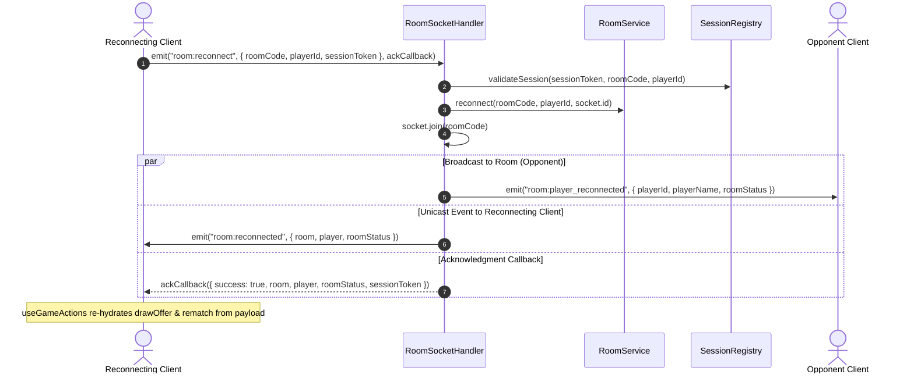

# Frozen API Contracts: Fun Chess Audit Remediation

> **Status:** FROZEN ARCHITECTURAL CONTRACTS
> **Phase:** Wave 0 (Design Phase)
> **Author:** System Architect (`@architect`)
> **Audience:** All Domain Implementers (`@backend-engineer`, `@frontend-engineer`, `@tech-lead`, `@test-automation-engineer`)
> **Authority:** Preempts all individual builder decisions. Any deviation requires formal ADR and Architect approval.
> **Audit Findings Addressed:** MAJ-003, MAJ-007, MAJ-008, MAJ-009, MIN-010

---

## 1. REST API Specification: `/api/v1/lan-info` (MAJ-009, MIN-010)

### 1.1 Context & Defect Analysis
- **Defect (MAJ-009):** The host addressing and QR discovery endpoint was previously mounted at unversioned `/api/lan-info` and returned naked, un-enveloped JSON payloads. This violated `api-design-principles.md` (requiring URL path versioning `/api/v1/...` and standard `{ data: ... }` response envelopes).
- **Defect (MIN-010):** Contract drift between `apps/server/src/features/lan/relay_address.service.ts` and `shared/src/contracts/schemas.ts`. The server implementation mandated `relayMode: "cloud" | "lan"` and `isCloudRelay: boolean`, whereas `LanInfoResponseSchema` in `@fun-chess/shared` defined both fields as optional (`.optional()`).

### 1.2 Routing & Backward-Compatible Redirect Specification
The server MUST register two routes in `apps/server/src/platform/http/`:

1. **Canonical Endpoint:** `GET /api/v1/lan-info` (and `HEAD /api/v1/lan-info`)
   - Returns HTTP `200 OK` with standard JSON envelope `{ data: LanInfoResponse }`.
2. **Backward-Compatible Legacy Endpoint:** `GET /api/lan-info` (and `HEAD /api/lan-info`)
   - Emits HTTP `307 Temporary Redirect` (or HTTP `308 Permanent Redirect`) with header `Location: /api/v1/lan-info`.
   - For clients that do not automatically follow redirects (or during backward-compatibility grace period in automated unit tests), the server helper `handleLanInfoRoute` may directly return the canonical `{ data: LanInfoResponse }` envelope or emit 307 redirect based on request headers / configuration.

#### HTTP Headers
```http
HTTP/1.1 200 OK
Content-Type: application/json; charset=utf-8
X-Correlation-ID: 550e8400-e29b-41d4-a716-446655440000
Content-Security-Policy: default-src 'self'; ...
Strict-Transport-Security: max-age=31536000; includeSubDomains; preload
X-Content-Type-Options: nosniff
X-Frame-Options: DENY
```

### 1.3 JSON Response Envelope & Schema (Single Source of Truth)
The schema in `shared/src/contracts/schemas.ts` is updated to make `relayMode` and `isCloudRelay` strictly required, eliminating contract drift:

```typescript
import { z } from "zod";

/**
 * Host network addressing information payload schema.
 * Aligned between server relay service and shared contracts (MIN-010).
 */
export const LanInfoResponseSchema = z.object({
  /** Primary local area network IPv4 address */
  lanIp: z.string().ip({ version: "v4" }),
  /** Active listening HTTP/WS TCP port */
  port: z.number().int().min(1).max(65535),
  /** Absolute local network base URL for LAN play (e.g. "http://192.168.1.100:3000") */
  localUrl: z.string().url(),
  /** Full join URL with default route for QR code pairing */
  joinUrl: z.string().url(),
  /** List of all non-internal IPv4 interface addresses discovered on host */
  interfaces: z.array(z.string().ip({ version: "v4" })),
  /** Operating relay mode: 'cloud' when behind public URL / reverse proxy, 'lan' for direct LAN */
  relayMode: z.enum(["cloud", "lan"]),
  /** Boolean flag indicating if server operates in cloud relay mode */
  isCloudRelay: z.boolean(),
  /** Public base URL when deployed to Cloud Run or behind reverse proxy */
  publicUrl: z.string().url().optional(),
});
export type LanInfoResponse = z.infer<typeof LanInfoResponseSchema>;

/**
 * Standard REST success envelope for LAN info discovery (MAJ-009).
 */
export const LanInfoEnvelopeSchema = z.object({
  data: LanInfoResponseSchema,
});
export type LanInfoEnvelope = z.infer<typeof LanInfoEnvelopeSchema>;
```

### 1.4 Response Payload Examples

#### Example A: Local Network (LAN) Mode
```json
{
  "data": {
    "lanIp": "192.168.1.50",
    "port": 3000,
    "localUrl": "http://192.168.1.50:3000",
    "joinUrl": "http://192.168.1.50:3000",
    "interfaces": [
      "192.168.1.50",
      "10.0.0.12"
    ],
    "relayMode": "lan",
    "isCloudRelay": false
  }
}
```

#### Example B: Cloud Relay Mode (Google Cloud Run / Production)
```json
{
  "data": {
    "lanIp": "10.0.0.1",
    "port": 8080,
    "localUrl": "http://10.0.0.1:8080",
    "joinUrl": "https://chess.example.com",
    "interfaces": [
      "10.0.0.1"
    ],
    "relayMode": "cloud",
    "isCloudRelay": true,
    "publicUrl": "https://chess.example.com"
  }
}
```

### 1.5 Client Ingress Contract (`FetchApiClient.getLanInfo`)
The client API adapter in `apps/client/src/platform/api/fetch_api_client.ts` requests `/api/v1/lan-info` and safely parses the enveloped payload:

```typescript
async getLanInfo(options?: ApiRequestOptions): Promise<LanInfoResponse> {
  const res = await this.get<unknown>('/api/v1/lan-info', options);
  if (!res.ok) {
    this.handleResponseError(res, 'Failed to fetch LAN info', options?.correlationId ?? '');
  }

  // Support both standard { data: LanInfoResponse } envelope and direct payload (defensive fallback)
  if (res.data && typeof res.data === 'object' && 'data' in res.data) {
    return LanInfoResponseSchema.parse((res.data as { data: unknown }).data);
  }
  return LanInfoResponseSchema.parse(res.data);
}
```

---

## 2. Mid-Game Socket Action Schemas & Server Verification (MAJ-007)

### 2.1 Context & Security Vulnerability
- **Defect (MAJ-007):** Mid-game action schemas (`MakeMoveRequestSchema`, `ResignRequestSchema`, `OfferDrawRequestSchema`, `RespondDrawRequestSchema`, `RequestRematchRequestSchema`, `RespondRematchRequestSchema`) only accepted `roomCode` and action data. Neither the schema nor the client payload included the HMAC `sessionToken`.
- **Security Vulnerability:** Authentication was coupled exclusively to the transient Socket.IO `socket.id`. If a player momentarily disconnected and reconnected with a new socket ID before the reconnection handshake completed, all subsequent move attempts failed with `PlayerNotInRoomError`. Furthermore, if an attacker could guess or observe a valid `roomCode`, they could emit socket events from an arbitrary connection if socket tracking slipped.

### 2.2 Schema Updates in `shared/src/contracts/schemas.ts`
All mid-game request schemas MUST accept an optional `sessionToken` field:

```typescript
/**
 * Socket request schema for submitting a move in an active game room.
 * Includes optional HMAC sessionToken for cryptographic authentication (MAJ-007).
 */
export const MakeMoveRequestSchema = z.object({
  roomCode: RoomCodeSchema,
  move: MovePayloadSchema,
  expectedMoveNumber: z.number().int().nonnegative().optional(),
  idempotencyKey: z
    .string()
    .min(1, "Idempotency key must not be empty")
    .max(64, "Idempotency key cannot exceed 64 characters")
    .regex(/^[a-zA-Z0-9_-]+$/, "Idempotency key must be alphanumeric, hyphen, or underscore")
    .optional(),
  /** Cryptographic HMAC session token for player verification (MAJ-007) */
  sessionToken: z
    .string()
    .min(1, "Session token cannot be empty")
    .max(256, "Session token exceeds maximum length")
    .optional(),
});
export type MakeMoveRequest = z.infer<typeof MakeMoveRequestSchema>;

/**
 * Socket request schema for resigning an active match.
 */
export const ResignRequestSchema = z.object({
  roomCode: RoomCodeSchema,
  sessionToken: z.string().min(1).max(256).optional(),
});
export type ResignRequest = z.infer<typeof ResignRequestSchema>;

/**
 * Socket request schema for offering a draw to the opponent.
 */
export const OfferDrawRequestSchema = z.object({
  roomCode: RoomCodeSchema,
  sessionToken: z.string().min(1).max(256).optional(),
});
export type OfferDrawRequest = z.infer<typeof OfferDrawRequestSchema>;

/**
 * Socket request schema for accepting or declining a draw offer.
 */
export const RespondDrawRequestSchema = z.object({
  roomCode: RoomCodeSchema,
  accept: z.boolean(),
  sessionToken: z.string().min(1).max(256).optional(),
});
export type RespondDrawRequest = z.infer<typeof RespondDrawRequestSchema>;

/**
 * Socket request schema for requesting a rematch after match conclusion.
 */
export const RequestRematchRequestSchema = z.object({
  roomCode: RoomCodeSchema,
  sessionToken: z.string().min(1).max(256).optional(),
});
export type RequestRematchRequest = z.infer<typeof RequestRematchRequestSchema>;

/**
 * Socket request schema for accepting or declining a rematch request.
 */
export const RespondRematchRequestSchema = z.object({
  roomCode: RoomCodeSchema,
  accept: z.boolean(),
  sessionToken: z.string().min(1).max(256).optional(),
});
export type RespondRematchRequest = z.infer<typeof RespondRematchRequestSchema>;
```

### 2.3 Server Verification Semantics (`GameService`)
Server verification MUST follow the **Dual-Authentication & Session Auto-Healing Protocol**:

```
Client Action Socket Ingress
          │
          ▼
   Does request or socket
   contain sessionToken?
          │
    ┌─────┴─────┐
   YES          NO
    │            │
    ▼            ▼
Validate token   Fallback: Verify player
in Session       by socket.id in room
Registry         (Legacy / Grace period)
    │            │
    ├─ Invalid ──┴─ Not in room ──► Reject (401/404)
    │
    ▼
Does session match roomCode & player?
    │
    ├─ No ──► Reject PlayerNotInRoomError
    │
    ▼
Is player.socketId != socket.id?
    │
    ├─ YES ─► Auto-heal: update player.socketId in Room
    │         and re-bind socket to room channel
    ▼
Execute Game Action (move, resign, draw, rematch)
```

#### Detailed Verification Algorithm
1. **Token Extraction:**
   - Check `req.sessionToken`. If absent, check `socket.data.sessionToken`.
2. **Cryptographic Validation:**
   - When a token is present, validate via `sessionRegistry.validateSession(sessionToken, roomCode, expectedPlayerId)`.
   - If invalid signature or expired: throw `InvalidSessionError` (HTTP 401).
   - If valid: resolve the authentic `playerId`.
3. **Session Auto-Healing (Connection Recovery):**
   - If `player.socketId !== currentSocketId`:
     - The player has reconnected or opened a new socket.
     - Automatically update `player.socketId = currentSocketId` in the room state.
     - Join the new socket to the room room channel (`socket.join(roomCode)`).
     - Log diagnostic message: `operation: "player_socket_auto_healed"`.
4. **Turn & State Authorization:**
   - Verify the authenticated `playerId` owns the turn (for `game:move`) or is an active participant in the match (for resign/draw/rematch).
5. **Fallback:**
   - If NO `sessionToken` was provided by request or socket, verify via existing socket ID mapping `room.whitePlayer?.socketId === socket.id || room.blackPlayer?.socketId === socket.id`. If unmatched, throw `PlayerNotInRoomError`.

### 2.4 Client Egress Contract (`useGameActions.ts`)
The client composable in `apps/client/src/features/multiplayer/composables/useGameActions.ts` extracts `sessionToken` from the reactive session store and attaches it to every emitted action:

```typescript
// In useGameActions.ts:
const sessionToken = currentSession.value?.sessionToken;

// Submitting a move:
await emitSocketAction('game:move', {
  roomCode,
  move: { from, to, promotion },
  expectedMoveNumber,
  idempotencyKey,
  sessionToken,
});

// Resigning:
await emitSocketAction('game:resign', {
  roomCode,
  sessionToken,
});
```

---

## 3. `room:reconnected` Socket Event & Client Rehydration (MAJ-003)

### 3.1 Context & Defect Analysis
- **Defect (MAJ-003):** Refactor `MAJ-025` eliminated emitting `room:reconnected` to the reconnecting client, relying exclusively on the acknowledgment callback.
- **Consequence:** `useGameActions.ts:255` was registered to listen for `room:reconnected` to restore incoming draw offers (`drawOfferedBy`) and rematch requests (`rematchRequestedBy`). Because the socket event was never emitted, reconnecting players lost active draw offers and rematch modals.

### 3.2 Dual-Delivery Reconnection Protocol
To guarantee 100% resilience against both event drops and callback timeouts, the server and client implement **Dual-Delivery Reconnection**:



### 3.3 Event Schema (`shared/src/contracts/events.ts`)
```typescript
/**
 * Payload emitted specifically to the reconnecting client socket upon successful reconnect (MAJ-003).
 */
export const RoomReconnectedPayloadSchema = z.object({
  /** Complete sanitized public room state */
  room: RoomSchema,
  /** Current player representation */
  player: PlayerSchema,
  /** Active room status */
  roomStatus: RoomStatusSchema.optional(),
});
export type RoomReconnectedPayload = z.infer<typeof RoomReconnectedPayloadSchema>;
```

### 3.4 Server Emission Contract (`room.socket_handler.ts`)
```typescript
// apps/server/src/features/rooms/room.socket_handler.ts (in handleReconnect):
const roomCode = result.room.roomCode;
await safeSocketJoin(socket, roomCode, logger);

// Cancel disconnect timers for this player
timerRegistry.cancel(roomCode, result.player.id);

// 1. Notify other players in room
socket.to(roomCode).emit("room:player_reconnected", {
  playerId: result.player.id,
  playerName: result.player.name,
  roomStatus: result.room.status,
});

// 2. Unicast state event directly to reconnecting socket (MAJ-003)
socket.emit("room:reconnected", {
  room: sanitizePublicRoom(result.room),
  player: sanitizePublicPlayer(result.player),
  roomStatus: result.room.status,
});

// 3. Complete acknowledgment callback
return {
  success: true,
  room: sanitizePublicRoom(result.room),
  player: sanitizePublicPlayer(result.player),
  roomStatus: result.room.status,
  sessionToken: result.sessionToken ?? req.sessionToken,
};
```

### 3.5 Client Rehydration Contract (`useGameActions.ts` & `useRoomSession.ts`)
`useGameActions.ts` handles the event and restores reactive state:

```typescript
export function handleRoomReconnected(data: { room: RoomState; player: Player }): void {
  if (!data?.room || !data?.player) return;

  const opponent =
    data.room.whitePlayer?.id === data.player.id
      ? data.room.blackPlayer
      : data.room.whitePlayer;

  // Re-hydrate pending draw offer
  if (opponent && data.room.drawOffer && data.room.drawOffer.offeredBy === opponent.id) {
    drawOfferedBy.value = {
      fromPlayerId: opponent.id,
      fromPlayerName: opponent.name,
    };
  } else {
    drawOfferedBy.value = null;
  }

  // Re-hydrate pending rematch request
  if (
    opponent &&
    data.room.rematch &&
    data.room.rematch.requestedBy === opponent.id &&
    (data.room.rematch.status ?? 'pending') === 'pending'
  ) {
    rematchRequestedBy.value = {
      requestedBy: opponent.id,
      requesterName: opponent.name,
    };
  } else {
    rematchRequestedBy.value = null;
  }
}
```

In addition, `useRoomSession.ts` MUST call `handleRoomReconnected({ room: ack.room, player: ack.player })` when processing the acknowledgment callback if the event listener was not already triggered (idempotent rehydration).

---

## 4. Client HTTP Contract & Server Route Alignment (MAJ-008)

### 4.1 Architectural Scope: HTTP vs. WebSocket Boundary
The Fun Chess system architecture establishes a strict separation of transport concerns:

| Concern | Protocol | Rationale |
|---|---|---|
| **Discovery & Health** | HTTP GET/HEAD | Stateless, cacheable, CDN-friendly, compatible with container orchestrator liveness probes. |
| **Static SPA Delivery** | HTTP GET | Served via Node HTTP static handler with strict CSP and traversal defense. |
| **All State Mutations** | WebSocket (Socket.IO) | Low latency, synchronized game clock, CAS locking, room presence, reconnection timers. |

### 4.2 Endpoint Mapping
The following table defines ALL supported HTTP routes exposed by `apps/server/src/platform/http/http_router.ts`:

| Method | Route Path | Handler / Controller | Return Type | Auth / Purpose |
|---|---|---|---|---|
| `GET`, `HEAD` | `/health` | `HealthController.getLiveness` | `LivenessHealthResponse` | Public probe |
| `GET`, `HEAD` | `/api/health` | `HealthController.getLiveness` | `LivenessHealthResponse` | Public probe alias |
| `GET`, `HEAD` | `/health/detail` | `HealthController.getDeepHealth` | `DetailedHealthResponse` | Telemetry / Admin probe |
| `GET`, `HEAD` | `/api/v1/lan-info` | `LanInfoController.getLanInfo` | `LanInfoEnvelope` | Host networking & QR code |
| `GET`, `HEAD` | `/api/lan-info` | `handleLanInfoRoute` | 307 Redirect to `/api/v1/lan-info` | Legacy backward compat |
| `GET`, `HEAD` | `/favicon.svg` | Static File Handler | Image SVG | Lightweight connectivity check |
| `GET` | `/*` (SPA) | `StaticController.serveStatic` | `text/html` or static assets | Client web app bundle |

### 4.3 `IApiClient` Contract Clarification (`apps/client/src/platform/api/api_client.interface.ts`)
To prevent false assumptions of REST mutation endpoints (MAJ-008):
1. The server exposes **zero POST endpoints**. All state changes MUST be dispatched over WebSockets.
2. `IApiClient` explicitly documents this boundary. If `post<T>` is retained for future extensibility or third-party webhooks, it MUST be annotated with `@deprecated` or `@remarks` stating that the Fun Chess core server accepts queries via GET only:

```typescript
/**
 * Centralized HTTP API client for client composables and features.
 *
 * NOTE ON TRANSPORT ARCHITECTURE (MAJ-008):
 * Fun Chess server uses HTTP strictly for queries, discovery, and health probes.
 * All game and room mutations (room creation, joins, moves, resignations) occur
 * exclusively via TypedSocket (Socket.IO).
 */
export interface IApiClient {
  /** Performs GET request with timeout, correlation tracing, and error handling */
  get<T>(url: string, options?: ApiRequestOptions): Promise<ApiResponse<T>>;

  /**
   * Discovers LAN networking information from server at /api/v1/lan-info (MAJ-009, MIN-010).
   */
  getLanInfo(options?: ApiRequestOptions): Promise<LanInfoResponse>;

  /**
   * Lightweight health probe targeting server liveness at /health (CRIT-001).
   */
  checkHealth(options?: ApiRequestOptions): Promise<LivenessHealthResponse>;

  /**
   * Deep telemetry probe targeting /health/detail (CRIT-001).
   */
  getDetailedHealth(options?: ApiRequestOptions): Promise<DetailedHealthResponse>;

  /**
   * Verifies network connectivity via light probe HEAD request.
   */
  checkConnectivity(probeUrl?: string, options?: ApiRequestOptions): Promise<boolean>;

  /**
   * @deprecated Server exposes zero POST endpoints (MAJ-008). All mutations must use WebSocket events.
   */
  post<T>(url: string, body?: unknown, options?: ApiRequestOptions): Promise<ApiResponse<T>>;
}
```

---

## 5. Frozen Contract Summary for Implementers

| Contract Target | Source File | Implementer Responsibility |
|---|---|---|
| **`/api/v1/lan-info`** | `shared/src/contracts/schemas.ts`<br>`apps/server/src/platform/http/http_helpers.ts` | Wrap in `{ data: LanInfoResponse }`, add 307 redirect from `/api/lan-info`, update `LanInfoResponseSchema` (`relayMode` & `isCloudRelay` required). |
| **Mid-Game `sessionToken`** | `shared/src/contracts/schemas.ts`<br>`apps/server/src/features/game/game.service.ts`<br>`apps/client/src/features/multiplayer/composables/useGameActions.ts` | Add `sessionToken?: string` to 6 action schemas; verify and auto-heal socket in `GameService`; forward `sessionToken` from `useGameActions`. |
| **`room:reconnected`** | `shared/src/contracts/events.ts`<br>`apps/server/src/features/rooms/room.socket_handler.ts`<br>`apps/client/src/features/multiplayer/composables/useGameActions.ts` | Restore `socket.emit("room:reconnected", payload)` unicast on reconnect; parse and rehydrate draw and rematch dialogs. |
| **`IApiClient`** | `apps/client/src/platform/api/api_client.interface.ts`<br>`apps/client/src/platform/api/fetch_api_client.ts` | Call `/api/v1/lan-info`, unwrap envelope, annotate `post<T>` deprecation and HTTP query-only scope. |
