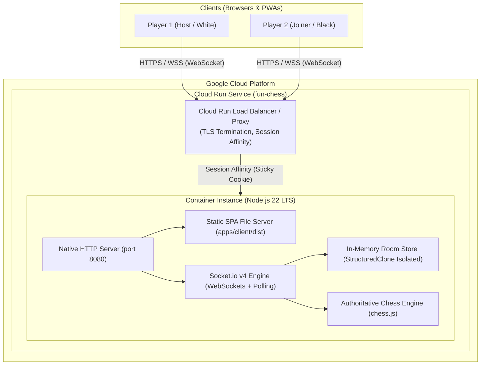
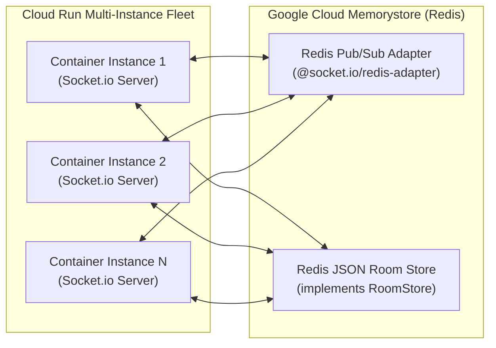

# Google Cloud Run Architecture: Multiplayer Networking & Ephemeral Relay

**Status:** ARCHITECTURAL SPECIFICATION & DEPLOYMENT GUIDE
**Version:** 1.0.0
**Target Platform:** Google Cloud Run (Fully Managed Serverless Container Platform)
**Target Services:** Fun Chess Monorepo (`apps/server`, `apps/client`, `@fun-chess/shared`)
**Date:** 2026-08-27

---

## 1. Overview & Architectural Goals

Fun Chess is designed as a **zero-database, high-performance real-time chess platform** capable of running in two distinct topologies:
1. **Local Wi-Fi / LAN Mode:** Zero-config local host binding (`192.168.x.x`, `10.x.x.x`) with QR code pairing for kids and families on the same local network.
2. **Cloud Relay Mode:** Serverless cloud deployment on **Google Cloud Run** with public HTTPS/WSS endpoints, enabling instant "Play with Friends" over the internet without NAT traversal or port forwarding.



---

## 2. Google Cloud Run Runtime Characteristics

### 2.1 WebSocket Support on Cloud Run
Cloud Run supports native WebSockets over HTTP/1.1 and HTTP/2. Key configuration parameters:

| Parameter | Recommended Value | Description |
|---|---|---|
| **Request Timeout (`--timeout`)** | `3600s` (60 min) | Maximum lifetime of an open WebSocket connection before requiring reconnection. |
| **Concurrency (`--concurrency`)** | `80` – `200` | Maximum simultaneous concurrent WebSocket connections per container instance. |
| **Min Instances (`--min-instances`)** | `1` (production) / `0` (dev) | Set `1` for zero cold-start latency on match creation; `0` for true scale-to-zero cost efficiency. |
| **Max Instances (`--max-instances`)** | `10` | Caps maximum horizontal scale. |
| **Memory Limit (`--memory`)** | `512Mi` – `1Gi` | Lightweight footprint due to zero-database in-memory storage. |
| **CPU Allocation (`--cpu`)** | `1` (vCPU) | Set `--no-cpu-throttling` if keeping persistent WebSockets idle without drops. |

### 2.2 Session Affinity (Sticky Sessions)
Because Fun Chess utilizes an authoritative in-memory room storage model (`InMemoryRoomStore`), all participants of a game room (Player 1 and Player 2) must establish their WebSocket connections to the **same container instance** unless a distributed backing store is attached.

Cloud Run provides built-in **Session Affinity**:
- **Flag:** `--session-affinity`
- **Mechanism:** Cloud Run inspects the client request and injects a routing cookie (`__session` / Cloud Run routing header). Subsequent HTTP requests and WebSocket upgrades from the same client session are routed to the same container instance.
- **Room Code Routing:** In single-instance or session-affinitized deployments, room pairing connects cleanly via the 4-letter room code (`e.g. STAR`).

---

## 3. Communication Protocol & Connection Lifecycle

### 3.1 Transport & Heartbeat Tuning
Socket.io is configured with explicit transport options in `apps/server/src/platform/socket/socket_server.ts`:

```typescript
const io = new Server<ClientToServerEvents, ServerToClientEvents>(httpServer, {
  cors: { origin: '*', methods: ['GET', 'POST'] },
  pingInterval: 10000, // Send ping every 10s
  pingTimeout: 5000,    // Drop if pong not received within 5s
  transports: ['websocket', 'polling'], // Prefer WebSockets
});
```

- **Ping Interval (10s):** Keeps Cloud Run load balancer proxy idle connection timers active, preventing intermediate firewall drops.
- **Ping Timeout (5s):** Fast dead-peer detection triggers immediate player disconnect handling (`handleSocketDisconnect`).

### 3.2 60-Second Disconnection Grace Period & Reconnection
When a player experiences a mobile network switch (e.g. 5G to Wi-Fi) or brief packet loss:
1. Server marks player `isConnected = false` and transitions room status to `paused_disconnect`.
2. A 60-second cancellation timer is registered in `disconnectTimers`.
3. Client automatically reconnects with `sessionToken` persisted in `sessionStorage` (`fun_chess_session_token`).
4. Upon receiving `room:reconnect`, server restores `socketId`, resumes game status to `playing`, cancels the grace timer, and notifies the opponent via `room:player_reconnected`.
5. If the timer expires (60s), the disconnected player forfeits by `abandonment`.

---

## 4. State Management: Ephemeral In-Memory vs Distributed Redis

### 4.1 Ephemeral In-Memory Architecture (Current)
- **Store:** `InMemoryRoomStore` (`apps/server/src/features/rooms/in_memory_room.store.ts`).
- **Isolation:** Immutability enforced via `structuredClone` on save and read.
- **Advantages:**
  - 0 external infrastructure dependencies (no database, no Redis cache to provision or pay for).
  - Sub-millisecond game state transactions and move validations (<1ms).
  - Instant cold start (<200ms container boot).
- **Lifecycle:**
  - Automated garbage collection: `RoomService.cleanupAbandonedRooms(10 * 60 * 1000)` executes every 5 minutes, purging finished or inactive rooms older than 10 minutes.

### 4.2 Horizontal Multi-Instance Scaling with Redis (Scale-Out Blueprint)
When scaling beyond single-instance session affinity capacity (>1,000 concurrent rooms), the architecture supports drop-in Redis adapter integration without altering business logic:



1. **Pub/Sub Transport:** Attach `@socket.io/redis-adapter` to broadcast room events (`game:moved`, `room:player_joined`) across all Cloud Run container instances.
2. **Persistence Adapter:** Implement `RedisRoomStore` conforming to the existing `RoomStore` interface contract (`findByCode`, `findBySocketId`, `save`, `delete`, `listActiveRooms`).

---

## 5. Health Probe Contracts & Observability

Cloud Run and container orchestrators rely on HTTP health checks for traffic routing and automated self-healing.

### 5.1 Liveness & Readiness Probe (`/healthz`)
- **Endpoint:** `GET /healthz`
- **Response:** HTTP `200 OK`
- **Payload:** Plain text `"OK"`
- **Cloud Run Use:** Configured as the startup and liveness probe in Cloud Run service specifications.

### 5.2 Deep Telemetry Health Endpoint (`/health` & `/api/health`)
- **Endpoint:** `GET /health` or `GET /api/health`
- **Response:** HTTP `200 OK` (or `503 Service Unavailable` if degraded)
- **Content-Type:** `application/json; charset=utf-8`
- **Contract (`HealthCheckResponse`):**
  ```json
  {
    "status": "ok",
    "uptimeSeconds": 14320,
    "timestamp": "2026-08-27T12:00:00.000Z",
    "activeRooms": 14,
    "activeSockets": 28,
    "memoryUsageMb": {
      "rss": 48.2,
      "heapTotal": 24.5,
      "heapUsed": 18.1
    },
    "relay": {
      "mode": "cloud",
      "publicUrl": "https://fun-chess-relay-xyz.a.run.app"
    }
  }
  ```

### 5.3 Addressing & Discovery Endpoint (`/api/lan-info`)
- **Endpoint:** `GET /api/lan-info`
- **Response:** HTTP `200 OK`
- **Contract (`LanInfoResponse`):**
  ```json
  {
    "lanIp": "fun-chess-relay-xyz.a.run.app",
    "port": 8080,
    "localUrl": "http://localhost:8080",
    "joinUrl": "https://fun-chess-relay-xyz.a.run.app",
    "interfaces": [],
    "relayMode": "cloud",
    "isCloudRelay": true,
    "publicUrl": "https://fun-chess-relay-xyz.a.run.app"
  }
  ```

---

## 6. Cloud Run Deployment Specification

### 6.1 Multi-Stage Containerfile
The root `Dockerfile` utilizes multi-stage builds to produce a hardened, minimal production container:

```dockerfile
# Stage 1: Build Workspace
FROM node:22-alpine AS builder
WORKDIR /app
COPY package*.json ./
COPY shared/package*.json ./shared/
COPY apps/server/package*.json ./apps/server/
COPY apps/client/package*.json ./apps/client/
RUN npm ci

COPY . .
RUN npm run build

# Stage 2: Production Distroless / Minimal Runtime
FROM node:22-alpine AS runner
WORKDIR /app
ENV NODE_ENV=production
ENV PORT=8080
ENV HOST=0.0.0.0

COPY package*.json ./
COPY shared/package*.json ./shared/
COPY apps/server/package*.json ./apps/server/
COPY apps/client/package*.json ./apps/client/
RUN npm ci --omit=dev

COPY --from=builder /app/shared/dist ./shared/dist
COPY --from=builder /app/apps/server/dist ./apps/server/dist
COPY --from=builder /app/apps/client/dist ./apps/client/dist

USER node
EXPOSE 8080
CMD ["node", "apps/server/dist/index.js"]
```

### 6.2 Environment Variables Reference

| Variable | Default | Purpose |
|---|---|---|
| `PORT` | `8080` | Port provided dynamically by Cloud Run container contract. |
| `HOST` | `0.0.0.0` | Host IP interface binding. |
| `PUBLIC_URL` | *(Unset)* | When set (e.g. `https://fun-chess.a.run.app`), switches `RelayAddressService` to Cloud Relay mode. |
| `NODE_ENV` | `production` | Optimizes Node runtime and disables verbose debug tracing. |
| `CORS_ORIGIN` | `*` | Allowed CORS origins for WebSocket handshakes and REST probes. |

### 6.3 Deployment Commands (`gcloud` CLI)

```bash
# 1. Build and push container to Google Artifact Registry
gcloud builds submit --tag gcr.io/${PROJECT_ID}/fun-chess:v1.0.0

# 2. Deploy service to Cloud Run with Session Affinity and WebSocket timeout
gcloud run deploy fun-chess \
  --image gcr.io/${PROJECT_ID}/fun-chess:v1.0.0 \
  --platform managed \
  --region us-central1 \
  --allow-unauthenticated \
  --port 8080 \
  --timeout 3600 \
  --concurrency 100 \
  --session-affinity \
  --min-instances 1 \
  --max-instances 10 \
  --memory 512Mi \
  --cpu 1 \
  --set-env-vars PUBLIC_URL=https://fun-chess-xyz.a.run.app,NODE_ENV=production
```

---

## 7. Operational Runbook & Troubleshooting

### Scenario A: Disconnects During Game
- **Symptom:** Client shows `"⚠️ Opponent disconnected. Waiting for reconnection..."`.
- **Cause:** Mobile device switched network interfaces or entered background mode.
- **Resolution:** Client socket auto-reconnects using `sessionStorage` token within 60 seconds without data loss.

### Scenario B: Room Pairing Across Instances
- **Symptom:** Player 2 enters valid 4-letter code but gets `ERR_ROOM_NOT_FOUND`.
- **Cause:** Multi-instance Cloud Run deployment without Session Affinity or Redis adapter.
- **Resolution:** Ensure `--session-affinity` is enabled on the Cloud Run service, or attach `@socket.io/redis-adapter` for multi-instance deployments.
