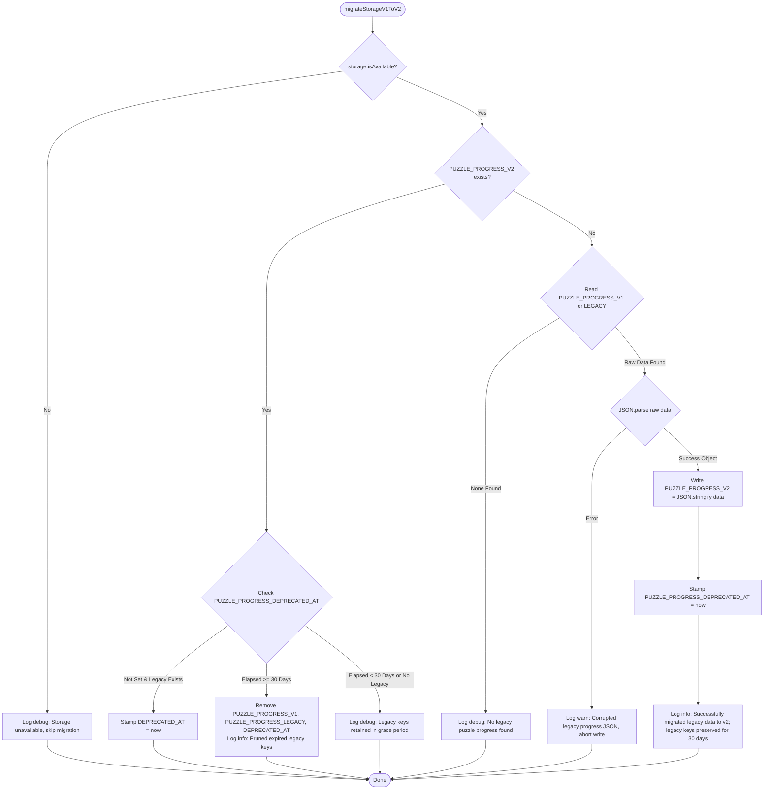

# Database & Client Storage Contracts: Full Codebase Remediation
**Document Version:** 1.0.0 (FROZEN)  
**Author:** Senior Database Engineer (`@database-expert`)  
**Domain:** Storage Architecture, Schema Migrations, Two-Phase Commit Transactions, and Concurrency Controls  
**Target Scope Cards:** `SC-1-SHARED`, `SC-2-SERVER`, `SC-3-CLIENT-CORE`, `SC-4-CLIENT-FEATURES`  
**Audit Findings Addressed:** `[CRIT-001]`, `[MIN-005]`, `[MIN-006]`, `[MAJ-020]`, `[MIN-026]`, `[MAJ-005]`

---

## 1. Executive Summary & Finding Traceability

This contract specification provides the authoritative, frozen design for all storage, migration, transaction, and concurrency remediation required by the Fun Chess platform audit (`docs/audits/review-findings-fun-chess-codebase-2026-09-08-0618.md`).

All implementations in Wave 1 (`SC-1-SHARED`), Wave 2 (`SC-2-SERVER`, `SC-3-CLIENT-CORE`), and Wave 3 (`SC-4-CLIENT-FEATURES`) MUST conform strictly to these contracts.

| Finding ID | Severity | Problem Summary | Remediation Specification | Target File | Scope Card |
| :--- | :--- | :--- | :--- | :--- | :--- |
| **[CRIT-001]** | **CRITICAL** | `migrateStorageV1ToV2` uninvoked at bootstrap causing total data loss on upgrade; destructive `removeItem` on legacy keys | Non-destructive migration with 30-day deprecation timestamp; wired in `apps/client/src/main.ts` | `apps/client/src/platform/storage/keys.ts`<br>`apps/client/src/main.ts` | `SC-3-CLIENT-CORE` |
| **[MIN-006]** | **MINOR** | Nested empty `catch {}` blocks in `migrateStorageV1ToV2` silently swallow storage exceptions | Structured 3-point logging using `ILogger`; correlation ID attachment; zero empty catches | `apps/client/src/platform/storage/keys.ts` | `SC-3-CLIENT-CORE` |
| **[MAJ-020]** | **MAJOR** | `LocalStorageUnifiedStore.overwriteAll` 2PC transaction lacks start/success logs, duration, and silently drops write errors on successful rollback | 3-point structured logging (`start`, `success`, `failure`), duration tracking, primary error logging with `rolledBack: true` | `apps/client/src/features/portability/store/local_storage_unified.store.ts` | `SC-4-CLIENT-FEATURES` |
| **[MIN-005]** | **MINOR** | Corrupted JSON silently swallowed in `LocalStorageProgressStore.getProgressMap` with empty catch | Explicit `logger.warn` diagnostics logging with error details, falling back safely to memory cache | `apps/client/src/features/scenarios/store/local_storage_progress.store.ts` | `SC-4-CLIENT-FEATURES` |
| **[MIN-026]** | **MINOR** | `LocalStoragePuzzleProgressStore` performs 102 lines of manual `typeof` sanitization bypassing shared schema | Delegate sanitization to `sanitizeAndValidateProgress` from `@fun-chess/shared` | `apps/client/src/features/puzzles/store/local_storage_puzzle_store.ts` | `SC-4-CLIENT-FEATURES` |
| **[MAJ-005]** | **MAJOR** | `InMemoryRoomStore.withLock` has 5000ms acquisition timeout but unbounded execution timeout; hung action leaks lock forever | Dual-timeout race specification: 5000ms acquisition timeout + 5000ms execution timeout race | `apps/server/src/features/rooms/in_memory_room.store.ts`<br>`apps/server/src/features/rooms/room.errors.ts` | `SC-2-SERVER` |

---

## 2. Client LocalStorage Migration Contract (CRIT-001, MIN-006)

### 2.1 Problem & Vulnerability Analysis
1. **Dead Code & Data Loss (CRIT-001):** `migrateStorageV1ToV2(storage)` in `apps/client/src/platform/storage/keys.ts` is defined but never invoked in `apps/client/src/main.ts` or during store instantiation. Consequently, users upgrading from earlier client versions lose access to their puzzle history, streak milestones, and rating data because `LocalStoragePuzzleProgressStore` reads solely from the v2 key (`fun_chess_puzzle_progress_v2`).
2. **Destructive Removal Without Deprecation Window:** Lines 47–48 of `keys.ts` immediately execute:
   ```typescript
   storage.removeItem(STORAGE_KEYS.PUZZLE_PROGRESS_V1);
   storage.removeItem(STORAGE_KEYS.PUZZLE_PROGRESS_LEGACY);
   ```
   If a client encounters an issue or rolls back to a previous release within days of migration, their legacy progress is permanently destroyed. Per `database-design-principles.md` (Migration Safety: *"Never drop columns/keys without deprecation; Additive changes first"*), legacy data MUST be preserved with a 30-day grace window before pruning.
3. **Empty Catch Blocks (MIN-006):** Lines 50–55 contain nested empty `catch {}` blocks:
   ```typescript
   try { ... } catch { /* Corrupted v1 data: safe no-op */ }
   try { ... } catch { /* Storage access exceptions gracefully handled */ }
   ```
   This directly violates `rugged-software-constitution.md` (*"No silent failures"*) and `error-handling-principles.md` (*"Zero Tolerance for Empty Catch Blocks"*).

---

### 2.2 Storage Key Registry & Deprecation Schema

The centralized storage registry in `apps/client/src/platform/storage/keys.ts` is extended with the deprecation metadata key:

```typescript
export const STORAGE_KEYS = {
  SCENARIO_PROGRESS: 'fun_chess_scenario_progress_v1',
  PUZZLE_PROGRESS_V1: 'fun_chess_puzzle_progress_v1',
  PUZZLE_PROGRESS_LEGACY: 'fun_chess_puzzle_progress',
  PUZZLE_PROGRESS_V2: 'fun_chess_puzzle_progress_v2',
  PUZZLE_PROGRESS_DEPRECATED_AT: 'fun_chess_puzzle_progress_deprecated_at',
  PLAYER_AVATAR: 'fun_chess_player_avatar',
  THEME: 'fun_chess_theme',
  LAN_IP: 'fun_chess_lan_ip',
  SESSION_TOKEN: 'fun_chess_session_token',
  PWA_SNOOZE: 'fun_chess_pwa_install_snoozed_until',
} as const;

export type StorageKey = (typeof STORAGE_KEYS)[keyof typeof STORAGE_KEYS];

/** 30-day retention grace window in milliseconds (30 * 24 * 60 * 60 * 1000) */
export const LEGACY_STORAGE_DEPRECATION_WINDOW_MS = 2_592_000_000;
```

---

### 2.3 Non-Destructive Migration State Machine



---

### 2.4 Migration Algorithm & Logging Specification

```typescript
import type { KeyValueStorage } from './key_value_storage';
import { STORAGE_KEYS, LEGACY_STORAGE_DEPRECATION_WINDOW_MS } from './keys';
import { logger, generateCorrelationId, type ILogger } from '@/platform/telemetry';

export interface MigrationOutcome {
  status: 'migrated' | 'already_migrated' | 'pruned' | 'skipped' | 'corrupt' | 'error';
  legacyKeyFound?: string;
  deprecationTimestamp?: number;
  error?: string;
}

/**
 * Migrates stored puzzle progress from legacy v1 keys to canonical v2 schema.
 * Enforces non-destructive deprecation: retains legacy keys for 30 days before pruning.
 *
 * @param storage - Target KeyValueStorage implementation
 * @param log - Optional structured logger (defaults to platform logger)
 * @param referenceNowMs - Optional timestamp for testing time travel
 * @returns MigrationOutcome summary
 */
export function migrateStorageV1ToV2(
  storage: KeyValueStorage,
  log: ILogger = logger,
  referenceNowMs: number = Date.now()
): MigrationOutcome {
  const correlationId = generateCorrelationId();
  const operation = 'migrate_storage_v1_to_v2';

  try {
    if (!storage.isAvailable()) {
      log.debug('Storage is unavailable; skipping v1->v2 puzzle progress migration', {
        operation,
        correlationId,
      });
      return { status: 'skipped' };
    }

    const v2Data = storage.getItem(STORAGE_KEYS.PUZZLE_PROGRESS_V2);
    const v1Raw = storage.getItem(STORAGE_KEYS.PUZZLE_PROGRESS_V1);
    const legacyRaw = storage.getItem(STORAGE_KEYS.PUZZLE_PROGRESS_LEGACY);
    const deprecatedAtRaw = storage.getItem(STORAGE_KEYS.PUZZLE_PROGRESS_DEPRECATED_AT);

    // Case 1: V2 already exists — handle deprecation lifecycle of legacy keys
    if (v2Data) {
      const hasLegacyKeys = Boolean(v1Raw || legacyRaw);

      if (!hasLegacyKeys) {
        // Legacy keys already purged; nothing to do
        return { status: 'already_migrated' };
      }

      // Check if deprecation timestamp is recorded
      if (!deprecatedAtRaw) {
        // Stamp deprecation timestamp now to begin 30-day countdown
        storage.setItem(STORAGE_KEYS.PUZZLE_PROGRESS_DEPRECATED_AT, String(referenceNowMs));
        log.info('PUZZLE_PROGRESS_V2 exists; stamped deprecation timer on legacy keys', {
          operation,
          correlationId,
          deprecationTimestamp: referenceNowMs,
          graceWindowMs: LEGACY_STORAGE_DEPRECATION_WINDOW_MS,
        });
        return { status: 'already_migrated', deprecationTimestamp: referenceNowMs };
      }

      const deprecatedAt = Number(deprecatedAtRaw);
      if (!Number.isNaN(deprecatedAt) && referenceNowMs - deprecatedAt >= LEGACY_STORAGE_DEPRECATION_WINDOW_MS) {
        // 30 days elapsed: safe to prune legacy keys
        storage.removeItem(STORAGE_KEYS.PUZZLE_PROGRESS_V1);
        storage.removeItem(STORAGE_KEYS.PUZZLE_PROGRESS_LEGACY);
        storage.removeItem(STORAGE_KEYS.PUZZLE_PROGRESS_DEPRECATED_AT);

        log.info('Pruned legacy puzzle progress keys after 30-day deprecation grace window', {
          operation,
          correlationId,
          deprecatedAt,
          prunedAt: referenceNowMs,
          retentionDurationMs: referenceNowMs - deprecatedAt,
        });
        return { status: 'pruned', deprecationTimestamp: deprecatedAt };
      }

      // Within 30-day grace period: retain legacy keys
      log.debug('Legacy puzzle progress keys retained within 30-day deprecation grace window', {
        operation,
        correlationId,
        deprecatedAt,
        remainingMs: Math.max(0, LEGACY_STORAGE_DEPRECATION_WINDOW_MS - (referenceNowMs - deprecatedAt)),
      });
      return { status: 'already_migrated', deprecationTimestamp: deprecatedAt };
    }

    // Case 2: V2 does not exist — migrate legacy data if present
    const legacyKeyFound = v1Raw
      ? STORAGE_KEYS.PUZZLE_PROGRESS_V1
      : legacyRaw
        ? STORAGE_KEYS.PUZZLE_PROGRESS_LEGACY
        : null;

    const sourceRaw = v1Raw || legacyRaw;
    if (!sourceRaw || !legacyKeyFound) {
      log.debug('No legacy puzzle progress data found; migration not required', {
        operation,
        correlationId,
      });
      return { status: 'skipped' };
    }

    try {
      const parsed = JSON.parse(sourceRaw);
      if (!parsed || typeof parsed !== 'object' || Array.isArray(parsed)) {
        log.warn('Legacy puzzle progress contains non-object JSON payload; aborting migration', {
          operation,
          correlationId,
          legacyKey: legacyKeyFound,
        });
        return { status: 'corrupt', legacyKeyFound };
      }

      // Write canonical v2 key
      storage.setItem(STORAGE_KEYS.PUZZLE_PROGRESS_V2, JSON.stringify(parsed));

      // Non-destructive: DO NOT delete legacy keys! Stamp deprecation timestamp instead
      storage.setItem(STORAGE_KEYS.PUZZLE_PROGRESS_DEPRECATED_AT, String(referenceNowMs));

      log.info('Successfully migrated legacy puzzle progress to v2 schema with 30-day deprecation retention', {
        operation,
        correlationId,
        sourceKey: legacyKeyFound,
        targetKey: STORAGE_KEYS.PUZZLE_PROGRESS_V2,
        deprecationTimestamp: referenceNowMs,
      });

      return {
        status: 'migrated',
        legacyKeyFound,
        deprecationTimestamp: referenceNowMs,
      };
    } catch (parseErr) {
      log.warn('Failed to parse legacy puzzle progress JSON during migration', {
        operation,
        correlationId,
        legacyKey: legacyKeyFound,
        error: parseErr instanceof Error ? parseErr.message : String(parseErr),
      });
      return {
        status: 'corrupt',
        legacyKeyFound,
        error: parseErr instanceof Error ? parseErr.message : String(parseErr),
      };
    }
  } catch (storageErr) {
    log.error('Unexpected storage exception encountered during client migration', {
      operation,
      correlationId,
      error: storageErr instanceof Error ? storageErr.message : String(storageErr),
    });
    return {
      status: 'error',
      error: storageErr instanceof Error ? storageErr.message : String(storageErr),
    };
  }
}
```

---

### 2.5 Invocation Contract in Client Bootstrap (`apps/client/src/main.ts`)

Per Rule 3 (Dependency Direction) and Finding [CRIT-001], the migration MUST be triggered synchronously in `apps/client/src/main.ts` prior to store instantiation, DI injection, and Vue app mounting.

```typescript
// apps/client/src/main.ts
import { createApp } from 'vue';
import App from './App.vue';
import './assets/design-tokens.css';
import {
  API_CLIENT_KEY,
  STORAGE_KEY,
  SESSION_STORAGE_KEY,
  AUDIO_SERVICE_KEY,
  LOGGER_KEY,
  SCENARIO_STORE_KEY,
  PUZZLE_STORE_KEY,
} from './platform/di';
import { apiClient } from './platform/api';
import { safeLocalStorage, safeSessionStorage } from './platform/storage';
import { migrateStorageV1ToV2 } from './platform/storage/keys'; // <-- CRIT-001
import { audioSynthesizer } from './platform/audio/audio_synthesizer';
import { logger } from './platform/telemetry';
import { defaultLocalStorageProgressStore } from './features/scenarios/store/local_storage_progress.store';
import { defaultLocalStoragePuzzleProgressStore } from './features/puzzles/store/local_storage_puzzle_store';

// 1. Execute storage migrations before stores are mounted or accessed
migrateStorageV1ToV2(safeLocalStorage, logger);

const app = createApp(App);

// 2. Composition Root: Wire Infrastructure & Stores via app.provide (MAJ-019)
app.provide(API_CLIENT_KEY, apiClient);
app.provide(STORAGE_KEY, safeLocalStorage);
app.provide(SESSION_STORAGE_KEY, safeSessionStorage);
app.provide(AUDIO_SERVICE_KEY, audioSynthesizer);
app.provide(LOGGER_KEY, logger);
app.provide(SCENARIO_STORE_KEY, defaultLocalStorageProgressStore);
app.provide(PUZZLE_STORE_KEY, defaultLocalStoragePuzzleProgressStore);

// 3. Global Error Handler with Structured Telemetry Logging (MIN-014)
app.config.errorHandler = (err, _instance, info) => {
  logger.error('Unhandled Vue application error', {
    operation: 'vue_error_handler',
    correlationId: logger.generateCorrelationId?.() ?? undefined,
    error: err instanceof Error ? err.message : String(err),
    stack: err instanceof Error ? err.stack : undefined,
    componentInfo: info,
  });
};

app.mount('#app');
```

---

## 3. Structured Storage Two-Phase Commit Contract (MAJ-020)

### 3.1 Problem & Vulnerability Analysis
`LocalStorageUnifiedStore.overwriteAll` in `apps/client/src/features/portability/store/local_storage_unified.store.ts` performs a multi-store two-phase commit (2PC) write across `ScenarioProgressStore` and `PuzzleProgressStore`.

The audit revealed three compliance defects:
1. **Unlogged Transaction Entry & Exit (MAJ-020):** Per `logging-and-observability-mandate.md` (*"Universal Requirement: All Operations Must Be Logged — Database transactions are mandatory operations"*), operations require 3 points of logging: start, success with duration, and failure with correlation ID. `overwriteAll` had zero start or success logs.
2. **Silent Drop of Primary Write Error on Compensating Rollback:** When `writeErr` occurred, the method entered the `catch (writeErr)` block. If the compensating rollback succeeded (`rollbackSucceeded = true`), it logged NOTHING. `writeErr` was attached as `cause` to `StorageCommitError`, but was never logged to telemetry.
3. **Missing Telemetry Context:** No `correlationId` or `duration` was logged on primary failure paths.

---

### 3.2 Authoritative 2PC Transaction Sequence

```mermaid
sequenceDiagram
    autonumber
    participant Caller as Import/Sync Handler
    participant UnifiedStore as LocalStorageUnifiedStore
    participant Logger as ILogger
    participant Scenarios as ScenarioProgressStore
    participant Puzzles as PuzzleProgressStore
    participant Alert as StorageAlertDispatcher

    Caller->>UnifiedStore: overwriteAll(payload)
    Note over UnifiedStore: Generate correlationId & startTime = Date.now()
    UnifiedStore->>Logger: info("Starting unified storage 2PC overwrite", { operation, correlationId, payloadCounts })

    %% Phase 0: Validate
    Note over UnifiedStore: Phase 0: Ingress Validation (assertValidProgress)

    %% Phase 1: Pre-write snapshot
    Note over UnifiedStore: Phase 1: Capture Pre-Write Snapshot
    UnifiedStore->>Scenarios: getProgressMap()
    UnifiedStore->>Puzzles: getProgress()
    Note over UnifiedStore: snapshot = structuredClone({ scenarios, puzzles })

    %% Phase 2: Staged Write
    alt Staged Write Succeeds
        UnifiedStore->>Scenarios: restoreProgressMap(payload.scenarios)
        UnifiedStore->>Puzzles: restoreProgress(payload.puzzles)
        UnifiedStore->>Logger: info("Unified storage 2PC overwrite succeeded", { operation, correlationId, duration })
        UnifiedStore-->>Caller: resolve(void)
    else Staged Write Fails (writeErr)
        Note over UnifiedStore: Phase 2 Failed: Execute Compensating Rollback
        alt Compensating Rollback Succeeds
            UnifiedStore->>Scenarios: restoreProgressMap(snapshot.scenarios)
            UnifiedStore->>Puzzles: restoreProgress(snapshot.puzzles)
            UnifiedStore->>Logger: error("Unified storage write failed; compensating rollback succeeded", { operation, correlationId, duration, writeErr, rolledBack: true })
            opt Quota Exceeded
                UnifiedStore->>Alert: notify(STORAGE_QUOTA_EXCEEDED)
            end
            UnifiedStore-->>Caller: reject(StorageCommitError(rolledBack: true, cause: writeErr))
        else Compensating Rollback Fails (rollbackErr)
            UnifiedStore->>Logger: fatal("FATAL: Two-phase commit rollback failed", { operation, correlationId, duration, primaryError: writeErr, rollbackError: rollbackErr, rolledBack: false })
            UnifiedStore-->>Caller: reject(StorageCommitError(rolledBack: false, cause: writeErr))
        end
    end
```

---

### 3.3 2PC Implementation Contract with 3-Point Logging

```typescript
// apps/client/src/features/portability/store/local_storage_unified.store.ts

export class LocalStorageUnifiedStore implements ProgressStorage {
  constructor(
    private readonly scenarioStore: ScenarioProgressStore,
    private readonly puzzleStore: PuzzleProgressStore,
    private readonly log: ILogger = logger
  ) {}

  public async overwriteAll(payload: UnifiedProgressPayload): Promise<void> {
    const correlationId = generateCorrelationId();
    const startTime = Date.now();
    const operation = 'unified_store_overwrite';

    // 1. Mandatory Point 1: Operation Start Logging
    this.log.info('Starting unified storage 2PC overwrite', {
      operation,
      correlationId,
      version: payload?.version,
      scenariosCount: payload?.scenarios ? Object.keys(payload.scenarios).length : 0,
      puzzlesSolvedCount: payload?.puzzles?.solvedPuzzles ? Object.keys(payload.puzzles.solvedPuzzles).length : 0,
    });

    // Phase 0: Validate payload structure against authoritative schema
    if (!payload || typeof payload !== 'object' || !payload.scenarios || !payload.puzzles) {
      const err = new Error('Invalid payload: missing scenarios or puzzles data');
      this.log.error('Unified storage 2PC overwrite rejected: invalid payload structure', {
        operation,
        correlationId,
        duration: Date.now() - startTime,
        error: err.message,
      });
      throw err;
    }

    let validatedPayload: UnifiedProgressPayload;
    try {
      validatedPayload = assertValidProgress(payload);
    } catch (validationErr) {
      this.log.error('Unified storage 2PC overwrite schema assertion failed', {
        operation,
        correlationId,
        duration: Date.now() - startTime,
        error: validationErr instanceof Error ? validationErr.message : String(validationErr),
      });
      throw validationErr;
    }

    // Phase 1: Capture pre-write snapshot
    const snapshot: StorageSnapshot = {
      scenarios: structuredClone(await this.scenarioStore.getProgressMap()),
      puzzles: structuredClone(await this.puzzleStore.getProgress()),
    };

    // Phase 2: Staged write
    try {
      // 2a. Reset and restore scenario records
      if (typeof this.scenarioStore.restoreProgressMap === 'function') {
        await this.scenarioStore.restoreProgressMap(validatedPayload.scenarios);
      } else {
        await this.scenarioStore.resetAllProgress();
        for (const [id, progress] of Object.entries(validatedPayload.scenarios)) {
          await this.scenarioStore.saveProgress(
            id,
            progress.starsEarned,
            progress.hintsUsedTotal
          );
        }
      }

      // 2b. Write full puzzle state (including themeMastery & arcadeStats)
      await this.puzzleStore.restoreProgress(validatedPayload.puzzles);

      // 2. Mandatory Point 2: Operation Success Logging
      const duration = Date.now() - startTime;
      this.log.info('Unified storage 2PC overwrite completed successfully', {
        operation,
        correlationId,
        duration,
        scenariosCommitted: Object.keys(validatedPayload.scenarios).length,
        puzzlesSolvedCommitted: Object.keys(validatedPayload.puzzles.solvedPuzzles).length,
      });
    } catch (writeErr) {
      const duration = Date.now() - startTime;

      // Compensating Rollback: restore from pre-write snapshot
      let rollbackSucceeded = false;
      try {
        if (typeof this.scenarioStore.restoreProgressMap === 'function') {
          await this.scenarioStore.restoreProgressMap(snapshot.scenarios);
        } else {
          await this.scenarioStore.resetAllProgress();
          for (const [id, progress] of Object.entries(snapshot.scenarios)) {
            await this.scenarioStore.saveProgress(
              id,
              progress.starsEarned,
              progress.hintsUsedTotal
            );
          }
        }
        await this.puzzleStore.restoreProgress(snapshot.puzzles);
        rollbackSucceeded = true;
      } catch (rollbackErr) {
        rollbackSucceeded = false;
        // Critical rollback failure logging
        this.log.fatal('FATAL: Two-phase commit rollback failed; storage in potentially inconsistent state', {
          operation: 'unified_store_rollback',
          correlationId,
          duration,
          primaryError: writeErr instanceof Error
            ? { name: writeErr.name, message: writeErr.message, stack: writeErr.stack }
            : { raw: writeErr },
          rollbackError: rollbackErr instanceof Error
            ? { name: rollbackErr.name, message: rollbackErr.message, stack: rollbackErr.stack }
            : { raw: rollbackErr },
        });
      }

      // 3. Mandatory Point 3: Operation Failure Logging (MAJ-020 fix)
      if (rollbackSucceeded) {
        this.log.error('Unified storage write failed; compensating rollback safely restored previous state', {
          operation,
          correlationId,
          duration,
          rolledBack: true,
          error: writeErr instanceof Error
            ? { name: writeErr.name, message: writeErr.message, stack: writeErr.stack }
            : { raw: writeErr },
        });
      }

      // Check quota error & emit reactive alert
      if (isQuotaExceededError(writeErr)) {
        storageAlertDispatcher.notify({
          type: 'STORAGE_QUOTA_EXCEEDED',
          store: 'unified',
          attemptedAction: 'overwrite',
          timestamp: Date.now(),
          message: 'Storage quota exceeded while importing progress. Local state was preserved.',
          suggestedRemediation: 'EXPORT_BACKUP_AND_CLEAR',
        });
      }

      throw new StorageCommitError(
        rollbackSucceeded
          ? 'Failed to save unified progress. Existing progress was safely restored.'
          : 'CRITICAL: Progress save failed and partial rollback failed.',
        { cause: writeErr, rolledBack: rollbackSucceeded }
      );
    }
  }
}
```

---

## 4. Progress Schema Sanitization Contract (MIN-026, MIN-005)

### 4.1 Authoritative Sanitization Delegation (MIN-026)
`LocalStoragePuzzleProgressStore` previously maintained 102 lines of manual `typeof` parsing and ad-hoc fallback values in `sanitizeProgress`. This violated DRY, bypassed Zod schema constraints in `@fun-chess/shared`, and caused maintenance friction.

The store MUST delegate sanitization to the shared canonical validator `sanitizeAndValidateProgress` from `@fun-chess/shared`:

```typescript
// apps/client/src/features/puzzles/store/local_storage_puzzle_store.ts
import {
  sanitizeAndValidateProgress,
  UNIFIED_PROGRESS_SCHEMA_VERSION,
  type PuzzleProgress,
} from '@fun-chess/shared';
import { DEFAULT_PUZZLE_PROGRESS } from './puzzle_progress.store';

/**
 * Sanitizes and validates unknown puzzle progress input by delegating to
 * the authoritative @fun-chess/shared schema validator.
 */
private sanitizeProgress(raw: unknown): PuzzleProgress {
  if (!raw || typeof raw !== 'object' || Array.isArray(raw)) {
    return { ...DEFAULT_PUZZLE_PROGRESS };
  }

  // Wrap raw puzzle payload in minimal valid UnifiedProgressPayload envelope
  const wrappedPayload = {
    version: UNIFIED_PROGRESS_SCHEMA_VERSION,
    exportedAt: Date.now(),
    scenarios: {},
    puzzles: raw,
  };

  const result = sanitizeAndValidateProgress(wrappedPayload);
  if (result.success && result.data?.puzzles) {
    return result.data.puzzles;
  }

  // Schema rejected payload: fall back defensively to default profile
  return { ...DEFAULT_PUZZLE_PROGRESS };
}
```

---

### 4.2 Corrupted JSON Handling in Scenario Store (MIN-005)
`LocalStorageProgressStore.getProgressMap` in `apps/client/src/features/scenarios/store/local_storage_progress.store.ts` previously swallowed JSON parse errors in an empty catch block (`catch {}`).

The store MUST log a diagnostic warning with the error details and correlation ID before returning the in-memory fallback cache:

```typescript
// apps/client/src/features/scenarios/store/local_storage_progress.store.ts

public async getProgressMap(): Promise<ScenarioProgressMap> {
  if (!this.storage.isAvailable()) {
    const result: ScenarioProgressMap = {};
    for (const [id, rec] of this.memoryFallback.entries()) {
      result[id] = { ...rec };
    }
    return result;
  }

  try {
    const raw = this.storage.getItem(this.storageKey);
    if (!raw) return {};

    const parsed = JSON.parse(raw);
    if (!parsed || typeof parsed !== 'object' || Array.isArray(parsed)) {
      logger.warn('Scenario progress storage contained invalid non-object JSON; returning empty map', {
        operation: 'get_scenario_progress_map',
        storageKey: this.storageKey,
      });
      return {};
    }

    const result: ScenarioProgressMap = {};
    for (const [key, val] of Object.entries(parsed)) {
      const sanitized = this.sanitizeRecord(val);
      if (sanitized) {
        result[key] = sanitized;
        this.memoryFallback.set(key, sanitized);
      }
    }
    return result;
  } catch (err) {
    // MIN-005 Fix: Log corrupted storage JSON warning instead of silent swallow
    logger.warn('Failed to parse scenario progress JSON from storage; safely falling back to memory cache', {
      operation: 'get_scenario_progress_map',
      storageKey: this.storageKey,
      error: err instanceof Error ? err.message : String(err),
    });

    const result: ScenarioProgressMap = {};
    for (const [id, rec] of this.memoryFallback.entries()) {
      result[id] = { ...rec };
    }
    return result;
  }
}
```

---

## 5. Server Ephemeral Room Lock Mutex Contract (MAJ-005)

### 5.1 Problem Statement & Vulnerability Analysis
`InMemoryRoomStore.withLock(roomCode, action)` guards concurrent operations on a per-room basis using a promise queue (`tail`). 

The previous implementation enforced a 5000ms acquisition timeout (`LOCK_TIMEOUT_MS = 5000`), but once the lock was acquired, `await action()` ran **unbounded**:
```typescript
await Promise.race([prevTail, timeoutPromise]); // 5000ms acquisition timeout
acquired = true;

return await action(); // <-- UNBOUNDED EXECUTION (MAJ-005)
```

**Impact:** If `action()` stalled (e.g., waiting on an unresolved promise, slow worker, or CPU lock), the lock was held indefinitely. Subsequent operations queued behind `entry.tail` all failed with `LockTimeoutError`, permanently starving the room until server restart and leaking queued promise callbacks in Node.js heap.

---

### 5.2 Dual-Timeout Race Mutex Specification

To ensure robust mutual exclusion and total starvation immunity, `InMemoryRoomStore.withLock` MUST execute a **Dual-Timeout Race Architecture**:
1. **Acquisition Timeout (5000ms):** Timeout waiting in queue for previous mutator to complete.
2. **Execution Timeout (5000ms):** Timeout racing the executing mutator (`action()`) against a timer promise.

```mermaid
sequenceDiagram
    autonumber
    participant Mutator as Room Action
    participant Store as InMemoryRoomStore.withLock
    participant AcqTimer as Acquisition Timer (5000ms)
    participant ExecTimer as Execution Timer (5000ms)
    participant Queue as Lock Queue

    Store->>AcqTimer: Start acquisition countdown
    Store->>Queue: Await prevTail
    alt Acquisition takes > 5000ms
        AcqTimer-->>Store: Reject LockTimeoutError
        Note over Store: acquired = false. Attach prevTail.finally() to defer release
        Store-->>Mutator: Reject LockTimeoutError
    else Acquisition succeeds in <= 5000ms
        AcqTimer->>AcqTimer: clearTimeout(acqTimer)
        Note over Store: acquired = true
        Store->>ExecTimer: Start execution countdown (5000ms)
        Store->>Mutator: Execute action()
        alt action() completes in <= 5000ms
            Mutator-->>Store: Return result
            ExecTimer->>ExecTimer: clearTimeout(execTimer)
            Note over Store: Release lock & drain queue
            Store-->>Mutator: Return result
        else action() hangs > 5000ms (MAJ-005)
            ExecTimer-->>Store: Reject LockExecutionTimeoutError
            Note over Store: acquired = true. Call releaseLock() immediately!
            Note over Store: Next queued waiter is UNBLOCKED; room not starved
            Store-->>Mutator: Reject LockExecutionTimeoutError
        end
    end
```

---

### 5.3 Error Class Definition (`apps/server/src/features/rooms/room.errors.ts`)

```typescript
/**
 * Thrown when an operation times out while actively executing inside a room's exclusive lock.
 * Addresses MAJ-005: Prevents hung actions from blocking room operations indefinitely.
 */
export class LockExecutionTimeoutError extends AppError {
  constructor(roomCode: string, timeoutMs: number) {
    super(
      'ERR_SOCKET_TIMEOUT',
      `Execution timed out while holding lock on room '${roomCode}' after ${timeoutMs}ms`,
      408,
      { roomCode, timeoutMs, phase: 'execution' }
    );
    this.name = 'LockExecutionTimeoutError';
  }
}
```

---

### 5.4 Mutex Implementation Contract (`apps/server/src/features/rooms/in_memory_room.store.ts`)

```typescript
// apps/server/src/features/rooms/in_memory_room.store.ts

export class InMemoryRoomStore implements RoomStore {
  public readonly LOCK_TIMEOUT_MS = 5000;
  public readonly EXECUTION_TIMEOUT_MS = 5000; // MAJ-005

  public async withLock<T>(roomCode: string, action: () => Promise<T>): Promise<T> {
    const code = roomCode.toUpperCase();
    let entry = this.lockQueues.get(code);
    if (!entry) {
      entry = { tail: Promise.resolve(), waitersCount: 0 };
      this.lockQueues.set(code, entry);
    }

    entry.waitersCount++;
    const prevTail = entry.tail;

    let releaseLock!: () => void;
    const currentLock = new Promise<void>((resolve) => {
      releaseLock = resolve;
    });

    entry.tail = prevTail.then(
      () => currentLock,
      () => currentLock
    );

    let acquireTimer: NodeJS.Timeout | undefined;
    let executionTimer: NodeJS.Timeout | undefined;
    let acquired = false;

    try {
      // 1. Lock Acquisition Race (5000ms acquisition timeout)
      await Promise.race([
        prevTail,
        new Promise((_, reject) => {
          acquireTimer = setTimeout(
            () => reject(new LockTimeoutError(code, this.LOCK_TIMEOUT_MS)),
            this.LOCK_TIMEOUT_MS
          );
        }),
      ]);
      acquired = true;
      if (acquireTimer) clearTimeout(acquireTimer);

      // 2. Lock Execution Race (5000ms execution timeout) — MAJ-005
      const actionPromise = action();
      const executionTimeoutPromise = new Promise<never>((_, reject) => {
        executionTimer = setTimeout(
          () => reject(new LockExecutionTimeoutError(code, this.EXECUTION_TIMEOUT_MS)),
          this.EXECUTION_TIMEOUT_MS
        );
      });

      return await Promise.race([actionPromise, executionTimeoutPromise]);
    } finally {
      if (acquireTimer) clearTimeout(acquireTimer);
      if (executionTimer) clearTimeout(executionTimer);

      if (acquired) {
        // Mutator acquired the lock: release immediately on completion or execution timeout
        releaseLock();
        const currentEntry = this.lockQueues.get(code);
        if (currentEntry) {
          currentEntry.waitersCount--;
          if (currentEntry.waitersCount <= 0) {
            // Prevent memory leak: purge drained queue
            this.lockQueues.delete(code);
          }
        }
      } else {
        // Acquisition timed out: DO NOT prematurely release the lock.
        // Forward resolution once prevTail settles so subsequent waiters remain blocked until the slow holder completes.
        prevTail.finally(() => {
          releaseLock();
          const currentEntry = this.lockQueues.get(code);
          if (currentEntry) {
            currentEntry.waitersCount--;
            if (currentEntry.waitersCount <= 0) {
              this.lockQueues.delete(code);
            }
          }
        });
      }
    }
  }
}
```

---

## 6. Verification Test Matrices

### 6.1 Client Migration Verification Matrix (`SC-3-CLIENT-CORE`)

| Test Case | Inputs / State | Expected Behavior | Verification Assertions |
| :--- | :--- | :--- | :--- |
| **Migrate V1 Key** | Storage has `PUZZLE_PROGRESS_V1 = '{"solved":[1]}'` | Migrates to `PUZZLE_PROGRESS_V2`; sets `DEPRECATED_AT`; retains V1 key | `getItem(V2)` equals data;<br>`getItem(V1)` remains non-null;<br>`getItem(DEPRECATED_AT)` is set |
| **Migrate Legacy Key** | Storage has `PUZZLE_PROGRESS_LEGACY = '{"solved":[2]}'` | Migrates to `PUZZLE_PROGRESS_V2`; sets `DEPRECATED_AT`; retains legacy key | `getItem(V2)` equals data;<br>`getItem(LEGACY)` remains non-null |
| **Preserve V2 & Legacy (<30 days)** | Storage has V2, Legacy, and `DEPRECATED_AT = now - 10 days` | Does not alter V2; does not prune legacy | `getItem(V2)` untouched;<br>`getItem(LEGACY)` untouched |
| **Prune Legacy (>=30 days)** | Storage has V2, Legacy, and `DEPRECATED_AT = now - 31 days` | Prunes legacy keys and deprecation key; V2 untouched | `getItem(V1)` is null;<br>`getItem(LEGACY)` is null;<br>`getItem(DEPRECATED_AT)` is null |
| **Corrupted JSON Handling** | Storage has `PUZZLE_PROGRESS_V1 = '{broken json'` | Logs warning via `logger.warn`; does not write V2; no unhandled exception | `getItem(V2)` is null;<br>logger spy recorded `warn` with `operation` |
| **Bootstrap Wiring** | `main.ts` loaded | Migration function called before app mount | Spy on `migrateStorageV1ToV2` called with `safeLocalStorage` |

---

### 6.2 2PC Transaction Verification Matrix (`SC-4-CLIENT-FEATURES`)

| Test Case | Scenario | Expected Behavior | Verification Assertions |
| :--- | :--- | :--- | :--- |
| **Happy Path Overwrite** | Valid payload, normal quota | Both stores updated; start & success logged | Logger `info` called twice with `operation: 'unified_store_overwrite'` and `duration` |
| **Staged Write Failure + Rollback Success** | Scenario succeeds, Puzzle fails (e.g. storage error) | Snapshot restored to both stores; failure logged with `rolledBack: true` | Store data reverts to snapshot;<br>Logger `error` logged with primary error and `rolledBack: true`;<br>Throws `StorageCommitError(rolledBack: true)` |
| **Staged Write Failure + Rollback Failure** | Puzzle fails, rollback throws | Throws `StorageCommitError(rolledBack: false)`; fatal log emitted | Logger `fatal` called with `primaryError` and `rollbackError` |
| **Quota Exceeded Detection** | QuotaExceededError thrown during write | Storage alert emitted; snapshot restored | `storageAlertDispatcher.notify` called with `type: 'STORAGE_QUOTA_EXCEEDED'` |

---

### 6.3 Room Mutex Timeout Verification Matrix (`SC-2-SERVER`)

| Test Case | Scenario | Expected Behavior | Verification Assertions |
| :--- | :--- | :--- | :--- |
| **Acquisition Timeout** | Mutator 1 runs for 6000ms; Mutator 2 enqueued at t=100ms | Mutator 2 rejects with `LockTimeoutError` at t=5100ms; Mutator 1 completes normally | Mutator 2 rejects with `LockTimeoutError`;<br>Mutator 1 finishes; queue drains |
| **Execution Timeout (MAJ-005)** | Mutator 1 hangs indefinitely (`new Promise(() => {})`) | Mutator 1 rejects with `LockExecutionTimeoutError` at t=5000ms; Mutator 2 queued behind it acquires lock and completes | Mutator 1 rejects with `LockExecutionTimeoutError`;<br>Mutator 2 resolves successfully; lock is NOT held forever |
| **Fast Completion (No Timer Leaks)** | Mutators complete in 5ms | Both timers cleared immediately | `clearTimeout` called on both timers; zero event loop lag |

---

## 7. Delivery Status & Next Steps

This document is **FROZEN** and serves as the authoritative blueprint for:
1. **Builder (`@backend-engineer`)** for `SC-1-SHARED` (contracts and validation utilities)
2. **Tech-Lead (`@tech-lead[server]`)** for `SC-2-SERVER` (`InMemoryRoomStore.withLock` execution timeout and error types)
3. **Tech-Lead (`@tech-lead[client-core]`)** for `SC-3-CLIENT-CORE` (`keys.ts` non-destructive migration and `main.ts` wiring)
4. **Tech-Lead (`@tech-lead[client-features]`)** for `SC-4-CLIENT-FEATURES` (`local_storage_unified.store.ts` 3-point logging and `local_storage_puzzle_store.ts` sanitization)
