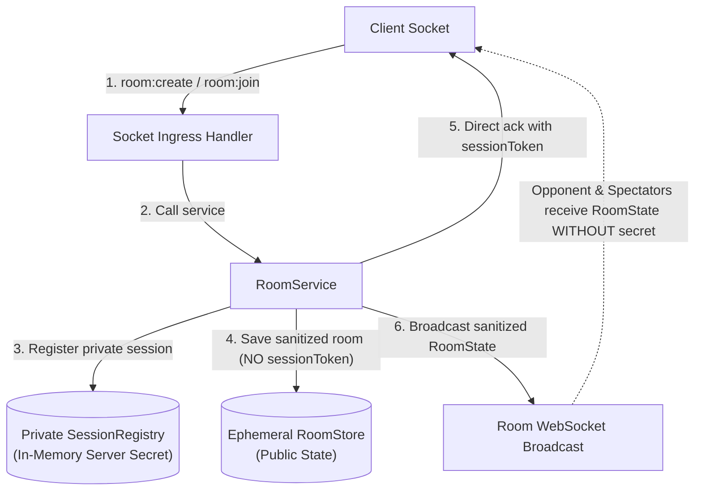
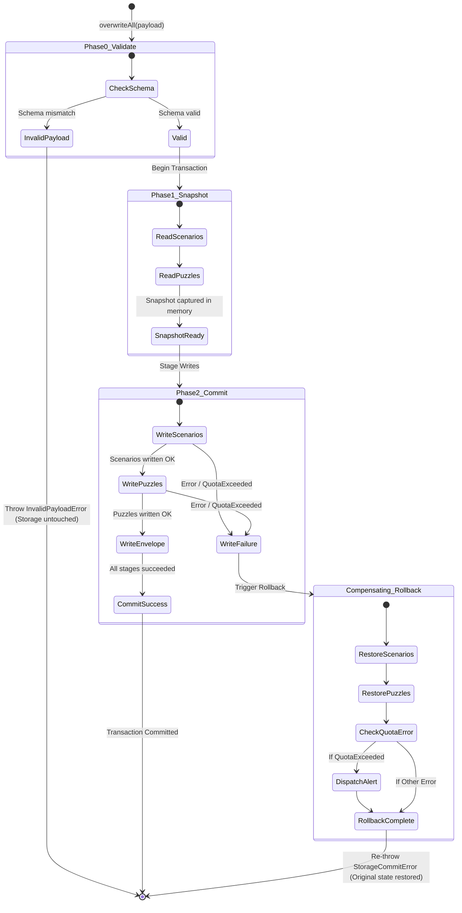

# Data Storage & Concurrency Contracts: Full Codebase Remediation
**Document Version:** 1.0.0 (FROZEN)
**Author:** Database Expert (`@database-expert`)
**Scope:** Server In-Memory Stores, Concurrency Controls, Session Security, Client Two-Phase Commit, and Deterministic Serialization
**Applicability:** Full Monorepo Remediation (`shared`, `apps/server`, `apps/client`, `tests`)
**Audit Findings Addressed:** CRIT-001, CRIT-003, CRIT-006, MAJ-006, MAJ-014, MAJ-024, ENH-008, ENH-009

---

## Executive Summary & Audit Mapping

This document specifies the authoritative, production-grade data storage, concurrency, and serialization contracts for remediating all data integrity, concurrency, and storage security findings identified in `docs/audits/review-findings-full-codebase-2026-09-07-0755.md`.

All technical leads, backend engineers, and frontend engineers implementing Scope Cards SC-1, SC-2, SC-3, and SC-4 MUST adhere strictly to these frozen contracts.

| Finding ID | Severity | Problem Summary | Remediation Contract Section |
| :--- | :--- | :--- | :--- |
| **CRIT-001** | CRITICAL | Secret `sessionToken` leaked in public `Player` & `RoomState` models | [Section 2: Server Private Session Registry Schema](#section-2-server-private-session-registry-schema-crit-001-maj-014-enh-008) |
| **CRIT-003** | CRITICAL | Permanent data loss on `LocalStorageUnifiedStore.overwriteAll` without rollback | [Section 3: Client Storage Two-Phase Commit Protocol](#section-3-client-storage-two-phase-commit-protocol-crit-003-enh-009) |
| **CRIT-006** | CRITICAL | Race conditions & lost updates in `InMemoryRoomStore` across interleaved moves/draws/resigns | [Section 1: Ephemeral Server Room Store Concurrency](#section-1-ephemeral-server-room-store-concurrency-crit-006) |
| **MAJ-006** | MAJOR | Direct unabstracted `localStorage` / `sessionStorage` crashes Safari private browsing | [Section 5: Browser Storage Abstraction](#section-5-browser-storage-abstraction-maj-006) |
| **MAJ-014** | MAJOR | Dangling disconnect grace timers leak on abandoned room pruning | [Section 2: Server Private Session Registry Schema (§2.5)](#25-lifecycle-disconnect-grace-timers--cleanup-coordination) |
| **MAJ-024** | MAJOR | Non-deterministic key serialization in JSON backup envelope causes false CRC-32 checksum failures | [Section 4: Canonical JSON Serialization & Checksum](#section-4-canonical-json-serialization--checksum-maj-024) |
| **ENH-008** | ENHANCEMENT | Global disconnect grace timers not cleared on graceful server shutdown | [Section 2: Server Private Session Registry Schema (§2.5)](#25-lifecycle-disconnect-grace-timers--cleanup-coordination) |
| **ENH-009** | ENHANCEMENT | Storage quota exceeded reactive user alert missing | [Section 3: Client Storage Two-Phase Commit Protocol (§3.4)](#34-storage-quota-detection--reactive-user-alert-contract) |

---

## Section 1: Ephemeral Server Room Store Concurrency (CRIT-006)

### 1.1 Problem Statement & Vulnerability Analysis
`InMemoryRoomStore` stores `RoomState` records in memory and returns deep clones on `findByCode(roomCode)`. However, the server processes incoming WebSocket events asynchronously across independent event-loop ticks.

When two operations occur concurrently for the same room—for example:
1. **Interleaved Moves & Resignations:** Player A submits a resignation (`handleResign`). In the same event loop window, Player B submits a move (`makeMove`). Both handlers read the room snapshot where `status = "playing"`. Player A's handler sets `status = "game_over"` and saves. Player B's move handler validates the chess engine move, updates `room.game`, and invokes `await store.save(room)`, blindly overwriting the room state and resetting `status = "playing"`, completely erasing the resignation.
2. **Interleaved Draw Offers & Moves:** Player A accepts a draw offer while Player B plays a move. The draw agreement is erased.
3. **Simultaneous Joins:** Two players attempt to claim the open guest slot in the same tick; both succeed locally and the last save wins, corrupting player assignments.

### 1.2 Dual-Layer Concurrency Model
To guarantee absolute linearizability and eliminate lost updates, `InMemoryRoomStore` enforces a **dual-layer concurrency architecture**:
1. **Layer 1 (Primary Execution Guard): Per-Room Async Lock Queue (`withLock` / `mutate`)**
   Serializes all mutating operations on a per-room basis. Each room code possesses a dedicated FIFO promise chain. Read-modify-write sequences are executed atomically within a lock critical section. Independent rooms execute concurrently without blocking one another.
2. **Layer 2 (Optimistic Concurrency Control): Monotonic CAS Versioning (`version: number`)**
   Provides defense-in-depth against direct `save()` calls or cross-subsystem race conditions. Every `RoomState` maintains a monotonic integer `version`. A mutation must supply the expected version; if `current.version !== expectedVersion`, the write is rejected with an `OptimisticLockConflictError`.

```mermaid
sequenceDiagram
    autonumber
    participant SocketA as Socket A (Resign)
    participant LockQueue as Room Async Lock Queue
    participant Store as InMemoryRoomStore
    participant SocketB as Socket B (Move)

    SocketA->>LockQueue: mutate("ABCD", fnResign)
    Note over LockQueue: Acquire lock for ABCD
    LockQueue->>Store: findByCode("ABCD") [v=3, status=playing]
    SocketB->>LockQueue: mutate("ABCD", fnMove)
    Note over LockQueue: Room ABCD locked; Socket B enqueued

    LockQueue->>Store: save(room) [v=4, status=game_over]
    Note over LockQueue: Release lock for ABCD

    Note over LockQueue: Dequeue Socket B
    LockQueue->>Store: findByCode("ABCD") [v=4, status=game_over]
    Note over SocketB: Mutator detects status == game_over
    LockQueue-->>SocketB: Reject: GameNotActiveError
```

### 1.3 Schema Definition: Versioned RoomState
The shared `RoomState` model in `@fun-chess/shared` is extended with a mandatory monotonic `version` property:

```typescript
export interface RoomState {
  readonly roomCode: string; // 4-letter uppercase code
  readonly version: number;  // Monotonically increasing sequence (starts at 1)
  status: RoomStatus;
  hostId: string;
  whitePlayer: Player | null;
  blackPlayer: Player | null;
  spectators: Player[];
  game: GameState;
  rematch: RematchState | null;
  drawOffer?: { offeredBy: string; offeredAt: number } | null;
  createdAt: number;
  lastActivityAt: number;
}
```

### 1.4 RoomStore Interface Specification
`apps/server/src/features/rooms/room.store.ts` must expose both query methods and atomic mutation primitives:

```typescript
import { RoomState } from "@fun-chess/shared";

/**
 * Mutation function callback executed inside the room's exclusive lock.
 * Receives the current deep-cloned RoomState and returns the updated RoomState plus an arbitrary result.
 */
export type RoomMutator<T> = (
  current: RoomState,
) => Promise<{ updatedRoom: RoomState; result: T }> | { updatedRoom: RoomState; result: T };

/**
 * Storage boundary abstraction for room persistence.
 * Adheres to Architectural Patterns Rule 1: I/O Isolation.
 */
export interface RoomStore {
  /**
   * Retrieves a deep-cloned snapshot of the room state.
   */
  findByCode(roomCode: string): Promise<RoomState | null>;

  /**
   * Finds room and player by socket ID.
   */
  findBySocketId(
    socketId: string,
  ): Promise<{ room: RoomState; playerId: string } | null>;

  /**
   * Atomically executes a mutator function within the room's exclusive lock.
   * Handles lock acquisition, state retrieval, optimistic version check, version increment, and persistence.
   *
   * @param roomCode - 4-letter uppercase room code
   * @param mutator - Pure mutation callback returning updated room and caller result
   * @returns The result returned by the mutator
   * @throws RoomNotFoundError if roomCode does not exist
   * @throws OptimisticLockConflictError if version precondition fails
   */
  mutate<T>(roomCode: string, mutator: RoomMutator<T>): Promise<T>;

  /**
   * Executes an arbitrary asynchronous callback within the room's exclusive lock.
   */
  withLock<T>(roomCode: string, action: () => Promise<T>): Promise<T>;

  /**
   * Saves a room state with CAS version validation.
   * If expectedVersion is provided, rejects if current.version !== expectedVersion.
   * Increments room.version by 1 on successful persist.
   */
  save(room: RoomState, expectedVersion?: number): Promise<void>;

  /**
   * Deletes a room from storage and clears its pending lock queue.
   */
  delete(roomCode: string): Promise<boolean>;

  /**
   * Lists all active rooms.
   */
  listActiveRooms(): Promise<RoomState[]>;

  /**
   * Returns current active room count.
   */
  count(): Promise<number>;

  /**
   * Clears all room entries and releases all pending lock chains (for shutdown and testing).
   */
  clear(): Promise<void>;
}
```

### 1.5 InMemoryRoomStore Reference Implementation Contract
`apps/server/src/features/rooms/in_memory_room.store.ts` must implement `RoomStore` with bounded memory management for lock queues:

```typescript
import { RoomState } from "@fun-chess/shared";
import { RoomStore, RoomMutator } from "./room.store.js";
import {
  RoomNotFoundError,
  OptimisticLockConflictError,
  LockTimeoutError,
} from "./room.errors.js";

interface LockEntry {
  tail: Promise<unknown>;
  waitersCount: number;
}

export class InMemoryRoomStore implements RoomStore {
  private readonly rooms = new Map<string, RoomState>();
  private readonly lockQueues = new Map<string, LockEntry>();
  private readonly LOCK_TIMEOUT_MS = 5000;

  public async findByCode(roomCode: string): Promise<RoomState | null> {
    const code = roomCode.toUpperCase();
    const room = this.rooms.get(code);
    return room ? structuredClone(room) : null;
  }

  public async findBySocketId(
    socketId: string,
  ): Promise<{ room: RoomState; playerId: string } | null> {
    for (const room of this.rooms.values()) {
      if (room.whitePlayer?.socketId === socketId) {
        return { room: structuredClone(room), playerId: room.whitePlayer.id };
      }
      if (room.blackPlayer?.socketId === socketId) {
        return { room: structuredClone(room), playerId: room.blackPlayer.id };
      }
      const spectator = room.spectators?.find((s) => s.socketId === socketId);
      if (spectator) {
        return { room: structuredClone(room), playerId: spectator.id };
      }
    }
    return null;
  }

  public async withLock<T>(
    roomCode: string,
    action: () => Promise<T>,
  ): Promise<T> {
    const code = roomCode.toUpperCase();
    let entry = this.lockQueues.get(code);

    if (!entry) {
      entry = { tail: Promise.resolve(), waitersCount: 0 };
      this.lockQueues.set(code, entry);
    }

    entry.waitersCount++;
    const prevTail = entry.tail;

    let releaseLock!: () => void;
    const currentLock = new Promise<void>((resolve) => {
      releaseLock = resolve;
    });

    entry.tail = prevTail.then(
      () => currentLock,
      () => currentLock,
    );

    try {
      // Await previous queued operation with timeout guard
      await Promise.race([
        prevTail,
        new Promise((_, reject) =>
          setTimeout(
            () => reject(new LockTimeoutError(code, this.LOCK_TIMEOUT_MS)),
            this.LOCK_TIMEOUT_MS,
          ),
        ),
      ]);

      return await action();
    } finally {
      releaseLock();
      const currentEntry = this.lockQueues.get(code);
      if (currentEntry) {
        currentEntry.waitersCount--;
        if (currentEntry.waitersCount <= 0) {
          // Prevent memory leak: purge drained queue
          this.lockQueues.delete(code);
        }
      }
    }
  }

  public async mutate<T>(
    roomCode: string,
    mutator: RoomMutator<T>,
  ): Promise<T> {
    return this.withLock(roomCode, async () => {
      const code = roomCode.toUpperCase();
      const existing = this.rooms.get(code);
      if (!existing) {
        throw new RoomNotFoundError(code);
      }

      const clone = structuredClone(existing);
      const expectedVersion = clone.version;

      const { updatedRoom, result } = await mutator(clone);

      if (updatedRoom.roomCode.toUpperCase() !== code) {
        throw new Error(
          `Mutation cannot alter roomCode: expected ${code}, received ${updatedRoom.roomCode}`,
        );
      }

      // Increment version and save
      const nextVersion = expectedVersion + 1;
      const roomToSave: RoomState = {
        ...structuredClone(updatedRoom),
        version: nextVersion,
        lastActivityAt: Date.now(),
      };

      this.rooms.set(code, roomToSave);
      return result;
    });
  }

  public async save(room: RoomState, expectedVersion?: number): Promise<void> {
    const code = room.roomCode.toUpperCase();
    const existing = this.rooms.get(code);

    if (existing && expectedVersion !== undefined) {
      if (existing.version !== expectedVersion) {
        throw new OptimisticLockConflictError(
          code,
          expectedVersion,
          existing.version,
        );
      }
    }

    const nextVersion = existing ? existing.version + 1 : (room.version || 1);
    const roomToSave: RoomState = {
      ...structuredClone(room),
      version: nextVersion,
      lastActivityAt: Date.now(),
    };

    this.rooms.set(code, roomToSave);
  }

  public async delete(roomCode: string): Promise<boolean> {
    const code = roomCode.toUpperCase();
    this.lockQueues.delete(code);
    return this.rooms.delete(code);
  }

  public async listActiveRooms(): Promise<RoomState[]> {
    return Array.from(this.rooms.values()).map((r) => structuredClone(r));
  }

  public async count(): Promise<number> {
    return this.rooms.size;
  }

  public async clear(): Promise<void> {
    this.lockQueues.clear();
    this.rooms.clear();
  }
}
```

### 1.6 State Machine Invariants
Any mutation performed via `mutate` must satisfy these state transition invariants:

| Initial State | Target State | Permitted Operation | Invariant Enforcement |
| :--- | :--- | :--- | :--- |
| `lobby` | `playing` | Player 2 joins | Must assign missing color; both `whitePlayer` and `blackPlayer` must be non-null. |
| `lobby` | `lobby` | Host updates preferences | Cannot begin chess moves. |
| `playing` | `playing` | Legal chess move made | Move turn must match player color; `moveCount` increases by 1; `drawOffer` reset. |
| `playing` | `game_over` | Resignation | Allowed at any turn by either active player. Room permanently locked from further moves. |
| `playing` | `game_over` | Draw agreed / Checkmate / Stalemate | Reason recorded in `GameOverPayload`. Terminal state. |
| `game_over` | `playing` | Rematch accepted by both | Board reset to standard initial FEN; players swap colors or retain preference. |
| `game_over` | `game_over` | Rematch requested/declined | Updates `rematch` state only. |
| `game_over` | `playing` | **FORBIDDEN (Illegal Move)** | Moves submitted after `game_over` MUST throw `GameNotActiveError`. |

---

## Section 2: Server Private Session Registry Schema (CRIT-001, MAJ-014, ENH-008)

### 2.1 Problem Statement & Vulnerability Analysis
CRIT-001 documented that the private `sessionToken`—the credential used to authenticate player reconnection via `room:reconnect`—was stored directly on the public `Player` interface inside `RoomState.whitePlayer` and `RoomState.blackPlayer`.

Because the full `RoomState` is broadcast over WebSockets to both players and all spectators on every room update, any participant could capture the opponent's `sessionToken` and issue a malicious `room:reconnect` payload, hijacking the opponent's active seat, resigning on their behalf, or making troll moves.

### 2.2 Architectural Separation: Public Views vs Private Credentials
To remediate this:
1. `sessionToken` is completely purged from `Player` and `RoomState` in `@fun-chess/shared`.
2. A server-internal `SessionRegistry` (`ISessionRegistry`) stores session credentials in an in-memory lookup table completely isolated from socket serialization.
3. `sessionToken` is emitted to a player **exactly once**: in the direct socket ack/callback response upon initial room creation or room joining.



### 2.3 Updated Shared Model: Public Player
In `shared/src/contracts/models.ts`:

```typescript
export interface Player {
  readonly id: string;         // UUIDv4
  readonly socketId: string;   // Current Socket connection ID
  readonly name: string;       // Display Nickname
  readonly avatar?: string;    // Emoji avatar (e.g. 🦁, 🚀)
  readonly color: PieceColor;  // 'w' | 'b'
  readonly isHost: boolean;    // Room creator flag
  readonly isConnected: boolean;
  readonly connectedAt: number;
  // NOTE: sessionToken is strictly EXCLUDED from Player and RoomState
}
```

### 2.4 Server SessionRecord Schema & SessionRegistry Interface
In `apps/server/src/features/rooms/session_registry.ts`:

```typescript
import { PieceColor } from "@fun-chess/shared";

/**
 * Server-private session record.
 * Never exposed over API, WebSocket broadcasts, or client payloads.
 */
export interface SessionRecord {
  readonly sessionToken: string; // Cryptographically secure token (UUIDv4)
  readonly playerId: string;     // Player UUID
  readonly roomCode: string;     // Normalized 4-letter uppercase code
  readonly color: PieceColor;    // Assigned player color
  readonly isHost: boolean;
  socketId: string;              // Current active socket connection ID
  readonly createdAt: number;    // Epoch ms
  lastSeenAt: number;            // Epoch ms
  expiresAt: number;             // Epoch ms
}

/**
 * Interface contract for server-side private session storage.
 * Adheres to Architectural Patterns Rule 1: I/O Isolation.
 */
export interface SessionRegistry {
  /**
   * Creates and registers a new private session token for a player in a room.
   */
  createSession(params: {
    playerId: string;
    roomCode: string;
    color: PieceColor;
    isHost: boolean;
    socketId: string;
    ttlMs?: number;
  }): Promise<SessionRecord>;

  /**
   * Validates a session token for reconnection.
   * Verifies that the token matches the expected roomCode and playerId, and has not expired.
   */
  validateSession(
    sessionToken: string,
    roomCode: string,
    playerId: string,
  ): Promise<SessionRecord | null>;

  /**
   * Updates the socket ID and lastSeenAt timestamp for an active session.
   */
  touchSession(sessionToken: string, newSocketId: string): Promise<void>;

  /**
   * Revokes and deletes a specific session token.
   */
  deleteSession(sessionToken: string): Promise<boolean>;

  /**
   * Deletes all sessions associated with a specific room code (cascade delete on room destruction).
   * Returns the count of deleted sessions.
   */
  deleteSessionsForRoom(roomCode: string): Promise<number>;

  /**
   * Purges all expired sessions past their expiresAt threshold.
   */
  cleanupExpiredSessions(): Promise<number>;

  /**
   * Completely clears all sessions (for graceful shutdown and test isolation).
   */
  clear(): Promise<void>;
}
```

### 2.5 Lifecycle, Disconnect Grace Timers & Cleanup Coordination
To resolve **MAJ-014** (leaking disconnect timers on abandoned room pruning) and **ENH-008** (global state timers leaking on graceful shutdown), the session and room lifecycle is orchestrated as follows:

```typescript
export class InMemorySessionRegistry implements SessionRegistry {
  // Primary session lookup: sessionToken -> SessionRecord
  private readonly sessions = new Map<string, SessionRecord>();

  // Secondary index for O(1) cascade deletion: roomCode -> Set<sessionToken>
  private readonly roomIndex = new Map<string, Set<string>>();

  // Secondary index: `${roomCode}:${playerId}` -> sessionToken
  private readonly playerIndex = new Map<string, string>();

  private readonly DEFAULT_TTL_MS = 2 * 60 * 60 * 1000; // 2 hours

  public async createSession(params: {
    playerId: string;
    roomCode: string;
    color: PieceColor;
    isHost: boolean;
    socketId: string;
    ttlMs?: number;
  }): Promise<SessionRecord> {
    const code = params.roomCode.toUpperCase();
    const sessionToken = crypto.randomUUID();
    const now = Date.now();
    const expiresAt = now + (params.ttlMs || this.DEFAULT_TTL_MS);

    const record: SessionRecord = {
      sessionToken,
      playerId: params.playerId,
      roomCode: code,
      color: params.color,
      isHost: params.isHost,
      socketId: params.socketId,
      createdAt: now,
      lastSeenAt: now,
      expiresAt,
    };

    this.sessions.set(sessionToken, record);

    // Index by room
    let roomTokens = this.roomIndex.get(code);
    if (!roomTokens) {
      roomTokens = new Set<string>();
      this.roomIndex.set(code, roomTokens);
    }
    roomTokens.add(sessionToken);

    // Index by room + player
    this.playerIndex.set(`${code}:${params.playerId}`, sessionToken);

    return structuredClone(record);
  }

  public async validateSession(
    sessionToken: string,
    roomCode: string,
    playerId: string,
  ): Promise<SessionRecord | null> {
    const record = this.sessions.get(sessionToken);
    if (!record) return null;

    if (
      record.roomCode !== roomCode.toUpperCase() ||
      record.playerId !== playerId
    ) {
      return null;
    }

    if (Date.now() > record.expiresAt) {
      await this.deleteSession(sessionToken);
      return null;
    }

    return structuredClone(record);
  }

  public async touchSession(
    sessionToken: string,
    newSocketId: string,
  ): Promise<void> {
    const record = this.sessions.get(sessionToken);
    if (record) {
      record.socketId = newSocketId;
      record.lastSeenAt = Date.now();
    }
  }

  public async deleteSession(sessionToken: string): Promise<boolean> {
    const record = this.sessions.get(sessionToken);
    if (!record) return false;

    this.sessions.delete(sessionToken);
    const roomTokens = this.roomIndex.get(record.roomCode);
    if (roomTokens) {
      roomTokens.delete(sessionToken);
      if (roomTokens.size === 0) {
        this.roomIndex.delete(record.roomCode);
      }
    }
    this.playerIndex.delete(`${record.roomCode}:${record.playerId}`);
    return true;
  }

  public async deleteSessionsForRoom(roomCode: string): Promise<number> {
    const code = roomCode.toUpperCase();
    const tokens = this.roomIndex.get(code);
    if (!tokens) return 0;

    let deleted = 0;
    for (const token of tokens) {
      const record = this.sessions.get(token);
      if (record) {
        this.playerIndex.delete(`${code}:${record.playerId}`);
        this.sessions.delete(token);
        deleted++;
      }
    }
    this.roomIndex.delete(code);
    return deleted;
  }

  public async cleanupExpiredSessions(): Promise<number> {
    const now = Date.now();
    let cleaned = 0;
    for (const [token, record] of this.sessions.entries()) {
      if (now > record.expiresAt) {
        await this.deleteSession(token);
        cleaned++;
      }
    }
    return cleaned;
  }

  public async clear(): Promise<void> {
    this.sessions.clear();
    this.roomIndex.clear();
    this.playerIndex.clear();
  }
}
```

#### Lifecycle Hooks & Shutdown Coordination
1. **Abandoned Room Pruning (`roomService.cleanupAbandonedRooms`) — MAJ-014:**
   When an inactive room is deleted:
   ```typescript
   // 1. Cancel any active disconnect grace timers for this room
   cancelAllDisconnectTimersForRoom(room.roomCode);
   // 2. Cascade delete all private sessions for this room
   await sessionRegistry.deleteSessionsForRoom(room.roomCode);
   // 3. Delete room from store
   await roomStore.delete(room.roomCode);
   ```
2. **Server Shutdown (`index.ts` graceful exit) — ENH-008:**
   ```typescript
   // On SIGINT / SIGTERM / process shutdown:
   clearAllDisconnectTimers();
   await sessionRegistry.clear();
   await roomStore.clear();
   ```

---

## Section 3: Client Storage Two-Phase Commit Protocol (CRIT-003, ENH-009)

### 3.1 Problem Statement & Vulnerability Analysis
CRIT-003 revealed that `LocalStorageUnifiedStore.overwriteAll` was deleting all existing user progress (`await this.scenarioStore.resetAllProgress()`) BEFORE attempting to validate and persist the incoming backup payload.

If any failure occurred midway (e.g. `QuotaExceededError` from large progress payloads, schema validation errors, or malformed data), the user's historical progress was wiped clean with zero recovery path. Furthermore, the import logic discarded `themeMastery`, `arcadeStats`, and `solvedPuzzles` from `PuzzleProgress`, silently corrupting user stats.

### 3.2 Two-Phase Commit (2PC) Protocol Specification
The unified storage overwrite follows a strict **Two-Phase Commit Protocol with Automated Rollback**:



### 3.3 Protocol Execution Stages
1. **Phase 0 (Pre-flight Schema Assertion):**
   Validate `payload` against `UnifiedProgressPayload` schema using Zod or `defaultSchemaValidator`. If assertion fails, reject immediately. No storage access or mutations occur.
2. **Phase 1 (Prepare / Pre-Write Snapshot):**
   Capture a deep-cloned in-memory snapshot of all existing scenario progress (`scenarioStore.getProgressMap()`) and puzzle progress (`puzzleStore.getProgress()`).
3. **Phase 2 (Staged Atomic Commit):**
   Perform writes sequentially:
   - Reset and populate scenario store with new scenario progress entries.
   - Overwrite puzzle store using `puzzleStore.restoreProgress(payload.puzzles)` (persisting all fields: `ratingProfile`, `themeMastery`, `arcadeStats`, `solvedPuzzles`).
   - If all writes succeed, commit is finalized.
4. **Compensating Rollback (Abort on Failure):**
   If any exception is thrown during Phase 2:
   - Catch the error.
   - Wipe partial writes and re-apply the snapshot captured in Phase 1:
     - `await scenarioStore.resetAllProgress();`
     - Re-save each scenario from `snapshot.scenarios`.
     - `await puzzleStore.restoreProgress(snapshot.puzzles);`
   - Detect whether the root cause was a `QuotaExceededError`. If so, dispatch a reactive quota alert (ENH-009).
   - Throw a typed `StorageCommitError` containing the original cause and confirmation that the rollback succeeded.

### 3.4 Storage Quota Detection & Reactive User Alert Contract (ENH-009)

#### Cross-Browser Quota Detection Predicate
```typescript
/**
 * Cross-browser detection for Web Storage quota exceeded errors.
 * Covers WebKit, Blink, Gecko, and legacy Safari Private Browsing DOM exceptions.
 */
export function isQuotaExceededError(err: unknown): boolean {
  if (!err) return false;
  if (err instanceof DOMException) {
    return (
      // Standard W3C code & name
      err.code === 22 ||
      err.name === "QuotaExceededError" ||
      // Firefox Gecko legacy
      err.code === 1014 ||
      err.name === "NS_ERROR_DOM_QUOTA_REACHED"
    );
  }
  // Generic error object inspection for non-standard runtimes
  if (typeof err === "object" && "name" in err) {
    const name = String((err as { name: unknown }).name);
    return name === "QuotaExceededError" || name === "NS_ERROR_DOM_QUOTA_REACHED";
  }
  return false;
}
```

#### Reactive Alert Event Contract
In `apps/client/src/platform/storage/storage_alert.ts`:

```typescript
export interface StorageQuotaAlertEvent {
  readonly type: "STORAGE_QUOTA_EXCEEDED";
  readonly store: "scenarios" | "puzzles" | "unified";
  readonly attemptedAction: "overwrite" | "save" | "import";
  readonly timestamp: number;
  readonly message: string;
  readonly suggestedRemediation: "EXPORT_BACKUP_AND_CLEAR";
}

export type StorageAlertListener = (event: StorageQuotaAlertEvent) => void;

class StorageAlertDispatcher {
  private readonly listeners = new Set<StorageAlertListener>();

  public subscribe(listener: StorageAlertListener): () => void {
    this.listeners.add(listener);
    return () => this.listeners.delete(listener);
  }

  public notify(event: StorageQuotaAlertEvent): void {
    for (const listener of this.listeners) {
      try {
        listener(event);
      } catch (err) {
        console.error("Error in storage alert listener:", err);
      }
    }
  }
}

export const storageAlertDispatcher = new StorageAlertDispatcher();
```

#### Vue Composable Integration Bridge
```typescript
// apps/client/src/features/portability/composables/useStorageQuotaAlert.ts
import { ref, onMounted, onUnmounted, readonly } from "vue";
import {
  storageAlertDispatcher,
  StorageQuotaAlertEvent,
} from "@/platform/storage/storage_alert";

export function useStorageQuotaAlert() {
  const isQuotaExceeded = ref(false);
  const currentAlert = ref<StorageQuotaAlertEvent | null>(null);

  let unsubscribe: (() => void) | null = null;

  onMounted(() => {
    unsubscribe = storageAlertDispatcher.subscribe((event) => {
      isQuotaExceeded.value = true;
      currentAlert.value = event;
    });
  });

  onUnmounted(() => {
    if (unsubscribe) unsubscribe();
  });

  function dismissAlert(): void {
    isQuotaExceeded.value = false;
    currentAlert.value = null;
  }

  return {
    isQuotaExceeded: readonly(isQuotaExceeded),
    currentAlert: readonly(currentAlert),
    dismissAlert,
  };
}
```

### 3.5 Extended PuzzleProgressStore Contract
To eliminate silent data dropping of `themeMastery`, `arcadeStats`, and `solvedPuzzles`, `shared/src/contracts/puzzle.ts` is updated:

```typescript
export interface PuzzleProgressStore {
  getProgress(): Promise<PuzzleProgress>;
  updateRating(newRatingState: AdaptiveRatingState): Promise<void>;
  recordPuzzleAttempt(
    puzzleId: string,
    theme: PuzzleTheme,
    result: PuzzleAttemptResult,
    stars: StarRating,
  ): Promise<PuzzleProgress>;
  saveArcadeResult(
    mode: "puzzle_rush" | "streak_survivor",
    score: number,
    streak: number,
  ): Promise<PuzzleProgress>;
  /**
   * Complete lossless restoration of full Puzzle Hub progress.
   * Atomically sets ratingProfile, themeMastery, arcadeStats, and solvedPuzzles.
   */
  restoreProgress(progress: PuzzleProgress): Promise<void>;
  resetAll(): Promise<void>;
}
```

### 3.6 LocalStorageUnifiedStore 2PC Implementation Contract
In `apps/client/src/features/portability/store/local_storage_unified.store.ts`:

```typescript
import {
  ProgressStorage,
  UnifiedProgressPayload,
  ScenarioProgressStore,
  PuzzleProgressStore,
  UNIFIED_PROGRESS_SCHEMA_VERSION,
  ScenarioProgressMap,
  PuzzleProgress,
} from "@fun-chess/shared";
import { isQuotaExceededError, storageAlertDispatcher } from "@/platform/storage/storage_alert";

export class StorageCommitError extends Error {
  public readonly rolledBack: boolean;
  constructor(message: string, options: { cause?: unknown; rolledBack: boolean }) {
    super(message, { cause: options.cause });
    this.name = "StorageCommitError";
    this.rolledBack = options.rolledBack;
  }
}

interface StorageSnapshot {
  scenarios: ScenarioProgressMap;
  puzzles: PuzzleProgress;
}

export class LocalStorageUnifiedStore implements ProgressStorage {
  constructor(
    private readonly scenarioStore: ScenarioProgressStore,
    private readonly puzzleStore: PuzzleProgressStore,
  ) {}

  public async getUnifiedProgress(): Promise<UnifiedProgressPayload> {
    const [scenarios, puzzles] = await Promise.all([
      this.scenarioStore.getProgressMap(),
      this.puzzleStore.getProgress(),
    ]);

    return {
      version: UNIFIED_PROGRESS_SCHEMA_VERSION,
      exportedAt: Date.now(),
      scenarios,
      puzzles,
    };
  }

  public async saveUnifiedProgress(payload: UnifiedProgressPayload): Promise<void> {
    return this.overwriteAll(payload);
  }

  /**
   * Two-phase commit overwrite with pre-write snapshot and rollback on write failure.
   */
  public async overwriteAll(payload: UnifiedProgressPayload): Promise<void> {
    // Phase 0: Validate payload structure
    if (!payload || typeof payload !== "object" || !payload.scenarios || !payload.puzzles) {
      throw new Error("Invalid payload: missing scenarios or puzzles data");
    }

    // Phase 1: Capture pre-write snapshot
    const snapshot: StorageSnapshot = {
      scenarios: structuredClone(await this.scenarioStore.getProgressMap()),
      puzzles: structuredClone(await this.puzzleStore.getProgress()),
    };

    // Phase 2: Staged write
    try {
      // 2a. Reset and write scenario records
      await this.scenarioStore.resetAllProgress();
      for (const [id, progress] of Object.entries(payload.scenarios)) {
        await this.scenarioStore.saveProgress(
          id,
          progress.starsEarned,
          progress.hintsUsedTotal,
        );
      }

      // 2b. Write full puzzle state (including themeMastery & arcadeStats)
      await this.puzzleStore.restoreProgress(payload.puzzles);
    } catch (writeErr) {
      // Compensating Rollback: restore from snapshot
      let rollbackSucceeded = false;
      try {
        await this.scenarioStore.resetAllProgress();
        for (const [id, progress] of Object.entries(snapshot.scenarios)) {
          await this.scenarioStore.saveProgress(
            id,
            progress.starsEarned,
            progress.hintsUsedTotal,
          );
        }
        await this.puzzleStore.restoreProgress(snapshot.puzzles);
        rollbackSucceeded = true;
      } catch (rollbackErr) {
        console.error("FATAL: Two-phase commit rollback failed:", rollbackErr);
        rollbackSucceeded = false;
      }

      // Check quota error & emit alert
      if (isQuotaExceededError(writeErr)) {
        storageAlertDispatcher.notify({
          type: "STORAGE_QUOTA_EXCEEDED",
          store: "unified",
          attemptedAction: "overwrite",
          timestamp: Date.now(),
          message: "Storage quota exceeded while importing progress. Local state was preserved.",
          suggestedRemediation: "EXPORT_BACKUP_AND_CLEAR",
        });
      }

      throw new StorageCommitError(
        rollbackSucceeded
          ? "Failed to save unified progress. Existing progress was safely restored."
          : "CRITICAL: Progress save failed and partial rollback failed.",
        { cause: writeErr, rolledBack: rollbackSucceeded },
      );
    }
  }
}
```

---

## Section 4: Canonical JSON Serialization & Checksum (MAJ-024)

### 4.1 Problem Statement: Non-Deterministic Checksum Mismatch
MAJ-024 identified that `DefaultProgressCodec.encodeToEnvelopeJson` and `DefaultProgressCodec.decodeFromEnvelopeJson` in `shared/src/utils/progress_codec.ts` compute CRC-32 checksums using standard `JSON.stringify(payload)`.

In JavaScript engines:
- Standard `JSON.stringify` serializes object keys in property insertion order.
- When an exported JSON file is imported on another browser or device, parsed with `JSON.parse()`, and serialized back to calculate the checksum, the stringified key sequence often differs (e.g. V8 vs WebKit property order or object restructuring during validation).
- Example: `{ "version": 1, "exportedAt": 100 }` vs `{ "exportedAt": 100, "version": 1 }`.
- Even though the data is semantically identical, the CRC-32 checksum produces completely different byte hashes. Legitimate user backup files are rejected with:
  `CRC-32 checksum mismatch: calculated A1B2C3D4 does not match expected E5F6A7B8`.

### 4.2 Canonical JSON Specification (RFC 8785 / JCS Subset)
Deterministic checksum calculation requires **Canonical JSON Stringification**:
1. **Lexicographical Key Sorting:** All object keys must be recursively sorted in ascending Unicode code point order (`Array.prototype.sort()`).
2. **Compact Separators:** Delimiters must be strictly `,` and `:` with zero surrounding whitespace.
3. **Deterministic Primitives:**
   - Numbers: standard IEEE-754 decimal format without trailing zeroes (native `Number.prototype.toString()`).
   - Strings: standard JSON string escaping (`\"`, `\\`, control chars `\u00XX`).
   - Booleans: `true` and `false`.
   - Null: `null`.
4. **Undefined Handling:** Object properties with `undefined` values are completely omitted. `undefined` in arrays is serialized as `null` (matching standard JSON semantics).
5. **Array Integrity:** Array elements preserve their existing order; nested objects within arrays are recursively canonicalized.

### 4.3 Reference Algorithm & Implementation Specification
In `shared/src/utils/canonical_json.ts`:

```typescript
/**
 * Serializes any JavaScript value to a deterministic, canonical JSON string
 * conforming to RFC 8785 (JSON Canonicalization Scheme).
 * Guarantees identical output string across all browser runtimes and key insertion orders.
 *
 * @param value - Arbitrary data to serialize
 * @returns Deterministic canonical JSON string
 */
export function canonicalJsonStringify(value: unknown): string {
  if (value === null || typeof value !== "object") {
    return JSON.stringify(value) ?? "null";
  }

  if (Array.isArray(value)) {
    const elements = value.map((item) =>
      item === undefined || typeof item === "symbol" || typeof item === "function"
        ? "null"
        : canonicalJsonStringify(item),
    );
    return `[${elements.join(",")}]`;
  }

  // Handle Date objects deterministically as ISO string
  if (value instanceof Date) {
    return JSON.stringify(value.toISOString());
  }

  // Object key sorting in lexicographical Unicode order
  const obj = value as Record<string, unknown>;
  const sortedKeys = Object.keys(obj).sort();

  const pairs: string[] = [];
  for (const key of sortedKeys) {
    const val = obj[key];
    // Skip undefined, functions, and symbols per JSON specification
    if (val === undefined || typeof val === "function" || typeof val === "symbol") {
      continue;
    }
    const serializedKey = JSON.stringify(key);
    const serializedVal = canonicalJsonStringify(val);
    pairs.push(`${serializedKey}:${serializedVal}`);
  }

  return `{${pairs.join(",")}}`;
}
```

### 4.4 DefaultProgressCodec Checksum Integration
In `shared/src/utils/progress_codec.ts`:

```typescript
import { canonicalJsonStringify } from "./canonical_json.js";
import { crc32Checksum } from "./checksum_crc32.js";
import {
  UnifiedProgressPayload,
  UnifiedProgressEnvelope,
  UNIFIED_PROGRESS_SCHEMA_VERSION,
} from "../types/progress_sync.js";

export class DefaultProgressCodec {
  public encodeToEnvelopeJson(payload: UnifiedProgressPayload): string {
    const sanitized = defaultSchemaValidator.assertValid(payload);

    // Canonical serialization guarantees deterministic CRC-32 regardless of key order
    const canonicalPayload = canonicalJsonStringify(sanitized);
    const checksum = crc32Checksum.toHex(crc32Checksum.calculate(canonicalPayload));

    const envelope: UnifiedProgressEnvelope = {
      magic: "FC_PROGRESS_V1",
      schemaVersion: UNIFIED_PROGRESS_SCHEMA_VERSION,
      exportedAt: new Date(sanitized.exportedAt || Date.now()).toISOString(),
      checksum,
      payload: sanitized,
    };

    // Envelope can be formatted with indentation for user readability
    return JSON.stringify(envelope, null, 2);
  }

  public decodeFromEnvelopeJson(jsonString: string): UnifiedProgressPayload {
    if (!jsonString || typeof jsonString !== "string") {
      throw new Error("Invalid envelope JSON: input must be a non-empty string");
    }

    let parsed: Partial<UnifiedProgressEnvelope>;
    try {
      parsed = JSON.parse(jsonString);
    } catch {
      throw new Error("Invalid envelope JSON: malformed JSON syntax");
    }

    if (!parsed || parsed.magic !== "FC_PROGRESS_V1") {
      throw new Error('Invalid envelope JSON: missing or incorrect "FC_PROGRESS_V1" magic identifier');
    }

    if (!parsed.payload || typeof parsed.payload !== "object") {
      throw new Error("Invalid envelope JSON: missing payload object");
    }

    // Verify CRC-32 against canonical representation
    const canonicalPayload = canonicalJsonStringify(parsed.payload);
    const calculatedChecksum = crc32Checksum.toHex(
      crc32Checksum.calculate(canonicalPayload),
    );

    if (
      !parsed.checksum ||
      calculatedChecksum.toUpperCase() !== parsed.checksum.trim().toUpperCase()
    ) {
      throw new Error(
        `CRC-32 checksum mismatch: calculated ${calculatedChecksum} does not match expected ${parsed.checksum}`,
      );
    }

    return defaultSchemaValidator.assertValid(parsed.payload);
  }
}
```

### 4.5 Test Vectors for Determinism Verification
To ensure zero regressions across environments, tests must assert:
1. **Key Permutation Invariance:**
   - Object A: `{ "b": 1, "a": 2 }`
   - Object B: `{ "a": 2, "b": 1 }`
   - Both produce canonical string: `{"a":2,"b":1}`
   - Both produce CRC-32: `crc32Checksum.calculate(canonicalJsonStringify(A)) === crc32Checksum.calculate(canonicalJsonStringify(B))`
2. **Deeply Nested Invariance:**
   - Object A: `{ "z": { "y": [1, 2], "x": true }, "a": null }`
   - Object B: `{ "a": null, "z": { "x": true, "y": [1, 2] } }`
   - Canonical string: `{"a":null,"z":{"x":true,"y":[1,2]}}`

---

## Section 5: Browser Storage Abstraction (MAJ-006)

### 5.1 Problem Statement: Unabstracted Browser Storage & Private Browsing Crashes
MAJ-006 documented that browser storage APIs (`window.localStorage` and `window.sessionStorage`) are accessed directly in multiple locations (`useSocket.ts:37`, `useLanDiscovery.ts:85`, and `App.vue:211`).

In restricted browser environments:
- **Safari Private Browsing Mode (iOS / macOS):** Any synchronous read or write to `localStorage` throws `DOMException: SecurityError: The operation is insecure.`
- **Restricted Iframe Contexts:** Embeds without storage permissions throw security exceptions.
- **`App.vue:211` Failure:** Top-level evaluation of `localStorage.getItem('fun_chess_player_avatar')` causes an unhandled exception during Vue application mount, presenting the user with a completely blank white screen.
- **Testing Impediment:** Direct browser globals violate Architectural Pattern Rule 1 (I/O Isolation) and prevent unit testing without monkey-patching `window`.

### 5.2 Storage Abstraction Contract: KeyValueStorage
In `apps/client/src/platform/storage/key_value_storage.ts`:

```typescript
/**
 * Storage boundary abstraction for key-value persistence.
 * Adheres to Architectural Patterns Rule 1: I/O Isolation.
 */
export interface KeyValueStorage {
  /**
   * Retrieves an item by key. Returns null if key does not exist or storage is inaccessible.
   */
  getItem(key: string): string | null;

  /**
   * Persists a key-value pair.
   * @throws StorageQuotaExceededError if device storage quota is exhausted
   */
  setItem(key: string, value: string): void;

  /**
   * Removes an item by key.
   */
  removeItem(key: string): void;

  /**
   * Clears all items in this storage instance.
   */
  clear(): void;

  /**
   * Returns the key at the specified index.
   */
  key(index: number): string | null;

  /**
   * Returns total number of stored entries.
   */
  readonly length: number;

  /**
   * Indicates whether the underlying storage mechanism is active and writable.
   */
  isAvailable(): boolean;

  /**
   * Safe getter that falls back to defaultValue if item is absent or storage throws.
   */
  safeGetItem<T = string>(key: string, defaultValue: T): string | T;

  /**
   * Safe setter that swallows non-fatal errors and returns success boolean.
   */
  safeSetItem(key: string, value: string): boolean;
}
```

### 5.3 Implementations: BrowserStorageAdapter & InMemoryStorageAdapter

#### BrowserStorageAdapter (Production Adapter)
```typescript
import { KeyValueStorage } from "./key_value_storage";
import { isQuotaExceededError, storageAlertDispatcher } from "./storage_alert";

export class BrowserStorageAdapter implements KeyValueStorage {
  private available = false;
  private readonly fallback = new Map<string, string>();

  constructor(
    private readonly storageType: "localStorage" | "sessionStorage" = "localStorage",
  ) {
    this.probeAvailability();
  }

  private probeAvailability(): void {
    if (typeof window === "undefined") {
      this.available = false;
      return;
    }
    try {
      const storage = window[this.storageType];
      if (!storage) {
        this.available = false;
        return;
      }
      const probeKey = `__fc_probe_${Date.now()}__`;
      storage.setItem(probeKey, "1");
      storage.removeItem(probeKey);
      this.available = true;
    } catch {
      // SecurityError (Safari private) or QuotaExceededError
      this.available = false;
    }
  }

  private get rawStorage(): Storage | null {
    if (!this.available || typeof window === "undefined") return null;
    try {
      return window[this.storageType];
    } catch {
      return null;
    }
  }

  public isAvailable(): boolean {
    return this.available;
  }

  public getItem(key: string): string | null {
    const storage = this.rawStorage;
    if (!storage) {
      return this.fallback.get(key) ?? null;
    }
    try {
      return storage.getItem(key);
    } catch {
      return this.fallback.get(key) ?? null;
    }
  }

  public setItem(key: string, value: string): void {
    const storage = this.rawStorage;
    if (!storage) {
      this.fallback.set(key, value);
      return;
    }
    try {
      storage.setItem(key, value);
      // Synchronize in-memory fallback
      this.fallback.set(key, value);
    } catch (err) {
      // Store in memory regardless to prevent state loss in active session
      this.fallback.set(key, value);

      if (isQuotaExceededError(err)) {
        storageAlertDispatcher.notify({
          type: "STORAGE_QUOTA_EXCEEDED",
          store: "unified",
          attemptedAction: "save",
          timestamp: Date.now(),
          message: "Storage quota exceeded. Temporary in-memory cache activated.",
          suggestedRemediation: "EXPORT_BACKUP_AND_CLEAR",
        });
        throw err;
      }
    }
  }

  public removeItem(key: string): void {
    this.fallback.delete(key);
    const storage = this.rawStorage;
    if (storage) {
      try {
        storage.removeItem(key);
      } catch {
        // Safe ignore
      }
    }
  }

  public clear(): void {
    this.fallback.clear();
    const storage = this.rawStorage;
    if (storage) {
      try {
        storage.clear();
      } catch {
        // Safe ignore
      }
    }
  }

  public key(index: number): string | null {
    const storage = this.rawStorage;
    if (storage) {
      try {
        return storage.key(index);
      } catch {
        // Fall back below
      }
    }
    return Array.from(this.fallback.keys())[index] ?? null;
  }

  public get length(): number {
    const storage = this.rawStorage;
    if (storage) {
      try {
        return storage.length;
      } catch {
        // Fall back below
      }
    }
    return this.fallback.size;
  }

  public safeGetItem<T = string>(key: string, defaultValue: T): string | T {
    const val = this.getItem(key);
    return val !== null ? val : defaultValue;
  }

  public safeSetItem(key: string, value: string): boolean {
    try {
      this.setItem(key, value);
      return true;
    } catch {
      return false;
    }
  }
}
```

#### InMemoryStorageAdapter (Test & SSR Adapter)
```typescript
import { KeyValueStorage } from "./key_value_storage";

export class InMemoryStorageAdapter implements KeyValueStorage {
  private readonly store = new Map<string, string>();

  public isAvailable(): boolean {
    return true;
  }

  public getItem(key: string): string | null {
    return this.store.get(key) ?? null;
  }

  public setItem(key: string, value: string): void {
    this.store.set(key, String(value));
  }

  public removeItem(key: string): void {
    this.store.delete(key);
  }

  public clear(): void {
    this.store.clear();
  }

  public key(index: number): string | null {
    return Array.from(this.store.keys())[index] ?? null;
  }

  public get length(): number {
    return this.store.size;
  }

  public safeGetItem<T = string>(key: string, defaultValue: T): string | T {
    const val = this.getItem(key);
    return val !== null ? val : defaultValue;
  }

  public safeSetItem(key: string, value: string): boolean {
    this.setItem(key, value);
    return true;
  }
}
```

### 5.4 Storage Factory & Singleton Accessors
In `apps/client/src/platform/storage/index.ts`:

```typescript
import { KeyValueStorage } from "./key_value_storage";
import { BrowserStorageAdapter } from "./browser_storage.adapter";
import { InMemoryStorageAdapter } from "./in_memory_storage.adapter";

export * from "./key_value_storage";
export * from "./browser_storage.adapter";
export * from "./in_memory_storage.adapter";
export * from "./storage_alert";

/**
 * Creates a safe KeyValueStorage instance.
 * Automatically falls back to in-memory storage in SSR or if browser storage throws.
 */
export function createSafeStorage(
  type: "localStorage" | "sessionStorage" = "localStorage",
): KeyValueStorage {
  if (typeof window === "undefined") {
    return new InMemoryStorageAdapter();
  }
  return new BrowserStorageAdapter(type);
}

export const safeLocalStorage = createSafeStorage("localStorage");
export const safeSessionStorage = createSafeStorage("sessionStorage");
```

### 5.5 Client Call Site Migration Map
All direct calls identified in MAJ-006 must be replaced with `safeLocalStorage` or `safeSessionStorage`:

| File Location | Existing Unabstracted Code | Remediated Code |
| :--- | :--- | :--- |
| `apps/client/src/App.vue:209-213` | `localStorage.getItem('fun_chess_player_avatar')` | `safeLocalStorage.safeGetItem('fun_chess_player_avatar', DEFAULT_PLAYER_AVATAR)` |
| `apps/client/src/composables/useSocket.ts:37` | `window.sessionStorage.getItem(SESSION_STORAGE_KEY)` | `safeSessionStorage.getItem(SESSION_STORAGE_KEY)` |
| `apps/client/src/composables/useSocket.ts:55` | `window.sessionStorage.setItem(...)` | `safeSessionStorage.safeSetItem(...)` |
| `apps/client/src/composables/useSocket.ts:62` | `window.sessionStorage.removeItem(...)` | `safeSessionStorage.removeItem(...)` |
| `apps/client/src/composables/useLanDiscovery.ts:85`| `localStorage.getItem(STORAGE_KEY)` | `safeLocalStorage.getItem(STORAGE_KEY)` |
| `apps/client/src/composables/useLanDiscovery.ts:110`| `localStorage.setItem(STORAGE_KEY, ip)` | `safeLocalStorage.setItem(STORAGE_KEY, ip)` |

---

## Section 6: Cross-Contract Error Taxonomy

All error classes thrown by the storage and concurrency layers are structured, strongly-typed, and adhere to Rule 1 of Error Handling Principles:

```typescript
// apps/server/src/features/rooms/room.errors.ts

export class RoomNotFoundError extends Error {
  public readonly code = "ROOM_NOT_FOUND";
  constructor(public readonly roomCode: string) {
    super(`Room not found: ${roomCode}`);
    this.name = "RoomNotFoundError";
  }
}

export class OptimisticLockConflictError extends Error {
  public readonly code = "OPTIMISTIC_LOCK_CONFLICT";
  constructor(
    public readonly roomCode: string,
    public readonly expectedVersion: number,
    public readonly currentVersion: number,
  ) {
    super(
      `Optimistic lock conflict for room ${roomCode}: expected version ${expectedVersion}, but found ${currentVersion}`,
    );
    this.name = "OptimisticLockConflictError";
  }
}

export class LockTimeoutError extends Error {
  public readonly code = "LOCK_TIMEOUT";
  constructor(
    public readonly roomCode: string,
    public readonly timeoutMs: number,
  ) {
    super(`Lock acquisition timed out for room ${roomCode} after ${timeoutMs}ms`);
    this.name = "LockTimeoutError";
  }
}

export class InvalidSessionError extends Error {
  public readonly code = "INVALID_SESSION_TOKEN";
  constructor(public readonly roomCode: string) {
    super(`Invalid or expired session token for room ${roomCode}`);
    this.name = "InvalidSessionError";
  }
}
```

---

## Section 7: Verification & Test Plan

To verify that all 8 audit findings are completely remediated with zero regressions, the following test suites must be implemented:

### 7.1 Server Concurrency & Race Condition Verification (CRIT-006)
- **File:** `apps/server/src/features/rooms/__tests__/room_store_concurrency.spec.ts`
- **Tests:**
  1. `Concurrent Move vs Resignation:` Concurrently dispatch a move and a resignation via `Promise.all([store.mutate(code, moveMutator), store.mutate(code, resignMutator)])`. Verify that the resignation transition to `game_over` is NEVER lost or overwritten.
  2. `Interleaved Moves (100 parallel mutations):` Dispatch 100 concurrent sequential move mutations for the same room. Verify that version increments monotonically from `1` to `101`, no plies are dropped, and no unhandled promise rejections occur.
  3. `Lock Queue Memory Eviction:` Dispatch operations for 50 distinct room codes. Verify `lockQueues.size === 0` after all operations resolve.

### 7.2 Private Session Registry Verification (CRIT-001, MAJ-014, ENH-008)
- **File:** `apps/server/src/features/rooms/__tests__/session_registry.spec.ts`
- **Tests:**
  1. `No Token Leakage in Broadcast:` Create room and join room. Inspect `RoomState` emitted across sockets. Assert `expect(JSON.stringify(roomState)).not.toContain(sessionToken)`.
  2. `Reconnect Authentication:` Assert `validateSession` succeeds with valid token, and rejects with invalid token, wrong room, or wrong player ID.
  3. `Abandoned Room Pruning Grace Timer Cleanup (MAJ-014):` Create disconnected player with active grace timer. Trigger `cleanupAbandonedRooms()`. Verify timer handle is cleared and does not fire subsequent ghost events.
  4. `Server Shutdown Cleanup (ENH-008):` Populate sessions and timers; invoke `clearAllDisconnectTimers()` and `sessionRegistry.clear()`. Assert all maps and timer handles are empty.

### 7.3 Client Two-Phase Commit & Quota Alert (CRIT-003, ENH-009)
- **File:** `apps/client/src/features/portability/store/__tests__/local_storage_unified_store.spec.ts`
- **Tests:**
  1. `Rollback on Quota Failure:` Mock `scenarioStore.saveProgress` to throw `new DOMException("QuotaExceeded", "QuotaExceededError")` on item 3. Run `overwriteAll(newProgress)`. Assert `StorageCommitError` thrown. Assert previous `getProgressMap()` is 100% intact.
  2. `Full Puzzle Hub Restoration:` Import payload with `themeMastery` and `arcadeStats`. Verify all puzzle properties are persisted via `puzzleStore.getProgress()`, eliminating silent property truncation.
  3. `Storage Quota Alert Dispatch:` Verify `storageAlertDispatcher` receives `STORAGE_QUOTA_EXCEEDED` event when quota error is thrown.

### 7.4 Canonical JSON & Checksum Determinism (MAJ-024)
- **File:** `shared/src/utils/__tests__/canonical_json.spec.ts`
- **Tests:**
  1. `Permutation Test:` Assert `canonicalJsonStringify({ b: 1, a: 2 }) === '{"a":2,"b":1}'`.
  2. `Cross-Platform Determinism:` Construct payload with 5 levels of nesting, arrays, dates, and unordered keys. Assert CRC-32 checksum matches precomputed test vector.
  3. `Codec Import Compatibility:` Export envelope, mutate key order of parsed JSON payload, re-verify with `decodeFromEnvelopeJson`. Assert verification succeeds without checksum mismatch error.

### 7.5 Browser Storage Abstraction & Safari Private Browsing (MAJ-006)
- **File:** `apps/client/src/platform/storage/__tests__/browser_storage_adapter.spec.ts`
- **Tests:**
  1. `Safari Private Mode Simulation:` Mock `window.localStorage` to throw `DOMException("SecurityError", "SecurityError")`. Initialize `BrowserStorageAdapter`. Assert no uncaught exception thrown during initialization.
  2. `Seamless Memory Fallback:` Perform `setItem` and `getItem` under simulated private mode. Verify read-your-writes consistency in volatile memory cache.
  3. `safeLocalStorage Helper:` Assert `safeLocalStorage.safeGetItem("missing", "default") === "default"`. Verify `App.vue` mounting initialization never crashes.
