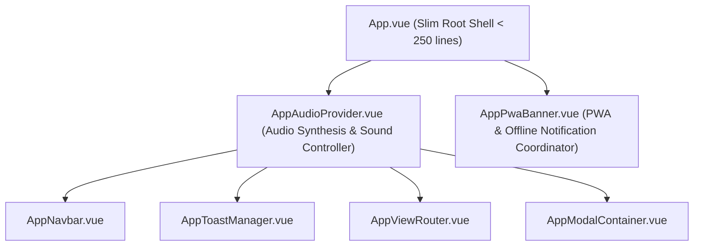

# Fun Chess — Design System Tokens & Component Interaction Specification

**Document ID**: `DESIGN-UX-002` (Monorepo Remediation Edition)  
**Phase**: DESIGN (Frozen Architecture & Interaction Contract)  
**Author**: UX Craftsman (`@ux-craftsman`)  
**Consumers**: Frontend Builders (`@tech-lead[client-platform]`, `@tech-lead[client-features]`, `@frontend-engineer`), QA & Red Team (`@reviewer`, `@red-team-lead`)  
**Target Scope Cards**: `SC-5` (`@tech-lead[client-platform]`), `SC-6` (`@tech-lead[client-features]`)  
**Audit Findings Addressed**: `[MAJ-036]`, `[MIN-019]`, `[MAJ-017]`, `[MIN-008]`, `[ENH-002]`, `[MAJ-016]`, `[MAJ-025]`  

---

## 1. Executive Summary & Design System Foundations

Fun Chess delivers a responsive, delightful chess experience designed for young players, families, and classroom learners. The user experience balances **tactile physical game excitement**, **immediate cognitive feedback**, and **robust defensive usability**.

During the Tier 3 monorepo audit remediation, significant architectural refactorings are planned for `apps/client/`:
- Decomposing the monolithic 712-line `App.vue` god-component (`MAJ-036`).
- Standardizing keyboard navigation and focus management across 6+ UI lists and mode selectors (`MIN-019`).
- Decoupling hardware/DOM I/O in modals to use abstracted services and adding robust error handling and clipboard feedback (`MAJ-017`, `MIN-008`, `ENH-002`).

This document establishes the **frozen design contract** to prevent visual, interactive, or accessibility regressions during these refactorings.

### 1.1 Core Experience Pillars
1. **Playful Tactility**: Every interactive button, mode tab, and game card feels physical, springy, and satisfying with tactile 3D bevels and pressable `:active` feedback.
2. **Instant Reassurance & Never-Stuck UX**: When network connections blip, QR generation fails, or save imports encounter errors, the UI never traps the user in infinite loaders or silent failures. It explains what happened in child-friendly language and provides prominent, one-tap recovery paths.
3. **Zero-CLS Layout Stability**: Layout dimensions, offline pills, PWA banners, and modal containers reserve operational bounding boxes to eliminate Cumulative Layout Shift during asynchronous hydration and network changes.
4. **WCAG 2.1 Level AA Accessibility**: High-contrast typography ($\ge 4.5:1$ text, $\ge 3:1$ graphical elements), $44 \times 44\text{px}$ minimum touch targets, full keyboard roving tabindex navigation, modal focus trapping, and screen-reader polite live announcements.

### 1.2 Frozen Contract Status
This specification is a **frozen design contract**. Frontend builders must translate the exact CSS custom properties, prop names, injection tokens, and kebab-case event names documented here into code. No ad-hoc camelCase aliases, hardcoded hex colors, or bypassed abstractions that deviate from this document may be introduced.

---

## 2. Complete Design System Tokens & Regression Protection Catalog

All styling in `apps/client/` is governed by CSS custom properties defined in `apps/client/src/assets/design-tokens.css`. Frontend builders refactoring components must consume these tokens exclusively.

### 2.1 Color Palette & Semantic Tokens

#### 2.1.1 Brand & Semantic Primitives (Light & Dark Themes)

| Token Name | Light Value (Hex / HSL) | Dark Value (Hex / HSL) | WCAG AA Ratio | Semantic Purpose |
|---|---|---|---|---|
| `--color-primary` | `#6c5ce7` / `hsl(255 85% 60%)` | `#8270f5` / `hsl(255 85% 68%)` | $\ge 4.6:1$ | Brand primary, hero action buttons, player turn badge |
| `--color-primary-hover` | `hsl(255 85% 54%)` | `hsl(255 85% 74%)` | $\ge 4.5:1$ | Primary button hover state |
| `--color-primary-active`| `hsl(255 85% 48%)` | `hsl(255 85% 62%)` | $\ge 4.5:1$ | Primary button depressed/active state |
| `--color-primary-bevel` | `hsl(255 85% 42%)` | `hsl(255 85% 32%)` | Graphical | 3D tactile button bottom shadow bevel |
| `--color-primary-subtle`| `hsl(255 85% 60% / 0.14)`| `hsl(255 85% 60% / 0.22)`| N/A | Active selection wash, tint containers |
| `--color-accent` | `#ffb300` / `hsl(42 100% 52%)` | `#ffc107` / `hsl(45 100% 51%)` | $\ge 4.5:1$ (on dark) | Sunshine Gold: Stars, badges, warning highlights |
| `--color-accent-hover` | `hsl(42 100% 46%)` | `hsl(45 100% 45%)` | Graphical | Accent button hover state |
| `--color-accent-active` | `hsl(42 100% 40%)` | `hsl(45 100% 39%)` | Graphical | Accent button active depressed state |
| `--color-accent-bevel` | `hsl(42 95% 36%)` | `hsl(45 90% 30%)` | Graphical | 3D tactile accent button shadow bevel |
| `--color-accent-subtle` | `hsl(42 100% 52% / 0.16)`| `hsl(45 100% 51% / 0.24)`| N/A | Gold highlight badge background |
| `--color-success` | `#22c55e` / `hsl(145 68% 48%)` | `#34d399` / `hsl(156 72% 52%)` | $\ge 4.5:1$ | Emerald Mint: Accept buttons, smart merge, victory, legal moves |
| `--color-success-hover` | `hsl(145 68% 42%)` | `hsl(156 72% 58%)` | Graphical | Success button hover state |
| `--color-success-active`| `hsl(145 68% 36%)` | `hsl(156 72% 46%)` | Graphical | Success button active depressed state |
| `--color-success-bevel` | `hsl(145 68% 34%)` | `hsl(156 70% 24%)` | Graphical | 3D tactile success button bottom bevel |
| `--color-success-subtle`| `hsl(145 68% 48% / 0.16)`| `hsl(156 72% 52% / 0.22)`| N/A | Valid move indicator halo, win background |
| `--color-danger` | `#dc2626` / `hsl(354 88% 48%)` | `#ef4444` / `hsl(0 84% 60%)` | $\ge 4.8:1$ | Coral Crimson: Errors, check warnings, resign actions |
| `--color-danger-hover` | `hsl(354 88% 42%)` | `hsl(0 84% 66%)` | Graphical | Danger button hover state |
| `--color-danger-active` | `hsl(354 88% 36%)` | `hsl(0 84% 54%)` | Graphical | Danger button active state |
| `--color-danger-bevel` | `hsl(354 88% 40%)` | `hsl(0 80% 28%)` | Graphical | 3D tactile danger button bottom bevel |
| `--color-danger-subtle` | `hsl(354 88% 48% / 0.16)`| `hsl(0 84% 60% / 0.24)` | N/A | Subdued danger hover, soft error container |
| `--color-info` | `#0ea5e9` / `hsl(198 93% 54%)` | `#38bdf8` / `hsl(199 89% 60%)` | $\ge 4.5:1$ | Sky Cyan: Info badges, spectator, LAN discovery status |

#### 2.1.2 Backgrounds, Surfaces & Elevation Overlays

| Token Name | Light Value | Dark Value | Purpose / Usage |
|---|---|---|---|
| `--bg-app` | `#f1f4f9` (`hsl(220 28% 96%)`) | `#111524` (`hsl(226 30% 10%)`) | Viewport page background |
| `--bg-surface` | `#ffffff` (`hsl(0 0% 100%)`) | `#1e2438` (`hsl(225 24% 16%)`) | Modal body, card containers, dropdowns |
| `--bg-surface-raised`| `#edf1f7` (`hsl(0 0% 97%)`) | `#272f48` (`hsl(225 22% 22%)`) | Modal footer, nested sub-cards, button bars |
| `--bg-surface-glass` | `rgba(255, 255, 255, 0.88)` | `rgba(30, 36, 56, 0.88)` | Frosted glass HUD, floating pills, banners |
| `--bg-overlay` | `rgba(15, 23, 42, 0.65)` | `rgba(5, 8, 16, 0.80)` | Modal backdrop blur overlay (`backdrop-filter: blur(8px)`) |

#### 2.1.3 Semantic Typography & Text Colors

| Token Name | Light Value | Dark Value | Contrast Ratio | Usage |
|---|---|---|---|---|
| `--text-main` | `#0f172a` (`hsl(222 47% 11%)`) | `#f1f3f9` (`hsl(220 20% 96%)`) | $\ge 14:1$ | Primary titles, body text, strong labels |
| `--text-muted` | `#596780` (`hsl(222 16% 42%)`) | `#9ba8c0` (`hsl(220 14% 68%)`) | $\ge 4.7:1$ | Subtitles, secondary descriptions, timestamps |
| `--text-faint` | `#64748b` (`hsl(222 16% 47%)`) | `#8593aa` (`hsl(220 14% 60%)`) | $\ge 4.5:1$ | Coordinate markers, input placeholders |
| `--text-inverse` | `#ffffff` | `#0f172a` | $\ge 14:1$ | Inverted pill labels, tooltips |
| `--text-on-primary` | `#ffffff` | `#ffffff` | $\ge 4.6:1$ | Text on primary violet buttons |
| `--text-on-accent` | `#1e1b4b` | `#1e1b4b` | $\ge 8.2:1$ | Dark navy text on sunshine gold |
| `--text-on-danger` | `#ffffff` | `#ffffff` | $\ge 4.8:1$ | Text on danger crimson buttons |
| `--text-on-success`| `#0f172a` | `#0f172a` | $\ge 8.5:1$ | Dark slate text on emerald green |

#### 2.1.4 Status, Soft Error & Reassurance Containers

| Token Name | Light Value | Dark Value | Usage |
|---|---|---|---|
| `--status-offline` | `#f59e0b` (`hsl(38 92% 50%)`) | `#f59e0b` | Warm amber disconnect indicator |
| `--status-offline-bg`| `rgba(245, 158, 11, 0.14)` | `rgba(245, 158, 11, 0.16)` | Offline badge and banner background |
| `--status-offline-border` | `#f59e0b` | `#f59e0b` | Offline badge border |
| `--status-offline-text`| `#78350f` ($\ge 6.1:1$) | `#fef3c7` ($\ge 8.5:1$) | Offline alert text |
| `--status-online` | `#10b981` | `#34d399` | Online active beacon dot |
| `--soft-error-bg` | `hsl(350 90% 96%)` (`#fff1f2`) | `hsl(350 40% 18%)` | QR canvas error card, file import error box |
| `--soft-error-border`| `hsl(350 80% 75%)` (`#fecdd3`) | `hsl(350 50% 35%)` | Soft error container border |
| `--soft-error-text` | `hsl(350 75% 35%)` (`#9f1239`) | `hsl(350 85% 90%)` | High-contrast error message copy ($\ge 5.2:1$) |

#### 2.1.5 Chessboard & Game Piece Immunity (Forced Light Mode)
> [!IMPORTANT]
> The chessboard, pieces, coordinate markings, and capture trays MUST remain visually immune to mobile browser dark mode heuristics (e.g., Samsung Internet, Chrome dark algorithm) and OS high-contrast auto-inversion:
> ```css
> .chess-board-container,
> .chess-board-grid,
> .chess-square,
> .chess-piece-wrapper,
> .chess-piece-svg,
> .captured-tray,
> .captured-piece-item,
> .promotion-card,
> .piece-icon-wrapper {
>   color-scheme: only light !important;
>   forced-color-adjust: none !important;
> }
> ```

---

### 2.2 Typography Scale & Text Styling System

Fun Chess uses two Google Fonts typefaces:
- **Fredoka**: Rounded, joyful display font for headings, modal titles, scoreboards, and mode tabs.
- **Nunito**: Highly readable geometric sans-serif for instructions, body text, form controls, and dialog messages.
- **ui-monospace**: Tabular numbers for clocks, coordinates, and 4-letter room codes.

```css
:root {
  --font-display: 'Fredoka', -apple-system, BlinkMacSystemFont, 'Segoe UI', system-ui, sans-serif;
  --font-body:    'Nunito', -apple-system, BlinkMacSystemFont, 'Segoe UI', Roboto, sans-serif;
  --font-mono:    ui-monospace, 'Cascadia Code', Menlo, Monaco, Consolas, monospace;
}
```

#### 2.2.1 Fluid Typography Scale

| Token Name | Clamp Formula | Viewport Size Range | Weight | Line Height | Usage |
|---|---|---|---|---|---|
| `--text-hero` | `clamp(2.40rem, 1.80rem + 2.8vw, 3.40rem)` | 38px $\to$ 54px | Bold (700) | 1.15 | Hero titles, victory fanfare |
| `--text-4xl` | `clamp(1.90rem, 1.50rem + 1.9vw, 2.60rem)` | 30px $\to$ 42px | Bold (700) | 1.15 | Page title (`h1`), Lobby title |
| `--text-3xl` | `clamp(1.50rem, 1.25rem + 1.4vw, 2.10rem)` | 24px $\to$ 34px | Bold (700) | 1.25 | Section headers (`h2`) |
| `--text-2xl` | `clamp(1.30rem, 1.10rem + 0.9vw, 1.65rem)` | 21px $\to$ 26px | Bold (700) | 1.30 | Modal dialog titles (`h3`), Card titles |
| `--text-xl` | `clamp(1.15rem, 1.00rem + 0.6vw, 1.35rem)` | 18px $\to$ 22px | Bold (700) | 1.30 | Sub-modals, prominent badges |
| `--text-lg` | `clamp(1.05rem, 0.95rem + 0.4vw, 1.20rem)` | 17px $\to$ 19px | Semibold (600) | 1.40 | Large button labels, HUD score display |
| `--text-base` | `clamp(0.95rem, 0.90rem + 0.2vw, 1.05rem)` | 15px $\to$ 17px | Semibold (600) | 1.50 | Default body copy, modal descriptions |
| `--text-sm` | `clamp(0.82rem, 0.78rem + 0.2vw, 0.92rem)` | 13px $\to$ 15px | Medium (500) | 1.40 | Small buttons, helper text, banner pills |
| `--text-xs` | `clamp(0.70rem, 0.67rem + 0.1vw, 0.78rem)` | 11px $\to$ 12.5px | Medium (500) | 1.30 | Coordinates, micro-tooltips, metadata |
| `--text-room-code`| `clamp(2.20rem, 1.80rem + 2.0vw, 3.00rem)` | 35px $\to$ 48px | Bold (700) | 1.00 | 4-letter LAN/Online Room Code chip |

#### 2.2.2 Typographic Orphan Prevention
- Headings (`h1`-`h6`, `.modal-title`, `.sync-modal-title`): `text-wrap: balance;`
- Paragraphs (`p`, `.modal-desc`, `.sync-modal-subtitle`): `text-wrap: pretty;`

---

### 2.3 Spacing, Touch Target & Layout System

Spacing adheres to a strict **4px geometric base grid**:

```css
:root {
  --space-0-5: 2px;
  --space-1:   4px;
  --space-1-5: 6px;
  --space-2:   8px;
  --space-2-5: 10px;
  --space-3:   12px;
  --space-4:   16px;   /* Standard container padding */
  --space-5:   20px;
  --space-6:   24px;   /* Modal header / body padding */
  --space-8:   32px;   /* Viewport gutter */
  --space-10:  40px;
  --space-12:  48px;
  --space-16:  64px;
}
```

#### Touch Target Accessibility Standard (WCAG 2.5.5 / Level AA)
- **Minimum Tap Target**: `--touch-target-min: 44px` (All buttons, links, icons, dismiss triggers, tab triggers).
- **Tactile Button Height**: `--touch-target-button: 52px` (Primary dialog actions, lobby game modes).
- **Chessboard Square Tap Area**: `--touch-target-square: 48px` minimum on all mobile viewports.

---

### 2.4 Border Radius, Shadows & Tactile 3D Buttons

#### 2.4.1 Border Radius System
```css
:root {
  --radius-xs:   4px;    /* Badges, coordinate markers */
  --radius-sm:   8px;    /* Small trays, pills */
  --radius-md:   12px;   /* Input fields, banners, buttons */
  --radius-lg:   16px;   /* Primary tactile buttons, inner cards */
  --radius-xl:   22px;   /* Lobby mode switcher, conflict cards */
  --radius-2xl:  30px;   /* Modal dialog container */
  --radius-pill: 9999px; /* Status pills, mode tabs, close buttons */

  --radius-modal: var(--radius-2xl);
  --radius-btn:   var(--radius-lg);
}
```

#### 2.4.2 Tactile 3D Pushable Buttons
Buttons depress downward physically on `:active` with an optical $4\text{px}$ travel distance:
- **Default state**: `box-shadow: 0 5px 0 var(--color-*-bevel), 0 8px 15px rgba(...); transform: translateY(0);`
- **Hover state**: `transform: translateY(-2px); box-shadow: 0 7px 0 var(--color-*-bevel), 0 10px 20px rgba(...);`
- **Active state**: `transform: translateY(4px) scale(0.98); box-shadow: 0 1px 0 var(--color-*-bevel), 0 2px 5px rgba(...);`

---

### 2.5 Motion, Timing & Micro-Interaction Animation Specifications

```css
:root {
  --duration-instant: 70ms;
  --duration-fast:    140ms;
  --duration-normal:  240ms;
  --duration-spring:  360ms;
  --duration-pulse:   1400ms;

  --ease-spring:      cubic-bezier(0.175, 0.885, 0.32, 1.275);
  --ease-out-back:    cubic-bezier(0.34, 1.56, 0.64, 1);
  --ease-standard:    cubic-bezier(0.2, 0, 0, 1);
}
```

#### Micro-Interaction Keyframes
1. `float-pill-in`: OfflineIndicator entry animation (`translateY(-24px) scale(0.92) opacity: 0` $\to$ `translateY(0) scale(1) opacity: 1` over `360ms var(--ease-spring)`).
2. `banner-slide`: PwaInstallBanner entry animation (`translate(-50%, 40px) scale(0.92)` $\to$ `translate(-50%, 0) scale(1)` over `300ms var(--ease-spring)`).
3. `modal-pop-in`: Modal card dialog entrance (`scale(0.90) translateY(20px)` $\to$ `scale(1) translateY(0)` over `360ms var(--ease-spring)`).
4. `shake-soft`: Error alert feedback (`translateX(-5px)` $\to$ `translateX(5px)` oscillation over `200ms`).
5. `copy-bounce`: Clipboard success icon pop (`scale(0.85)` $\to$ `scale(1.15)` $\to$ `scale(1)` over `240ms var(--ease-spring)`).

#### Reduced Motion Mandate
```css
@media (prefers-reduced-motion: reduce) {
  *, *::before, *::after {
    animation-duration: 0.01ms !important;
    animation-iteration-count: 1 !important;
    transition-duration: 0.01ms !important;
    scroll-behavior: auto !important;
  }
}
```

---

### 2.6 Z-Index Stacking Hierarchy (Zero-CLS Architecture)

| Z-Index Token | Numeric Value | Layer Component |
|---|---|---|
| `--z-base` | `1` | Chessboard tiles, page background |
| `--z-board-piece` | `5` | Chess pieces, drag layer |
| `--z-board-indicator`| `8` | Valid move dots, check warning halos |
| `--z-overlay-toast` | `10` | Non-blocking toasts |
| `--z-overlay-alert` | `30` | Draw offer banner, disconnect warning |
| `--z-floating-indicator`| `40`| Floating offline status pill (`OfflineIndicator`) |
| `--z-pwa-banner` | `45` | PWA installation banner (`PwaInstallBanner`) |
| `--z-modal-backdrop`| `50` | Modal backdrop blur overlay |
| `--z-modal-card` | `60` | Modal dialog card container |
| `--z-global-notification`| `100` | Skip link, critical system toasts |

---

## 3. Component Structural & Visual Decomposition of `App.vue` (MAJ-036)

### 3.1 Problem Diagnosis & Single Responsibility Audit
`apps/client/src/App.vue` is currently a **712-line monolithic god-component** violating Vue idioms and Single Responsibility:
1. **Audio Synthesis & Event Coupling**: Manages Web Audio API audio synthesis, volume/mute state, and attaches socket audio listeners directly inside `App.vue` lifecycle hooks (`onMounted`, `onUnmounted`).
2. **PWA & Network Infrastructure Clutter**: Manages offline status, install prompt lifecycle, install banners, and snooze state directly within the root application shell.
3. **Excessive Prop Drilling**: Passes 30+ props and binds 20+ event handlers into `AppViewRouter` and `AppModalContainer`.

### 3.2 Target Decomposition Architecture



Frontend builders refactor `App.vue` into two dedicated components:
1. `AppAudioProvider.vue`: Owns audio synthesizer lifecycle, mute/volume state, audio persistence, and game event triggers. Provides reactive audio controls to child components via Vue `provide` / `inject`.
2. `AppPwaBanner.vue`: Coordinates the floating offline reassurance pill and bottom PWA installation banner, managing installation prompts and 7-day snooze rules.

---

### 3.3 `AppAudioProvider.vue` Specification

**File Target**: `apps/client/src/components/layout/AppAudioProvider.vue`  
**Responsibility**: Single owner of sound synthesis, audio mute persistence, and reactive game domain audio triggers.

#### 3.3.1 Component Architecture & DI Injection
`AppAudioProvider.vue` provides the `AudioContext` to the component tree via Vue's `provide`:

```typescript
export interface AudioContextValue {
  isMuted: Ref<boolean>;
  toggleMute: () => boolean;
  setMuted: (muted: boolean) => void;
  playMove: () => void;
  playCapture: () => void;
  playCheck: () => void;
  playVictory: () => void;
  playDraw: () => void;
  playStart: () => void;
  playError: () => void;
  playStarEarned: () => void;
  playClick: () => void;
}

export const AUDIO_CONTEXT_KEY: InjectionKey<AudioContextValue> = Symbol('AudioContext');
```

Child components (such as `AppNavbar` and game views) consume audio via `inject(AUDIO_CONTEXT_KEY)` or the existing `useAudio()` composable without needing `App.vue` to drill props.

#### 3.3.2 Props & Emits Contract
```typescript
interface AppAudioProviderProps {
  socketApi?: {
    onOpponentMove?: (cb: (data: any) => void) => () => void;
    onGameCheck?: (cb: () => void) => () => void;
    onGameOver?: (cb: (payload: any) => void) => () => void;
  };
}
```

#### 3.3.3 Template Structure
`AppAudioProvider.vue` is a **zero-DOM layout wrapper**:
```html
<template>
  <slot :is-muted="isMuted" :toggle-mute="toggleMute" />
</template>
```
It renders no extra `<div>` or wrapper element, guaranteeing **0 layout or styling regression**.

#### 3.3.4 Audio Event Lifecycle
- **Context Auto-Resume**: The Web Audio API requires a user gesture. On first click anywhere in the window, `AppAudioProvider` calls `audioSynthesizer.resumeContext()`.
- **Event Attachment**: Attaches socket listeners via `attachGameEventListeners(props.socketApi)` on mount and cleans them up on unmount.
- **Persistence**: Automatically reads and writes `STORAGE_KEYS.AUDIO_MUTED` via safe local storage.

---

### 3.4 `AppPwaBanner.vue` Specification

**File Target**: `apps/client/src/features/pwa/components/AppPwaBanner.vue`  
**Responsibility**: Unified coordinator for offline reassurance and PWA installation prompts.

#### 3.4.1 Layout & Visual Stacking Specification
`AppPwaBanner.vue` encapsulates both `OfflineIndicator.vue` and `PwaInstallBanner.vue`, enforcing layout separation and preventing visual collisions:

```
+-------------------------------------------------------------+
| [AppNavbar]                                                 |
|                                                             |
|           [ 🐶✈️ Playing Offline — Your progress is saved! ] | <-- OfflineIndicator (Top Pill)
|                                                             |
|                                                             |
| [Main App Viewport / Chessboard]                            |
|                                                             |
|                                                             |
|   +-------------------------------------------------------+ |
|   | 🎮✨ Install Fun Chess on your Device! [Install] [Later]| <-- PwaInstallBanner (Bottom Bar)
|   +-------------------------------------------------------+ |
+-------------------------------------------------------------+
```

- **Top Floating Pill**: `OfflineIndicator.vue` renders at `top: max(68px, calc(56px + env(safe-area-inset-top) + 12px))`, centered horizontally (`z-index: var(--z-floating-indicator, 40)`).
- **Bottom Install Banner**: `PwaInstallBanner.vue` renders at `bottom: max(20px, calc(12px + env(safe-area-inset-bottom)))`, centered horizontally (`z-index: var(--z-pwa-banner, 45)`).

#### 3.4.2 Visibility Rules & Gating Logic
`PwaInstallBanner` is only displayed when:
1. Browser supports installation (`canInstall.value === true`).
2. App is not already running in standalone PWA mode (`!isStandalone.value`).
3. User is in the lobby view (`props.currentAppMode === 'lobby'`).
4. No multiplayer match is in progress (`!props.isRoomActive`).
5. User has not snoozed installation in the last 7 days (`!isSnoozed.value`).

#### 3.4.3 Props & Emits Contract
```typescript
interface AppPwaBannerProps {
  currentAppMode?: AppGameMode;
  isRoomActive?: boolean;
}

interface AppPwaBannerEmits {
  install: [];
  snooze: [];
}
```

---

### 3.5 Slim Refactored `App.vue` Blueprint

Following decomposition, `App.vue` line count drops from 712 lines to **under 250 lines**. It serves strictly as the high-level routing and layout orchestrator:

```html
<template>
  <AppAudioProvider :socket-api="socketApi">
    <template #default="{ isMuted, toggleMute }">
      <div class="app-shell" data-testid="app-shell">
        <a href="#main-content" class="skip-link">Skip to main content</a>
        <div class="sr-only" role="status" aria-live="polite">{{ notificationAnnouncement }}</div>

        <AppNavbar
          :is-dark-mode="isDarkMode"
          :is-muted="isMuted"
          :current-room="currentRoom"
          :current-player="currentPlayer"
          :current-app-mode="currentAppMode"
          :is-my-turn="isMyTurn"
          :active-scenario="activeScenario"
          :puzzle-sub-mode="puzzleSubMode"
          @toggle-theme="toggleTheme"
          @toggle-mute="toggleMute"
          @navigate-home="handleNavbarBrandClick"
          @open-qr="showQrModal = true"
          @leave-room="handleLeaveRoom"
          @exit-solo-ai="exitSoloAi"
          @exit-academy="exitAcademy"
          @exit-puzzle="exitPuzzle"
          @open-sync="openSyncModal"
        />

        <main id="main-content" class="app-viewport">
          <AppToastManager :notifications="notifications" @dismiss="dismissNotification" />
          <AppViewRouter ... />
        </main>

        <AppModalContainer ... />

        <!-- PWA Offline Pill and Install Banner Coordinator -->
        <AppPwaBanner
          :current-app-mode="currentAppMode"
          :is-room-active="Boolean(currentRoom)"
        />
      </div>
    </template>
  </AppAudioProvider>
</template>
```

---

## 4. Actionable Keyboard Navigation & Focus Specification (`useRovingTabindex`, MIN-019)

### 4.1 Audit Diagnosis of Duplicated Focus Traversal
Audit item `[MIN-019]` identified that 6 Vue components independently implement duplicated, brittle keyboard navigation with manual key listeners and raw DOM queries:
1. `LobbyModeSelector.vue` (4 mode tabs: LAN, AI, Academy, Puzzle Hub)
2. `AiOpponentSelect.vue` (mascot selection & color radio buttons)
3. `HostCard.vue` (color picker: white, random, black)
4. `LobbyView.vue` (avatar picker options: 🐶, 🚀, 🦄, 🐱, 🦊, 🐻, 🐼, 🦁)
5. `ProgressSyncModal.vue` (tab bar: export / import)
6. `ThemeDrillSelector.vue` (tactical drill theme list)
7. `ScenarioCategoryList.vue` (academy category filter pills)

Common flaws across existing implementations:
- Hardcoded DOM `document.getElementById(...)?.focus()` calls that fail in shadow DOM, during transitions, or when IDs contain special characters.
- Inconsistent wrapping behavior (some wrap around, others trap at edges).
- Missing `Home` and `End` key handling in some components.
- Inability to handle 2D grid layouts (e.g., avatar picker and mobile mode selector grid).

---

### 4.2 Architecture of `useRovingTabindex` Composable

**File Target**: `apps/client/src/composables/useRovingTabindex.ts`  
**Standards Compliance**: WAI-ARIA Authoring Practices Guide (APG) for Tablists, Radiogroups, and Toolbars.

#### 4.2.1 Composable API Contract
```typescript
export type RovingOrientation = 'horizontal' | 'vertical' | 'both' | 'grid';

export interface UseRovingTabindexOptions<T extends string | number> {
  /** Reactive list of items or item IDs */
  items: MaybeRefOrGetter<readonly T[]>;
  /** Currently selected/active value (for v-model binding) */
  modelValue?: Ref<T> | WritableComputedRef<T>;
  /** Navigation axis */
  orientation?: RovingOrientation;
  /** Number of columns for grid orientation */
  gridColumns?: MaybeRefOrGetter<number>;
  /** Loop back to start/end on boundary */
  loop?: boolean;
  /** Automatically select item on focus (default: true for tabs/radios) */
  selectOnFocus?: boolean;
  /** Prefix for generating predictable DOM element IDs */
  idPrefix?: string;
  /** Callback fired when an item is selected via keyboard */
  onSelect?: (id: T) => void;
}

export interface UseRovingTabindexReturn<T extends string | number> {
  /** Current focused item ID */
  focusedId: Ref<T | null>;
  /** Computed tabindex for a given item: 0 if active/focused, -1 otherwise */
  getTabindex: (id: T) => 0 | -1;
  /** Keydown handler to attach to item or container */
  handleKeyDown: (event: KeyboardEvent, currentId?: T) => void;
  /** Programmatically move focus to a specific item */
  focusItem: (id: T) => void;
  /** Helper generating accessible props for v-bind on interactive elements */
  getItemProps: (id: T, index?: number) => {
    id: string;
    tabindex: 0 | -1;
    onKeydown: (event: KeyboardEvent) => void;
    onClick: () => void;
  };
}
```

#### 4.2.2 Key Navigation State Machine
```
           [ ArrowUp / ArrowLeft ]
       +----------------------------+
       |                            |
       v                            |
  [ Item 0 ] <================> [ Item 1 ] <================> [ Item N ]
       |                            ^
       |                            |
       +----------------------------+
          [ ArrowDown / ArrowRight ]

  [ Home ] -> Focuses Item 0
  [ End ]  -> Focuses Item N
```

1. **Horizontal Axis (`orientation: 'horizontal'` or `'both'`)**:
   - `ArrowRight`: Moves focus to next item. If at end, loops to index `0` (if `loop: true`).
   - `ArrowLeft`: Moves focus to previous item. If at start, loops to index `N - 1`.
2. **Vertical Axis (`orientation: 'vertical'` or `'both'`)**:
   - `ArrowDown`: Moves to next item.
   - `ArrowUp`: Moves to previous item.
3. **Grid Axis (`orientation: 'grid'`)**:
   - `ArrowRight` / `ArrowLeft`: $\pm 1$ item with row boundary wrapping.
   - `ArrowDown` / `ArrowUp`: $\pm \text{gridColumns}$ items with column clamping.
4. **Boundary Keys**:
   - `Home`: Immediately focuses first item (`index = 0`).
   - `End`: Immediately focuses last item (`index = N - 1`).
5. **Selection Keys**:
   - `Enter` or `Space`: Calls `select(id)` if `selectOnFocus` is `false`.

---

### 4.3 Refactoring `LobbyModeSelector.vue` with `useRovingTabindex`

```html
<script setup lang="ts">
import { computed } from 'vue';
import type { AppGameMode, LobbyModeOption } from '@fun-chess/shared';
import { useRovingTabindex } from '@/composables/useRovingTabindex';

interface Props {
  modelValue?: AppGameMode;
  completedCount?: number;
}

const props = withDefaults(defineProps<Props>(), {
  modelValue: 'multiplayer_lan',
  completedCount: undefined,
});

const emit = defineEmits<{
  'update:modelValue': [mode: AppGameMode];
  select: [mode: AppGameMode];
}>();

const modeOptions: readonly LobbyModeOption[] = [ ... ];
const modeIds = computed(() => modeOptions.map((m) => m.id));

const { getTabindex, handleKeyDown, getItemProps } = useRovingTabindex({
  items: modeIds,
  modelValue: computed({
    get: () => props.modelValue,
    set: (val) => {
      emit('update:modelValue', val);
      emit('select', val);
    },
  }),
  orientation: 'both',
  loop: true,
  idPrefix: 'mode-tab-',
});
</script>

<template>
  <nav
    class="mode-switcher-container"
    role="tablist"
    aria-label="Game Mode Selection"
    data-testid="lobby-mode-selector"
  >
    <button
      v-for="mode in modeOptions"
      :key="mode.id"
      v-bind="getItemProps(mode.id)"
      type="button"
      role="tab"
      :aria-selected="props.modelValue === mode.id"
      :aria-controls="`mode-panel-${mode.id}`"
      :data-testid="`mode-tab-${mode.id}`"
      class="mode-tab-button"
      :class="[`theme--${mode.id}`, { 'is-active': props.modelValue === mode.id }]"
    >
      <span class="mode-icon" aria-hidden="true">{{ mode.icon }}</span>
      <div class="mode-text-group">
        <span class="mode-title">{{ mode.title }}</span>
        <span class="mode-badge">{{ mode.subtitle }}</span>
      </div>
      <span
        v-if="mode.id === 'academy' && (props.completedCount ?? 0) === 0"
        class="start-here-badge"
        data-testid="start-here-badge"
      >
        ⭐ Start Here!
      </span>
    </button>
  </nav>
</template>
```

#### Visual Focus Ring Contract
The focus ring must remain fully visible on rounded pill buttons and not be clipped by container `overflow: hidden`:
```css
.mode-tab-button:focus-visible {
  outline: 2px solid var(--border-focus, var(--color-primary));
  outline-offset: 2px;
  box-shadow: var(--focus-ring, 0 0 0 3px hsla(var(--color-primary-h, 255), 85%, 60%, 0.45));
}
```

---

### 4.4 Consumer Component Migration Matrix

| Component | Target UI List | Orientation | `idPrefix` | Aria Role |
|---|---|---|---|---|
| `LobbyModeSelector.vue` | Game mode tabs (4) | `both` (row/grid) | `mode-tab-` | `role="tab"` in `role="tablist"` |
| `AiOpponentSelect.vue` | 4 Mascot cards | `horizontal` | `mascot-card-` | `role="radio"` in `role="radiogroup"` |
| `AiOpponentSelect.vue` | Color picker (3) | `horizontal` | `color-opt-` | `role="radio"` in `role="radiogroup"` |
| `HostCard.vue` | Color picker (3) | `horizontal` | `host-color-` | `role="radio"` in `role="radiogroup"` |
| `LobbyView.vue` | Avatar picker (8) | `grid` (`cols: 4`) | `avatar-choice-` | `role="radio"` in `role="radiogroup"` |
| `ProgressSyncModal.vue`| Export/Import tabs (2)| `horizontal` | `tab-` | `role="tab"` in `role="tablist"` |
| `ThemeDrillSelector.vue`| Tactical themes (9) | `vertical` | `drill-theme-` | `role="button"` list |

---

## 5. Modal Accessibility, Focus Trapping & Clipboard Feedback Specification

### 5.1 `QrCodeModal.vue` Remediation (`MAJ-017`, `ENH-002`)

#### 5.1.1 Abstracted Clipboard Integration (`MAJ-017`)
Direct `navigator.clipboard` and `document.createElement('textarea')` DOM manipulation in lines 253–296 of `QrCodeModal.vue` is replaced with the injected `IClipboardService`:

```typescript
import { useInjectClipboard } from '@/platform/di';

const clipboardService = useInjectClipboard();

async function copyLink() {
  const text = effectiveJoinUrl.value;
  try {
    const succeeded = await clipboardService.copyText(text);
    if (succeeded) {
      handleCopySuccess();
    } else {
      handleCopyFailure();
    }
  } catch (err: unknown) {
    logger.warn('Failed to copy to clipboard', {
      operation: 'qr_modal_copy_link',
      error: err instanceof Error ? err.message : String(err),
    });
    handleCopyFailure();
  }
}
```

#### 5.1.2 Unified URL Construction (`ENH-002`)
The duplicated URL building logic between `LobbyView.vue` (lines 165–199) and `QrCodeModal.vue` (lines 154–172) is unified into a pure helper `buildJoinUrl()` in `features/lobby/utils/lobby_url.ts`:

```typescript
export interface BuildJoinUrlParams {
  host: string;
  port?: string | number;
  protocol?: string;
  roomCode?: string;
  isCloudMode?: boolean;
  publicUrl?: string;
}

export function buildJoinUrl(params: BuildJoinUrlParams): string {
  if (params.isCloudMode && params.publicUrl) {
    const base = params.publicUrl.replace(/\/+$/, '');
    return params.roomCode ? `${base}/?join=${params.roomCode}` : base;
  }
  const protocol = params.protocol || 'http:';
  const portPart = params.port && params.port !== '80' && params.port !== '443' && params.port !== 80 && params.port !== 443
    ? `:${params.port}`
    : '';
  const base = `${protocol}//${params.host}${portPart}`;
  return params.roomCode ? `${base}/?join=${params.roomCode}` : base;
}
```

#### 5.1.3 Focus Trapping & Initial Focus Target
`BaseModal.vue` provides the outer focus trap and Escape handler. Within `QrCodeModal.vue`:
- **Initial Focus**: On open, focus lands automatically on the **Copy Link Button** (`data-testid="copy-link-btn"`) rather than the first pill or modal container, enabling instant 1-key copying.
- **Escape Key**: Closes modal and restores focus to the triggering element in the parent view.

#### 5.1.4 Error Fallback & Retry State Machine
When `QRCode.toDataURL` rejects, the component switches `qrStatus` to `'error'` and renders `.qr-canvas-card--error`:
- **Visuals**: Dashed danger border (`border: 2px dashed var(--color-danger)`), high-contrast text (`--soft-error-text`), and soft coral background (`--soft-error-bg`).
- **Retry Action**: Tactical violet button (`--color-primary`, min-height $44\text{px}$) with `🔄 Retry QR Code` label.
- **Accessibility**: `role="alert"` and `aria-live="assertive"`.

#### 5.1.5 Micro-Interaction: Clipboard Feedback & Polite Screen Reader Alert
When user taps **Copy Invite Link**:
1. **Button Visual State**:
   - Label morphs from `"Copy Invite Link"` to `"Copied! ✅"`.
   - Icon morphs from `📋` to `✅` with a tactile scale bounce (`scale(0.85)` $\to$ `scale(1.15)` $\to$ `scale(1.0)` over $240\text{ms}$).
   - Button color transitions to success green (`--color-success`).
   - Reverts after $2000\text{ms}$.
2. **Screen Reader Live Announcement**:
   An invisible polite live region announces the result:
   ```html
   <div class="sr-only" role="status" aria-live="polite">
     {{ copied ? 'Invite link copied to clipboard! Share with player 2.' : '' }}
   </div>
   ```
3. **Failure State**:
   If clipboard copying fails, an inline alert displays for $5000\text{ms}$:
   ```html
   <p v-if="copyError" class="copy-error-notice" role="alert" aria-live="polite">
     ⚠️ Could not copy automatically. Please select and copy the link above.
   </p>
   ```

---

### 5.2 `ProgressSyncModal.vue` Remediation (`MIN-008`, `ENH-002`)

#### 5.2.1 Graceful File Read Error Handling (`MIN-008`)
In `ProgressSyncModal.vue:98-111`, silent failures in `handleImportFile` are remediated with structured logging and visible user alerts:

```typescript
async function handleImportFile(file: File) {
  try {
    if (file && file.size > 2 * 1024 * 1024) {
      syncError.value = `File size exceeds 2MB limit (${(file.size / (1024 * 1024)).toFixed(2)}MB uploaded). Please upload a valid Fun Chess backup file.`;
      logger.warn('Progress file import rejected: size exceeded', {
        operation: 'progress_sync_import_file',
        fileSize: file.size,
      });
      return;
    }
    const text = await defaultProgressFileService.readProgressFile(file);
    const success = await importPayload(text);
    if (success) {
      modelValue.value = false;
    }
  } catch (err: unknown) {
    const message = err instanceof Error ? err.message : 'Failed to read save file.';
    syncError.value = `Could not import backup file: ${message}`;
    logger.warn('Failed to read or parse progress file', {
      operation: 'progress_sync_import_file',
      error: message,
    });
  }
}
```

#### 5.2.2 Visual Error Banner Contract
```css
.sync-error-banner {
  display: flex;
  align-items: center;
  gap: var(--space-2);
  padding: var(--space-2-5) var(--space-4);
  background-color: var(--soft-error-bg);
  border: 1.5px solid var(--soft-error-border);
  border-radius: var(--radius-md);
  color: var(--soft-error-text);
  font-family: var(--font-body);
  font-size: var(--text-sm);
  animation: shake-soft var(--duration-fast) var(--ease-spring);
}
```

#### 5.2.3 Focus Trapping Across TabPanels
- The 2 tabs (`#tab-export` and `#tab-import`) use `useRovingTabindex`.
- When switching between tabs:
  - Active tab maintains focus (`tabindex="0"`).
  - Pressing `Tab` moves focus directly to the first interactive element inside the active panel (`#panel-export` $\to$ Download JSON button; `#panel-import` $\to$ File dropzone).
- Modal nesting: If `ProgressConflictModal.vue` opens during import, the focus trap gracefully moves to the conflict dialog and returns to the sync modal upon dismissal.

#### 5.2.4 Clipboard Feedback in `QrExportView.vue`
In `apps/client/src/features/portability/components/QrExportView.vue`:
```html
<BaseButton
  data-testid="copy-qr-text-btn"
  variant="ghost"
  size="sm"
  :disabled="!qrString || loading"
  @click="handleCopy"
>
  <template #icon-left>
    <span aria-hidden="true">{{ isCopied ? '✅' : '📋' }}</span>
  </template>
  {{ isCopied ? 'Copied! ✅' : 'Copy Backup Text' }}
</BaseButton>

<div class="sr-only" role="status" aria-live="polite">
  {{ isCopied ? 'Backup text copied to clipboard!' : '' }}
</div>
```

---

## 6. Frozen Design Contract Checklist for Frontend Builders

Frontend engineers implementing Scope Cards **`SC-5`** and **`SC-6`** must satisfy this checklist:

### 6.1 Token Adherence Checklist
- [ ] No raw hex codes outside `design-tokens.css` (0 hardcoded colors).
- [ ] All interactive buttons utilize tactile bevel shadow tokens (`--shadow-btn-primary`, `--shadow-btn-accent`, `--shadow-btn-success`, `--shadow-btn-danger`).
- [ ] Contrast ratio between text and surface meets WCAG AA ($\ge 4.5:1$ for body text, $\ge 3:1$ for headings).
- [ ] Chessboard and piece components declare `color-scheme: only light !important; forced-color-adjust: none !important;`.

### 6.2 Component Decomposition Checklist (`MAJ-036`)
- [ ] `AppAudioProvider.vue` extracted into `src/components/layout/AppAudioProvider.vue`.
- [ ] `AppPwaBanner.vue` extracted into `src/features/pwa/components/AppPwaBanner.vue`.
- [ ] `App.vue` refactored to $< 250$ lines, delegating audio and PWA concerns.
- [ ] Zero layout or styling regression across desktop, tablet, and mobile breakpoints.

### 6.3 Keyboard Navigation Checklist (`MIN-019`)
- [ ] Shared `useRovingTabindex.ts` composable created in `src/composables/useRovingTabindex.ts`.
- [ ] `LobbyModeSelector.vue` migrated to `useRovingTabindex` with `ArrowLeft`, `ArrowRight`, `ArrowUp`, `ArrowDown`, `Home`, and `End` support.
- [ ] Focus indicator styles use `--focus-ring` with visible outline offset.

### 6.4 Modal Accessibility & Clipboard Checklist (`MAJ-017`, `MIN-008`, `ENH-002`)
- [ ] `QrCodeModal.vue` injects `IClipboardService` via `useInjectClipboard()`, eliminating direct DOM/hardware calls.
- [ ] URL construction in `LobbyView.vue` and `QrCodeModal.vue` unified via `buildJoinUrl()`.
- [ ] QR generation failure triggers soft error card with retry button and fallback copy link.
- [ ] Clipboard feedback provides visual icon/text flip ($2000\text{ms}$) and polite screen reader announcement (`aria-live="polite"`).
- [ ] File import errors in `ProgressSyncModal.vue` logged at `WARN` and displayed with dismissible alert.

---

## 7. Quality Gate & Acceptance Verification

| Verification ID | Verification Target | Tool / Command | Success Criteria |
|---|---|---|---|
| **V-TOKENS** | Design Token Compliance | ESLint / CSS audit | 0 hardcoded colors outside `design-tokens.css`; 100% tokens prefixed with `--` |
| **V-DECOMPOSE** | `App.vue` Size & Modularity | `wc -l apps/client/src/App.vue` | Total lines $< 250$; passes all existing unit and E2E tests |
| **V-ROVING-A11Y**| Keyboard Navigation | Vitest (`LobbyModeSelector.spec.ts`) | ArrowRight, ArrowLeft, Home, End traverse tabs; `tabindex="0"` set on active tab |
| **V-CLIPBOARD** | Abstracted Clipboard | Vitest (`QrCodeModal.spec.ts`) | `IClipboardService.copyText` called; zero references to `navigator.clipboard` |
| **V-URL-BUILDER**| Unified Join URL | Vitest (`lobby_url.spec.ts`) | Shared builder produces identical URLs for Cloud and LAN modes |
| **V-FILE-ERROR** | Import Error Recovery | Vitest (`ProgressSyncModal.spec.ts`) | $>2\text{MB}$ and corrupted files display friendly alert; error logged via `ILogger` |
| **V-A11Y-AA** | Screen Reader Announcements | Vitest / axe-core | Live regions announce clipboard copy and network state changes |

---
*End of Design Specification — DESIGN-UX-002*
