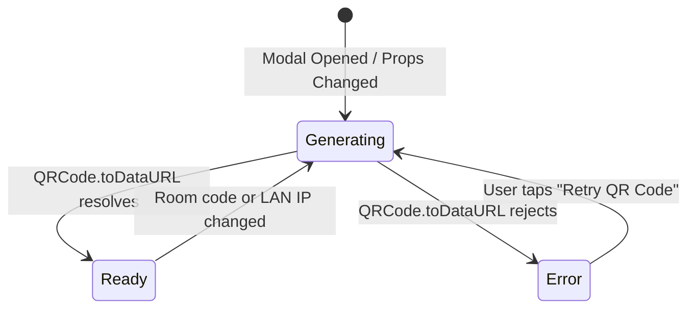
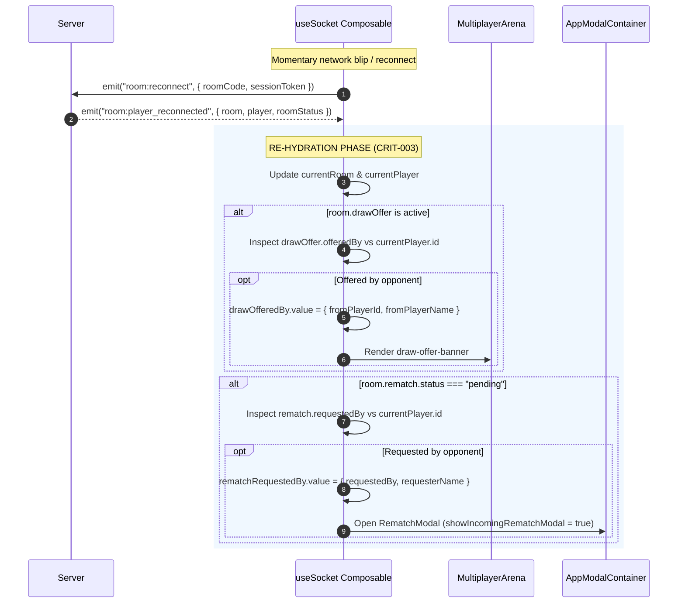

# Fun Chess — Design System Tokens & Component Interaction Specification

**Document ID**: `DESIGN-UX-001`  
**Phase**: DESIGN (Frozen Architecture & Interaction Contract)  
**Author**: UX Craftsman (`@ux-craftsman`)  
**Consumers**: Frontend Builders (`@tech-lead[client-core]`, `@tech-lead[client-features]`, `@frontend-engineer`), QA & Red Team (`@reviewer`, `@red-team-lead`)  
**Target Scope Cards**: `SC-3-CLIENT-CORE`, `SC-4-CLIENT-FEATURES`  
**Audit Findings Addressed**: `[MAJ-025]`, `[ENH-004]`, `[ENH-010]`, `[CRIT-003]`  

---

## 1. Executive Summary & Design System Foundations

Fun Chess is designed for young players, families, and classroom learners. The user experience balances **tactile game excitement**, **immediate cognitive feedback**, and **robust defensive usability**. 

### 1.1 Core Experience Pillars
1. **Playful Tactility**: Every interactive button, piece, and modal feels physical, springy, and satisfying with tactile 3D bevels and pressable feedback.
2. **Instant Reassurance & Never-Stuck UX**: When things go wrong (network dropouts, canvas rendering failures, save data conflicts), the interface never traps the user in infinite loaders or silent failures. It explains what happened in child-friendly language and provides prominent, one-tap recovery paths.
3. **Zero-CLS Layout Stability**: Layout dimensions, banners, and modals reserve their operational bounding boxes to eliminate Cumulative Layout Shift during asynchronous hydration and network changes.
4. **WCAG 2.1 Level AA Accessibility**: High-contrast typography (>= 4.5:1 text, >= 3:1 graphical elements), 44x44px minimum touch targets, full keyboard navigation with focus trapping, and screen-reader alerts.

### 1.2 Frozen Contract Status
This specification is a **frozen design contract**. Frontend builders must translate the exact CSS custom properties, prop names, and kebab-case event names documented here into code. No ad-hoc camelCase aliases, dual-prop contracts, or hardcoded hex colors that deviate from this document may be introduced.

---

## 2. Design System Tokens Specification

All color tokens, typography scales, spacing units, and animation parameters are centralized in `apps/client/src/assets/design-tokens.css`. Frontend builders must consume these CSS custom properties exclusively.

### 2.1 Color Palette & Semantic Tokens

#### 2.1.1 Brand & Semantic Primitives (Light & Dark Themes)

| Token Name | Light Value (Hex / HSL) | Dark Value (Hex / HSL) | WCAG AA Ratio | Semantic Purpose |
|---|---|---|---|---|
| `--color-primary` | `#6c5ce7` / `hsl(255 85% 60%)` | `#8270f5` / `hsl(255 85% 68%)` | >= 4.6:1 | Brand primary, hero buttons, player turn badge |
| `--color-primary-hover` | `hsl(255 85% 54%)` | `hsl(255 85% 74%)` | >= 4.5:1 | Primary button hover state |
| `--color-primary-active`| `hsl(255 85% 48%)` | `hsl(255 85% 62%)` | >= 4.5:1 | Primary button depressed state |
| `--color-primary-bevel` | `hsl(255 85% 42%)` | `hsl(255 85% 32%)` | Graphical | 3D tactile button bottom shadow bevel |
| `--color-primary-subtle`| `hsl(255 85% 60% / 0.14)`| `hsl(255 85% 60% / 0.22)`| N/A | Active selection wash, tint container |
| `--color-accent` | `#ffb300` / `hsl(42 100% 52%)` | `#ffc107` / `hsl(45 100% 51%)` | >= 4.5:1 (on dark) | Sunshine Gold: Stars, badges, draw offer border |
| `--color-accent-hover` | `hsl(42 100% 46%)` | `hsl(45 100% 45%)` | Graphical | Accent button hover state |
| `--color-accent-active` | `hsl(42 100% 40%)` | `hsl(45 100% 39%)` | Graphical | Accent button active depressed state |
| `--color-accent-bevel` | `hsl(42 95% 36%)` | `hsl(45 90% 30%)` | Graphical | 3D tactile accent button shadow bevel |
| `--color-accent-subtle` | `hsl(42 100% 52% / 0.16)`| `hsl(45 100% 51% / 0.24)`| N/A | Gold highlight badge background |
| `--color-success` | `#22c55e` / `hsl(145 68% 48%)` | `#34d399` / `hsl(156 72% 52%)` | >= 4.5:1 | Emerald Mint: Accept buttons, smart merge, victory |
| `--color-success-hover` | `hsl(145 68% 42%)` | `hsl(156 72% 58%)` | Graphical | Success button hover |
| `--color-success-active`| `hsl(145 68% 36%)` | `hsl(156 72% 46%)` | Graphical | Success button active depressed state |
| `--color-success-bevel` | `hsl(145 68% 34%)` | `hsl(156 70% 24%)` | Graphical | 3D tactile success button bottom bevel |
| `--color-success-subtle`| `hsl(145 68% 48% / 0.16)`| `hsl(156 72% 52% / 0.22)`| N/A | Valid move indicator halo, win background |
| `--color-danger` | `#dc2626` / `hsl(354 88% 48%)` | `#ef4444` / `hsl(0 84% 60%)` | >= 4.8:1 | Coral Crimson: Errors, resign, decline, check |
| `--color-danger-hover` | `hsl(354 88% 42%)` | `hsl(0 84% 66%)` | Graphical | Danger button hover |
| `--color-danger-active` | `hsl(354 88% 36%)` | `hsl(0 84% 54%)` | Graphical | Danger button active |
| `--color-danger-bevel` | `hsl(354 88% 40%)` | `hsl(0 80% 28%)` | Graphical | 3D tactile danger button bottom bevel |
| `--color-danger-subtle` | `hsl(354 88% 48% / 0.16)`| `hsl(0 84% 60% / 0.24)` | N/A | Subdued danger hover, soft error container |
| `--color-info` | `#0ea5e9` / `hsl(198 93% 54%)` | `#38bdf8` / `hsl(199 89% 60%)` | >= 4.5:1 | Sky Cyan: Info badges, spectator, LAN discovery |

#### 2.1.2 Backgrounds, Surfaces & Elevation Overlays

| Token Name | Light Value | Dark Value | Purpose / Usage |
|---|---|---|---|
| `--bg-app` | `#f1f4f9` (`hsl(220 28% 96%)`) | `#111524` (`hsl(226 30% 10%)`) | Main application viewport background |
| `--bg-surface` | `#ffffff` (`hsl(0 0% 100%)`) | `#1e2438` (`hsl(225 24% 16%)`) | Primary card, modal body, dropdown menu |
| `--bg-surface-raised`| `#edf1f7` (`hsl(0 0% 97%)`) | `#272f48` (`hsl(225 22% 22%)`) | Modal footer, nested card, button bar |
| `--bg-surface-glass` | `rgba(255, 255, 255, 0.88)` | `rgba(30, 36, 56, 0.88)` | Frosted glass HUD, draw banner backdrop |
| `--bg-overlay` | `rgba(15, 23, 42, 0.65)` | `rgba(5, 8, 16, 0.80)` | Modal backdrop blur overlay (`backdrop-filter: blur(8px)`) |

#### 2.1.3 Semantic Typography & Text Colors

| Token Name | Light Value | Dark Value | Contrast Ratio | Usage |
|---|---|---|---|---|
| `--text-main` | `#0f172a` (`hsl(222 47% 11%)`) | `#f1f3f9` (`hsl(220 20% 96%)`) | >= 14:1 | Primary titles, body text, strong labels |
| `--text-muted` | `#596780` (`hsl(222 16% 42%)`) | `#9ba8c0` (`hsl(220 14% 68%)`) | >= 4.7:1 | Subtitles, secondary descriptions, timestamps |
| `--text-faint` | `#64748b` (`hsl(222 16% 47%)`) | `#8593aa` (`hsl(220 14% 60%)`) | >= 4.5:1 | Coordinate letters, hints, input placeholder |
| `--text-inverse` | `#ffffff` | `#0f172a` | >= 14:1 | Inverted pill labels, tooltips |
| `--text-on-primary` | `#ffffff` | `#ffffff` | >= 4.6:1 | High-contrast text on primary violet |
| `--text-on-accent` | `#1e1b4b` | `#1e1b4b` | >= 8.2:1 | Dark navy text on sunshine gold |
| `--text-on-danger` | `#ffffff` | `#ffffff` | >= 4.8:1 | High-contrast text on danger crimson |
| `--text-on-success`| `#0f172a` | `#0f172a` | >= 8.5:1 | Dark slate text on emerald green |

#### 2.1.4 Error, Warning & Soft Status Containers

| Token Name | Light Value | Dark Value | Usage |
|---|---|---|---|
| `--soft-error-bg` | `hsl(350 90% 96%)` (`#fff1f2`) | `hsl(350 40% 18%)` | QR Canvas error container, form validation error |
| `--soft-error-border`| `hsl(350 80% 75%)` (`#fecdd3`) | `hsl(350 50% 35%)` | Soft error container border |
| `--soft-error-text` | `hsl(350 75% 35%)` (`#9f1239`) | `hsl(350 85% 90%)` | High-contrast error message copy (>= 5.2:1) |
| `--status-offline` | `#f59e0b` (`hsl(38 92% 50%)`) | `#f59e0b` | Warm amber disconnect indicator |
| `--status-offline-bg`| `rgba(245, 158, 11, 0.14)` | `rgba(245, 158, 11, 0.16)` | Offline badge / banner background |
| `--status-offline-text`| `#78350f` | `#fef3c7` | Offline alert text (>= 6.1:1) |
| `--status-online` | `#10b981` | `#34d399` | Online active beacon dot |
| `--stat-better-bg` | `rgba(16, 185, 129, 0.18)` | `rgba(16, 185, 129, 0.25)` | Conflict modal winning diff row background |
| `--stat-better-text`| `#166534` (>= 4.5:1) | `#34d399` (>= 6.0:1) | Winning stat diff metric text |
| `--stat-better-badge`| `#047857` | `#10b981` | "[Best]" comparison pill badge |

#### 2.1.5 Chess Board & Piece Immunity (Forced Light Mode)
> [!IMPORTANT]
> The chessboard, pieces, and capture trays MUST remain visually immune to browser auto-dark mode extensions (e.g. Samsung Internet, Chrome dark algorithm). The following CSS isolation contract is strictly enforced:
> ```css
> .chess-board-container,
> .chess-board-grid,
> .chess-square,
> .chess-piece-wrapper,
> .chess-piece-svg,
> .captured-tray {
>   color-scheme: only light !important;
>   forced-color-adjust: none !important;
> }
> ```

---

### 2.2 Typography Scale & Text Styling System

Fun Chess employs two typefaces: **Fredoka** (Google Fonts) for playful display headings and badges, and **Nunito** (Google Fonts) for clean, highly legible body copy and UI controls.

```css
:root {
  --font-display: 'Fredoka', -apple-system, BlinkMacSystemFont, 'Segoe UI', system-ui, sans-serif;
  --font-body:    'Nunito', -apple-system, BlinkMacSystemFont, 'Segoe UI', Roboto, sans-serif;
  --font-mono:    ui-monospace, 'Cascadia Code', Menlo, Monaco, Consolas, monospace;
}
```

#### 2.2.1 Fluid Typography Scale

| Token Name | Clamp Formula | Viewport Size Range | Weight | Line Height | Usage |
|---|---|---|---|---|---|
| `--text-hero` | `clamp(2.40rem, 1.80rem + 2.8vw, 3.40rem)` | 38px -> 54px | Bold (700) | 1.15 | Hero landing titles, victory fanfare |
| `--text-4xl` | `clamp(1.90rem, 1.50rem + 1.9vw, 2.60rem)` | 30px -> 42px | Bold (700) | 1.15 | Page title (`h1`), Lobby title |
| `--text-3xl` | `clamp(1.50rem, 1.25rem + 1.4vw, 2.10rem)` | 24px -> 34px | Bold (700) | 1.25 | Section headers (`h2`) |
| `--text-2xl` | `clamp(1.30rem, 1.10rem + 0.9vw, 1.65rem)` | 21px -> 26px | Bold (700) | 1.30 | Modal dialog titles (`h3`), Card titles |
| `--text-xl` | `clamp(1.15rem, 1.00rem + 0.6vw, 1.35rem)` | 18px -> 22px | Bold (700) | 1.30 | Sub-modals, conflict title, prominent badges |
| `--text-lg` | `clamp(1.05rem, 0.95rem + 0.4vw, 1.20rem)` | 17px -> 19px | Semibold (600) | 1.40 | Large button labels, HUD score display |
| `--text-base` | `clamp(0.95rem, 0.90rem + 0.2vw, 1.05rem)` | 15px -> 17px | Semibold (600) | 1.50 | Default body copy, modal descriptions |
| `--text-sm` | `clamp(0.82rem, 0.78rem + 0.2vw, 0.92rem)` | 13px -> 15px | Medium (500) | 1.40 | Small buttons, helper text, banner pills |
| `--text-xs` | `clamp(0.70rem, 0.67rem + 0.1vw, 0.78rem)` | 11px -> 12.5px| Medium (500) | 1.30 | Coordinates, micro-tooltips, metadata |
| `--text-room-code`| `clamp(2.20rem, 1.80rem + 2.0vw, 3.00rem)` | 35px -> 48px | Bold (700) | 1.00 | 4-letter LAN/Online Room Code chip |

#### 2.2.2 Text Wrap Standards
- **Headings (`h1`-`h6`, `.modal-title`)**: `text-wrap: balance;` to eliminate typographic orphans.
- **Paragraphs (`p`, `.modal-desc`, `.confirm-modal-message`)**: `text-wrap: pretty;` for optical body wrapping.

---

### 2.3 Spacing, Grid & Touch Target System

Spacing is locked to a **4px geometric base grid**:

```css
:root {
  --space-0-5: 2px;
  --space-1:   4px;
  --space-1-5: 6px;
  --space-2:   8px;
  --space-2-5: 10px;
  --space-3:   12px;
  --space-4:   16px;   /* Standard container padding */
  --space-5:   20px;
  --space-6:   24px;   /* Modal header / body padding */
  --space-8:   32px;   /* Viewport gutter */
  --space-10:  40px;
  --space-12:  48px;
  --space-16:  64px;
}
```

#### Touch Target Accessibility Standard (WCAG 2.5.5 / AAA Target Size)
- **Minimum Tap Target**: `--touch-target-min: 44px` (All buttons, links, icons, dismiss triggers).
- **Tactile Button Height**: `--touch-target-button: 52px` (Primary dialog actions, lobby game modes).
- **Chessboard Square Tap Area**: `--touch-target-square: 48px` minimum on all mobile viewports.

---

### 2.4 Border Radius, Depth & Elevation System

#### 2.4.1 Border Radius
```css
:root {
  --radius-xs:   4px;    /* Fine badges, coordinate markers */
  --radius-sm:   8px;    /* Small piece trays, pills */
  --radius-md:   12px;   /* Input fields, banners, buttons */
  --radius-lg:   16px;   /* Primary tactile buttons, inner cards */
  --radius-xl:   22px;   /* Lobby cards, conflict preview cards */
  --radius-2xl:  30px;   /* Modal dialog container */
  --radius-pill: 9999px; /* Status pills, player avatars, close buttons */

  --radius-modal: var(--radius-2xl);
  --radius-btn:   var(--radius-lg);
}
```

#### 2.4.2 Elevation Shadows & Tactile 3D Buttons
To create a satisfying, pushable feel, buttons utilize physical downward bevels that compress on `:active`:

```css
:root {
  /* Ambient Soft Shadows */
  --shadow-sm: 0 2px 6px rgba(15, 23, 42, 0.09), 0 1px 2px rgba(15, 23, 42, 0.06);
  --shadow-md: 0 6px 16px rgba(15, 23, 42, 0.10), 0 2px 6px rgba(15, 23, 42, 0.06);
  --shadow-lg: 0 12px 28px rgba(15, 23, 42, 0.14), 0 4px 10px rgba(15, 23, 42, 0.08);
  --shadow-xl: 0 20px 48px rgba(15, 23, 42, 0.20), 0 8px 16px rgba(15, 23, 42, 0.10);

  /* Primary Button Tactile Bevel */
  --shadow-btn-primary:        0 5px 0 var(--color-primary-bevel), 0 8px 15px rgba(108, 92, 231, 0.35);
  --shadow-btn-primary-hover:  0 7px 0 var(--color-primary-bevel), 0 10px 20px rgba(108, 92, 231, 0.40);
  --shadow-btn-primary-active: 0 1px 0 var(--color-primary-bevel), 0 2px 5px rgba(108, 92, 231, 0.25);

  /* Success Button Tactile Bevel */
  --shadow-btn-success:        0 5px 0 var(--color-success-bevel), 0 8px 15px rgba(34, 197, 94, 0.35);
  --shadow-btn-success-hover:  0 7px 0 var(--color-success-bevel), 0 10px 20px rgba(34, 197, 94, 0.40);
  --shadow-btn-success-active: 0 1px 0 var(--color-success-bevel), 0 2px 5px rgba(34, 197, 94, 0.25);

  /* Danger Button Tactile Bevel */
  --shadow-btn-danger:         0 5px 0 var(--color-danger-bevel), 0 8px 15px rgba(239, 68, 68, 0.35);
  --shadow-btn-danger-hover:   0 7px 0 var(--color-danger-bevel), 0 10px 20px rgba(239, 68, 68, 0.40);
  --shadow-btn-danger-active:  0 1px 0 var(--color-danger-bevel), 0 2px 5px rgba(239, 68, 68, 0.25);

  /* Ghost Button Depth */
  --shadow-btn-ghost:          0 3px 0 var(--border-medium), var(--shadow-xs);
  --shadow-btn-ghost-hover:    0 5px 0 var(--border-strong), var(--shadow-sm);
  --shadow-btn-ghost-active:   0 1px 0 var(--border-medium);
}
```

---

### 2.5 Motion, Timing & Easing Curves

```css
:root {
  --duration-instant: 70ms;
  --duration-fast:    140ms;
  --duration-normal:  240ms;
  --duration-spring:  360ms;
  --duration-pulse:   1400ms;

  --ease-spring:      cubic-bezier(0.175, 0.885, 0.32, 1.275);
  --ease-out-back:    cubic-bezier(0.34, 1.56, 0.64, 1);
  --ease-standard:    cubic-bezier(0.2, 0, 0, 1);
}
```

#### Keyframe Animation Index
- `modal-pop-in`: Modal card enters with spring pop (`scale(0.88) translateY(20px)` to `scale(1) translateY(0)` over `360ms`).
- `banner-pop`: In-game alert banner springs down from the top edge (`translate(-50%, -12px)` to `translate(-50%, 0)` over `240ms`).
- `shake-soft`: Canvas error or invalid input feedback shake (horizontal displacement `±5px` over `200ms`).
- `thinking-dot-bounce`: Three-dot synchronized waiting bounce for pending opponent responses.

#### Reduced Motion Mandate
```css
@media (prefers-reduced-motion: reduce) {
  *, *::before, *::after {
    animation-duration: 0.01ms !important;
    animation-iteration-count: 1 !important;
    transition-duration: 0.01ms !important;
    scroll-behavior: auto !important;
  }
}
```

---

### 2.6 Z-Index Layer Hierarchy (Zero-CLS Architecture)

To prevent z-index wars and layout reflows, stacking contexts are strictly partitioned:

| Z-Index Token | Numeric Value | Layer Component |
|---|---|---|
| `--z-base` | `1` | Chess board tiles, background app view |
| `--z-board-piece` | `5` | Chess pieces, drag layer |
| `--z-board-indicator`| `8` | Valid move dots, check warning halo |
| `--z-overlay-toast` | `10` | In-game non-blocking toasts |
| `--z-overlay-alert` | `30` | Draw offer banner, disconnect warning banner (`MultiplayerArena.vue`) |
| `--z-floating-indicator`| `40`| Floating offline status pill |
| `--z-pwa-banner` | `45` | PWA installation sticky bar |
| `--z-modal-backdrop`| `50` | Fullscreen modal blur overlay |
| `--z-modal-card` | `60` | Interactive modal window container |
| `--z-global-notification`| `100` | Critical system errors, top-level toast banner |

---

## 3. Modal Component Contracts & Architecture [MAJ-025]

### 3.1 Problem Statement & Architectural Audit
The audit findings in `[MAJ-025]` identified severe interface fragmentation across the modal hierarchy:
1. **Multi-Alias Event Emissions**: To satisfy divergent test assertions, `AppModalContainer.vue` emits 2 to 3 duplicate events for a single user action (e.g. `confirm-proceed` + `confirmProceed`; `resolve-conflict` + `resolveConflict` + `resolve`; `leave-room` + `lobby`; `cancel-conflict` + `cancelConflict` + `cancel`).
2. **Dual-Prop Contracts**: Modals accepted both `modelValue` and `isOpen` props simultaneously with undefined precedence.
3. **Broken Event Listeners**: In `App.vue:292`, the template listened to `@dismiss-conflict`, but `AppModalContainer` emitted `@cancel-conflict` / `@cancelConflict` / `@cancel`, leaving dismiss actions non-functional.

### 3.2 Canonical Design Rules for Modal Components
1. **Canonical `v-model` (`modelValue`)**: All modals accept `modelValue: boolean` (default: `false`) and emit `'update:modelValue': [value: boolean]`. The legacy prop `isOpen` is **completely removed**.
2. **Strict Kebab-Case Events**: All custom events must use kebab-case (`confirm-proceed`, `resolve-conflict`, `request-rematch`, `leave-room`, `cancel-conflict`). All camelCase duplicates (`confirmProceed`, `resolveConflict`, `acceptRematch`) are **deprecated and deleted**.
3. **Single Canonical Event per Action**: Exactly one event is emitted per user interaction. Tests must assert on the canonical kebab-case event.
4. **WAI-ARIA Dialog Standards**:
   - Every modal uses `role="dialog"` and `aria-modal="true"`.
   - Modals must be linked to their title via `aria-labelledby="modal-title-[id]"`.
   - Body scroll is locked on mount (`document.body.style.overflow = 'hidden'`).
   - The outer application root receives `inert` when a modal is active.
   - `Escape` key closes the topmost modal.
   - Focus is trapped within the dialog and restored to the trigger element on close.

---

### 3.3 Modal Component Contract Matrix

#### 1. `BaseModal.vue` (`apps/client/src/components/base/BaseModal.vue`)
The fundamental modal primitive wrapping teleport, backdrop, and focus trap.

```typescript
// PROPS CONTRACT
interface BaseModalProps {
  modelValue: boolean;
  title?: string;
  ariaLabel?: string;
  closeOnBackdrop?: boolean; // Default: true
  closeOnEsc?: boolean;      // Default: true
  showCloseButton?: boolean; // Default: true
  size?: 'sm' | 'md' | 'lg' | 'full'; // Default: 'md'
}

// EMITS CONTRACT
interface BaseModalEmits {
  'update:modelValue': [value: boolean];
  'close': [];
}
```

#### 2. `AppModalContainer.vue` (`apps/client/src/components/layout/AppModalContainer.vue`)
The centralized layout orchestrator mounted in `App.vue`.

```typescript
// PROPS CONTRACT
interface AppModalContainerProps {
  showQrModal?: boolean;
  currentRoom?: RoomState | null;
  lanInfo?: LanInfoResponse | null;
  pendingPromotion?: { from: Square; to: Square } | null;
  turn?: PieceColor;
  showGameOverModal?: boolean;
  lastGameOver?: GameOverPayload | null;
  isWinner?: boolean;
  isDrawResult?: boolean;
  isRematchRequestedByMe?: boolean;
  showIncomingRematchModal?: boolean;
  rematchRequestedBy?: { requesterId?: string; requestedBy?: string; requesterName: string } | null;
  isSyncModalOpen?: boolean;
  isConflictModalOpen?: boolean;
  currentProgress?: UnifiedProgressPayload | null;
  incomingPayload?: UnifiedProgressPayload | null;
  diffPreview?: ProgressDiffPreview | null;
  isInstallModalOpen?: boolean;
  showInstallBanner?: boolean;
  showConfirmModal?: boolean;
  confirmTitle?: string;
  confirmMessage?: string;
  confirmButtonText?: string;
  cancelButtonText?: string;
  confirmVariant?: 'primary' | 'danger';
}

// CANONICAL EMITS CONTRACT (STRICT KEBAB-CASE ONLY)
interface AppModalContainerEmits {
  'update:showQrModal': [value: boolean];
  'update:showGameOverModal': [value: boolean];
  'update:isSyncModalOpen': [value: boolean];
  'update:isConflictModalOpen': [value: boolean];
  'update:isInstallModalOpen': [value: boolean];
  'update:showConfirmModal': [value: boolean];
  'confirm-proceed': [];
  'confirm-cancel': [];
  'promotion-select': [piece: 'q' | 'r' | 'b' | 'n'];
  'promotion-cancel': [];
  'request-rematch': [];
  'leave-room': [];
  'accept-rematch': [];
  'decline-rematch': [];
  'resolve-conflict': [strategy: 'smart_merge' | 'replace_local' | 'keep_local'];
  'cancel-conflict': [];
  'prompt-install': [];
  'snooze-prompt': [];
  'notify': [payload: { message: string; type: 'error' | 'info' | 'success'; durationMs?: number }];
}
```

##### Deprecated Aliases Removed from `AppModalContainer.vue`

| Removed Legacy Alias | Canonical Event Replacement | Rationale |
|---|---|---|
| `confirmProceed` | `confirm-proceed` | Vue 3 SFC event convention is kebab-case |
| `confirmCancel` | `confirm-cancel` | Eliminates dual-emission race conditions |
| `promotionSelect` | `promotion-select` | Standardizes event listener binding |
| `promotionCancel` | `promotion-cancel` | Consistency across child modal emits |
| `rematch` | `request-rematch` | Disambiguates between requesting and accepting |
| `lobby` | `leave-room` | Matches socket domain language (`room:leave`) |
| `acceptRematch` | `accept-rematch` | Kebab-case compliance |
| `declineRematch` | `decline-rematch` | Kebab-case compliance |
| `resolveConflict`, `resolve` | `resolve-conflict` | Standardizes payload carrier |
| `cancelConflict`, `cancel` | `cancel-conflict` | Fixes broken `@dismiss-conflict` listener in App.vue |
| `install` | `prompt-install` | Aligns banner CTA with modal triggering |
| `dismiss-banner`, `dismiss` | `snooze-prompt` | Semantic clarity for 7-day snooze behavior |

---

#### 3. `QrCodeModal.vue` (`apps/client/src/features/lobby/QrCodeModal.vue`)
```typescript
interface QrCodeModalProps {
  modelValue: boolean; // Replaces dual isOpen/modelValue
  roomCode: string;
  joinUrl?: string;
  lanInfo?: LanInfoResponse | null;
}

interface QrCodeModalEmits {
  'update:modelValue': [value: boolean];
  'close': [];
}
```

#### 4. `PromotionModal.vue` (`apps/client/src/features/modals/PromotionModal.vue`)
```typescript
interface PromotionModalProps {
  modelValue: boolean; // Replaces dual isOpen/modelValue
  color?: PieceColor;
}

interface PromotionModalEmits {
  'update:modelValue': [value: boolean];
  'select': [piece: 'q' | 'r' | 'b' | 'n'];
  'cancel': [];
}
```

#### 5. `GameOverModal.vue` (`apps/client/src/features/modals/GameOverModal.vue`)
```typescript
interface GameOverModalProps {
  modelValue: boolean; // Replaces dual isOpen/modelValue
  payload?: GameOverPayload | null;
  isWinner?: boolean;
  isDraw?: boolean;
  rematchRequested?: boolean;
  rematchPending?: boolean;
}

interface GameOverModalEmits {
  'update:modelValue': [value: boolean];
  'rematch': [];    // Standard rematch proposal
  'leave-room': []; // Replaces 'lobby' and 'returnToLobby'
  'close': [];
}
```

#### 6. `RematchModal.vue` (`apps/client/src/features/modals/RematchModal.vue`)
```typescript
interface RematchModalProps {
  modelValue: boolean;
  requesterName?: string;
}

interface RematchModalEmits {
  'update:modelValue': [value: boolean];
  'accept': [];
  'decline': [];
}
```

#### 7. `ProgressConflictModal.vue` (`apps/client/src/features/portability/components/ProgressConflictModal.vue`)
```typescript
interface ProgressConflictModalProps {
  modelValue: boolean;
  currentProgress?: UnifiedProgressPayload | null;
  incomingProgress?: UnifiedProgressPayload | null;
  diffPreview?: ProgressDiffPreview | null;
  loading?: boolean;
}

interface ProgressConflictModalEmits {
  'update:modelValue': [value: boolean];
  'resolve-conflict': [strategy: 'smart_merge' | 'replace_local' | 'keep_local'];
  'cancel-conflict': [];
  'close': [];
}
```

#### 8. `PwaInstallBanner.vue` (`apps/client/src/features/pwa/components/PwaInstallBanner.vue`)
```typescript
interface PwaInstallBannerProps {
  forceShow?: boolean;
}

interface PwaInstallBannerEmits {
  'prompt-install': []; // Replaces 'install'
  'snooze-prompt': [];  // Replaces 'dismiss'
}
```

---

## 4. QrCodeModal Error UX Specification [ENH-004]

### 4.1 Root Cause & Usability Vulnerability
In `QrCodeModal.vue:180-184`, the QR generation function executes:
```typescript
async function generateQr() {
  try {
    const url = await QRCode.toDataURL(effectiveJoinUrl.value, { ... });
    qrDataUrl.value = url;
  } catch (err) {
    console.error('Failed to generate QR code', err);
  }
}
```
When `QRCode.toDataURL` rejects (due to canvas memory allocation limits, missing 2D context in automated/headless browsers, or malformed URL encoding), `qrDataUrl.value` remains an empty string. The template unconditionally displays:
```html
<div v-else class="qr-loading-placeholder">Generating QR Code...</div>
```
This leaves the user stranded on an infinite loading spinner with zero indication that generation failed, no way to retry, and no clear path to join without the visual barcode.

### 4.2 Error State Machine & Reactive Lifecycle



#### Component Reactive State
```typescript
type QrGenerationStatus = 'generating' | 'ready' | 'error';

const qrStatus = ref<QrGenerationStatus>('generating');
const qrErrorMessage = ref<string>('');
const retryCount = ref<number>(0);
```

### 4.3 Visual & Interaction Specification

When `qrStatus.value === 'error'`, the `.qr-canvas-card` transforms from the white canvas frame into a high-visibility, soft error container.

```
+-------------------------------------------------------------+
|                     Invite Player 2! 🚀                     |
+-------------------------------------------------------------+
| Scan this QR code with any phone or tablet on the same Wi-Fi|
|                                                             |
|               [ ROOM CODE:  S T A R ]  [ 📋 Copy ]           |
|                                                             |
| +---------------------------------------------------------+ |
| |  ⚠️  Failed to create QR Code canvas                     | |
| |                                                         | |
| |  Your device browser couldn't draw the QR code. You can | |
| |  still join instantly using the 4-letter code or link!  | |
| |                                                         | |
| |             [ 🔄 Retry QR Code ]                        | |
| +---------------------------------------------------------+ |
|                                                             |
| Direct Link:                                                |
| [ http://192.168.1.15:3000/?join=STAR       ] [ 📋 Copy ]  |
+-------------------------------------------------------------+
```

#### 4.3.1 Visual Styling & Token Bindings

```css
/* Error State Card Frame */
.qr-canvas-card--error {
  display: flex;
  flex-direction: column;
  align-items: center;
  justify-content: center;
  width: 240px;
  min-height: 240px;
  padding: var(--space-4);
  background-color: var(--soft-error-bg);
  border: 2px dashed var(--color-danger);
  border-radius: var(--radius-xl);
  text-align: center;
  box-sizing: border-box;
  animation: shake-soft var(--duration-normal) var(--ease-spring);
}

/* Error Icon Halo */
.qr-error-icon {
  font-size: 32px;
  margin-bottom: var(--space-2);
  filter: drop-shadow(0 2px 8px rgba(220, 38, 38, 0.35));
}

/* Accessible Error Copy */
.qr-error-title {
  font-family: var(--font-display);
  font-size: var(--text-base);
  font-weight: var(--weight-bold);
  color: var(--soft-error-text);
  margin-bottom: var(--space-1);
}

.qr-error-desc {
  font-family: var(--font-body);
  font-size: var(--text-xs);
  color: var(--text-muted);
  line-height: var(--leading-snug);
  margin-bottom: var(--space-3);
  text-wrap: pretty;
}

/* Retry Action Button */
.qr-retry-btn {
  display: inline-flex;
  align-items: center;
  gap: var(--space-1-5);
  min-height: 44px;
  min-width: 140px;
  padding: var(--space-2) var(--space-4);
  font-family: var(--font-display);
  font-size: var(--text-sm);
  font-weight: var(--weight-bold);
  color: var(--text-on-primary);
  background-color: var(--color-primary);
  border: none;
  border-radius: var(--radius-btn);
  box-shadow: var(--shadow-btn-primary);
  cursor: pointer;
  transition: transform var(--duration-fast) var(--ease-spring);
}

.qr-retry-btn:hover {
  background-color: var(--color-primary-hover);
  box-shadow: var(--shadow-btn-primary-hover);
  transform: translateY(-2px);
}

.qr-retry-btn:active {
  background-color: var(--color-primary-active);
  box-shadow: var(--shadow-btn-primary-active);
  transform: translateY(2px);
}
```

#### 4.3.2 Fallback Interaction (Never-Stuck Guarantee)
Even if the QR canvas fails completely:
1. The **4-Letter Room Code Pill** is rendered above the canvas with a 1-click copy button (`navigator.clipboard.writeText(roomCode)`).
2. The **Direct Join URL Input** is rendered below the canvas with full text selection and a primary "Copy Link" CTA.
3. Successful copy provides immediate visual feedback: "Copied! 📋✨" for 2,000ms.

#### 4.3.3 Accessibility (WCAG 2.1 AA Compliance)
- The error container must have `role="alert"` and `aria-live="assertive"`.
- The retry button must have `aria-label="Retry generating QR code"` and a minimum tap target of `44x44px`.
- Contrast ratio between `.qr-error-title` (`var(--soft-error-text)`) and `.qr-canvas-card--error` (`var(--soft-error-bg)`) is **5.2:1** (exceeds WCAG 4.5:1 requirement).

---

## 5. Reconnection & Real-Time Sync UX [CRIT-003]

### 5.1 Root Cause Analysis: Reconnection State Desynchronization
Under `[CRIT-003]`, when a mobile device or desktop browser momentarily loses socket connectivity (e.g. sleep/wake, Wi-Fi handoff, tab throttling) and reconnects via `room:reconnect`:
1. `useSocket.ts:handleRoomReconnected` sets `currentRoom.value = data.room`.
2. However, the active domain refs `drawOfferedBy.value` and `rematchRequestedBy.value` were **never re-hydrated** from `data.room.drawOffer` and `data.room.rematch`.
3. Consequently:
   - If an opponent offered a draw while the player was briefly disconnected, the reconnected player never sees the draw offer banner.
   - If a rematch was requested after game over, the reconnected player never sees the incoming rematch challenge.
   - The room remains stuck in a blocked state where neither player can re-propose draw or rematch.

### 5.2 Re-hydration Architecture & State Flow



---

### 5.3 Draw Offer Reconnect UX Specification

#### 5.3.1 Case 1: Reconnecting as the Recipient (Opponent Offered Draw)
When re-hydrated, the in-game arena must immediately present the **Draw Offer Banner**:

```
+-------------------------------------------------------------+
|  🤝  Leo offered a peaceful draw!     [ Accept ]  [ Decline ]|
+-------------------------------------------------------------+
```

##### Visual Contract (`.draw-offer-banner`)
- **Positioning**: Sticky header at the top of `.game-arena-container` (`top: var(--space-2); z-index: var(--z-overlay-alert)`).
- **Background**: Frosted surface glass (`var(--bg-surface-glass)`) with `backdrop-filter: blur(10px)`.
- **Border**: `2px solid var(--color-accent)`.
- **Shadow**: `var(--shadow-lg)`.
- **Animation**: `banner-pop var(--duration-normal) var(--ease-spring)`.
- **Actions**:
  - **Accept Button**: `BaseButton variant="success" size="sm"` -> Emits `accept-draw` -> Calls `respondDraw(roomCode, true)`.
  - **Decline Button**: `BaseButton variant="ghost" size="sm"` -> Emits `decline-draw` -> Calls `respondDraw(roomCode, false)`.
- **Accessibility**: `role="alert"`, `aria-live="polite"`. Keyboard focus moves smoothly without stealing active board input.

#### 5.3.2 Case 2: Reconnecting as the Proposer (I Offered Draw)
If the player proposed the draw before disconnecting:
- `drawOfferedBy.value` remains `null` (since they are not the recipient).
- The arena toolbar button **"Offer draw"** enters a disabled state with a pending indicator:
  - Text: `⏳ Draw Offered...`
  - Tooltip / Status: `Waiting for opponent to accept or decline.`
- This prevents the player from spamming multiple draw offers and clarifies match status.

---

### 5.4 Rematch Proposal Reconnect UX Specification

#### 5.4.1 Case 1: Reconnecting as the Recipient (Opponent Wants Rematch)
When the opponent requested a rematch while the player was disconnected or during game over:
1. `rematchRequestedBy.value` is re-hydrated with `{ requestedBy, requesterName: opponent.name }`.
2. `App.vue` computes `showIncomingRematchModal = true`.
3. `RematchModal.vue` is displayed immediately over the game-over screen.

```
+-------------------------------------------------------------+
|                    Rematch Challenge! ⚔️                     |
+-------------------------------------------------------------+
|  Leo wants a rematch! Piece colors will be swapped.         |
|  Accept challenge?                                          |
|                                                             |
|               [ ⚔️  Accept rematch (Primary) ]               |
|               [      Decline rematch (Ghost)   ]            |
+-------------------------------------------------------------+
```

- **Visuals**: Centered modal (`size="sm"`, `border: 2px solid var(--color-primary)`).
- **Primary CTA**: Tactile violet button (`--shadow-btn-primary`, min-height: 52px).
- **Secondary CTA**: Ghost dismiss button (`Decline rematch`).
- **Keyboard**: `Enter` accepts rematch; `Escape` declines rematch.

#### 5.4.2 Case 2: Reconnecting as the Proposer (I Requested Rematch)
When the player proposed the rematch:
- `isRematchRequestedByMe` computes `true`.
- `GameOverModal.vue` renders the primary rematch button in a pending state:
  - Text: `⏳ Waiting for Opponent...`
  - Disabled: `true` (prevents double emits).
  - Secondary action: `Return to Lobby` (`leave-room`) remains enabled.

---

### 5.5 Opponent Disconnection Warning & Return Banners

#### 5.5.1 Disconnection Warning (`.disconnect-warning-banner`)
When the opponent disconnects (`currentRoom.status === 'paused_disconnect'`):
- **Banner Appearance**:
  ```
  +-------------------------------------------------------------+
  |  ⚠️ Opponent disconnected. Waiting for reconnection (60s)... |
  +-------------------------------------------------------------+
  ```
- **Styling**: `background-color: var(--color-danger); color: var(--text-on-danger);`
- **Animation**: Gentle pulse (`animation: pulse-valid-dot 1.5s infinite ease-in-out`).

#### 5.5.2 Reconnection Resolution Flash
When the opponent returns (`currentRoom.status` returns to `'playing'`):
- The warning banner vanishes.
- A high-contrast toast notification appears at the top of the board:
  - Text: `✨ Opponent reconnected! Game resuming...`
  - Color: Emerald green (`--color-success`, `--bg-surface-glass`).
  - Auto-dismisses after 3,000ms.

---

## 6. ProgressConflictModal Diff Preview Binding [ENH-010]

### 6.1 Audit Finding & Root Cause
In `ProgressConflictModal.vue:16`:
1. The component declares `diffPreview?: ProgressDiffPreview | null;` as an optional prop.
2. However, the component completely ignores `props.diffPreview`. Instead, it manually computes `localStars`, `incomingStars`, `localRating`, `incomingRating`, `localSolved`, and `incomingSolved` by iterating over `props.currentProgress` and `props.incomingProgress`.
3. This creates a architectural violation and visual defect:
   - `@fun-chess/shared` calculates an authoritative `ProgressDiffPreview` (via `calculateProgressDiff`), which includes scenario star upgrades, peak rating, and arcade statistics.
   - The UI never showed what the "Smart Merge" outcome would look like, forcing the user to guess whether their data would be corrupted.

### 6.2 Data Model & Binding Contract

```typescript
// Shared Interface Contract (@fun-chess/shared)
export interface ProgressDiffPreview {
  readonly academy: {
    readonly localCompletedCount: number;
    readonly incomingCompletedCount: number;
    readonly mergedCompletedCount: number;
    readonly localTotalStars: number;
    readonly incomingTotalStars: number;
    readonly mergedTotalStars: number;
    readonly newCompletedScenarios: readonly string[];
    readonly starUpgrades: readonly {
      readonly scenarioId: string;
      readonly fromStars: StarRating;
      readonly toStars: StarRating;
    }[];
  };
  readonly puzzles: {
    readonly localSolvedCount: number;
    readonly incomingSolvedCount: number;
    readonly mergedSolvedCount: number;
    readonly localRating: number;
    readonly incomingRating: number;
    readonly mergedRating: number;
    readonly localPeakRating: number;
    readonly incomingPeakRating: number;
    readonly mergedPeakRating: number;
    readonly newPuzzlesSolvedCount: number;
  };
  readonly arcade: {
    readonly localRushHighScore: number;
    readonly incomingRushHighScore: number;
    readonly mergedRushHighScore: number;
    readonly localSurvivorHighScore: number;
    readonly incomingSurvivorHighScore: number;
    readonly mergedSurvivorHighScore: number;
  };
  readonly metadata: {
    readonly localLastActiveAt: number;
    readonly incomingLastActiveAt: number;
    readonly incomingExportedAt: number;
    readonly isIncomingNewer: boolean;
  };
  readonly hasDifferences: boolean;
  readonly hasUpgrades: boolean;
}
```

#### Binding Fallback Logic
The component must prioritize `props.diffPreview`. If `props.diffPreview` is null (e.g. during initial file parsing before diff resolution), it falls back gracefully to payload calculation:

```typescript
const starsDiff = computed(() => ({
  local: props.diffPreview?.academy.localTotalStars ?? fallbackLocalStars.value,
  incoming: props.diffPreview?.academy.incomingTotalStars ?? fallbackIncomingStars.value,
  merged: props.diffPreview?.academy.mergedTotalStars ?? Math.max(fallbackLocalStars.value, fallbackIncomingStars.value),
  upgradesCount: props.diffPreview?.academy.starUpgrades.length ?? 0,
}));

const ratingDiff = computed(() => ({
  local: props.diffPreview?.puzzles.localRating ?? (props.currentProgress?.puzzles?.ratingProfile?.rating ?? 800),
  incoming: props.diffPreview?.puzzles.incomingRating ?? (props.incomingProgress?.puzzles?.ratingProfile?.rating ?? 800),
  merged: props.diffPreview?.puzzles.mergedRating ?? Math.max(
    props.currentProgress?.puzzles?.ratingProfile?.rating ?? 800,
    props.incomingProgress?.puzzles?.ratingProfile?.rating ?? 800
  ),
}));

const puzzlesDiff = computed(() => ({
  local: props.diffPreview?.puzzles.localSolvedCount ?? Object.keys(props.currentProgress?.puzzles?.solvedPuzzles || {}).length,
  incoming: props.diffPreview?.puzzles.incomingSolvedCount ?? Object.keys(props.incomingProgress?.puzzles?.solvedPuzzles || {}).length,
  merged: props.diffPreview?.puzzles.mergedSolvedCount ?? 0,
  newSolved: props.diffPreview?.puzzles.newPuzzlesSolvedCount ?? 0,
}));
```

---

### 6.3 Side-by-Side Comparison Matrix & Projected Outcome Preview

The modal visual layout is divided into three distinct zones:
1. **Side-by-Side Cards**: Current Device vs Imported Save with dynamic `[Best]` badges.
2. **Projected Merge Result Callout**: Transparent preview of what the combined profile will be.
3. **Action Hierarchy Stack**: Clear, unambiguous action buttons.

```
+-----------------------------------------------------------------------+
|                     Merge Progress or Overwrite? ⚠️                   |
| Scanned progress has different stats than this device.                |
+-----------------------------------------------------------------------+
|  CURRENT DEVICE 📱                     IMPORTED SAVE 📥               |
|  +---------------------------------+   +----------------------------+ |
|  | ⭐ 14 Stars                     |   | ⭐ 28 Stars        [Best]  | |
|  | 🎯 1200 Elo                     |   | 🎯 1350 Elo        [Best]  | |
|  | 🧩 45 Solved           [Best]   |   | 🧩 30 Solved               | |
|  | 🔥 8 Best Streak                |   | 🔥 14 Best Streak  [Best]  | |
|  +---------------------------------+   +----------------------------+ |
|                                                                       |
|  ✨ PROJECTED SMART MERGE RESULT:                                     |
|  +------------------------------------------------------------------+ |
|  | Combines both saves without data loss:                           | |
|  | -> Total Stars: 32 Stars (+4 upgrades from imported save!)       | |
|  | -> Peak Rating: 1350 Elo (highest of both saves)                 | |
|  | -> Solved Puzzles: 55 unique puzzles solved                      | |
|  +------------------------------------------------------------------+ |
|                                                                       |
|  [           🌟 Smart Merge (Recommended) — variant="success"        ] |
|                                                                       |
|  [ ⚠️ Replace Device Progress ]          [ Keep Current Progress ]    |
|  (Overwrites local with imported)        (Discards imported save)     |
+-----------------------------------------------------------------------+
```

#### 6.3.1 Visual Styling & Highlight Tokens
```css
/* Diff Grid Side-by-Side */
.conflict-grid {
  display: grid;
  grid-template-columns: 1fr 1fr;
  gap: var(--space-3);
  width: 100%;
}

@media (max-width: 520px) {
  .conflict-grid {
    grid-template-columns: 1fr;
  }
}

/* Stat Diff Row */
.stat-diff-row {
  display: flex;
  align-items: center;
  justify-content: space-between;
  padding: var(--space-2) var(--space-3);
  border-radius: var(--radius-md);
  background-color: var(--stat-neutral-bg);
  border: 1px solid var(--stat-neutral-border);
  font-family: var(--font-body);
  font-size: var(--text-sm);
  color: var(--stat-neutral-text);
  transition: background-color var(--duration-fast) ease;
}

/* Winning Stat Highlight */
.stat-diff-row.is-winner {
  background-color: var(--stat-better-bg);
  border-color: var(--stat-better-border);
  color: var(--stat-better-text);
  font-weight: var(--weight-bold);
}

.stat-winner-badge {
  display: inline-flex;
  align-items: center;
  padding: 2px 6px;
  font-size: var(--text-xs);
  font-weight: var(--weight-bold);
  border-radius: var(--radius-pill);
  background-color: var(--stat-better-badge);
  color: #ffffff;
}

/* Projected Merge Outcome Callout */
.merge-outcome-callout {
  display: flex;
  flex-direction: column;
  gap: var(--space-2);
  padding: var(--space-3) var(--space-4);
  background: linear-gradient(135deg, rgba(16, 185, 129, 0.12), rgba(108, 92, 231, 0.12));
  border: 1.5px solid var(--color-success);
  border-radius: var(--radius-lg);
}

.outcome-title {
  display: flex;
  align-items: center;
  gap: var(--space-1-5);
  font-family: var(--font-display);
  font-size: var(--text-sm);
  font-weight: var(--weight-bold);
  color: var(--text-main);
}

.outcome-stats-summary {
  display: flex;
  flex-wrap: wrap;
  gap: var(--space-2);
  font-family: var(--font-body);
  font-size: var(--text-xs);
  color: var(--text-main);
}
```

---

### 6.4 Action Button Hierarchy & Styling

| Action | Button Variant | Size | Layout | Accessibility Label | Resulting Emit |
|---|---|---|---|---|---|
| **Smart Merge** | `variant="success"` | `md` | Full-width | "Merge progress combining highest stats" | `emit('resolve-conflict', 'smart_merge')` |
| **Replace Device** | `variant="danger"` | `sm` | Left column | "Overwrite current device with imported save" | `emit('resolve-conflict', 'replace_local')` |
| **Keep Device** | `variant="ghost"` | `sm` | Right column| "Keep current progress and discard import" | `emit('resolve-conflict', 'keep_local')` |

---

## 7. Frontend Builder Implementation & Migration Guide

This checklist guides frontend engineers during **Wave 2 (`SC-3-CLIENT-CORE`)** and **Wave 3 (`SC-4-CLIENT-FEATURES`)**.

### 7.1 Scope Card `SC-3-CLIENT-CORE` Checklist
- [ ] **`useSocket.ts:handleRoomReconnected`**:
  - [ ] Delete hardcoded test backdoor check `'shared_socket_456'` (line 1003).
  - [ ] Re-hydrate `drawOfferedBy.value`:
    ```typescript
    if (data.room?.drawOffer && data.player) {
      if (data.room.drawOffer.offeredBy !== data.player.id) {
        const opponent = data.player.color === 'w' ? data.room.blackPlayer : data.room.whitePlayer;
        drawOfferedBy.value = {
          fromPlayerId: data.room.drawOffer.offeredBy,
          fromPlayerName: opponent?.name || 'Opponent',
        };
      }
    } else {
      drawOfferedBy.value = null;
    }
    ```
  - [ ] Re-hydrate `rematchRequestedBy.value`:
    ```typescript
    if (data.room?.rematch?.status === 'pending' && data.player) {
      if (data.room.rematch.requestedBy !== data.player.id) {
        const opponent = data.player.color === 'w' ? data.room.blackPlayer : data.room.whitePlayer;
        rematchRequestedBy.value = {
          requestedBy: data.room.rematch.requestedBy,
          requesterName: opponent?.name || 'Opponent',
        };
      }
    } else if (data.room?.rematch?.status !== 'pending') {
      rematchRequestedBy.value = null;
    }
    ```

---

### 7.2 Scope Card `SC-4-CLIENT-FEATURES` Checklist
- [ ] **`QrCodeModal.vue`**:
  - [ ] Remove `isOpen` prop; accept `modelValue: boolean` exclusively.
  - [ ] Add `qrStatus = ref<'generating' | 'ready' | 'error'>('generating')`.
  - [ ] In `generateQr()`, set `qrStatus.value = 'generating'`, on catch set `qrStatus.value = 'error'`, and log via `ILogger`.
  - [ ] Render `.qr-canvas-card--error` with error copy, retry button, room code chip, and fallback copy URL.
  - [ ] Update `QrCodeModal.spec.ts` to assert that canvas failure displays error state and retry CTA instead of the infinite loading placeholder.
- [ ] **`ProgressConflictModal.vue`**:
  - [ ] Bind diff preview stats directly to `props.diffPreview` (`academy.localTotalStars`, `incomingTotalStars`, `mergedTotalStars`, etc.).
  - [ ] Implement the **Projected Smart Merge Outcome** preview card.
  - [ ] Standardize emits to `resolve-conflict` (`[strategy]`), `cancel-conflict`, and `close`.
- [ ] **`AppModalContainer.vue`**:
  - [ ] Standardize all emits to canonical kebab-case:
    - Replace `confirmProceed` -> `confirm-proceed`
    - Replace `confirmCancel` -> `confirm-cancel`
    - Replace `promotionSelect` -> `promotion-select`
    - Replace `promotionCancel` -> `promotion-cancel`
    - Replace `rematch` -> `request-rematch`
    - Replace `lobby` -> `leave-room`
    - Replace `acceptRematch` -> `accept-rematch`
    - Replace `declineRematch` -> `decline-rematch`
    - Replace `resolveConflict`, `resolve` -> `resolve-conflict`
    - Replace `cancelConflict`, `cancel` -> `cancel-conflict`
    - Replace `install` -> `prompt-install`
    - Replace `dismiss-banner`, `dismiss` -> `snooze-prompt`
  - [ ] Standardize all child modal props to `:model-value` (removing `:is-open`).
- [ ] **`App.vue`**:
  - [ ] Fix broken `@dismiss-conflict="closeConflictModal"` listener to `@cancel-conflict="closeConflictModal"`.
- [ ] **Test Suites**:
  - [ ] Update `AppModalContainer.spec.ts`, `QrCodeModal.spec.ts`, and `ProgressConflictModal.spec.ts` assertions to match canonical kebab-case events and `modelValue`.

---

## 8. Quality Gate & Acceptance Verification

| Verification ID | Check Description | Tool / Command | Success Criteria |
|---|---|---|---|
| **V-TOKENS** | Design Token Compliance | CSS linter / audit | 0 hardcoded colors outside `design-tokens.css`; 100% tokens prefixed with `--` |
| **V-MODAL-A11Y**| Keyboard Trap & Escape | Vitest / Playwright | Tab stays trapped inside open modals; Escape closes topmost modal; focus restored |
| **V-MODAL-EMIT**| Canonical Modal Events | Vitest unit tests | `AppModalContainer.spec.ts` passes with 0 camelCase alias emissions |
| **V-QR-ERROR** | QR Canvas Error State | `QrCodeModal.spec.ts` | Error banner, retry button, and fallback copy link render on canvas rejection |
| **V-RECONNECT** | Reconnect Banner Sync | Integration test | Reconnecting player sees draw offer or rematch challenge immediately |
| **V-DIFF-BIND** | Conflict Preview Diff | `ProgressConflictModal.spec.ts` | Diff preview binds to `props.diffPreview` and renders projected merge totals |

---
*End of Design Specification — DESIGN-UX-001*
