# Fun Chess: Frozen Design Specification & UI Architecture
**Document ID:** `DESIGN-UX-001`
**Status:** FROZEN DESIGN CONTRACT
**Author:** @ux-craftsman (UI/UX Excellence & Design System Authority)
**Target Scope Cards:** SC-5 (Monolith Decomposition & UI View Architecture), SC-4 (Client Services, I/O Abstractions & State Composables)
**Audit Findings Addressed:** MAJ-008, MAJ-009, MAJ-012, MIN-010
**Standards Compliance:** WCAG 2.1 Level AA, Zero Cumulative Layout Shift (Zero-CLS), Safe-Area Adaptive, Mobile-First

---

## 1. Executive Summary & Architecture Overview

This document establishes the frozen visual and architectural design contract for refactoring the client presentation layer in `apps/client`. It provides the technical and visual blueprints required to decompose the 1,709-line god component (`App.vue`), isolate browser multimedia side-effects from pure game logic, unify chess board selection mechanics, and formalize the complete design token system.

### 1.1 Architecture Goals
1. **Monolith Decomposition (MAJ-012):** Reduce `App.vue` from 1,709 lines to an ultra-lean orchestrator shell (<200 lines) by extracting single-responsibility components: `AppViewRouter.vue`, `AppToastManager.vue`, `AppModalContainer.vue`, and composables `useTheme.ts`, `useNotification.ts`.
2. **Multimedia Decoupling (MAJ-008, MAJ-009):** Extract audio synthesis (`useAudio`), device vibration (`navigator.vibrate`), and celebratory confetti (`useConfetti`) from business logic composables (`useAiGame.ts`, `useScenarioRunner.ts`, `usePuzzleRunner.ts`, `useProgressSync.ts`). All domain logic emits pure outcome events; UI presenters trigger sensory effects.
3. **Board Selection Unification (MIN-010):** Unify duplicated selection state machines across game modes into a dedicated `useBoardSelection.ts` composable in `features/board`.
4. **Frozen Token Contract:** Formalize actionable semantic tokens for Light and Dark modes with exact HSL/hex definitions, fluid typography, 4px spacing rhythm, 3D tactile button physics, and WCAG AA contrast guarantees.
5. **Zero-CLS & Accessibility:** Enforce strict overlay coordinate positioning, persistent polite live regions, programmatic modal focus trapping, 44×44px touch targets, and comprehensive `prefers-reduced-motion` compliance.

---

## 2. `App.vue` Decomposition Architecture (MAJ-012)

### 2.1 Component Hierarchy & Orchestration Topology

```mermaid
graph TD
    AppShell["App.vue (Root Shell &lt;200 lines)"]

    AppShell --> SkipLink["a.skip-link (WCAG 2.4.1)"]
    AppShell --> OfflineIndicator["OfflineIndicator.vue"]
    AppShell --> AppNavbar["AppNavbar.vue (Top Global Header)"]
    AppShell --> AppToastManager["AppToastManager.vue (Floating Toasts & Live Region)"]
    AppShell --> AppViewRouter["AppViewRouter.vue (Dynamic View Switcher)"]
    AppShell --> AppModalContainer["AppModalContainer.vue (Dialogs, Modals, Banners)"]

    AppNavbar --> QuickActions["Theme, Audio Mute, PWA Install, Room Code Chip"]

    AppViewRouter --> LobbyView["features/lobby/LobbyView.vue"]
    AppViewRouter --> SoloAiArena["features/ai/SoloAiArena.vue"]
    AppViewRouter --> ScenarioArena["features/scenarios/ScenarioArena.vue"]
    AppViewRouter --> PuzzleArena["features/puzzles/PuzzleArena.vue"]
    AppViewRouter --> PuzzleRushArena["features/puzzles/PuzzleRushArena.vue"]
    AppViewRouter --> MultiplayerArena["features/arena/MultiplayerArena.vue (Extracted Board HUD & Controls)"]

    AppModalContainer --> QrCodeModal["features/lobby/QrCodeModal.vue"]
    AppModalContainer --> PromotionModal["features/modals/PromotionModal.vue"]
    AppModalContainer --> GameOverModal["features/modals/GameOverModal.vue"]
    AppModalContainer --> RematchModal["features/modals/RematchModal.vue"]
    AppModalContainer --> ProgressSyncModal["features/portability/ProgressSyncModal.vue"]
    AppModalContainer --> ProgressConflictModal["features/portability/ProgressConflictModal.vue"]
    AppModalContainer --> PwaInstallModal["features/pwa/PwaInstallModal.vue"]
    AppModalContainer --> PwaInstallBanner["features/pwa/PwaInstallBanner.vue"]
```



---

### 2.2 Orchestrator Shell: `App.vue` Specification

`App.vue` coordinates top-level lifecycle events, theme initialization, global socket connection, and wires the composables to child containers. It contains no modal DOM markup, no route switching conditionals, and no raw styling beyond the global flexbox shell layout.

```vue
<!-- Target line count: < 180 lines -->
<script setup lang="ts">
import { ref, computed, onMounted } from 'vue';
import { OfflineIndicator, usePwaInstall } from '@/features/pwa';
import { useSocket, useAudio } from '@/composables';
import { useTheme } from '@/composables/useTheme';
import { useNotification } from '@/composables/useNotification';
import AppNavbar from '@/components/layout/AppNavbar.vue';
import AppViewRouter from '@/components/layout/AppViewRouter.vue';
import AppToastManager from '@/components/layout/AppToastManager.vue';
import AppModalContainer from '@/components/layout/AppModalContainer.vue';

// 1. Core Platform Composables
const { isDarkMode, toggleTheme, initTheme } = useTheme();
const { notifications, dismissNotification, showNotification } = useNotification();
const { isMuted, toggleMute } = useAudio();
const { canInstall, isStandalone, promptInstall } = usePwaInstall();
const socketApi = useSocket();

// 2. Global Navigation & View State
const currentAppMode = ref<'lobby' | 'solo_ai' | 'academy' | 'puzzle_hub' | 'playing'>('lobby');

onMounted(() => {
  initTheme();
  socketApi.connect();
});
</script>

<template>
  <div class="app-shell" data-testid="app-shell">
    <a href="#main-content" class="skip-link">Skip to main content</a>
    <OfflineIndicator />

    <AppNavbar
      :is-dark-mode="isDarkMode"
      :is-muted="isMuted"
      :can-install="canInstall && !isStandalone && currentAppMode === 'lobby'"
      :current-room="socketApi.currentRoom.value"
      :current-player="socketApi.currentPlayer.value"
      :current-app-mode="currentAppMode"
      @toggle-theme="toggleTheme"
      @toggle-mute="toggleMute"
      @install-pwa="promptInstall"
      @navigate-home="currentAppMode = 'lobby'"
    />

    <main id="main-content" class="app-viewport">
      <AppToastManager
        :notifications="notifications"
        @dismiss="dismissNotification"
      />

      <AppViewRouter
        v-model:current-mode="currentAppMode"
        :socket-api="socketApi"
        @notify="showNotification"
      />
    </main>

    <AppModalContainer
      :current-room="socketApi.currentRoom.value"
      :current-player="socketApi.currentPlayer.value"
      @notify="showNotification"
    />
  </div>
</template>
```

---

### 2.3 Component Contracts & Interface Specifications

#### A. `AppViewRouter.vue` (Dynamic View Switching)
- **Role:** Handles view lifecycle, mode transitions, and view-level parameter state (mascot configuration, scenario lesson, drill theme).
- **Location:** `src/components/layout/AppViewRouter.vue`

| Prop Name | Type | Required | Description |
| :--- | :--- | :--- | :--- |
| `currentMode` | `AppGameMode` (`'lobby' \| 'solo_ai' \| 'academy' \| 'puzzle_hub' \| 'multiplayer'`) | Yes | Current active application view. |
| `socketApi` | `ReturnType<typeof useSocket>` | Yes | Real-time game socket instance and reactive room state. |

| Emitted Event | Payload Type | Trigger Condition |
| :--- | :--- | :--- |
| `update:currentMode` | `AppGameMode` | When exiting an arena, switching modes, or navigating. |
| `notify` | `{ message: string, type: 'error' \| 'info' \| 'success', durationMs?: number }` | When an arena encounters a recoverable error or informational milestone. |
| `action-loading` | `boolean` | Indicates ongoing network handshakes during room join/create. |

| Slot Name | Slot Props | Description |
| :--- | :--- | :--- |
| `default` | None | Fallback container if custom overlay views are injected. |

---

#### B. `AppToastManager.vue` (Floating Toasts & Accessible Live Region)
- **Role:** Manages the stacked presentation of actionable banners, toasts, and screen-reader announcements with Zero Cumulative Layout Shift (Zero-CLS).
- **Location:** `src/components/layout/AppToastManager.vue`

| Prop Name | Type | Required | Description |
| :--- | :--- | :--- | :--- |
| `notifications` | `AppNotification[]` | Yes | Ordered queue of active notifications. |

| Emitted Event | Payload Type | Trigger Condition |
| :--- | :--- | :--- |
| `dismiss` | `number` (Notification ID) | User taps dismiss button or auto-dismiss timer elapses. |

| Slot Name | Slot Props | Description |
| :--- | :--- | :--- |
| `icon` | `{ type: NotificationType }` | Customizable status icon per notification type. |
| `action` | `{ id: number }` | Optional inline action button inside toast. |

##### Accessibility & Zero-CLS Architecture:
```html
<template>
  <!-- Persistent Live Region for Screen Readers (WCAG 4.1.3) -->
  <div class="sr-only" role="status" aria-live="polite" aria-atomic="true">
    {{ latestAnnouncement }}
  </div>

  <!-- Accessible Floating Toast Container -->
  <TransitionGroup name="notification-slide" tag="div" class="toast-container">
    <div
      v-for="item in notifications"
      :key="item.id"
      class="app-notification-banner"
      :class="`is-${item.type}`"
      :role="item.type === 'error' ? 'alert' : 'status'"
      data-testid="app-notification-banner"
    >
      <span class="notification-icon" aria-hidden="true">{{ getIcon(item.type) }}</span>
      <span class="notification-message">{{ item.message }}</span>
      <button
        type="button"
        class="notification-dismiss-btn"
        aria-label="Dismiss notification"
        @click="$emit('dismiss', item.id)"
      >
        ✕
      </button>
    </div>
  </TransitionGroup>
</template>
```

---

#### C. `AppModalContainer.vue` (Modal Registry & Focus Trapping)
- **Role:** Centralized mount point for all 8 application dialogs and bottom sheets. Eliminates modal z-index collisions and guarantees body scroll-lock and keyboard focus restoration.
- **Location:** `src/components/layout/AppModalContainer.vue`

| Prop Name | Type | Required | Description |
| :--- | :--- | :--- | :--- |
| `currentRoom` | `RoomState \| null` | Yes | Room state driving QR code and rematch modal visibility. |
| `currentPlayer` | `Player \| null` | Yes | Identity used to verify rematch origin and game outcome. |

| Emitted Event | Payload Type | Trigger Condition |
| :--- | :--- | :--- |
| `notify` | `AppNotificationPayload` | User actions inside modals that surface notifications. |
| `rematch-accepted` | `{ roomCode: string }` | Rematch challenge accepted. |
| `rematch-declined` | `{ roomCode: string }` | Rematch challenge declined. |

---

### 2.4 Extracted Core State Composables

#### A. `useTheme.ts` (Theme Management & Smear Prevention)
- **Location:** `src/composables/useTheme.ts`
- **Responsibilities:**
  - Reactive `isDarkMode` state.
  - Temporary transition suppression (injects `*, *::before, *::after { transition: none !important; }`, forces reflow, and removes rule via double `requestAnimationFrame`) to prevent color smearing.
  - Synchronizes `<meta name="theme-color">` (`#ffffff` light, `#0f0f1b` dark).
  - Syncs `document.documentElement.setAttribute('data-theme', 'dark')`.
  - Listens to OS `prefers-color-scheme: dark` media queries.

```typescript
export interface UseThemeReturn {
  isDarkMode: Readonly<Ref<boolean>>;
  toggleTheme: () => void;
  applyTheme: (dark: boolean) => void;
  initTheme: () => void;
}
```

#### B. `useNotification.ts` (Reactive Notification Queue)
- **Location:** `src/composables/useNotification.ts`
- **Responsibilities:**
  - Reactive FIFO queue supporting multi-toast stacking.
  - Automatic timer dismissal with configurable `durationMs`.
  - Pause-on-hover capability for accessibility.
  - Error escalation (errors default to 8,000ms or persistent until dismissed; info defaults to 4,000ms).

```typescript
export interface AppNotification {
  id: number;
  type: 'error' | 'info' | 'success';
  message: string;
  durationMs?: number;
}

export interface UseNotificationReturn {
  notifications: Readonly<Ref<AppNotification[]>>;
  activeNotification: ComputedRef<AppNotification | null>;
  showNotification: (message: string, type?: 'error' | 'info' | 'success', durationMs?: number) => void;
  dismissNotification: (id?: number) => void;
  clearAll: () => void;
}
```

---

## 3. Interactive Board Selection State Machine (MIN-010)

### 3.1 Problem Statement
Four composables (`useChessGame.ts`, `useAiGame.ts`, `usePuzzleRunner.ts`, `useScenarioRunner.ts`) duplicate identical interactive selection, legal move filtering, destination checking, and pawn promotion interception logic (~80 lines repeated 4 times).

### 3.2 Solution Architecture: `useBoardSelection.ts`
- **Location:** `src/features/board/composables/useBoardSelection.ts`
- **Contract & State Definition:**

```typescript
import { ref, type Ref } from 'vue';
import type { Square } from '@fun-chess/shared';
import { isPawnPromotion } from '@fun-chess/shared';

export interface PendingPromotion {
  from: Square;
  to: Square;
}

export interface SelectionMoveResult {
  moved: boolean;
  requiresPromotion: boolean;
  from?: Square;
  to?: Square;
  promotion?: 'q' | 'r' | 'b' | 'n';
}

export interface BoardSelectionOptions {
  getPieceAt: (square: Square) => { color: 'w' | 'b'; type: string } | null;
  getLegalMovesForSquare: (square: Square) => Square[];
  currentTurn: Ref<'w' | 'b'>;
  playerColor: Ref<'w' | 'b' | null>;
  executeMove: (from: Square, to: Square, promotion?: 'q' | 'r' | 'b' | 'n') => boolean;
}

export function useBoardSelection(options: BoardSelectionOptions) {
  const selectedSquare = ref<Square | null>(null);
  const legalMovesForSelected = ref<Square[]>([]);
  const pendingPromotion = ref<PendingPromotion | null>(null);

  function clearSelection(): void {
    selectedSquare.value = null;
    legalMovesForSelected.value = [];
  }

  function isLegalTarget(square: Square): boolean {
    return legalMovesForSelected.value.includes(square);
  }

  function handleSquareClick(
    square: Square,
    onMoveReady?: (move: { from: Square; to: Square; promotion?: 'q' | 'r' | 'b' | 'n' }) => void
  ): SelectionMoveResult {
    // 1. Destination click when piece is selected
    if (selectedSquare.value && isLegalTarget(square)) {
      const from = selectedSquare.value;
      const to = square;

      if (isPawnPromotion(from, to)) {
        pendingPromotion.value = { from, to };
        return { moved: false, requiresPromotion: true, from, to };
      }

      const success = options.executeMove(from, to);
      if (success) {
        clearSelection();
        if (onMoveReady) onMoveReady({ from, to });
        return { moved: true, requiresPromotion: false, from, to };
      }
    }

    // 2. Piece selection
    const piece = options.getPieceAt(square);
    if (piece && piece.color === options.currentTurn.value) {
      if (options.playerColor.value && piece.color !== options.playerColor.value) {
        clearSelection();
        return { moved: false, requiresPromotion: false };
      }
      selectedSquare.value = square;
      legalMovesForSelected.value = options.getLegalMovesForSquare(square);
      return { moved: false, requiresPromotion: false };
    }

    // 3. Deselect
    clearSelection();
    return { moved: false, requiresPromotion: false };
  }

  function completePromotion(
    pieceType: 'q' | 'r' | 'b' | 'n',
    onMoveReady?: (move: { from: Square; to: Square; promotion: 'q' | 'r' | 'b' | 'n' }) => void
  ): boolean {
    if (!pendingPromotion.value) return false;
    const { from, to } = pendingPromotion.value;
    const success = options.executeMove(from, to, pieceType);
    if (success) {
      if (onMoveReady) onMoveReady({ from, to, promotion: pieceType });
      pendingPromotion.value = null;
      clearSelection();
      return true;
    }
    return false;
  }

  function cancelPromotion(): void {
    pendingPromotion.value = null;
    clearSelection();
  }

  return {
    selectedSquare,
    legalMovesForSelected,
    pendingPromotion,
    clearSelection,
    isLegalTarget,
    handleSquareClick,
    completePromotion,
    cancelPromotion,
  };
}
```

---

## 4. Multimedia Decoupling Specification (MAJ-008 & MAJ-009)

### 4.1 Separation Principle
**Universal Rule:** *Business logic composables must be pure state transformers.*
No Web Audio API calls, `navigator.vibrate()`, or `canvas-confetti` invocations may occur inside domain engines (`useAiGame.ts`, `useScenarioRunner.ts`, `usePuzzleRunner.ts`, `useProgressSync.ts`).

### 4.2 Strongly-Typed Outcome Events

Composables return or emit explicit outcome events:

```typescript
// Shared outcome event contracts
export interface MoveOutcomeEvent {
  type: 'move';
  from: Square;
  to: Square;
  isCapture: boolean;
  isCheck: boolean;
  isCheckmate: boolean;
  isDraw: boolean;
}

export interface GameCompletionOutcomeEvent {
  type: 'game_over';
  winner: 'w' | 'b' | 'draw';
  reason: 'checkmate' | 'stalemate' | 'resignation' | 'timeout' | 'agreement';
  isLocalPlayerWinner: boolean;
}

export interface ScenarioStepOutcomeEvent {
  type: 'scenario_step_completed';
  starsAwarded: number;
  isLessonComplete: boolean;
}

export interface SyncOutcomeEvent {
  type: 'sync_completed';
  itemsMerged: number;
  hadConflict: boolean;
}
```

### 4.3 UI Presenter Event-to-Effect Mapping Matrix

Sensory side effects are executed in Vue components (`SoloAiArena.vue`, `ScenarioArena.vue`, `PuzzleArena.vue`, `AppModalContainer.vue`) reacting to outcome events:

| Domain Outcome Event | Audio Method | Haptic Pattern (`navigator.vibrate`) | Visual FX |
| :--- | :--- | :--- | :--- |
| `move` (Normal) | `playMove()` | `12ms` | Board highlight transition |
| `move` (Capture) | `playCapture()` | `[20ms, 40ms, 25ms]` | Piece capture burst (`piece-capture-pop`) |
| `move` (Check) | `playCheck()` | `[40ms, 60ms, 40ms]` | King halo strobe (`check-strobe`) |
| `game_over` (Victory) | `playVictory()` | `[60ms, 50ms, 80ms, 50ms, 120ms]` | Full confetti explosion (`celebrate()`) |
| `game_over` (Defeat / Draw)| `playDraw()` | `40ms` | Modal fade-in |
| `scenario_step_completed` | `playStarEarned()` | `[30ms, 30ms, 60ms]` | Star burst animation (`star-pop`) |
| `invalid_interaction` | `playError()` | `[50ms, 80ms, 50ms]` | Board shake (`shake-soft`) |
| `sync_completed` | `playStart()` | `25ms` | Success beacon ring |

---

### 4.4 `IAudioService` Contract & Test Isolation (MAJ-008)

To eliminate module-level DOM side-effects during test execution (`audio_synthesizer.ts:560-585`), audio is abstracted behind `IAudioService`.

```typescript
export interface IAudioService {
  initContext(): void;
  resumeContext(): void;
  playMove(): void;
  playCapture(): void;
  playCheck(): void;
  playVictory(): void;
  playDraw(): void;
  playStart(): void;
  playError(): void;
  playStarEarned(): void;
  setMuted(muted: boolean): void;
  isMuted(): boolean;
}
```

- **Production Implementation:** `WebAudioSynthesizer` implements `IAudioService`. Event listeners on `window` and `document` are attached **only** within an explicit `bootstrap()` method called inside `main.ts` or on the first user interaction, never at module import time.
- **Test Implementation:** `NullAudioService` implements `IAudioService` as an inert no-op stub for all test suites.

---

## 5. Design Token System (Frozen Actionable Contract)

Frontend builders must translate these exact tokens into CSS custom properties in `apps/client/src/assets/design-tokens.css`.

### 5.1 Color Tokens (Light & Dark Themes)

```css
:root {
  color-scheme: light dark;
  scrollbar-gutter: stable;

  /* --------------------------------------------------------------------------
     1. COLOR PRIMITIVES (LIGHT THEME DEFAULT)
     -------------------------------------------------------------------------- */
  /* Brand Primary — Electric Violet */
  --color-primary-h: 255;
  --color-primary-s: 85%;
  --color-primary-l: 60%;
  --color-primary: #6c5ce7;
  --color-primary-hover: #5b4ae3;
  --color-primary-active: #4a38df;
  --color-primary-bevel: #4738be;
  --color-primary-subtle: rgba(108, 92, 231, 0.14);

  /* Brand Secondary / Accent — Sunshine Gold */
  --color-accent-h: 42;
  --color-accent-s: 100%;
  --color-accent-l: 52%;
  --color-accent: #ffb300;
  --color-accent-hover: #e6a100;
  --color-accent-active: #cc8f00;
  --color-accent-bevel: #b37d00;
  --color-accent-subtle: rgba(255, 179, 0, 0.16);

  /* Status: Success / Legal Move — Emerald Mint */
  --color-success-h: 145;
  --color-success-s: 68%;
  --color-success-l: 48%;
  --color-success: #22c55e;
  --color-success-hover: #1ca74f;
  --color-success-active: #178940;
  --color-success-bevel: #15803d;
  --color-success-subtle: rgba(34, 197, 94, 0.16);

  /* Status: Danger / Alert — Coral Crimson */
  --color-danger-h: 354;
  --color-danger-s: 88%;
  --color-danger-l: 48%;
  --color-danger: #dc2626;
  --color-danger-hover: #b91c1c;
  --color-danger-active: #991b1b;
  --color-danger-bevel: #7f1d1d;
  --color-danger-subtle: rgba(220, 38, 38, 0.16);

  /* Status: Info — Sky Cyan */
  --color-info-h: 198;
  --color-info-s: 93%;
  --color-info-l: 54%;
  --color-info: #0ea5e9;

  /* Surfaces & Backgrounds (Light) */
  --bg-base: #f1f4f9;
  --bg-surface: #ffffff;
  --bg-card: #ffffff;
  --bg-surface-raised: #e8edf5;
  --bg-surface-glass: rgba(255, 255, 255, 0.88);
  --bg-overlay: rgba(15, 23, 42, 0.65);

  /* Typography Colors (Light) */
  --text-primary: #0f172a;
  --text-muted: #64748b;
  --text-faint: #94a3b8;
  --text-inverse: #ffffff;
  --text-on-primary: #ffffff;
  --text-on-accent: #1e1b4b;
  --text-on-danger: #ffffff;
  --text-on-success: #0f172a;
  --color-primary-text: #4338ca;
  --color-accent-text: #92400e;
  --color-success-text: #166534;

  /* Borders & Focus Rings (Light) */
  --border-subtle: #e2e8f0;
  --border-medium: #cbd5e1;
  --border-strong: #94a3b8;
  --border-focus: var(--color-primary);
  --focus-ring: 0 0 0 3px rgba(108, 92, 231, 0.45);

  /* Chess Board (Sand & Caramel Wood) */
  --board-light-sq: #f0d9b5;
  --board-dark-sq: #b58863;
  --board-coord-light: #7d5538;
  --board-coord-dark: #3d220f;
  --board-rim: #7d5538;
  --board-rim-dark: #533722;

  /* Status Colors */
  --status-offline: #f59e0b;
  --status-offline-bg: rgba(245, 158, 11, 0.14);
  --status-offline-border: #f59e0b;
  --status-offline-text: #78350f;
  --status-online: #10b981;
  --status-online-glow: rgba(16, 185, 129, 0.40);
}

/* --------------------------------------------------------------------------
   2. DARK THEME OVERRIDES
   -------------------------------------------------------------------------- */
[data-theme='dark'] {
  color-scheme: dark;

  /* Surfaces & Backgrounds (Dark) */
  --bg-base: #111524;
  --bg-surface: #1e2438;
  --bg-card: #1e2438;
  --bg-surface-raised: #28304a;
  --bg-surface-glass: rgba(30, 36, 56, 0.88);
  --bg-overlay: rgba(5, 8, 16, 0.80);

  /* Typography Colors (Dark) */
  --text-primary: #f1f3f9;
  --text-muted: #94a3b8;
  --text-faint: #64748b;
  --color-primary-text: #a5b4fc;
  --color-accent-text: #fde68a;
  --color-success-text: #34d399;

  /* Borders & Focus Rings (Dark) */
  --border-subtle: #2d3748;
  --border-medium: #3b475e;
  --border-strong: #4a5975;
  --focus-ring: 0 0 0 3px rgba(165, 180, 252, 0.50);

  /* Chess Board (Subdued Timber) */
  --board-rim: #2c1f15;
  --board-rim-dark: #1a120c;

  /* Status Overrides (Dark) */
  --status-offline-bg: rgba(245, 158, 11, 0.20);
  --status-offline-text: #fef3c7;
}
```

#### Contrast Ratio Verification Table (WCAG 2.1 Level AA)

| Foreground Token | Background Token | Theme | Ratio | WCAG AA Standard | Status |
| :--- | :--- | :--- | :--- | :--- | :--- |
| `--text-primary` (`#0f172a`) | `--bg-surface` (`#ffffff`) | Light | 16.2:1 | ≥ 4.5:1 | PASS |
| `--text-muted` (`#64748b`) | `--bg-surface` (`#ffffff`) | Light | 4.6:1 | ≥ 4.5:1 | PASS |
| `--color-primary-text` (`#4338ca`)| `--bg-surface` (`#ffffff`) | Light | 7.8:1 | ≥ 4.5:1 | PASS |
| `--color-accent-text` (`#92400e`) | `--bg-surface` (`#ffffff`) | Light | 5.2:1 | ≥ 4.5:1 | PASS |
| `--color-success-text` (`#166534`)| `--bg-surface` (`#ffffff`) | Light | 6.8:1 | ≥ 4.5:1 | PASS |
| `--board-coord-light` (`#7d5538`) | `--board-light-sq` (`#f0d9b5`)| Both | 4.7:1 | ≥ 4.5:1 | PASS |
| `--board-coord-dark` (`#3d220f`)  | `--board-dark-sq` (`#b58863`) | Both | 5.8:1 | ≥ 4.5:1 | PASS |
| `--text-primary` (`#f1f3f9`) | `--bg-surface` (`#1e2438`) | Dark | 11.4:1 | ≥ 4.5:1 | PASS |
| `--text-muted` (`#94a3b8`)   | `--bg-surface` (`#1e2438`) | Dark | 5.1:1 | ≥ 4.5:1 | PASS |
| `--color-primary-text` (`#a5b4fc`)| `--bg-surface` (`#1e2438`) | Dark | 6.2:1 | ≥ 4.5:1 | PASS |
| `--color-accent-text` (`#fde68a`) | `--bg-surface` (`#1e2438`) | Dark | 8.9:1 | ≥ 4.5:1 | PASS |

---

### 5.2 Typography Scale & Line Heights

```css
:root {
  /* Font Families */
  --font-display: 'Fredoka', -apple-system, BlinkMacSystemFont, 'Segoe UI', system-ui, sans-serif;
  --font-body:    'Nunito', -apple-system, BlinkMacSystemFont, 'Segoe UI', Roboto, sans-serif;
  --font-mono:    ui-monospace, 'Cascadia Code', Menlo, Monaco, Consolas, 'JetBrains Mono', monospace;

  /* Font Weights */
  --weight-regular:  400;
  --weight-medium:   500;
  --weight-semibold: 600;
  --weight-bold:     700;
  --weight-heavy:    700;

  /* Line Heights */
  --leading-none:    1.0;
  --leading-tight:   1.15;
  --leading-snug:    1.30;
  --leading-normal:  1.50;
  --leading-relaxed: 1.65;

  /* Fluid Size Scale (Viewport: 320px -> 1280px) */
  --text-h1:   clamp(1.90rem, 1.50rem + 1.9vw, 2.60rem); /* 30px -> 42px */
  --text-h2:   clamp(1.50rem, 1.25rem + 1.4vw, 2.10rem); /* 24px -> 34px */
  --text-h3:   clamp(1.30rem, 1.10rem + 0.9vw, 1.65rem); /* 21px -> 26px */
  --text-h4:   clamp(1.15rem, 1.00rem + 0.6vw, 1.35rem); /* 18px -> 22px */
  --text-h5:   clamp(1.05rem, 0.95rem + 0.4vw, 1.20rem); /* 17px -> 19px */
  --text-h6:   clamp(0.95rem, 0.90rem + 0.2vw, 1.05rem); /* 15px -> 17px */
  --text-body: clamp(0.95rem, 0.90rem + 0.2vw, 1.05rem); /* 15px -> 17px */
  --text-sm:   clamp(0.82rem, 0.78rem + 0.2vw, 0.92rem); /* 13px -> 15px */
  --text-xs:   clamp(0.70rem, 0.67rem + 0.1vw, 0.78rem); /* 11px -> 12.5px */

  /* Game Specific Display */
  --text-room-code: clamp(2.2rem, 1.8rem + 2.0vw, 3.0rem); /* 35px -> 48px */
  --tracking-room-code: 0.22em;
}
```

---

### 5.3 Spacing Scale, Touch Targets, & Radii

```css
:root {
  /* 4px Base Unit Grid Scale */
  --space-0-5: 2px;
  --space-1:   4px;   /* xs */
  --space-1-5: 6px;
  --space-2:   8px;   /* sm */
  --space-2-5: 10px;
  --space-3:   12px;
  --space-4:   16px;  /* md */
  --space-5:   20px;
  --space-6:   24px;  /* lg */
  --space-8:   32px;  /* xl */
  --space-10:  40px;  /* 2xl */
  --space-12:  48px;  /* 3xl */
  --space-16:  64px;  /* 4xl */
  --space-20:  80px;
  --space-24:  96px;

  /* Strict WCAG Touch Target Compliance */
  --touch-target-min:    44px; /* Minimum tap area for all interactive elements */
  --touch-target-button: 52px; /* Primary tactical gaming buttons */
  --touch-target-square: 48px; /* Phone viewport chess square */

  /* Border Radii (Concentric Outer = Inner + Padding) */
  --radius-xs:   4px;    /* Fine badges, coordinate chips */
  --radius-sm:   8px;    /* Move list pills, small trays */
  --radius-md:   12px;   /* Input fields, square highlights */
  --radius-lg:   16px;   /* Standard buttons, board rim */
  --radius-xl:   22px;   /* Lobby cards, modal cards */
  --radius-2xl:  30px;   /* Large containers, bottom sheets */
  --radius-pill: 9999px; /* Status badges, turn pills */
}
```

---

### 5.4 Elevation & Tactile 3D Button Shadows

```css
:root {
  /* Soft Ambient Elevations */
  --shadow-xs: 0 1px 3px rgba(15, 23, 42, 0.08);
  --shadow-sm: 0 2px 6px rgba(15, 23, 42, 0.09), 0 1px 2px rgba(15, 23, 42, 0.06);
  --shadow-md: 0 6px 16px rgba(15, 23, 42, 0.10), 0 2px 6px rgba(15, 23, 42, 0.06);
  --shadow-lg: 0 12px 28px rgba(15, 23, 42, 0.14), 0 4px 10px rgba(15, 23, 42, 0.08);
  --shadow-xl: 0 20px 48px rgba(15, 23, 42, 0.20), 0 8px 16px rgba(15, 23, 42, 0.10);

  /* Tactile Pressable 3D Button Shadows */
  /* Primary */
  --shadow-btn-primary:        0 5px 0 var(--color-primary-bevel), 0 8px 15px rgba(108, 92, 231, 0.35);
  --shadow-btn-primary-hover:  0 7px 0 var(--color-primary-bevel), 0 10px 20px rgba(108, 92, 231, 0.40);
  --shadow-btn-primary-active: 0 1px 0 var(--color-primary-bevel), 0 2px 5px rgba(108, 92, 231, 0.25);

  /* Accent Gold */
  --shadow-btn-accent:         0 5px 0 var(--color-accent-bevel), 0 8px 15px rgba(255, 179, 0, 0.35);
  --shadow-btn-accent-hover:   0 7px 0 var(--color-accent-bevel), 0 10px 20px rgba(255, 179, 0, 0.40);
  --shadow-btn-accent-active:  0 1px 0 var(--color-accent-bevel), 0 2px 5px rgba(255, 179, 0, 0.25);

  /* Danger Coral */
  --shadow-btn-danger:         0 5px 0 var(--color-danger-bevel), 0 8px 15px rgba(220, 38, 38, 0.35);
  --shadow-btn-danger-hover:   0 7px 0 var(--color-danger-bevel), 0 10px 20px rgba(220, 38, 38, 0.40);
  --shadow-btn-danger-active:  0 1px 0 var(--color-danger-bevel), 0 2px 5px rgba(220, 38, 38, 0.25);

  /* Success Emerald */
  --shadow-btn-success:        0 5px 0 var(--color-success-bevel), 0 8px 15px rgba(34, 197, 94, 0.35);
  --shadow-btn-success-hover:  0 7px 0 var(--color-success-bevel), 0 10px 20px rgba(34, 197, 94, 0.40);
  --shadow-btn-success-active: 0 1px 0 var(--color-success-bevel), 0 2px 5px rgba(34, 197, 94, 0.25);

  /* Ghost Secondary */
  --shadow-btn-ghost:          0 3px 0 var(--border-medium), var(--shadow-xs);
  --shadow-btn-ghost-hover:    0 5px 0 var(--border-strong), var(--shadow-sm);
  --shadow-btn-ghost-active:   0 1px 0 var(--border-medium);
}
```

---

### 5.5 Transition Timings, Curves, & Z-Index Scale

```css
:root {
  /* Playful Tactile Easing Curves */
  --ease-spring:   cubic-bezier(0.175, 0.885, 0.32, 1.275);
  --ease-out-back: cubic-bezier(0.34, 1.56, 0.64, 1);
  --ease-out-expo: cubic-bezier(0.16, 1, 0.3, 1);
  --ease-standard: cubic-bezier(0.2, 0, 0, 1);

  /* Micro-Interaction Durations */
  --duration-instant: 70ms;   /* Rapid toggle */
  --duration-fast:    140ms;  /* Hover / Press squish */
  --duration-normal:  240ms;  /* Modal / Slide entry */
  --duration-spring:  360ms;  /* Bouncy pop-in */
  --duration-pulse:   1400ms; /* Ongoing turn glow */

  /* Zero-CLS Z-Index Scale */
  --z-base:                1;
  --z-board-piece:         5;
  --z-board-indicator:     8;
  --z-overlay-toast:       10;
  --z-overlay-alert:       30;
  --z-floating-indicator:  40;
  --z-pwa-banner:          45;
  --z-modal-backdrop:      50;
  --z-modal-card:          60;
  --z-global-notification: 100;
}
```

---

## 6. Micro-interactions and Animation Specifications

Builders must implement these animations with exact cubic bezier curves and durations:

### 6.1 View Transitions (`mode-switch-slide`)
- **Use:** Smooth crossfade and slight scaling when transitioning from Lobby to Arenas.
- **Duration:** `240ms`
- **Easing:** `var(--ease-out-expo)`

```css
@keyframes mode-switch-slide {
  0% {
    opacity: 0;
    transform: translateY(8px) scale(0.98);
  }
  100% {
    opacity: 1;
    transform: translateY(0) scale(1);
  }
}
```

### 6.2 Modal Open & Close Transitions
- **Backdrop Fade:** `opacity: 0` to `opacity: 1`, `180ms`, `ease-out`.
- **Card Pop-In (`modal-pop-in`):** `scale(0.88) translateY(20px)` to `scale(1) translateY(0)`, `280ms`, `var(--ease-spring)`.

```css
@keyframes modal-pop-in {
  0% {
    transform: scale(0.88) translateY(20px);
    opacity: 0;
  }
  100% {
    transform: scale(1) translateY(0);
    opacity: 1;
  }
}

@keyframes modal-fade-in {
  0% { opacity: 0; }
  100% { opacity: 1; }
}
```

### 6.3 Toast Appearances (`notification-slide`)
- **Use:** Sliding entry from top viewport edge into floating fixed pill at `top: 68px`.
- **Duration:** `240ms`
- **Easing:** `var(--ease-spring)`

```css
.notification-slide-enter-active,
.notification-slide-leave-active {
  transition: opacity 0.24s ease, transform 0.24s var(--ease-spring);
}

.notification-slide-enter-from,
.notification-slide-leave-to {
  opacity: 0;
  transform: translate(-50%, -14px) scale(0.96);
}

.notification-slide-enter-to,
.notification-slide-leave-from {
  opacity: 1;
  transform: translate(-50%, 0) scale(1);
}
```

### 6.4 Tactical Game Micro-interactions

#### A. Active Turn Beacon (`turn-bounce-glow`)
```css
@keyframes turn-bounce-glow {
  0%, 100% {
    transform: translateY(0) scale(1);
    box-shadow: 0 0 16px 3px rgba(34, 197, 94, 0.45);
  }
  50% {
    transform: translateY(-4px) scale(1.04);
    box-shadow: 0 0 24px 6px rgba(34, 197, 94, 0.75);
  }
}
```

#### B. King in Check Warning (`check-strobe` & `check-wobble`)
```css
@keyframes check-strobe {
  0%, 100% {
    background-color: rgba(220, 38, 38, 0.35);
    box-shadow: inset 0 0 15px 4px var(--color-danger), 0 0 22px 6px rgba(220, 38, 38, 0.90);
  }
  50% {
    background-color: rgba(220, 38, 38, 0.65);
    box-shadow: inset 0 0 25px 8px var(--color-danger), 0 0 30px 10px var(--color-danger);
  }
}

@keyframes check-wobble {
  0%, 100% { transform: rotate(0deg); }
  25% { transform: rotate(-5deg) scale(1.08); }
  75% { transform: rotate(5deg) scale(1.08); }
}
```

#### C. Tactile Button Squish (Press Feedback)
All pressable chips and action buttons must implement physical depression without triggering layout shifts:
```css
/* 3D Tactile Buttons */
.base-button:active:not(:disabled) {
  transform: translateY(4px) scale(0.96);
}

/* Icon Buttons and Chips */
.room-code-chip:active,
.navbar-brand:active,
.nav-icon-btn:active,
.notification-dismiss-btn:active {
  transform: scale(0.96);
}
```

---

## 7. Accessibility Standards (WCAG 2.1 AA Compliant)

### 7.1 Semantic HTML & Heading Hierarchy
1. Exactly one `<h1>` per view, located in the primary header of the active view.
2. Heading order must strictly progress sequentially (`h1` → `h2` → `h3`), never skipping levels.
3. Interactive icons must have explicit `aria-label`s and `type="button"`.

### 7.2 Focus Management & Focus Trapping
1. **Focus Ring Contract:** Every interactive control must exhibit a visible focus indicator using:
   ```css
   :focus-visible {
     outline: 2px solid var(--color-primary);
     outline-offset: 2px;
     box-shadow: var(--focus-ring);
   }
   ```
2. **Modal Trapping:**
   - Modals mount with `role="dialog"` and `aria-modal="true"`.
   - On mount, focus is trapped inside the modal container. Initial focus is placed on the primary action or close button.
   - Pressing <kbd>Tab</kbd> cycles exclusively through focusable elements inside the modal.
   - Pressing <kbd>Escape</kbd> dismisses the modal and restores keyboard focus to the triggering element.

### 7.3 Screen Reader Announcements & Live Regions
1. Non-disruptive notifications (turns, piece captures, draw offers) announce to `role="status"` with `aria-live="polite"`.
2. Critical errors or opponent disconnect warnings announce with `role="alert"` with `aria-live="assertive"`.
3. The live region `<div class="sr-only" role="status" aria-live="polite">` is permanently present in the DOM within `AppToastManager.vue`, avoiding recreation churn.

### 7.4 Motion Reduction (`prefers-reduced-motion`)
To protect users with vestibular motion disorders, all animations and transitions must immediately collapse:

```css
@media (prefers-reduced-motion: reduce) {
  *,
  *::before,
  *::after {
    animation-duration: 0.01ms !important;
    animation-iteration-count: 1 !important;
    transition-duration: 0.01ms !important;
    scroll-behavior: auto !important;
  }

  .valid-move-dot {
    opacity: 0.9 !important;
    transform: none !important;
  }

  .square-in-check {
    background-color: rgba(220, 38, 38, 0.4) !important;
    box-shadow: inset 0 0 10px var(--color-danger) !important;
  }
}
```

### 7.5 Touch Target Sizing (Mobile Optimization)
1. Every clickable element must meet the minimum 44×44px hit target (`--touch-target-min`).
2. Small buttons (e.g. `24px` icons or `32px` badges) must utilize pseudo-elements to expand touch bounds:
   ```css
   .compact-hit-target::before {
     content: '';
     position: absolute;
     top: 50%;
     left: 50%;
     transform: translate(-50%, -50%);
     min-width: 44px;
     min-height: 44px;
     width: 100%;
     height: 100%;
   }
   ```

---

## 8. Base Component Visual Specifications

### 8.1 `BaseButton.vue`
- **Variants:** `primary`, `accent`, `success`, `danger`, `gold`, `ghost`, `subdued-danger`.
- **Sizes:** `sm` (height 36px, min tap 44px), `md` (height 44px), `lg` (height 52px).
- **Bevel Geometry:** 3D lower shadow in default state; 4px downward displacement on `:active`.
- **Border Radius:** `--radius-lg` (16px) or `--radius-pill` (9999px).

### 8.2 `BaseInput.vue`
- **Typography:** Enforce `font-size: 16px;` to prevent iOS Safari auto-zooming on focus.
- **Clear Button:** Dedicated clear button with `min-width: 44px; min-height: 44px;` hit target and `aria-label="Clear input text"`.
- **Padding:** Logical padding `padding: var(--space-2-5) var(--space-4);`.

### 8.3 `BaseModal.vue`
- **Backdrop:** `background-color: var(--bg-overlay); backdrop-filter: blur(8px);`.
- **Card:** `background-color: var(--bg-surface); border-radius: var(--radius-xl); box-shadow: var(--shadow-xl);`.
- **Viewport Constraints:** Max height `calc(100dvh - 32px)`, safe-area padding `env(safe-area-inset-top)` and `env(safe-area-inset-bottom)`.

---

## 9. Implementation Checklist for Frontend Builders (SC-5 / SC-4)

- [ ] **Step 1: Create `useTheme.ts` & `useNotification.ts`**
  - Implement transition suppression with double `requestAnimationFrame`.
  - Extract FIFO notification queue with auto-dismiss timers and live region announcements.
- [ ] **Step 2: Create `useBoardSelection.ts` in `features/board`**
  - Implement selection, legal move filtering, and promotion interception.
  - Refactor `useChessGame`, `useAiGame`, `usePuzzleRunner`, and `useScenarioRunner` to consume `useBoardSelection()`.
- [ ] **Step 3: Decouple Multimedia Side Effects**
  - Define `IAudioService` and create `NullAudioService` test double.
  - Remove all direct `useAudio()` and `useConfetti()` imports from business composables.
  - Wire UI arena components to listen to outcome events and invoke audio/confetti.
- [ ] **Step 4: Create `AppNavbar.vue`**
  - Move global navbar, branding button, room code chip, PWA install pill, and theme/audio controls into dedicated component.
- [ ] **Step 5: Create `AppToastManager.vue`**
  - Extract floating toast banner and persistent `<div class="sr-only" role="status" aria-live="polite">`.
- [ ] **Step 6: Create `AppModalContainer.vue`**
  - Group all 8 dialogs into single container with focus trapping.
- [ ] **Step 7: Create `AppViewRouter.vue` & `MultiplayerArena.vue`**
  - Extract multiplayer board, turn indicator, captured piece trays, and HUD actions into `MultiplayerArena.vue`.
  - Wire dynamic mode switching in `AppViewRouter.vue`.
- [ ] **Step 8: Slim down `App.vue`**
  - Reduce root component to <180 lines, serving purely as root layout orchestrator.
- [ ] **Step 9: Validate Conformance & Tests**
  - Run `pnpm --filter client test` to verify zero test regressions.
  - Confirm all Zero-CLS, tactile squish, and WCAG AA accessibility tests pass.
