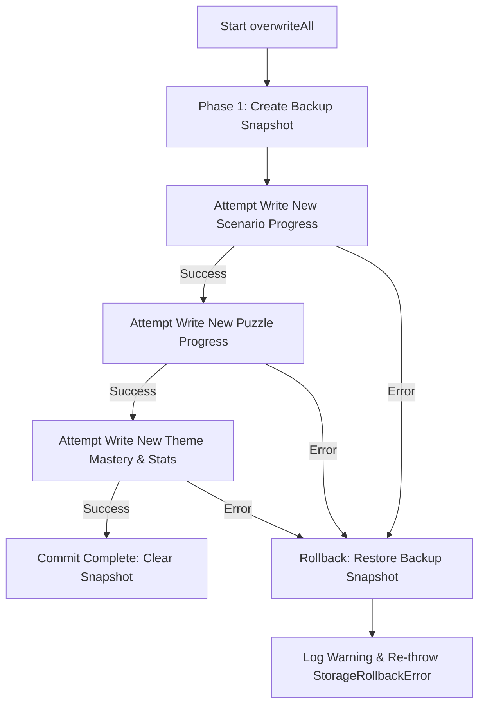

# Frozen Project Conventions & Architecture Standards: Fun Chess Remediation

**Status**: FROZEN CONTRACT
**Author**: @architect (System Architecture)
**Date**: 2026-09-07
**Scope**: Full Codebase Remediation (Findings CRIT-002, CRIT-003, CRIT-004, CRIT-006, CRIT-007, MAJ-004, MAJ-005, MAJ-006, MAJ-007, MAJ-008, MAJ-009, MAJ-010, MAJ-011, MAJ-012, MAJ-013, MAJ-014, MAJ-017, MAJ-019, MAJ-025, MIN-005, MIN-010, MIN-015, MIN-016, ENH-004, ENH-006, ENH-008, ENH-011)
**Target Locations**: Monorepo Root, `@fun-chess/shared`, `apps/server`, `apps/client`, `apps/e2e`, `tests`

---

## 1. Executive Summary & Principles

This document establishes the frozen coding, organization, and architectural conventions for all builders executing Scope Cards 1 through 7.

### Core Architectural Laws:
1. **Rule 1: I/O Isolation** — All I/O boundaries (browser storage, HTTP fetch, WebSockets, Web Audio, camera hardware, timers, network interfaces) MUST be abstracted behind interfaces with both production and test double implementations.
2. **Rule 2: Pure Business Logic** — Chess engine calculations, move validations, rating updates, and scenario step checks MUST remain pure functions (`state + input -> nextState + outcome`). Multimedia side effects (audio, haptics, confetti) MUST be triggered exclusively by UI presenter components in response to returned outcomes.
3. **Rule 3: Dependency Direction** — Dependencies point strictly inward toward business logic. Infrastructure implements interfaces defined by domain/application contracts. Dependencies are injected via constructors and wired at application entry points (Composition Roots).
4. **Strict Module Encapsulation** — Every feature and platform package MUST expose its public API strictly through a single root `index.ts`. Deep imports bypassing `index.ts` are strictly forbidden.
5. **Zero Silent Failures** — Empty `catch {}` blocks are rejected. Every exception must be either wrapped and rethrown, handled with a safe fallback and structured warning log, or reflected into observable UI state.

---

## 2. Directory Layout Conventions

The monorepo follows a strict **Context → Feature → Layer** vertical slice hierarchy per `project-structure.md`.

```
fun-chess/
├── apps/
│   ├── server/                         # Node.js HTTP + Socket.IO Backend
│   │   ├── src/
│   │   │   ├── index.ts                # Server Composition Root & Bootstrap
│   │   │   ├── features/               # Vertical business slices
│   │   │   │   ├── rooms/              # Room creation, matchmaking & sessions
│   │   │   │   ├── game/               # Move validation & chess engine bridge
│   │   │   │   └── lan/                # Network topology & Cloud Relay discovery
│   │   │   └── platform/               # Infrastructure & cross-cutting adapters
│   │   │       ├── config/             # Zod environment parsing & fail-fast
│   │   │       ├── http/               # HTTP server, routing & static file handler
│   │   │       ├── socket/             # Socket.IO setup, rate limiting & logging middleware
│   │   │       └── logger/             # Pino structured logger adapter
│   │   └── package.json
│   ├── client/                         # Vue 3 + Vite Frontend
│   │   ├── src/
│   │   │   ├── main.ts                 # Client Composition Root & Mount
│   │   │   ├── App.vue                 # Lightweight root shell (<200 lines)
│   │   │   ├── components/             # Decomposed shell components
│   │   │   │   ├── AppViewRouter.vue   # View switching router
│   │   │   │   ├── AppToastManager.vue # Toast notification container
│   │   │   │   └── AppModalContainer.vue # Modal presentation layer
│   │   │   ├── features/               # Client vertical slices
│   │   │   │   ├── lobby/              # Multiplayer lobby & match setup
│   │   │   │   ├── board/              # Board rendering & selection state machine
│   │   │   │   ├── ai/                 # Solo AI bot engine & arena
│   │   │   │   ├── puzzles/            # Daily puzzle runner & theme mastery
│   │   │   │   ├── scenarios/          # Interactive academy & mini-games
│   │   │   │   ├── portability/        # QR sync, import/export & backup codecs
│   │   │   │   ├── pwa/                # Service worker & network connectivity
│   │   │   │   ├── hud/                # Captured pieces, clocks & move history
│   │   │   │   └── modals/             # Matchmaking & settings dialogs
│   │   │   ├── platform/               # Browser I/O abstractions
│   │   │   │   ├── api/                # IApiClient & FetchApiClient (3s timeout)
│   │   │   │   ├── storage/            # KeyValueStorage & safe LocalStorage adapter
│   │   │   │   ├── audio/              # IAudioService & WebAudioSynthesizer
│   │   │   │   └── socket/             # Typed Socket.IO client factory
│   │   │   └── composables/            # Cross-cutting UI composables
│   │   │       ├── useTheme.ts         # Theme switching & CSS vars
│   │   │       ├── useNotification.ts  # Reactive toast queue
│   │   │       └── useSocket.ts        # Singleton multiplayer connection state
│   │   └── package.json
│   └── e2e/                            # Playwright End-to-End Test Suite
│       ├── tests/
│       │   ├── multiplayer.e2e.spec.ts
│       │   ├── ai_match.e2e.spec.ts
│       │   └── portability.e2e.spec.ts
│       ├── playwright.config.ts
│       └── package.json
├── shared/                             # @fun-chess/shared Core Package
│   ├── src/
│   │   ├── index.ts                    # Public shared export
│   │   ├── contracts/                  # Wire models, Zod schemas & error types
│   │   │   ├── models.ts
│   │   │   ├── schemas.ts
│   │   │   ├── events.ts
│   │   │   ├── errors.ts
│   │   │   └── api.ts
│   │   └── utils/                      # Pure algorithms & deterministic utilities
│   │       ├── chess_evaluation.ts     # Material advantage & captured pieces
│   │       ├── progress_codec.ts       # Canonical sorted JSON & CRC-32 checksums
│   │       ├── progress_merger/        # Decomposed sub-domain mergers
│   │       └── schema_validator.ts     # Declarative Zod validators
│   └── package.json
├── tests/                              # Monorepo Integration & Contract Test Suite
│   ├── contracts/                      # Socket & HTTP protocol contract tests
│   ├── integration/                    # Multi-client game integration tests
│   └── helpers/
│       └── test_server.ts              # Real server test harness factory
├── infra/                              # Terraform & Deployment manifests
└── vitest.config.ts                    # Root Vitest configuration with @vitest/coverage-v8
```

---

## 3. File Naming & Module Boundary Conventions

### 3.1 File Naming Standards
- **Interfaces / Contracts**: `{domain}.interface.ts` (e.g. `room.store.ts`, `api_client.interface.ts`, `audio.interface.ts`).
- **Domain Services**: `{domain}.service.ts` (e.g. `room.service.ts`, `game.service.ts`).
- **Store Implementations**: `in_memory_{domain}.store.ts` (server), `local_storage_{domain}.store.ts` (client).
- **Socket Handlers**: `{domain}.socket_handler.ts` (e.g. `room.socket_handler.ts`).
- **Vue Composables**: `use{Feature}.ts` in camelCase (e.g. `useBoardSelection.ts`, `useSocket.ts`).
- **Vue Components**: `PascalCase.vue` (e.g. `AppViewRouter.vue`, `ChessBoard.vue`).
- **Unit Tests**: `{name}.spec.ts` located adjacent to source file.
- **Contract Tests**: `{name}.contract.spec.ts` in `tests/contracts/`.
- **E2E Tests**: `{name}.e2e.spec.ts` in `apps/e2e/tests/`.

### 3.2 Module Boundary Encapsulation (MAJ-011)
- **Public API Rule**: Every directory under `features/` and `platform/` MUST export an `index.ts`.
- **No Deep Cross-Module Imports**:
  ```typescript
  // ❌ ILLEGAL: Bypassing feature public API (Causes circular dependencies & fragility)
  import { ChessEngine } from "../game/chess_engine.js";
  import { RoomStore } from "../rooms/room.store.js";
  import { useConfetti } from "../../composables/useConfetti.js";

  // ✅ CORRECT: Importing strictly from module public entry point
  import { ChessEngine } from "../game/index.js";
  import { type RoomStore } from "../rooms/index.js";
  import { useConfetti } from "@/platform/confetti/index.js";
  ```
- **Shared Package Independence**: `@fun-chess/shared` must never import from `apps/server` or `apps/client`.
- **Server Features Independence (MAJ-004)**: `features/rooms` and `features/game` must not cross-import concrete classes. Shared concepts (`ChessEngine`, `AppError`, `RoomState`) belong in `@fun-chess/shared` or interact via defined service interfaces.

---

## 4. Interface Patterns

### 4.1 Store / Repository Interface Pattern
All data stores must be asynchronous and abstract away storage mechanisms.

```typescript
// apps/server/src/features/rooms/room.store.ts
import type { RoomState, Player } from "@fun-chess/shared";

export interface RoomStore {
  /** Retrieves room by 4-letter code. Returns null if non-existent. */
  findByCode(roomCode: string): Promise<RoomState | null>;

  /** Saves or updates room state. Must support atomic concurrency control. */
  save(room: RoomState): Promise<void>;

  /** Deletes a room by code. */
  delete(roomCode: string): Promise<boolean>;

  /** Looks up room and player by active socketId. */
  findBySocketId(socketId: string): Promise<{ room: RoomState; player: Player } | null>;

  /** Returns total count of active rooms. */
  count(): Promise<number>;

  /** Prunes abandoned rooms older than maxAgeMs. */
  pruneAbandonedRooms(maxAgeMs: number): Promise<string[]>;

  /** Executes an isolated mutation inside a per-room async lock (CRIT-006) */
  withRoomLock<T>(roomCode: string, action: (room: RoomState) => Promise<T>): Promise<T>;
}
```

### 4.2 Safe Key-Value Browser Storage Pattern (MAJ-006, CRIT-003)
Isolates browser storage against Safari private mode exceptions and quota failures.

```typescript
// apps/client/src/platform/storage/storage.interface.ts
export interface KeyValueStorage {
  getItem(key: string): Promise<string | null>;
  setItem(key: string, value: string): Promise<void>;
  removeItem(key: string): Promise<void>;
  clear(): Promise<void>;
}

// apps/client/src/platform/storage/browser_storage_adapter.ts
export class BrowserStorageAdapter implements KeyValueStorage {
  constructor(private readonly storageType: "localStorage" | "sessionStorage") {}

  private get store(): Storage | null {
    try {
      if (typeof window === "undefined") return null;
      return window[this.storageType];
    } catch {
      return null; // Restricted environment (Safari Private, cross-origin iframe)
    }
  }

  async getItem(key: string): Promise<string | null> {
    try {
      return this.store?.getItem(key) ?? null;
    } catch {
      return null;
    }
  }

  async setItem(key: string, value: string): Promise<void> {
    try {
      this.store?.setItem(key, value);
    } catch (err) {
      if (err instanceof DOMException && (err.name === "QuotaExceededError" || err.code === 22)) {
        throw new StorageQuotaExceededError(`Storage quota exceeded for ${this.storageType}`, { cause: err });
      }
      throw new StorageUnavailableError(`Failed to access ${this.storageType}`, { cause: err });
    }
  }

  async removeItem(key: string): Promise<void> {
    try {
      this.store?.removeItem(key);
    } catch {
      // Safe no-op
    }
  }

  async clear(): Promise<void> {
    try {
      this.store?.clear();
    } catch {
      // Safe no-op
    }
  }
}
```

### 4.3 Audio Service Interface Pattern (MAJ-008, MAJ-009)
Abstracts Web Audio API so modules can be imported and tested without browser DOM side effects.

```typescript
// apps/client/src/platform/audio/audio.interface.ts
export interface IAudioService {
  /** Plays tactical game move sound effect */
  playMove(): void;
  /** Plays capture sound effect */
  playCapture(): void;
  /** Plays check alert sound */
  playCheck(): void;
  /** Plays game victory fanfare */
  playVictory(): void;
  /** Plays defeat sound */
  playDefeat(): void;
  /** Toggles global audio mute */
  toggleMute(): boolean;
  /** Audio mute status */
  isMuted(): boolean;
}

// apps/client/src/platform/audio/null_audio_service.ts
export class NullAudioService implements IAudioService {
  playMove(): void {}
  playCapture(): void {}
  playCheck(): void {}
  playVictory(): void {}
  playDefeat(): void {}
  toggleMute(): boolean { return false; }
  isMuted(): boolean { return true; }
}
```

---

## 5. Concurrency Control Pattern (CRIT-006)

To prevent lost updates between concurrent moves, resignations, draw acceptances, and disconnections, `InMemoryRoomStore` must serialize mutations per `roomCode` using a mutex queue.

```typescript
// apps/server/src/features/rooms/in_memory_room.store.ts
export class InMemoryRoomStore implements RoomStore {
  private readonly rooms = new Map<string, RoomState>();
  private readonly lockQueues = new Map<string, Promise<unknown>>();

  public async withRoomLock<T>(roomCode: string, action: (room: RoomState) => Promise<T>): Promise<T> {
    const code = roomCode.toUpperCase();
    const currentLock = this.lockQueues.get(code) || Promise.resolve();

    let resolveNext: () => void;
    const nextLock = new Promise<void>((resolve) => { resolveNext = resolve; });
    this.lockQueues.set(code, nextLock);

    try {
      await currentLock;
      const room = await this.findByCode(code);
      if (!room) throw new RoomNotFoundError(code);

      const result = await action(room);
      await this.save(room);
      return result;
    } finally {
      resolveNext!();
      if (this.lockQueues.get(code) === nextLock) {
        this.lockQueues.delete(code);
      }
    }
  }
}
```

---

## 6. Two-Phase Commit Storage Pattern (CRIT-003)

In `LocalStorageUnifiedStore.overwriteAll`, atomic transactional integrity is required to protect against quota exhaustion and partial writes:



```typescript
// apps/client/src/features/portability/store/local_storage_unified.store.ts
public async overwriteAll(progress: UnifiedProgress): Promise<void> {
  // Phase 1: Snapshot current state before executing any destructive operations
  const snapshot = await this.exportAll();

  try {
    // Stage updates
    await this.scenarioStore.resetAllProgress();
    for (const [id, item] of Object.entries(progress.scenarios)) {
      await this.scenarioStore.saveProgress(id, item);
    }
    await this.puzzleStore.importAllProgress(progress.puzzles);
    await this.saveThemeMastery(progress.themeMastery);
    await this.saveArcadeStats(progress.arcadeStats);
  } catch (err) {
    // Phase 2: Rollback to snapshot on ANY failure
    try {
      await this.restoreFromSnapshot(snapshot);
    } catch (rollbackErr) {
      console.error("FATAL: Failed to restore snapshot during rollback", rollbackErr);
    }
    throw new StorageRollbackError("Failed to overwrite progress; rolled back to previous state", { cause: err });
  }
}
```

---

## 7. Error Handling Patterns

### 7.1 Custom Domain Error Hierarchy (`shared/src/contracts/errors.ts`)
```typescript
import { ErrorCode } from "./errors.js";

export abstract class AppError extends Error {
  public readonly isAppError = true;

  constructor(
    public readonly code: ErrorCode,
    message: string,
    public readonly statusCode: number = 400,
    public readonly details?: Record<string, unknown>,
    public readonly cause?: Error
  ) {
    super(message);
    this.name = this.constructor.name;
    Object.setPrototypeOf(this, new.target.prototype);
  }
}

export class RoomNotFoundError extends AppError {
  constructor(roomCode: string) {
    super("ERR_ROOM_NOT_FOUND", `Room with code '${roomCode}' does not exist`, 404, { roomCode });
  }
}

export class RoomFullError extends AppError {
  constructor(roomCode: string) {
    super("ERR_ROOM_FULL", `Room '${roomCode}' already has 2 active players`, 409, { roomCode });
  }
}

export class InvalidMoveError extends AppError {
  constructor(reason: string, details?: Record<string, unknown>) {
    super("ERR_INVALID_MOVE", `Illegal chess move: ${reason}`, 422, details);
  }
}

export class RateLimitExceededError extends AppError {
  constructor(message: string = "Rate limit exceeded. Please wait.", details?: Record<string, unknown>) {
    super("ERR_RATE_LIMITED", message, 429, details);
  }
}

export class UnauthorizedError extends AppError {
  constructor(message: string = "Invalid or expired session credentials") {
    super("ERR_UNAUTHORIZED", message, 401);
  }
}
```

### 7.2 Zero-Tolerance Empty Catch Block Rule (MAJ-025)
Every `catch` block must either rethrow or record structured diagnostics:

```typescript
// ❌ REJECTED: Silent failure causes diagnostic blindness
try {
  const parsed = JSON.parse(data);
} catch {}

// ✅ COMPLIANT: Structured fallback with diagnostic observability
try {
  const parsed = JSON.parse(data);
} catch (err) {
  logger.warn("Failed to parse progress JSON payload, falling back to default", {
    operation: "parse_progress",
    error: err instanceof Error ? err.message : String(err),
  });
  return DEFAULT_PROGRESS;
}
```

---

## 8. Logging & Observability Patterns

### 8.1 Universal 3-Point Operation Logging Mandate
Every operation entry point (Socket event, HTTP route, background job) MUST log 3 points:
1. **Start**: `{ operation, correlationId, [userId/socketId], payload }`
2. **Success**: `{ operation, correlationId, duration, status: "success" }`
3. **Failure**: `{ operation, correlationId, duration, status: "failed", error }`

### 8.2 Background Job Logging Helper (MAJ-017)
```typescript
// apps/server/src/platform/logger/job_runner.ts
export async function runLoggedJob<T>(
  logger: Logger,
  operation: string,
  jobFn: (correlationId: string) => Promise<T>
): Promise<T> {
  const correlationId = randomUUID();
  const startTime = performance.now();

  logger.info(`Background job started: ${operation}`, {
    operation,
    correlationId,
    timestamp: new Date().toISOString(),
  });

  try {
    const result = await jobFn(correlationId);
    const duration = Math.round(performance.now() - startTime);

    logger.info(`Background job succeeded: ${operation}`, {
      operation,
      correlationId,
      duration,
      status: "success",
      result: typeof result === "object" ? result : { count: result },
    });

    return result;
  } catch (err: unknown) {
    const duration = Math.round(performance.now() - startTime);

    logger.error(`Background job failed: ${operation}`, {
      operation,
      correlationId,
      duration,
      status: "failed",
      error: err instanceof Error ? { name: err.name, message: err.message, stack: err.stack } : { raw: err },
    });

    throw err;
  }
}
```

### 8.3 Context Standardization (MIN-015)
- Execution time field is named **`duration`** (in integer milliseconds). Do NOT use `durationMs` or `timeTaken`.
- Authenticated user ID is mapped to **`userId`**.

---

## 9. Dependency Injection & Composition Root Patterns

### 9.1 Rules of Dependency Injection
1. **Pure Constructor Injection**: All classes accept dependencies via constructors as interfaces (`RoomStore`, `Logger`, `IApiClient`).
2. **No Default Constructor Parameters**: Default parameters (`store = new InMemoryRoomStore()`) hide coupling and cause state leakage between test runs.
3. **No Mutable Module Singletons (MAJ-010)**: Eliminate exported mutable module-level instances.
4. **Composition Root Wires Main**: `apps/server/src/index.ts` and `apps/client/src/main.ts` are the ONLY files permitted to instantiate concrete classes and wire them together.

### 9.2 Server Composition Root (`apps/server/src/index.ts`)
```typescript
// Step 1: Validate Environment
const env = loadServerConfig(process.env);

// Step 2: Initialize Logger
const logger = new PinoLogger(env.LOG_LEVEL);

// Step 3: Instantiate Stores & Registries
const roomStore = new InMemoryRoomStore();
const sessionRegistry = new InMemorySessionRegistry();
const rateLimiter = new SocketRateLimiter(60_000, 100);

// Step 4: Instantiate Services
const addressService = new RelayAddressService(env);
const gameService = new GameService(roomStore);
const roomService = new RoomService(roomStore, sessionRegistry);

// Step 5: Wire Ingress Infrastructure
const { server, handleRequest } = createHttpServer({
  port: env.PORT,
  logger,
  roomStore,
  addressService,
  allowedOrigins: resolveAllowedOrigins(env),
});

const io = createSocketServer({
  server,
  roomService,
  gameService,
  logger,
  rateLimiter,
  allowedOrigins: resolveAllowedOrigins(env),
});

// Step 6: Process Crash Guards (CRIT-002)
server.on("error", (err: Error) => {
  logger.fatal("HTTP server fatal socket error", { error: { name: err.name, message: err.message, stack: err.stack } });
  process.exit(1);
});

process.on("unhandledRejection", (reason: unknown) => {
  logger.error("Unhandled promise rejection", { error: reason instanceof Error ? { name: reason.name, message: reason.message, stack: reason.stack } : { raw: reason } });
});

process.on("uncaughtException", (err: Error) => {
  logger.fatal("Uncaught exception, initiating emergency shutdown", { error: { name: err.name, message: err.message, stack: err.stack } });
  process.exit(1);
});
```

### 9.3 Test Harness Server Wiring (`tests/helpers/test_server.ts`) (CRIT-004)
The shadow server is eliminated. `createTestServer` instantiates and wires real production classes with an ephemeral port (`port: 0`):

```typescript
export async function createTestServer(): Promise<TestServerInstance> {
  const logger = new NullLogger();
  const roomStore = new InMemoryRoomStore();
  const sessionRegistry = new InMemorySessionRegistry();
  const rateLimiter = new SocketRateLimiter(60_000, 1000);
  const addressService = new RelayAddressService({ NODE_ENV: "test", PORT: 0 });
  const gameService = new GameService(roomStore);
  const roomService = new RoomService(roomStore, sessionRegistry);

  const { server } = createHttpServer({
    port: 0,
    logger,
    roomStore,
    addressService,
    allowedOrigins: ["*"],
  });

  const io = createSocketServer({
    server,
    roomService,
    gameService,
    logger,
    rateLimiter,
    allowedOrigins: ["*"],
  });

  await new Promise<void>((resolve) => server.listen(0, "127.0.0.1", resolve));
  const address = server.address() as net.AddressInfo;
  const port = address.port;
  const url = `http://127.0.0.1:${port}`;

  return {
    server,
    io,
    port,
    url,
    roomStore,
    close: async () => {
      io.close();
      await new Promise<void>((resolve) => server.close(() => resolve()));
    },
  };
}
```

---

## 10. Skeleton Feature Directory Reference

Below is the standard blueprint for a vertical feature module (`features/rooms`):

```
features/rooms/
├── index.ts                     # Public API exports ONLY
├── room.interface.ts            # Public feature contracts & interfaces
├── room.service.ts              # Business logic & room lifecycle orchestrator
├── room.store.ts                # Storage abstraction contract
├── in_memory_room.store.ts      # Concrete in-memory store implementation
├── session.registry.ts          # Private session credential registry
├── room.socket_handler.ts       # Socket event registration & dispatch
└── __tests__/
    ├── room.service.spec.ts     # Unit tests with MockRoomStore
    └── in_memory_room.store.spec.ts # Concurrency & lock unit tests
```

### Reference Implementation Code:

#### `room.interface.ts`
```typescript
import type { RoomState, CreateRoomRequest, JoinRoomRequest, Player } from "@fun-chess/shared";

export interface IRoomService {
  createRoom(req: CreateRoomRequest, socketId: string): Promise<{ room: RoomState; sessionToken: string; player: Player }>;
  joinRoom(req: JoinRoomRequest, socketId: string): Promise<{ room: RoomState; sessionToken: string; player: Player }>;
  reconnect(roomCode: string, playerId: string, sessionToken: string, newSocketId: string): Promise<{ room: RoomState; player: Player }>;
  leaveRoom(roomCode: string, socketId: string): Promise<{ room: RoomState; leftPlayer: Player }>;
}
```

#### `index.ts`
```typescript
/**
 * Public API for features/rooms.
 * Cross-module callers must import exclusively from this file.
 */
export type { IRoomService } from "./room.interface.js";
export type { RoomStore } from "./room.store.js";
export { RoomService } from "./room.service.js";
export { InMemoryRoomStore } from "./in_memory_room.store.js";
export { registerRoomSocketHandlers } from "./room.socket_handler.js";
```
