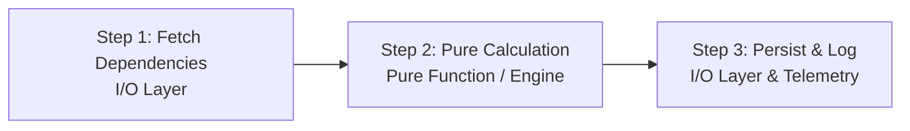

# Frozen Project Conventions & Architecture Standards: Fun Chess Remediation

**Status**: FROZEN CONTRACT
**Author**: System Architect (`@architect`)
**Date**: 2026-09-08
**Scope**: Full Monorepo Architecture Standards (CRIT-004, CRIT-005, MAJ-011, MAJ-012, MAJ-013, MAJ-014, MAJ-015, MAJ-016, MAJ-017, MAJ-018, MAJ-019, MAJ-020, MAJ-021, MAJ-022)
**Target Packages**: Monorepo Root, `@fun-chess/shared`, `@fun-chess/server`, `@fun-chess/client`, `@fun-chess/e2e`

---

## 1. Executive Summary & Architectural Laws

This document establishes the frozen coding, organization, and architectural conventions for all builders and tech leads executing Scope Cards **SC-01** through **SC-09**. Every engineer must follow these rules without deviation.

### Core Architectural Laws:
1. **Rule 1: I/O Isolation** — All I/O boundaries (browser storage, HTTP fetch, WebSockets, Web Audio, camera streams, clipboard, WebRTC, timers, and ID/time generation) MUST be abstracted behind interfaces with both production and test double implementations (`MAJ-015`, `MAJ-016`).
2. **Rule 2: Pure Business Logic** — State transitions, color assignments, chess engine rules, rating updates, and puzzle validation MUST reside in pure functions following the **Fetch → Calculate → Persist** sequence. Never execute I/O or invoke loggers inside pure algorithmic functions (`MAJ-013`).
3. **Rule 3: Dependency Direction** — Dependencies point strictly inward toward business logic. Domain features depend only on interface contracts defined in the domain or shared layer. Infrastructure implements interfaces defined by the domain layer. All dependencies are injected via constructor DI (server) or Vue DI (client) and wired at Composition Roots (`MAJ-011`, `MAJ-012`, `MAJ-014`).
4. **Strict Module Boundaries** — Every feature and platform package MUST expose its public API strictly through a single root `index.ts`. Deep imports bypassing `index.ts` are strictly forbidden (`MAJ-012`).
5. **Universal Observability** — Every operation entry point MUST implement 3-point structured logging with a correlation ID. Invariant message templates are mandatory. Direct `console.*` calls in client feature code are strictly prohibited (`MAJ-017`, `MAJ-018`, `MAJ-019`, `MAJ-020`, `MAJ-021`).

---

## 2. Feature Vertical Slice Conventions

### 2.1 Monorepo Structural Philosophy (`project-structure.md`)
The codebase is organized by **Vertical Business Feature Slices**, not by technical layers:
- **Root**: Contains `shared/`, `apps/server/`, `apps/client/`, `apps/e2e/`.
- **Level 2 Feature Slices**: Grouped inside `src/features/<feature-name>/`.
- **Level 3 Platform/Infrastructure**: Grouped inside `src/platform/<platform-name>/`.

### 2.2 Server Feature Layout Template (`apps/server/src/features/`)
Each server feature is an encapsulated vertical slice:
```
apps/server/src/features/<feature_name>/
├── index.ts                 # Mandatory public API barrel (Service & Interface exports ONLY)
├── <feature>.interface.ts   # Public domain contracts & service interfaces
├── <feature>.service.ts     # Orchestration service (owns transactions, calls pure logic)
├── <feature>.logic.ts       # Pure state transitions & business calculations (ZERO I/O, NO LOGGERS)
├── <feature>.store.ts       # Abstract storage interface (Rule 1: I/O Isolation)
├── in_memory_<feature>.store.ts # Production in-memory store adapter
├── mock_<feature>.store.ts  # Test double store adapter
├── <feature>.socket_handler.ts # Socket.IO event ingress (optional)
├── <feature>.controller.ts  # Native HTTP controller (optional)
├── <feature>.errors.ts      # Feature-specific custom errors
└── __tests__/               # Co-located unit & integration tests
    ├── <feature>.logic.spec.ts
    ├── <feature>.service.spec.ts
    └── in_memory_<feature>.store.spec.ts
```

### 2.3 Client Feature Layout Template (`apps/client/src/features/`)
Each client feature encapsulates components, composables, and feature-specific state:
```
apps/client/src/features/<feature_name>/
├── index.ts                 # Public API barrel (Exports components, composables, stores)
├── components/              # Vue UI components private to this feature
│   ├── <Component>.vue
│   └── index.ts
├── composables/             # Reactive feature state & lifecycle composables
│   ├── use<Feature>.ts
│   └── index.ts
├── stores/                  # Pinia or reactive progress stores (optional)
│   ├── <feature>.store.ts
│   └── index.ts
└── __tests__/               # Co-located component & composable tests
    ├── <Component>.spec.ts
    └── use<Feature>.spec.ts
```

### 2.4 Barrel Export & Module Boundary Invariants
1. **Public API Only in `index.ts`**:
   - Features MUST export only public services, public interface contracts, and public components/composables.
   - Internal helper files, pure logic transition functions (`room.logic.ts`), and concrete store implementations (`in_memory_room.store.ts`) MUST NOT be imported across features.
2. **Cross-Feature Interaction Rule**:
   - A feature MUST interact with another feature ONLY by importing that feature's **public Service or Adapter interface** from its root `index.ts`.
   - *Violation (`MAJ-012`)*: `GameService` importing `room.logic.ts` and `room.store.ts` directly.
   - *Compliant*: `GameService` receiving `IRoomGameAdapter` injected via constructor from `apps/server/src/features/rooms/index.ts`.
3. **No Circular Dependencies**:
   - Circular imports between modules are strictly forbidden. Interfaces shared between callers and implementations must be extracted to an upstream `.interface.ts` file (`MAJ-011`).

---

## 3. Pure Business Logic Rules [MAJ-013]

### 3.1 The Three-Step Pattern
All algorithmic calculations, chess rules, validation logic, rating systems, and state transitions must be pure functions without side-effects or I/O.
Every operation follows:
$$\text{Fetch Dependencies} \longrightarrow \text{Pure Calculation} \longrightarrow \text{Persist \& Log Result}$$



### 3.2 Chess Engine Purity (`apps/server/src/features/game/chess_engine.ts`)
- **Impurity Removed (`MAJ-013`)**: The chess engine previously imported `logger` from `../../platform/logger/` and emitted operational logs inside `validateAndApplyMove`.
- **Pure Contract**:
  - `ChessEngine` methods MUST NOT import `logger`, `console.*`, or any I/O module.
  - Returns a pure `MoveApplicationResult` or `ChessMoveOutcome` containing all move metrics, check status, and game-over state.
  - Logging is performed exclusively by the caller (`GameService` or `game.socket_handler.ts`).
  - Time must be supplied as a parameter (`now: number`); never call `Date.now()` inside the engine (`MAJ-016`).

### 3.3 Puzzle Engine Purity (`apps/client/src/features/puzzles/engine/`)
- **Impurity Removed (`MAJ-013`)**: `puzzle_validator.ts` and `puzzle_analysis_engine.ts` previously imported singleton `logger` from `@/platform/telemetry` and performed side-effect logging.
- **Pure Contract**:
  - `validatePuzzleMove(...)` is a pure function: `(puzzle: Puzzle, playedMove: string, currentStep: number) => PuzzleValidationResult`.
  - `analyzePositionMotifs(...)` is a pure function: `(fen: string, moveHistory: string[]) => MotifAnalysisResult`.
  - Logging is delegated to the calling composable (`usePuzzleGame.ts` or `usePuzzleAnalysis.ts`).

---

## 4. Structured Logging Patterns [MAJ-017, MAJ-018, MAJ-019, MAJ-020, MAJ-021]

### 4.1 Mandatory 3-Point Operation Logging
Every operation entry point (HTTP endpoints, WebSocket event handlers, background jobs, system lifecycle events, and progress export/import operations) MUST emit structured logs at three precise points:
1. **Operation Start**: Log entry with operation name, correlation ID, and sanitized input parameters.
2. **Operation Success**: Log completion with operation name, correlation ID, duration in milliseconds (`durationMs`), and result summary identifiers.
3. **Operation Failure**: Log error with operation name, correlation ID, duration in milliseconds, error code, message, and sanitized error context.

```typescript
// Standard 3-Point Logging Template
const correlationId = options?.correlationId ?? generateCorrelationId();
const startTime = performance.now();

logger.info("Operation started", {
  operation: "export_progress",
  correlationId,
  format: "json",
});

try {
  const result = await doWork();
  const durationMs = Math.round(performance.now() - startTime);

  logger.info("Operation completed", {
    operation: "export_progress",
    correlationId,
    durationMs,
    payloadSize: result.length,
    status: "success",
  });

  return result;
} catch (err) {
  const durationMs = Math.round(performance.now() - startTime);

  logger.error("Operation failed", {
    operation: "export_progress",
    correlationId,
    durationMs,
    error: err instanceof Error ? err.message : String(err),
    stack: err instanceof Error ? err.stack : undefined,
    status: "failure",
  });

  throw err;
}
```

### 4.2 Invariant Static Message Templates [MAJ-020]
Log message strings must be **static invariant templates**. Variable runtime values must be passed in the structured metadata payload, never interpolated into the message string.

- ❌ **Forbidden (High-Cardinality Anti-Pattern)**:
  ```typescript
  logger.info(`HTTP Request: ${method} ${pathname}`);
  logger.info(`HTTP Response: ${method} ${pathname} [${statusCode}]`);
  logger.info(`Player ${playerName} moved ${move.san} in room ${roomCode}`);
  ```
- ✅ **Mandatory (Static Invariant Template)**:
  ```typescript
  logger.info("HTTP request received", {
    operation: "http_request",
    correlationId,
    method,
    path: pathname,
  });

  logger.info("HTTP request completed", {
    operation: "http_response",
    correlationId,
    method,
    path: pathname,
    statusCode,
    durationMs,
  });

  logger.info("Game move executed", {
    operation: "game_move",
    correlationId,
    roomCode,
    moveNumber,
    san: move.san,
  });
  ```

### 4.3 Sensitive Key Redaction Invariants [MAJ-021]
The following sensitive keys MUST be redacted in all server loggers (`pino_logger.ts`), background job sanitizers (`job_runner.ts`), and socket middleware (`socket_logging_middleware.ts`):
- `sessionToken`, `session_token`
- `token`, `tokens`
- `bearer`
- `credential`, `credentials`
- `password`
- `secret`, `secrets`
- `authorization`
- Wildcard nested paths: `*.sessionToken`, `*.credential`, `*.credentials`, `*.bearer`

### 4.4 Client Telemetry Mandate [MAJ-017]
- Direct calls to `console.log`, `console.warn`, `console.info`, and `console.error` in client feature code are strictly prohibited.
- All client logging MUST use `logger` from `@/platform/telemetry` or the injected `LOGGER_KEY`.

---

## 5. PWA & Network Composables Deduplication Architecture [CRIT-004]

### 5.1 The Duplication Defect
Previously, two duplicate sets of PWA and network composables existed with divergent implementations and split test suites:
- `apps/client/src/composables/usePwaInstall.ts`
- `apps/client/src/features/pwa/composables/usePwaInstall.ts`
- `apps/client/src/composables/useNetworkStatus.ts`
- `apps/client/src/features/pwa/composables/useNetworkStatus.ts`

This caused multiple window event listeners, memory leaks, desynchronized offline states, and consumed `beforeinstallprompt` crashes.

### 5.2 Canonical Architecture

```
apps/client/src/features/pwa/
├── composables/
│   ├── usePwaInstall.ts      # CANONICAL SINGLETON & FACTORY
│   ├── useNetworkStatus.ts   # CANONICAL SINGLETON & FACTORY
│   └── index.ts
├── components/
│   ├── OfflineIndicator.vue
│   ├── PwaInstallBanner.vue
│   ├── PwaInstallModal.vue
│   └── index.ts
├── __tests__/
│   ├── usePwaInstall.spec.ts # UNIFIED TEST SUITE
│   ├── useNetworkStatus.spec.ts # UNIFIED TEST SUITE
│   ├── OfflineIndicator.spec.ts
│   └── PwaInstallBanner.spec.ts
└── index.ts                  # Public API barrel
```

### 5.3 Remediation Rules
1. **Delete Duplicates**:
   - Delete `apps/client/src/composables/usePwaInstall.ts` and `useNetworkStatus.ts`.
   - Delete `apps/client/src/composables/__tests__/usePwaInstall.spec.ts` and `useNetworkStatus.spec.ts`.
2. **Backwards-Compatibility Re-Export**:
   In `apps/client/src/composables/index.ts`:
   ```typescript
   // Re-export canonical PWA & Network composables from feature vertical slice (CRIT-004)
   export { usePwaInstall, useNetworkStatus } from '../features/pwa';
   ```
3. **Event Listener Lifecycle**:
   - `beforeinstallprompt`, `appinstalled`, `online`, `offline` event listeners must be guarded against duplicate registration.
   - Listeners registered in components or scoped composables must clean up on `onScopeDispose` or `onUnmounted`.

---

## 6. Client Multiplayer Composable Architecture [CRIT-005]

### 6.1 The Monolithic Antipattern
`apps/client/src/composables/useSocket.ts` previously spanned 1,329 lines in a generic directory, mixing transport, session storage, game state, and 21 unlogged event listeners with `as any` casts.

### 6.2 Decomposed Multiplayer Architecture (`apps/client/src/features/multiplayer/`)

```
apps/client/src/features/multiplayer/
├── index.ts                      # Public API barrel
├── MultiplayerArena.vue          # Container component
├── composables/
│   ├── index.ts                  # Composables barrel
│   ├── useSocketTransport.ts     # Connection lifecycle & typed socket communication
│   ├── useRoomSession.ts         # Room lifecycle, matchmaking & sessionStorage persistence
│   ├── useGameActions.ts         # Move submission, draw, resign, rematch actions
│   └── useMultiplayer.ts         # Unified facade combining transport, session, and game actions
└── __tests__/
    ├── useSocketTransport.spec.ts
    ├── useRoomSession.spec.ts
    ├── useGameActions.spec.ts
    └── useMultiplayer.spec.ts
```

### 6.3 Specialized Composable Responsibilities

#### 1. `useSocketTransport`
- **Scope**: Raw transport, connection state, auto-reconnect backoff, latency ping.
- **Exposes**:
  - `isConnected: Ref<boolean>`
  - `isReconnecting: Ref<boolean>`
  - `connectionError: Ref<string | null>`
  - `latencyMs: Ref<number>`
  - `connect(serverUrl?: string): void`
  - `disconnect(): void`
  - `emit<K>(event: K, req: Req, callback?: Ack): void`
- **Observability**: Intercepts all incoming and outgoing socket packets with structured telemetry logging.

#### 2. `useRoomSession`
- **Scope**: Room joining, creation, leaving, spectator tracking, session token storage (`sessionStorage`).
- **Exposes**:
  - `roomState: Ref<RoomState | null>`
  - `player: Ref<Player | null>`
  - `isHost: ComputedRef<boolean>`
  - `isSpectator: ComputedRef<boolean>`
  - `savedSession: Ref<SavedSession | null>`
  - `createRoom(req: CreateRoomRequest): Promise<void>`
  - `joinRoom(req: JoinRoomRequest): Promise<void>`
  - `leaveRoom(): Promise<void>`
  - `reconnect(): Promise<void>`

#### 3. `useGameActions`
- **Scope**: In-game state, chess move execution with idempotency (`expectedMoveNumber`), draw negotiations, resignations, and rematches.
- **Exposes**:
  - `gameState: ComputedRef<GameState | null>`
  - `turn: ComputedRef<PieceColor>`
  - `isCheck: ComputedRef<boolean>`
  - `isCheckmate: ComputedRef<boolean>`
  - `gameOverPayload: Ref<GameOverPayload | null>`
  - `makeMove(move: MovePayload): Promise<void>`
  - `resign(): Promise<void>`
  - `offerDraw(): Promise<void>`
  - `respondDraw(accept: boolean): Promise<void>`
  - `requestRematch(): Promise<void>`
  - `respondRematch(accept: boolean): Promise<void>`

#### 4. Unified Facade & Backwards Compatibility
- `useMultiplayer.ts` combines the 3 specialized composables into a unified reactive state.
- `apps/client/src/composables/useSocket.ts` is refactored to a lightweight adapter re-exporting `useMultiplayer()` so existing components continue to function seamlessly during migration.

---

## 7. Vue DI Tokens and Injection Helpers [MAJ-014]

### 7.1 Problem Statement
`main.ts` defined 11 DI tokens via `app.provide()`, but 26+ client components and composables directly imported singletons (`safeLocalStorage`, `apiClient`, `audioSynthesizer`, `logger`), bypassing DI and forcing tests to mutate module globals.

### 7.2 Injection Helper Architecture (`apps/client/src/platform/di/`)
Every token in `apps/client/src/platform/di/tokens.ts` must have a corresponding typed injection helper that supports an optional fallback or throws an informative error when unbound:

```typescript
// apps/client/src/platform/di/helpers.ts
import { inject } from 'vue';
import {
  API_CLIENT_KEY,
  STORAGE_KEY,
  SESSION_STORAGE_KEY,
  AUDIO_SERVICE_KEY,
  LOGGER_KEY,
  SCENARIO_STORE_KEY,
  PUZZLE_STORE_KEY,
  FILE_DOWNLOADER_KEY,
  HAPTICS_KEY,
  WEBRTC_DISCOVERY_KEY,
  CLIPBOARD_SERVICE_KEY,
  CAMERA_SERVICE_KEY,
  type IApiClient,
  type KeyValueStorage,
  type IAudioService,
  type ILogger,
  type IFileDownloader,
  type IHapticsService,
  type IWebRtcDiscovery,
} from './tokens';
import type { IClipboardService, ICameraService } from '../hardware';
import type { ScenarioProgressStore, PuzzleProgressStore } from '@fun-chess/shared';

export function useApiClient(custom?: IApiClient): IApiClient {
  return custom ?? inject(API_CLIENT_KEY) ?? throwMissingDI('API_CLIENT');
}

export function useStorage(custom?: KeyValueStorage): KeyValueStorage {
  return custom ?? inject(STORAGE_KEY) ?? throwMissingDI('STORAGE');
}

export function useSessionStorage(custom?: KeyValueStorage): KeyValueStorage {
  return custom ?? inject(SESSION_STORAGE_KEY) ?? throwMissingDI('SESSION_STORAGE');
}

export function useAudioService(custom?: IAudioService): IAudioService {
  return custom ?? inject(AUDIO_SERVICE_KEY) ?? throwMissingDI('AUDIO_SERVICE');
}

export function useLogger(custom?: ILogger): ILogger {
  return custom ?? inject(LOGGER_KEY) ?? throwMissingDI('LOGGER');
}

export function useScenarioStore(custom?: ScenarioProgressStore): ScenarioProgressStore {
  return custom ?? inject(SCENARIO_STORE_KEY) ?? throwMissingDI('SCENARIO_STORE');
}

export function usePuzzleStore(custom?: PuzzleProgressStore): PuzzleProgressStore {
  return custom ?? inject(PUZZLE_STORE_KEY) ?? throwMissingDI('PUZZLE_STORE');
}

export function useClipboardService(custom?: IClipboardService): IClipboardService {
  return custom ?? inject(CLIPBOARD_SERVICE_KEY) ?? throwMissingDI('CLIPBOARD_SERVICE');
}

export function useCameraService(custom?: ICameraService): ICameraService {
  return custom ?? inject(CAMERA_SERVICE_KEY) ?? throwMissingDI('CAMERA_SERVICE');
}

function throwMissingDI(name: string): never {
  throw new Error(`Vue DI binding [${name}] not provided in current injection context`);
}
```

---

## 8. Error Handling & Sentinel Error Patterns

### 8.1 Error Hierarchy (`shared/src/contracts/errors.ts`)
All domain errors inherit from `AppError`:
```typescript
export abstract class AppError extends Error {
  abstract readonly statusCode: number;
  abstract readonly code: string;
  readonly details?: Record<string, unknown>;

  constructor(message: string, details?: Record<string, unknown>) {
    super(message);
    this.name = this.constructor.name;
    this.details = details;
    Object.setPrototypeOf(this, new.target.prototype);
  }
}
```

### 8.2 Standard Domain Sentinel Errors
| Error Class | HTTP Status | Code String | Used In |
|---|---|---|---|
| `RoomNotFoundError` | 404 | `ERR_ROOM_NOT_FOUND` | RoomService, GameService |
| `RoomAlreadyExistsError` | 409 | `ERR_ROOM_ALREADY_EXISTS` | InMemoryRoomStore (`CRIT-003`) |
| `RoomFullError` | 409 | `ERR_ROOM_FULL` | RoomService |
| `PlayerNotInRoomError` | 403 | `ERR_PLAYER_NOT_IN_ROOM` | GameService |
| `NotYourTurnError` | 400 | `ERR_NOT_YOUR_TURN` | GameService |
| `InvalidMoveError` | 400 | `ERR_INVALID_MOVE` | GameService, ChessEngine |
| `OptimisticLockConflictError` | 409 | `ERR_LOCK_CONFLICT` | InMemoryRoomStore, GameService |
| `LockTimeoutError` | 504 | `ERR_LOCK_TIMEOUT` | InMemoryRoomStore |
| `LockExecutionTimeoutError` | 504 | `ERR_LOCK_EXECUTION_TIMEOUT` | InMemoryRoomStore (`CRIT-002`) |
| `StaleLockExecutionError` | 409 | `ERR_STALE_LOCK_EXECUTION` | InMemoryRoomStore (`CRIT-002`) |

---

## 9. Skeleton Reference Feature Directory Layout

### 9.1 Server Reference Feature (`apps/server/src/features/rooms/`)
```
apps/server/src/features/rooms/
├── index.ts                     # Public API barrel: exports RoomService, InMemoryRoomStore, IRoomService, IRoomGameAdapter
├── room.interface.ts            # IRoomService & IRoomGameAdapter public interface contracts
├── room.service.ts              # Room orchestration service
├── room.logic.ts                # Pure state transition functions (applyLeaveTransition, etc.)
├── room.store.ts                # Abstract IRoomStore interface
├── in_memory_room.store.ts      # Production in-memory room store with monotonic tickets (CRIT-002, CRIT-003)
├── mock_room.store.ts           # Mock store for unit testing
├── room.socket_handler.ts       # Socket event listeners (room:create, room:join, room:leave, room:reconnect)
├── room.errors.ts               # Feature custom errors
├── session_registry.ts          # Session registry interface
├── in_memory_session_registry.ts # Synchronized session storage (MAJ-034)
├── disconnect_timer_registry.ts # Disconnect timer manager under lock (MAJ-028)
└── __tests__/
    ├── room.logic.spec.ts       # Pure state transitions tests
    ├── room.service.spec.ts     # Service orchestration tests
    ├── in_memory_room.store.spec.ts # Store concurrency & CAS tests
    ├── concurrency.spec.ts      # Monotonic ticket & timeout tests (CRIT-002, CRIT-003)
    └── room.socket_handler.spec.ts # Ingress event tests
```

### 9.2 Client Reference Feature (`apps/client/src/features/pwa/`)
```
apps/client/src/features/pwa/
├── index.ts                     # Public API barrel: exports usePwaInstall, useNetworkStatus, components
├── composables/
│   ├── index.ts                 # Composables barrel
│   ├── usePwaInstall.ts         # Canonical PWA install prompt composable
│   └── useNetworkStatus.ts      # Canonical network status composable
├── components/
│   ├── index.ts                 # Components barrel
│   ├── OfflineIndicator.vue     # Offline banner component
│   ├── PwaInstallBanner.vue     # Install prompt banner
│   └── PwaInstallModal.vue      # Install instructions modal
└── __tests__/
    ├── usePwaInstall.spec.ts    # Composable unit tests
    ├── useNetworkStatus.spec.ts # Composable unit tests
    ├── OfflineIndicator.spec.ts # Component tests
    └── PwaInstallBanner.spec.ts # Component tests
```
