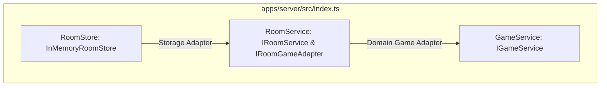

# Fun-Chess Monorepo Architectural Patterns & Engineering Conventions

## 1. Overview and Design Principles

<!-- architecture: ARCH-CONVENTIONS-001 -->
This document establishes the **authoritative architectural conventions, code idioms, and quality standards** for the Fun-Chess monorepo. It binds all Tech-Leads, Builders, and specialized subagents during the audit remediation lifecycle.

### Core Universal Invariants
1. **I/O Isolation (Rule 1)**: All network, storage, timer, randomness, and DOM interactions MUST be abstracted behind interfaces. Every I/O boundary must have a production implementation and a test double.
2. **Pure Business Logic (Rule 2)**: Core domain rules, calculations, chess rules, and state transformations MUST be pure functions (no side effects, deterministic inputs to outputs). The sequence is always: **Fetch dependencies -> Pure logic -> Persist result**.
3. **Dependency Direction (Rule 3)**: Dependencies point strictly inward toward pure business logic:
   $$\text{Infrastructure / Platform} \longrightarrow \text{Contracts / Interfaces} \longleftarrow \text{Domain / Business Logic}$$
4. **Structured Observability**: Every operation entry point MUST be instrumented with 3-point structured logging using static message strings, correlation IDs, and explicit durations. Raw `console.*` is strictly forbidden.
<!-- end architecture -->

---

## 2. Monorepo Directory Structure & Vertical Slice Architecture

### 2.1 Workspace Structure Overview

The repository is organized as a pnpm monorepo following the **Context $\to$ Feature $\to$ Layer** principle:

```text
fun-chess/
├── shared/                       # @fun-chess/shared (Contracts, models, pure utilities)
│   └── src/
│       ├── contracts/            # Schemas, interfaces, events, errors, system tokens
│       │   ├── events.ts         # ClientToServer & ServerToClient WebSocket event contracts
│       │   ├── schemas.ts        # Zod validation schemas for all I/O boundaries
│       │   ├── models.ts         # Authoritative domain models & TypeScript types
│       │   ├── errors.ts         # Canonical AppError & domain error hierarchy
│       │   └── system.ts         # IClock & IIdGenerator contracts
│       └── utils/                # Pure mathematical, evaluation, and codec algorithms
├── apps/
│   ├── server/                   # @fun-chess/server (Node.js/Socket.io backend)
│   │   └── src/
│   │       ├── platform/         # Generic technical infrastructure & adapters
│   │       │   ├── http/         # Native HTTP server, static file handler, IP utils
│   │       │   ├── socket/       # Socket.IO wrapper, logging middleware, rate limiter
│   │       │   ├── lifecycle/    # ShutdownCoordinator & graceful exit handlers
│   │       │   ├── logger/       # Structured Pino telemetry logger & job runner
│   │       │   ├── storage/      # NodeFileStorage adapter
│   │       │   └── network/      # RelayAddressService & LAN discovery
│   │       ├── features/         # Vertical business feature slices
│   │       │   ├── rooms/        # Room lifecycle, lobby matchmaking, sessions
│   │       │   └── game/         # Chess engine, gameplay state machine, move execution
│   │       └── index.ts          # Composition root & server bootstrap entry point
│   ├── client/                   # @fun-chess/client (Vue 3/Vite frontend SPA)
│   │   └── src/
│   │       ├── platform/         # Technical platform adapters & Vue DI
│   │       │   ├── di/           # Vue InjectionKey tokens & useInject* composables
│   │       │   ├── api/          # HTTP API client
│   │       │   ├── storage/      # LocalStorage/SessionStorage adapters & migrations
│   │       │   ├── telemetry/    # Structured browser logger & correlation IDs
│   │       │   ├── audio/        # Web Audio API synthesizer
│   │       │   └── hardware/     # Clipboard, camera, PWA, haptics
│   │       ├── features/         # Vertical frontend feature slices
│   │       │   ├── board/        # Chessboard canvas/DOM, piece rendering, drag-and-drop
│   │       │   ├── lobby/        # Room creation, joining, LAN discovery, QR codes
│   │       │   ├── multiplayer/  # Socket.IO transport, room session, game actions
│   │       │   ├── ai/           # Stockfish worker, bot difficulty, offline play
│   │       │   ├── puzzles/      # Daily puzzles, puzzle rush, local progress store
│   │       │   ├── scenarios/    # Interactive training scenarios & bot runner
│   │       │   ├── portability/  # Save export/import, QR sync, backup validation
│   │       │   └── pwa/          # Service worker registration & offline install prompt
│   │       ├── components/       # Shared UI primitives (modals, buttons, toast)
│   │       ├── main.ts           # Client composition root & app mount
│   │       └── App.vue           # Root view shell & providers
│   └── e2e/                      # @fun-chess/e2e (Playwright test suites)
│       ├── ui/                   # Browser user journey & PWA specs
│       └── src/pages/            # Page Object Model abstractions
├── tools/                        # Offline tooling (puzzle compiler, generators)
└── infra/                        # Docker, docker-compose, and deployment configs
```

### 2.2 Vertical Slice Architecture Rules

<!-- architecture: ARCH-VERTICAL-SLICES -->
1. **Self-Contained Slices**: Each feature directory represents an independent vertical business slice containing its public interface, domain logic, data stores, socket/UI handlers, and co-located unit tests.
2. **Public Barrel Export (`index.ts`)**: Every feature slice MUST expose a single public barrel `index.ts`. Cross-feature imports MUST target only this barrel (e.g. `import { RoomService } from '../rooms'`).
3. **Internal Isolation**: Direct deep imports into another feature's internal files (e.g. `import { InMemoryRoomStore } from '../rooms/in_memory_room.store.js'`) are **STRICTLY FORBIDDEN**.
4. **Platform Infrastructure Relocation (MAJ-021)**: Technical utilities that do not encapsulate business logic MUST reside under `platform/`. For example, `features/common/socket_handler.utils.ts` is relocated to `platform/socket/socket_handler.utils.ts` and re-exported via `platform/socket/index.ts`.
<!-- end architecture -->

---

## 3. Canonical Error Handling Conventions

<!-- architecture: ARCH-ERROR-HANDLING -->
### 3.1 Error Class Hierarchy & Prototype Identity (MAJ-005)

All domain, validation, and infrastructure errors in the Fun-Chess monorepo MUST inherit from `AppError` in `@fun-chess/shared`.

```text
                      ┌──────────────────────┐
                      │     Error (ES6)      │
                      └──────────┬───────────┘
                                 │
                      ┌──────────▼───────────┐
                      │       AppError       │
                      │  (@fun-chess/shared) │
                      └──────────┬───────────┘
         ┌───────────────────────┼───────────────────────┐
         │                       │                       │
┌────────▼────────┐    ┌─────────▼─────────┐   ┌─────────▼─────────┐
│  Domain Errors  │    │ Validation Errors │   │  Platform Errors  │
├─────────────────┤    ├───────────────────┤   ├───────────────────┤
│RoomNotFoundError│    │InvalidPayloadError│   │ LockTimeoutError  │
│NotYourTurnError │    │InvalidMoveError   │   │ StorageQuotaError │
│OptimisticLock...│    └───────────────────┘   │ SocketTimeoutError│
└─────────────────┘                            └───────────────────┘
```

#### Base `AppError` Contract (`shared/src/contracts/errors.ts`)

```typescript
export class AppError extends Error {
  public readonly code: string;
  public readonly statusCode: number;
  public readonly details?: Record<string, unknown>;

  constructor(
    code: string,
    message: string,
    statusCode = 500,
    details?: Record<string, unknown>,
  ) {
    super(message);
    this.name = this.constructor.name;
    this.code = code;
    this.statusCode = statusCode;
    this.details = details;

    // Explicitly restore prototype chain for transpiled ESM/CJS interop
    Object.setPrototypeOf(this, new.target.prototype);
  }

  public toJSON(): SocketErrorPayload {
    return {
      code: this.code,
      message: this.message,
      statusCode: this.statusCode,
      details: this.details,
    };
  }
}
```

### 3.2 Error Invariants & Anti-Patterns

1. **Single Source of Truth**: NEVER declare duplicate error classes with identical names in separate packages. Always export from `@fun-chess/shared` and import in server and client (resolves MAJ-005).
2. **Never Fail Silently (Rule 1 of Error Handling)**:
   - Empty catch blocks (`catch (e) {}`) are **REJECTED IN CODE REVIEW**.
   - If an error is caught and absorbed intentionally, it MUST be logged with a clear rationale or captured in an explicit fallback:
     ```typescript
     // FORBIDDEN:
     try { doSomething(); } catch (err) {}

     // REQUIRED:
     try {
       doSomething();
     } catch (err) {
       logger.warn("Non-critical operation failed, proceeding with fallback", {
         operation: "safe_operation_fallback",
         correlationId,
         error: err instanceof Error ? err.message : String(err),
       });
     }
     ```
3. **Sentinel Errors vs Exception Hierarchy**:
   - Use typed `AppError` subclasses for business logic failures that carry structured context (e.g. `OptimisticLockConflictError` carrying `expectedVersion` and `actualVersion`).
   - Use standard boolean/null return guards only for non-exceptional query misses (e.g. `findByCode(code): Promise<RoomState | null>`).
<!-- end architecture -->

---

## 4. Structured Logging Conventions

<!-- architecture: ARCH-STRUCTURED-LOGGING -->
### 4.1 Mandatory 3-Point Operation Logging

Per `.agents/rules/logging-and-observability-mandate.md`, every operation entry point (socket handler, HTTP endpoint, background cron/interval, or asynchronous worker) MUST log at three distinct lifecycle points:

1. **Operation Start**: Log immediately on entry with correlation ID, user ID (if available), and operation name.
2. **Operation Success**: Log completion with duration in milliseconds (`durationMs`), status `"success"`, and relevant result identifiers.
3. **Operation Failure**: Log error with duration in milliseconds, status `"failed"`, and full error context (message, stack trace).

```typescript
export async function handleOperation(
  logger: Logger,
  userId: string,
  params: OperationParams,
): Promise<OperationResult> {
  const correlationId = randomUUID();
  const startTime = performance.now();

  // 1. Operation Start
  logger.info("Executing operation", {
    operation: "user_operation",
    correlationId,
    userId,
    paramKey: params.key,
  });

  try {
    const result = await executeBusinessLogic(params);
    const durationMs = Math.round(performance.now() - startTime);

    // 2. Operation Success
    logger.info("Operation completed successfully", {
      operation: "user_operation",
      correlationId,
      userId,
      status: "success",
      duration: durationMs,
      durationMs,
      resultId: result.id,
    });

    return result;
  } catch (err) {
    const durationMs = Math.round(performance.now() - startTime);

    // 3. Operation Failure
    logger.error("Operation failed", {
      operation: "user_operation",
      correlationId,
      userId,
      status: "failed",
      duration: durationMs,
      durationMs,
      error:
        err instanceof Error
          ? { name: err.name, message: err.message, stack: err.stack }
          : { raw: err },
    });

    throw err;
  }
}
```

### 4.2 Static Message Templates (MAJ-024)

Log messages in the first argument MUST be **static string literals**. Dynamic variables MUST NEVER be interpolated into the message string:

```typescript
// FORBIDDEN (Violates MAJ-024, breaks aggregation and log indexing):
logger.info(`Room ${roomCode} created by player ${playerId}`);
logger.warn(`Lock timeout on room ${roomCode} after ${timeoutMs}ms`);

// REQUIRED (Static templates with structured context):
logger.info("Room created successfully", {
  operation: "room_create",
  roomCode,
  playerId,
});
logger.warn("Lock acquisition timed out", {
  operation: "room_lock_acquire",
  roomCode,
  timeoutMs,
});
```

### 4.3 Zero Raw `console.*` Mandate (MAJ-025)

1. Calls to `console.log`, `console.info`, `console.warn`, `console.error`, `console.debug`, or `console.trace` are **COMPLETELY FORBIDDEN** in production code across all workspaces.
2. In client components/composables, inject `ILogger` via `useInjectLogger()`.
3. In server components/services, receive `Logger` via constructor/parameter injection.
<!-- end architecture -->

---

## 5. Dependency Injection Patterns

### 5.1 Server Dependency Injection & Architecture

<!-- architecture: ARCH-SERVER-DI -->
#### 5.1.1 `GameService` Decoupling & `RoomService` Injection (MAJ-015)
- **Problem**: `InMemoryRoomStore` previously implemented `IRoomGameAdapter`, embedding domain gameplay logic (`applyGameMove`, `finalizeGame`) directly inside the storage adapter. In `index.ts`, `GameService` was injected with `roomStore` directly.
- **Remediation & Pattern**:
  1. `RoomStore` is confined strictly to data persistence operations (`findByCode`, `save`, `delete`, `mutate`, `withLock`). It DOES NOT implement `IRoomGameAdapter`.
  2. `RoomService` implements `IRoomService` (for socket/HTTP ingress) AND `IRoomGameAdapter` (for game domain coordination).
  3. `GameService` receives `IRoomGameAdapter` (implemented by `roomService`), NOT `roomStore`.



Wiring in `apps/server/src/index.ts`:

```typescript
const roomStore: RoomStore = options.roomStore ?? new InMemoryRoomStore(logger);
const roomService = new RoomService(
  roomStore,
  undefined,
  clock,
  idGenerator,
  timerRegistry,
);
// GameService is injected with roomService (implementing IRoomGameAdapter), NEVER roomStore!
const gameService = new GameService(roomService, clock, idGenerator);
```

#### 5.1.2 Time and Randomness Abstraction (MAJ-019, MAJ-020)

1. **System Clock (`IClock`)**:
   - Contract in `shared/src/contracts/system.ts`: `export interface IClock { now(): number; }`
   - Pure domain calculations MUST receive explicit timestamp parameters:
     ```typescript
     // dictionary_mapper.ts (MAJ-019)
     public toCompact(payload: UnifiedProgressPayload, now: number): CompactProgressDto
     ```
   - Stateful services receive `IClock` via constructor:
     ```typescript
     export class ChessEngine {
       public static applyMove(
         chess: Chess,
         moveResultObj: Move,
         currentHistory: MoveResult[],
         timestamp: number, // Explicit parameter, no Date.now() default
         initialFen?: string,
       ): MoveApplicationOutcome
     }
     ```
2. **ID & Randomness Generator (`IIdGenerator`)**:
   - `generateRandomInt` MUST be a required method on `IIdGenerator` (resolves MAJ-020):
     ```typescript
     export interface IIdGenerator {
       generateId(): string;
       generateRandomInt(min: number, max: number): number;
     }
     ```
   - `RoomService` MUST NOT fall back to `node:crypto.randomInt`. It calls `this.idGenerator.generateRandomInt(min, max)` exclusively.
<!-- end architecture -->

---

### 5.2 Client Dependency Injection (Vue 3)

<!-- architecture: ARCH-CLIENT-DI -->
#### 5.2.1 Unified `useInject*` Composables (MAJ-016, ENH-003)

In `apps/client/src/platform/di/index.ts`:
- Define all DI tokens using Vue's `InjectionKey<T>` in `tokens.ts`.
- Expose unified `useInject*` composables that provide graceful fallback to default instances.
- **ELIMINATE** the competing `use*` helpers that threw errors (ENH-003).

```typescript
import { inject } from 'vue';
import {
  API_CLIENT_KEY,
  STORAGE_KEY,
  SESSION_STORAGE_KEY,
  AUDIO_SERVICE_KEY,
  LOGGER_KEY,
  CLIPBOARD_SERVICE_KEY,
  CAMERA_SERVICE_KEY,
} from './tokens';
import type { IApiClient } from '../api/api_client.interface';
import type { KeyValueStorage } from '../storage/key_value_storage';
import type { IAudioService } from '../audio/audio.interface';
import type { ILogger } from '../telemetry';
import type { IClipboardService, ICameraService } from '../hardware';
import { apiClient as defaultApiClient } from '../api';
import { safeLocalStorage, safeSessionStorage } from '../storage';
import { audioSynthesizer as defaultAudioSynthesizer } from '../audio/audio_synthesizer';
import { logger as defaultLogger } from '../telemetry';
import { defaultClipboardService, defaultCameraService } from '../hardware';

export * from './tokens';

/**
 * Injects the application logger. Falls back to default platform logger if called outside provider.
 */
export function useInjectLogger(fallback?: ILogger): ILogger {
  return inject(LOGGER_KEY, fallback ?? defaultLogger);
}

/**
 * Injects persistent key-value storage.
 */
export function useInjectStorage(fallback?: KeyValueStorage): KeyValueStorage {
  return inject(STORAGE_KEY, fallback ?? safeLocalStorage);
}

/**
 * Injects session-scoped key-value storage.
 */
export function useInjectSessionStorage(fallback?: KeyValueStorage): KeyValueStorage {
  return inject(SESSION_STORAGE_KEY, fallback ?? safeSessionStorage);
}

/**
 * Injects clipboard service (MAJ-017).
 */
export function useInjectClipboardService(fallback?: IClipboardService): IClipboardService {
  return inject(CLIPBOARD_SERVICE_KEY, fallback ?? defaultClipboardService);
}

/**
 * Injects HTTP API client.
 */
export function useInjectApiClient(fallback?: IApiClient): IApiClient {
  return inject(API_CLIENT_KEY, fallback ?? defaultApiClient);
}

/**
 * Injects audio synthesizer service.
 */
export function useInjectAudioService(fallback?: IAudioService): IAudioService {
  return inject(AUDIO_SERVICE_KEY, fallback ?? defaultAudioSynthesizer);
}
```

#### 5.2.2 Feature Consumption Guidelines

In all client feature components and composables:
1. **NEVER** import singletons directly from `@/platform/telemetry`, `@/platform/storage`, or `@/platform/hardware`.
2. **ALWAYS** call the injection composables at the top of the `setup()` or composable function:

```typescript
// apps/client/src/features/lobby/QrCodeModal.vue (MAJ-017)
<script setup lang="ts">
import { useInjectLogger, useInjectClipboardService } from '@/platform/di';

const logger = useInjectLogger();
const clipboard = useInjectClipboardService();

async function handleCopy() {
  try {
    await clipboard.writeText(shareUrl.value);
    copied.value = true;
  } catch (err) {
    logger.error("Failed to copy URL to clipboard", {
      operation: "clipboard_copy",
      error: err instanceof Error ? err.message : String(err),
    });
  }
}
</script>
```
<!-- end architecture -->

---

## 6. Server Lifecycle & Teardown Patterns

### 6.1 `ShutdownCoordinator` Listener Retention & `dispose()` (MAJ-010)

<!-- architecture: ARCH-LIFECYCLE -->
To prevent process listener leaks and `MaxListenersExceededWarning` across server restarts and test runs, `ShutdownCoordinator` MUST retain references to registered listeners and provide a `dispose()` method:

```typescript
// apps/server/src/platform/lifecycle/shutdown_coordinator.ts
export class ShutdownCoordinator {
  private sigintHandler?: () => void;
  private sigtermHandler?: () => void;
  private unhandledRejectionHandler?: (reason: unknown) => void;
  private uncaughtExceptionHandler?: (err: Error) => void;
  private serverErrorHandler?: (err: Error) => void;
  private isDisposed = false;

  public installProcessHandlers(): void {
    if (this.isDisposed) return;

    this.sigintHandler = () => { void this.shutdown("SIGINT"); };
    this.sigtermHandler = () => { void this.shutdown("SIGTERM"); };
    this.unhandledRejectionHandler = (reason: unknown) => {
      this.logger.error("Unhandled promise rejection", {
        operation: "unhandled_rejection",
        correlationId: randomUUID(),
        error: reason instanceof Error ? { name: reason.name, message: reason.message, stack: reason.stack } : { raw: reason },
      });
    };
    this.uncaughtExceptionHandler = (err: Error) => {
      this.logger.fatal("Uncaught exception, initiating emergency shutdown", {
        operation: "uncaught_exception",
        correlationId: randomUUID(),
        error: { name: err.name, message: err.message, stack: err.stack },
      });
      void this.shutdown("uncaughtException");
    };
    this.serverErrorHandler = (err: Error) => {
      this.logger.fatal("HTTP server fatal socket error", {
        operation: "server_error",
        correlationId: randomUUID(),
        error: { name: err.name, message: err.message, stack: err.stack },
      });
      void this.shutdown("serverError");
    };

    process.on("SIGINT", this.sigintHandler);
    process.on("SIGTERM", this.sigtermHandler);
    process.on("unhandledRejection", this.unhandledRejectionHandler);
    process.on("uncaughtException", this.uncaughtExceptionHandler);
    this.server.on("error", this.serverErrorHandler);
  }

  /**
   * Uninstalls all process and server event listeners and cancels pending timers (MAJ-010).
   */
  public dispose(): void {
    if (this.isDisposed) return;
    this.isDisposed = true;

    if (this.sigintHandler) process.removeListener("SIGINT", this.sigintHandler);
    if (this.sigtermHandler) process.removeListener("SIGTERM", this.sigtermHandler);
    if (this.unhandledRejectionHandler) process.removeListener("unhandledRejection", this.unhandledRejectionHandler);
    if (this.uncaughtExceptionHandler) process.removeListener("uncaughtException", this.uncaughtExceptionHandler);
    if (this.serverErrorHandler) this.server.removeListener("error", this.serverErrorHandler);

    if (this.cleanupInterval) {
      clearInterval(this.cleanupInterval);
    }
  }
}
```

### 6.2 Programmatic `server.close()` Timeout Race & Teardown (MAJ-007, MAJ-008)

In `apps/server/src/index.ts`:
1. Race the shutdown against a **5000ms timeout rejection** to prevent hanging in test runners.
2. Disconnect socket clients: `io.disconnectSockets(true)`.
3. Call `closeIdleConnections()` AND `closeAllConnections()` on the HTTP server.
4. DO NOT ignore callback errors (`MAJ-008`). Reject the promise if `err` is returned:

```typescript
const close = async (): Promise<void> => {
  const closeCorrelationId = randomUUID();
  const closeStartTime = performance.now();

  logger.info("Fun Chess server closing...", {
    operation: "server_close",
    correlationId: closeCorrelationId,
  });

  const teardownPromise = (async () => {
    // 1. Clear background timers
    clearInterval(cleanupInterval);
    timerRegistry.clear();
    clearAllDisconnectTimers();
    rateLimiter.destroy();

    // 2. Disconnect and close WebSocket transport
    if (typeof io.disconnectSockets === "function") {
      io.disconnectSockets(true);
    }
    await new Promise<void>((resolve, reject) => {
      io.close((err) => (err ? reject(err) : resolve()));
    });

    // 3. Terminate active HTTP connections and close server
    if (server.listening) {
      const sWithConn = server as http.Server & {
        closeIdleConnections?: () => void;
        closeAllConnections?: () => void;
      };
      if (typeof sWithConn.closeIdleConnections === "function") {
        sWithConn.closeIdleConnections();
      }
      if (typeof sWithConn.closeAllConnections === "function") {
        sWithConn.closeAllConnections();
      }
      await new Promise<void>((resolve, reject) => {
        server.close((err) => (err ? reject(err) : resolve()));
      });
    }

    // 4. Clean up shutdown coordinator listeners
    shutdownCoordinator.dispose();
  })();

  const timeoutPromise = new Promise<void>((_, reject) => {
    const timer = setTimeout(() => {
      reject(new Error("Server teardown timed out after 5000ms"));
    }, 5000);
    timer.unref?.();
  });

  try {
    await Promise.race([teardownPromise, timeoutPromise]);
    const closeDuration = Math.round(performance.now() - closeStartTime);
    logger.info("Fun Chess server closed successfully", {
      operation: "server_close",
      correlationId: closeCorrelationId,
      status: "success",
      durationMs: closeDuration,
    });
  } catch (err) {
    const closeDuration = Math.round(performance.now() - closeStartTime);
    logger.error("Fun Chess server close encountered error or timed out", {
      operation: "server_close",
      correlationId: closeCorrelationId,
      status: "failed",
      durationMs: closeDuration,
      error: err instanceof Error ? { name: err.name, message: err.message, stack: err.stack } : { raw: err },
    });
    throw err;
  }
};
```

### 6.3 Server Bootstrap Failure Cleanup (MAJ-009)

If `server.listen()` encounters a binding failure (e.g. `EADDRINUSE`) or any synchronous setup throws:
- Wrap startup in `try / catch`.
- Clean up `cleanupInterval`, `rateLimiter.destroy()`, and `shutdownCoordinator.dispose()` before rethrowing:

```typescript
try {
  if (autoListen) {
    await new Promise<void>((resolve, reject) => {
      server.once("error", reject);
      server.listen(port, host, () => {
        server.removeListener("error", reject);
        resolve();
      });
    });
  }
} catch (bootstrapErr) {
  // MAJ-009: Clean up lingering resources immediately on bootstrap failure
  clearInterval(cleanupInterval);
  rateLimiter.destroy();
  shutdownCoordinator.dispose();
  timerRegistry.clear();
  clearAllDisconnectTimers();
  throw bootstrapErr;
}
```
<!-- end architecture -->

---

## 7. Reference Vertical Slice Skeleton

Below is the canonical template for a vertical feature slice (`features/example/`):

```text
apps/server/src/features/example/
├── index.ts                     # Public API barrel (Exports interface, service, types ONLY)
├── example.interface.ts         # Pure domain contracts & service interfaces
├── example.service.ts           # Domain orchestrator with constructor DI
├── example.logic.ts             # Pure business calculation functions (zero I/O)
├── example.store.ts             # I/O boundary interface for persistence
├── in_memory_example.store.ts   # In-memory production/test adapter
├── example.socket_handler.ts    # Socket.IO ingress controller (3-point logging)
└── __tests__/
    ├── example.service.spec.ts  # Unit tests with mocked dependencies
    ├── example.logic.spec.ts    # Pure unit tests for calculations
    └── example.store.spec.ts    # Storage adapter boundary tests
```

### Reference Implementation Snippets

#### 1. Public API (`index.ts`)
```typescript
export type { IExampleService, ExampleItem } from "./example.interface.js";
export { ExampleService } from "./example.service.js";
export { registerExampleSocketHandlers } from "./example.socket_handler.js";
export { InMemoryExampleStore } from "./in_memory_example.store.js";
```

#### 2. Pure Business Logic (`example.logic.ts`)
```typescript
/**
 * Pure calculation: No I/O, no network, no side effects, deterministic output.
 */
export function calculateItemScore(baseScore: number, multiplier: number): number {
  if (multiplier < 0) {
    throw new InvalidPayloadError("Score multiplier cannot be negative");
  }
  return baseScore * multiplier;
}
```

#### 3. Domain Service with Constructor DI (`example.service.ts`)
```typescript
export class ExampleService implements IExampleService {
  constructor(
    private readonly store: ExampleStore,
    private readonly clock: IClock,
    private readonly logger: Logger,
  ) {}

  public async processItem(id: string, multiplier: number): Promise<ExampleItem> {
    // 1. Fetch dependencies via I/O abstraction
    const item = await this.store.findById(id);
    if (!item) {
      throw new ItemNotFoundError(id);
    }

    // 2. Pure business logic
    const newScore = calculateItemScore(item.baseScore, multiplier);
    const updatedItem: ExampleItem = {
      ...item,
      score: newScore,
      updatedAt: this.clock.now(),
    };

    // 3. Persist result
    await this.store.save(updatedItem);
    return updatedItem;
  }
}
```
